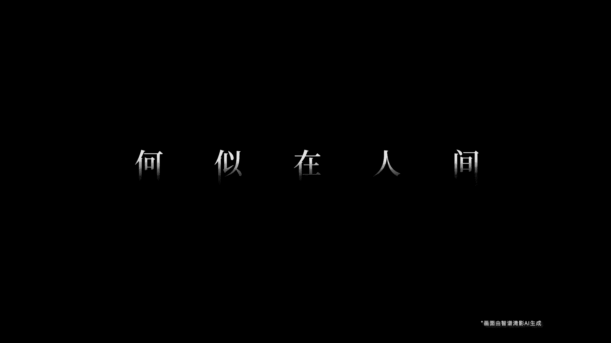
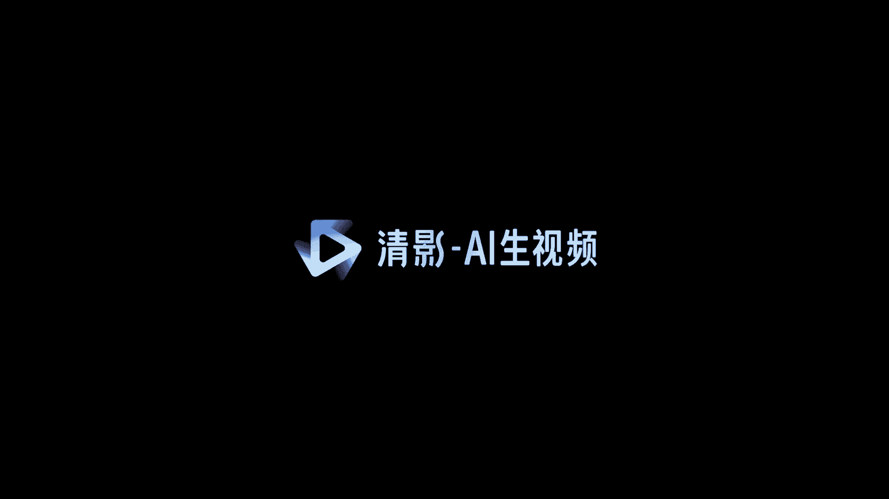
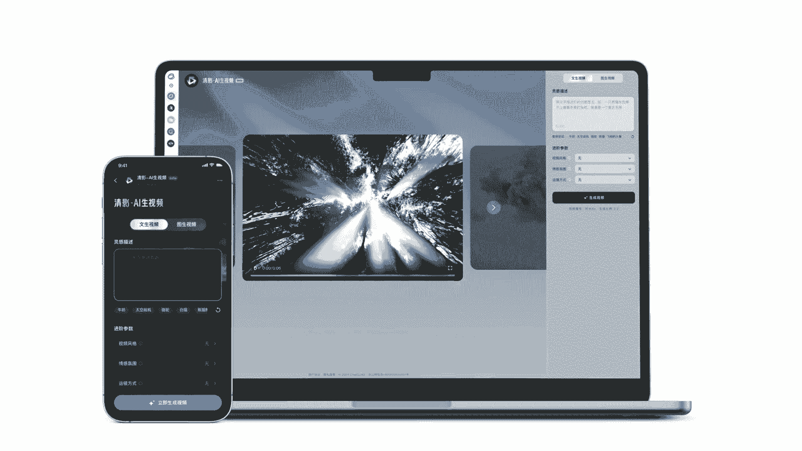

# 课程一：认识「清影」AI视频生成工具 🎬

在本节课中，我们将要学习一个名为「清影」的AI视频生成工具。它旨在让每个人都能轻松地使用人工智能技术来创作视频内容。我们将了解它的基本概念、核心功能以及它能为我们带来什么。


---

## 什么是「清影」？✨



上一节我们介绍了本课程的主题。本节中，我们来看看「清影」究竟是什么。

「清影」是一个利用人工智能技术生成视频的工具。它的目标是降低视频制作的技术门槛，让没有专业背景的用户也能创作出有趣的视频内容。其核心在于通过简单的输入（如文本或图片），由AI模型自动生成对应的动态视频。


其背后的核心概念可以简化为一个**公式**：
`用户输入（文本/图像） + AI模型 = 生成视频`

---

## 「清影」能做什么？🚀



了解了基本定义后，本节我们来看看「清影」具体具备哪些能力。

以下是「清影」工具的一些主要功能和应用场景：


*   **文生视频**：用户输入一段描述性文字，AI根据文字内容生成相应的视频片段。
*   **图生视频**：用户上传一张静态图片，AI能够让图片中的元素动起来，生成短视频。
*   **创意辅助**：为视频创作者提供灵感，快速生成视频素材或预览效果。
*   **简化流程**：将复杂的视频剪辑、特效制作过程，简化为几步简单的操作。

---

## 如何使用「清影」？🛠️


知道了它能做什么，接下来我们了解一下大致的操作流程。虽然具体步骤会因平台而异，但通常遵循以下模式：

以下是使用「清影」生成视频的一个基本流程示例：



1.  **打开工具**：访问「清影」的官方网站或应用。
2.  **选择模式**：在“文生视频”或“图生视频”模式中选择其一。
3.  **输入内容**：
    *   如果选择“文生视频”，在输入框内填写你的创意描述。
    *   如果选择“图生视频”，上传你的图片文件。
4.  **调整参数**：设置视频风格、时长、分辨率等可选参数。
5.  **生成视频**：点击生成按钮，等待AI处理并输出视频结果。
6.  **下载分享**：对生成的视频满意后，可以下载到本地或直接分享。

这个过程可以用一段伪**代码**来描述：
```python
打开工具(“清影”)
选择模式(模式=”文生视频”)
输入内容(文本=”一只猫在弹钢琴”)
调整参数(风格=”卡通”， 时长=”10秒”)
视频结果 = 生成视频()
下载(视频结果)
```


---

## 总结 📝

本节课中，我们一起学习了「清影」AI视频生成工具。我们首先了解了它是一个旨在普及化AI视频创作的工具，然后探讨了其核心的“文生视频”和“图生视频”功能，最后梳理了使用它的基本步骤。记住其核心公式 **`输入 + AI = 视频`**，你就能理解它的工作原理。希望这节课能帮助你迈出使用AI进行创意表达的第一步。