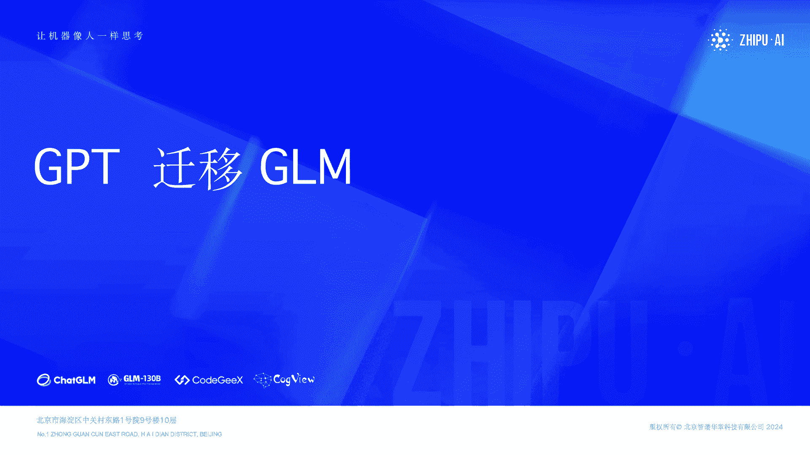
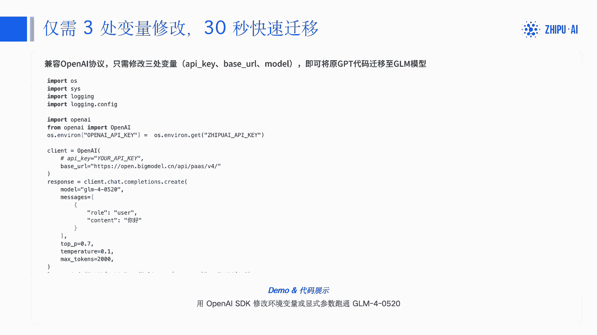
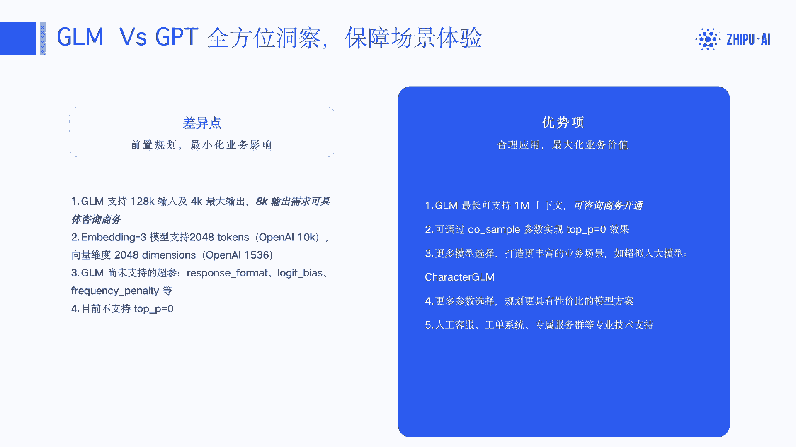
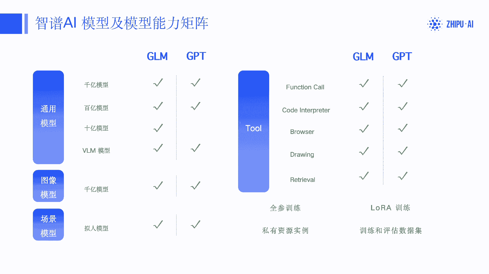
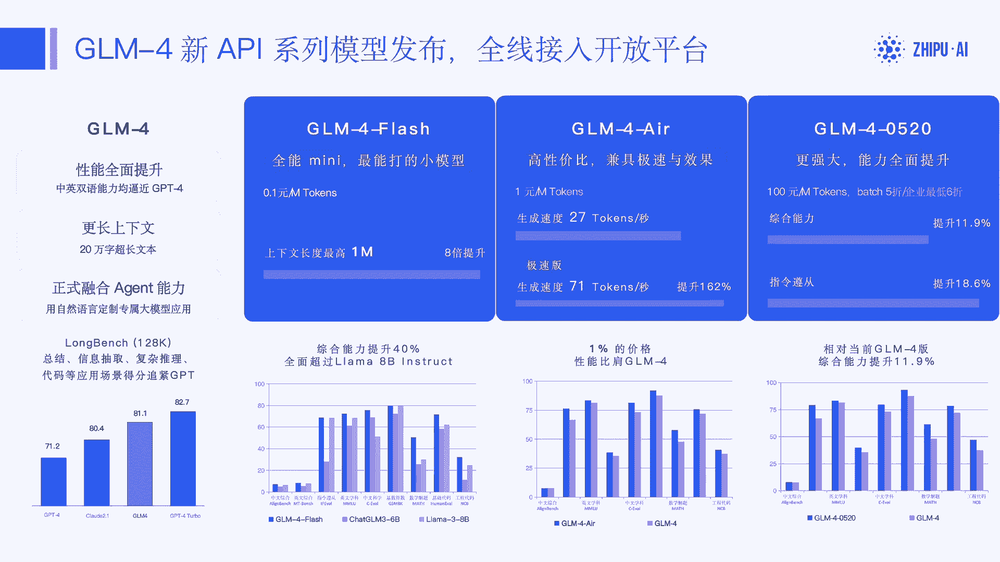

# 第一课：从GPT快速迁移到ChatGLM 🚀



在本节课中，我们将学习如何将现有的、基于OpenAI GPT模型的代码，快速迁移到使用智谱AI的ChatGLM模型。整个过程只需修改少量配置，无需重写核心业务逻辑。

---

## 快速迁移指南 ✨

上一节我们介绍了课程目标，本节中我们来看看具体的迁移步骤。只需修改三处变量，即可在30秒内完成迁移。

以下是实现快速迁移的三个关键步骤：



1.  **修改API密钥**：将OpenAI的API密钥替换为智谱AI平台的API Key。你需要提前将智谱API Key设置到环境变量中。
2.  **修改API基础地址**：将OpenAI的调用端点（`api.openai.com`）替换为智谱AI开放平台的地址（`open.bigmodel.cn`）。
3.  **修改模型名称**：将请求中指定的GPT模型名称（如`gpt-3.5-turbo`）替换为智谱GLM模型名称（如`glm-4-0520`）。

迁移后的核心代码示例如下：

```python
# 导入OpenAI SDK（无需更改）
from openai import OpenAI

# 1. 修改API密钥（假设已设置环境变量ZHIPU_API_KEY）
client = OpenAI(
    api_key="你的智谱API Key",  # 或使用 os.environ.get("ZHIPU_API_KEY")
    base_url="https://open.bigmodel.cn/api/paas/v4/"  # 2. 修改基础地址
)

# 发起调用
response = client.chat.completions.create(
    model="glm-4-0520",  # 3. 修改模型名称
    messages=[
        {"role": "user", "content": "你好"}
    ]
)
print(response.choices[0].message.content)
```

可以看到，除了上述三处修改，其他业务代码完全保持不变。

---

## ChatGLM与GPT的差异与优势 ⚖️

在成功迁移后，了解两个平台之间的主要差异和GLM的特色优势，有助于你更好地规划业务。



以下是ChatGLM与GPT的一些关键差异点，请注意提前规划：

*   **输入输出长度**：GLM-4模型支持128K上下文输入，但最大输出默认为4K token。若有8K或更长输出的需求，可联系商务咨询。这与GPT支持128K输出的能力目前存在差异。
*   **Embedding模型**：智谱的Embedding-3模型支持最大文本长度为2048 token，向量维度为1024。OpenAI的text-embedding-ada-002模型则支持8192 token和1536维度。
*   **特定参数支持**：部分GPT已支持的参数，GLM暂未完全支持。例如：
    *   通过`response_format`指定JSON格式返回。
    *   使用`presence_penalty`和`frequency_penalty`精确控制文本重复性。
    *   设置`top_p=0`（会报错）。但可通过设置`do_sample=False`实现类似“确定性输出”的效果。

以下是ChatGLM提供的额外优势和服务：

*   **更长的上下文**：GLM模型最长可支持1M（约100万）token的上下文，具体可咨询商务开通。
*   **丰富的模型矩阵**：提供从十亿、百亿到千亿参数的不同规模模型（如GLM-4-Flash, GLM-4-Air, GLM-4），满足从高速响应到复杂推理的不同业务场景。
*   **本地化服务**：服务国内客户，提供人工客服、工单系统、专属服务群和专业的技术支持。
*   **全面的能力支持**：除通用对话外，还支持图像理解（CogView）、拟人化对话、工具调用（Function Call）、代码解释、联网搜索、知识库检索以及文生图等多种能力。

---

## 开发者资源与模型介绍 📚

上一节我们对比了差异，本节我们来了解可用的开发资源和最新的GLM-4模型系列。



**开发者资源中心**：
你可以访问[智谱AI开放平台](https://open.bigmodel.cn/)获取所有开发资源。此外：
*   GitHub上提供了Python、Java、C#、Node.js等多种语言的官方SDK。
*   提供官方的使用指南和代码示例（Cookbook）。
*   由于协议兼容，你完全可以继续使用OpenAI官方SDK来调用GLM模型，正如我们在迁移指南中所做的那样。

**GLM-4新模型系列**：
GLM-4系列模型在性能上已接近GPT-4，并在长上下文、工具调用等方面表现优异。该系列主要分为三个型号：

*   **GLM-4-Flash**：速度最快，性价比高（0.1元/百万tokens），适用于长文本分析、总结、信息抽取等场景。
*   **GLM-4-Air**：平衡速度与效果的高性价比选择。
*   **GLM-4 (如glm-4-0520)**：能力最强（1元/百万tokens），适用于复杂的逻辑分析、智能体（Agent）应用、严格的指令遵循等场景。

对于企业客户，智谱AI还提供线上最低六折的折扣。如果需要通过批处理（Batch）进行离线大批量调用，也可联系获取相应支持。

---

## 总结 🎯



本节课中我们一起学习了如何从GPT快速迁移到ChatGLM。核心在于修改API密钥、基础地址和模型名称这三处配置。我们还探讨了GLM与GPT的主要差异，并介绍了GLM在模型多样性、本地化服务以及GLM-4新模型系列上的优势。利用这些知识和资源，你可以轻松地将现有应用切换到更符合国内需求的ChatGLM平台。