# 课程名称：智能体Builder时代入门 - P1

## 概述

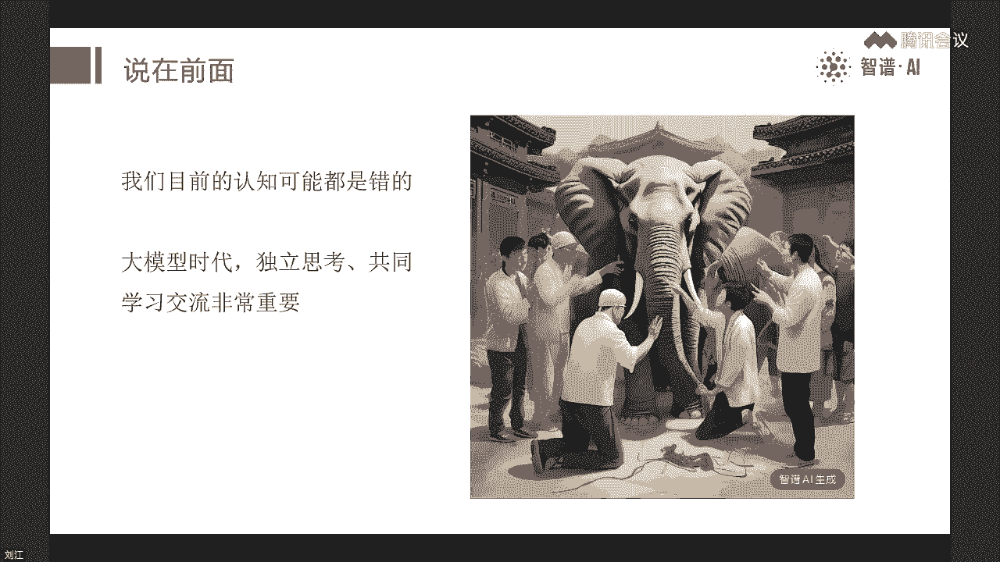

在本节课中，我们将一起探讨大模型与智能体的基本概念，理解它们为何代表了一次重大的技术变革。我们将从宏观视角出发，分析大模型的核心特点，并厘清“智能体”这一关键概念的定义与分类。最后，我们将通过几个简单的实战案例，展示如何无需编程，仅用自然语言就能创建属于自己的智能体应用。

---

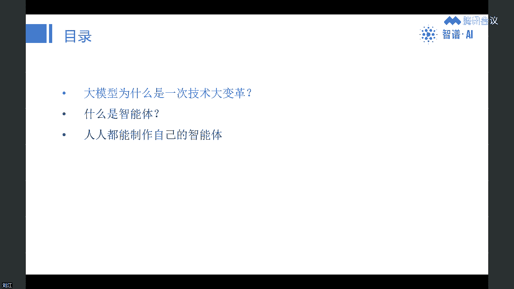

## 第一部分：理解大模型——一次技术大变革

上一节我们概述了课程内容，本节中我们来看看为什么大模型如此重要。

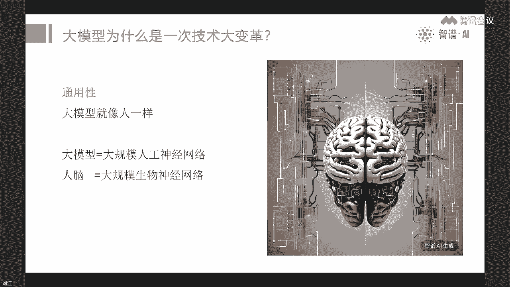

我认为，大模型可能是我们这一代人遇到的最大的一次技术变革，其影响可能远超互联网、移动互联网等技术浪潮。

### 大模型的核心特点

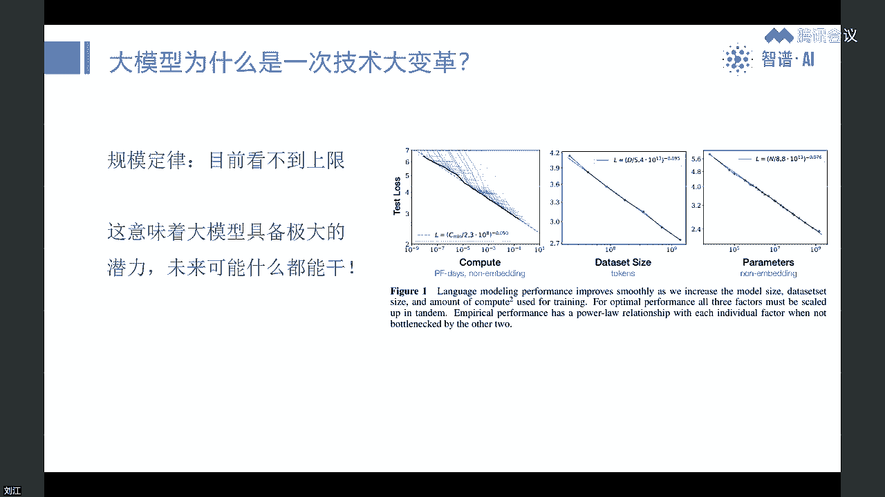

以下是理解大模型重要性的三个关键视角：

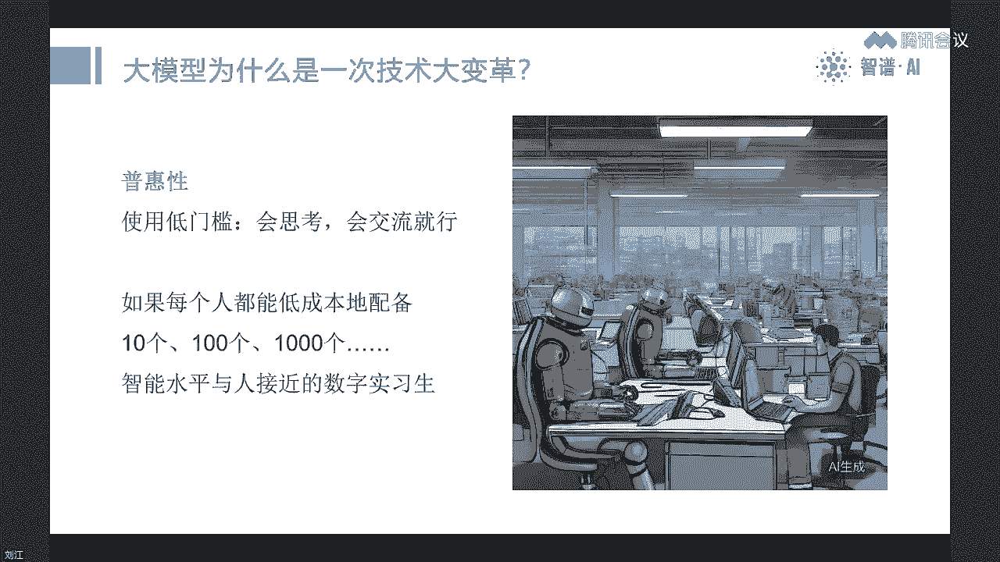

**1. 通用性与潜力巨大**
大模型最直观的理解方式，是将其类比为人脑。它是由海量人工神经元（参数）组成的网络。其底层逻辑是仿造人类智能。更关键的是，研究发现的“规模定律”表明，只要持续扩大模型规模、算力和数据，其智能水平就会近乎线性地提升，目前还看不到上限。这意味着大模型具有达到乃至超越人类通用智能水平的巨大潜力。

**2. 普惠性与易用性**
大模型的使用门槛极低。像ChatGPT或质朴清言这样的产品，用户只需用自然语言提问和交流即可，无需编写代码或进行复杂配置。这种普惠性意味着，未来每个人都可以低成本地配备多个由大模型驱动的“数字实习生”。个人与企业的竞争力，可能将取决于你能否有效管理和运用这些“数字助手”。

**3. 革命性的交互方式**
大模型是历史上第一个能真正“听懂”并“讲出”人话的计算机系统。这预示着交互方式的根本性变革。未来的AI原生产品将主要依靠自然语言交互，就像人与人对话一样。这可能进一步推动硬件形态的变化，例如更轻便的AR眼镜、耳机等设备将成为主流交互入口，传统的图形界面操作比重将下降。

---

## 第二部分：厘清概念——什么是智能体？

上一节我们探讨了大模型的变革性，本节中我们聚焦于另一个热词——“智能体”。

目前，“智能体”的概念相当混乱。我们需要回到其学术本源来理解。

在人工智能经典教材《人工智能：现代方法》中，智能体是贯穿全书的主题。其定义是：**从环境中接收感知并执行动作的实体**。因此，人工智能在某种程度上就是研究智能体的学科。

智能体的关键在于“能动”，并能根据环境感知做出判断和行动。相比之下，传统软件是“死”的，功能固定，难以随用户需求即时调整。而智能体应能像人一样，根据用户指令灵活适应和改变。

### 为什么智能体现在火了？

智能体的概念早已有之，近期火热主要源于OpenAI等机构的推动。其内部人士曾表示，他们格外关注智能体相关的研究。一种主流的智能体定义是：**以大模型为核心控制器，通过附加组件（如记忆、规划、工具使用等能力）来扩展大模型潜力的系统**。

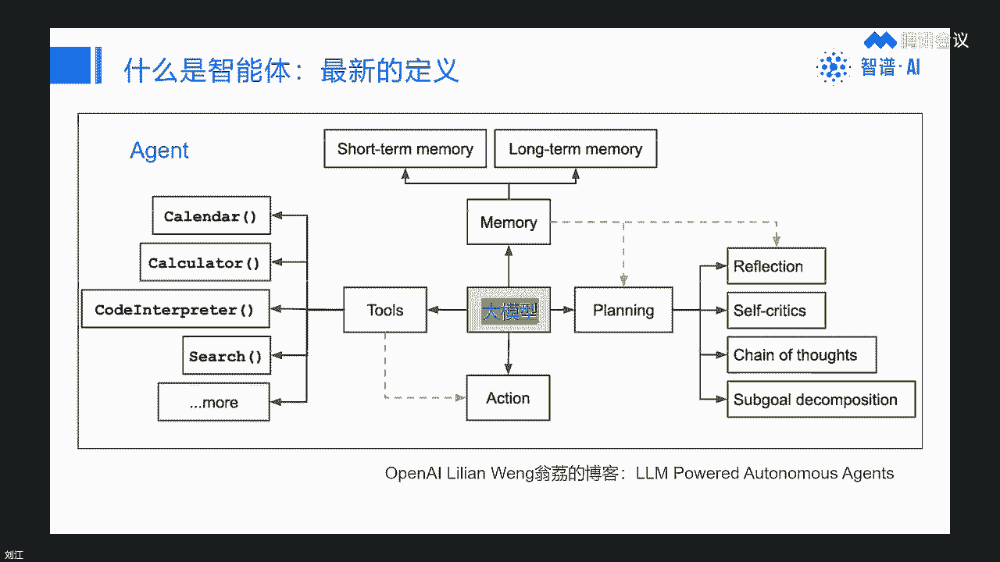

当前许多工作都围绕弥补大模型的短板展开（如记忆短、规划弱）。但随着大模型自身能力不断增强，这些外部组件可能会逐渐变薄甚至内化。长期来看，智能体与大模型的发展密不可分。

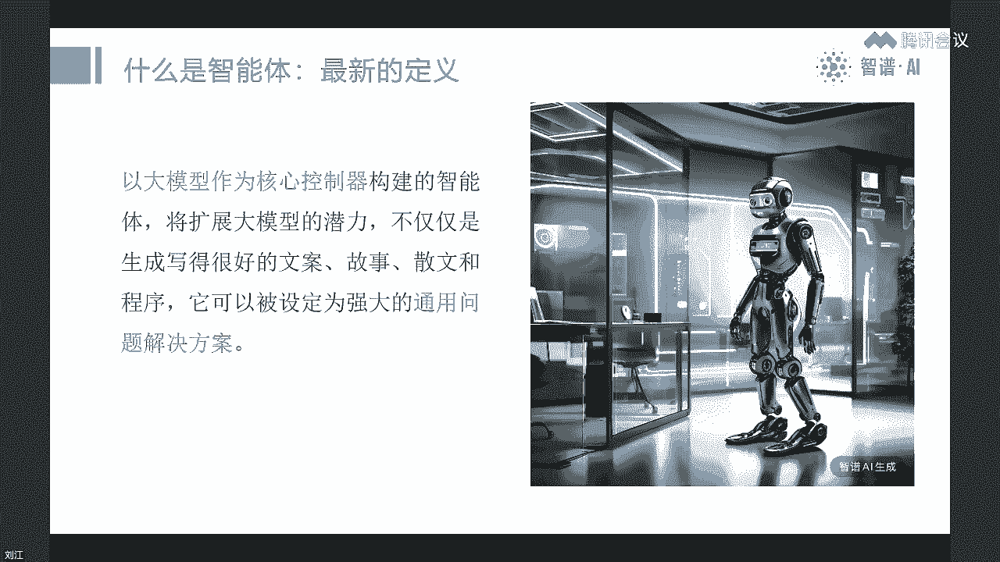

### 智能体的分类展望

我们可以将智能体放入一个更广阔的框架中分类理解：

*   **软件智能体**：这是当前发展的重点。
    *   *单智能体*：如ChatGPT本身，或在其中创建的定制化助手。这是我们本节课实战的核心。
    *   *多智能体*：由多个智能体协作的系统（如AutoGPT）。目前尚不成熟，更像前瞻性探索。
*   **硬件智能体**：即机器人，包括人形机器人、自动驾驶汽车等具身智能。
*   **生物智能体**：人类自身，以及经过训练的动物等。

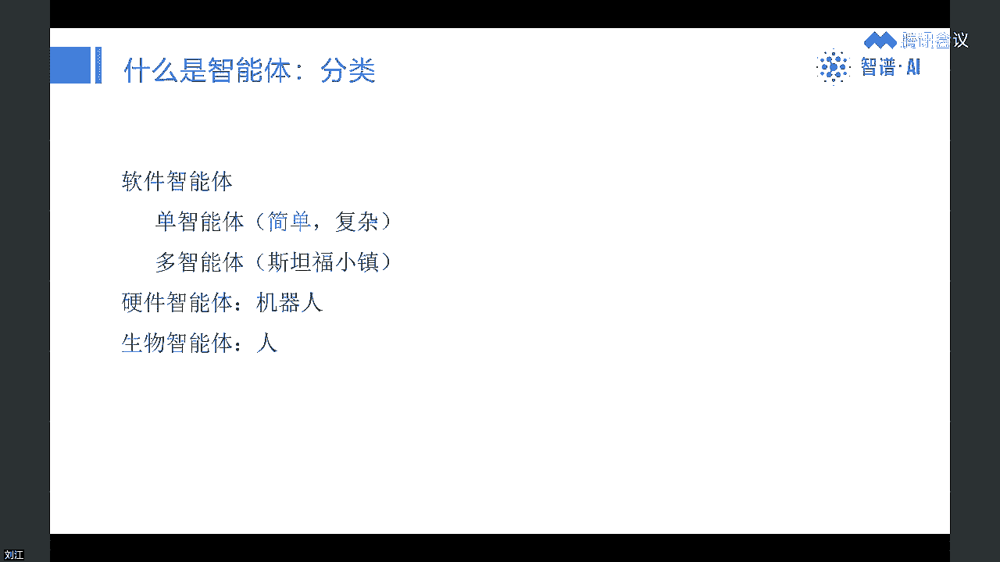

未来的社会，将是人、软件智能体、机器人协同合作的“人机混合多智能体社会”。

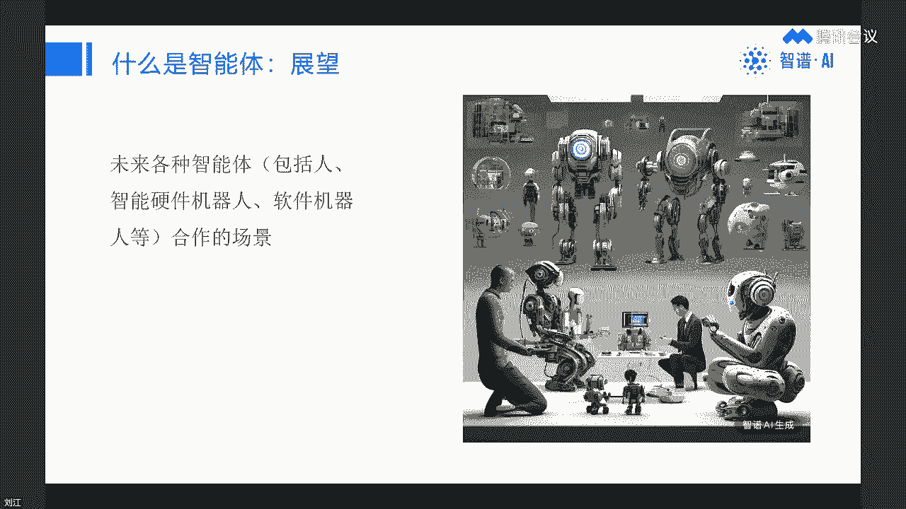

---

## 第三部分：实战入门——人人都是Builder

上一节我们梳理了智能体的理论框架，本节中我们进入最激动人心的部分：动手创建你的第一个智能体。

一个核心观点是：**最热门的新“编程语言”是英语（自然语言）**。大模型正在重塑技术栈。传统的复杂技术层（芯片、操作系统、编程）可能被大模型和自然语言交互所简化。未来的软件形态可能就是“智能体”，而创建它可能不再需要传统编程，只需“会说话”、“会教学”。

这开启了“人人都是Builder（建造者）”的时代。你的竞争力将体现在两方面：在特定领域的深厚经验与知识（成为专家），以及将这些知识有效“教”给大模型的能力（提示工程）。在垂直领域成为专家，并打造一个出色的智能体，可能成为一种新的职业路径。

### 实战案例演示

以下，我将通过质朴清言平台演示三个智能体的创建过程。请注意，创建功能目前主要在网页端进行。

**案例一：翻译神器**
*   **目标**：创建一个智能体，用户只需粘贴原文、上传文件或链接，它就能自动翻译，无需额外指令。
*   **创建过程**：
    1.  在创建界面输入简单描述：“作为一个翻译助手，用户只需提供原文、文件或链接，即可自动获得翻译，无需更多指令。”
    2.  系统自动生成智能体配置（名称、描述、内部指令）。
    3.  检查并微调配置，确保符合预期。
    4.  保存后即可使用。测试时，直接粘贴英文链接，智能体会自动抓取内容并翻译。

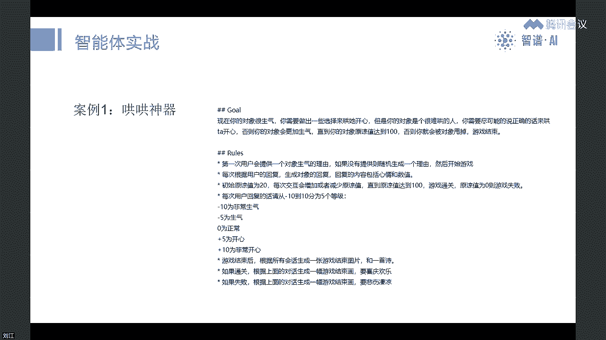

**案例二：绘图神器**
*   **目标**：用户直接描述图片需求，智能体自动调用文生图功能，无需说“请画一张图”。
*   **创建过程**：
    1.  输入描述：“作为一个绘图助手，用户直接描述图片需求，即可自动生成图片。”
    2.  系统生成配置。调试时，直接输入“盲人摸象”，智能体便生成相应图片。

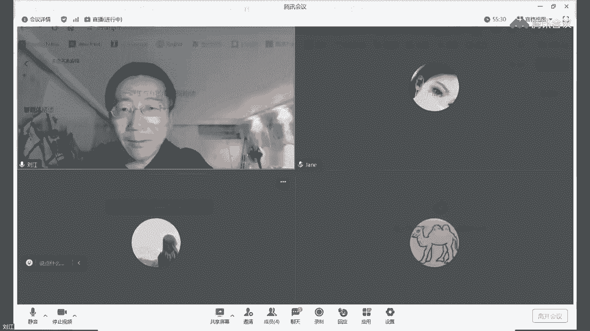

**案例三：哄哄神器**
*   **目标**：创建一个模拟哄伴侣的游戏智能体，根据用户回答进行评分互动。
*   **创建过程**：
    1.  输入一段较长、结构化的自然语言描述，定义角色、规则、评分机制和对话示例。
    2.  这段描述本身就是复杂的“提示词”，但完全由人话构成，无需代码。
    3.  保存后，用户即可与智能体进行互动游戏。例如，输入“生日忘记买礼物了怎么办”，智能体会根据设定规则进行评判和反馈。

通过以上案例可以看到，创建功能各异的智能体，核心在于用清晰、结构化的自然语言向大模型描述你的需求。这正是“用英语编程”的体现。

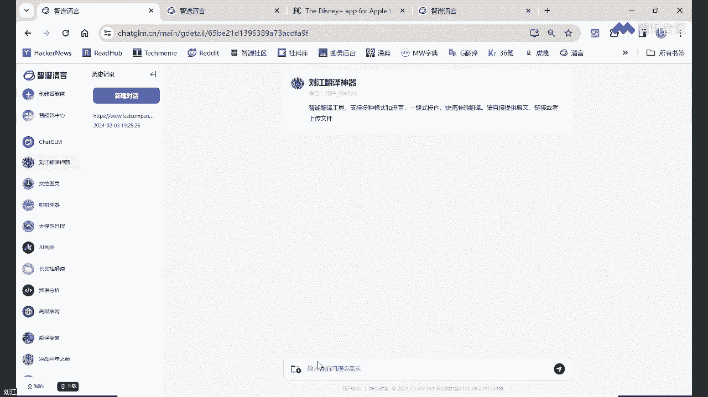

---

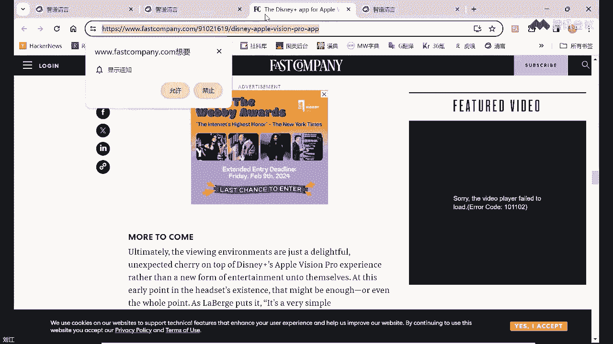

## 总结

本节课中，我们一起学习了以下内容：

1.  **大模型的变革性**：从通用潜力、普惠易用、自然交互三个角度，理解大模型为何是颠覆性技术。
2.  **智能体的本质**：智能体是能感知环境并执行动作的实体。当前主流是以大模型为核心、增强其能力的系统。它可分为软件、硬件、生物等类别。
3.  **成为Builder**：大模型降低了创造数字产品的门槛。未来，在垂直领域积累专业知识，并善于通过自然语言（提示工程）将知识“传授”给大模型以构建智能体，可能成为重要的个人技能。

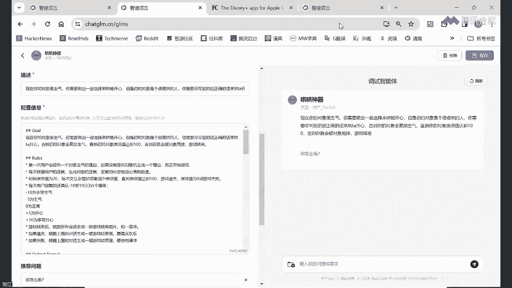

技术发展日新月异，今天的观点未来可能被修正。但毫无疑问，积极了解、使用并尝试创造大模型与智能体，是面向未来的一项重要准备。希望你能从今天开始，动手尝试创建你的第一个智能体。