# 课程名称：CogVideoX视频生成模型详解与部署指南 - P1

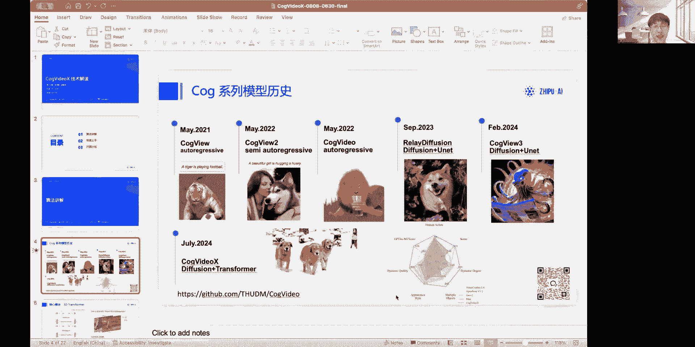

## 概述 📖

在本节课中，我们将全面学习由智谱AI开源的CogVideoX视频生成模型。课程将分为三个主要部分：首先，深入解析模型的核心算法与架构设计；其次，提供清晰、直白的模型部署与推理教程；最后，介绍未来的开源计划与社区贡献方向。无论你是初学者还是有一定经验的开发者，本教程都将帮助你理解并上手这一先进的视频生成技术。

---

## 第一部分：算法核心解析 🧠

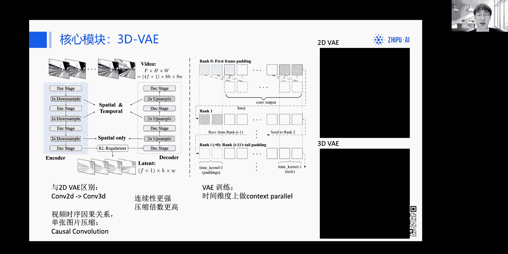

上一节我们概述了课程内容，本节中我们来看看CogVideoX模型背后的核心技术。

### 1.1 Cog系列模型发展历程

CogVideoX并非凭空诞生，它建立在智谱AI在生成模型领域多年的技术积累之上。

以下是Cog系列模型的关键发展节点：
*   **2021年**：团队开始使用大规模Transformer预训练文生图模型，采用**自回归（Auto Regressive）** 技术，将图像分块并按序生成。该技术已能生成“现实中不存在的物体”，例如“老虎踢足球”。
*   **同年改进**：针对自回归速度慢的问题，改进为**半自回归模型CogView2**，在生成效果上取得了显著提升。
*   **同年开源**：发布了当时开源领域最大、效果最好的文生视频模型 **CogVideo**。CogVideoX正是这一系列的传承与发展。
*   **技术栈迁移**：将技术栈迁移到**Diffusion（扩散模型）** 上，推出了**CogVideo3**模型，在当时超越了其他开源模型。
*   **当前模型**：今天的主角**CogVideoX**，其架构结合了Diffusion与Transformer，在生成效果和评测指标上均达到了开源模型的最佳水平。

### 1.2 核心模块一：3D Transformer with Full Attention

CogVideoX使用一个特殊的3D Transformer进行文生视频的生成。其核心创新在于文本与视频Token的融合处理方式。

以下是该结构的设计要点：
*   **联合输入**：将文本和视频压缩后的Token拼接（Concat）在一起，共同输入到Transformer中。
*   **共享与分离**：文本和视频Token会经过相同的Self-Attention和Feed-Forward网络层。但在进行Layer Norm操作时，会使用两组不同的参数，分别称为 **`text expert adaptive layer norm`** 和 **`vision expert adaptive layer norm`**。
*   **设计考量**：这种结构旨在增强模型的语义理解能力。传统模型通常只让图像特征通过Transformer主体，文本仅通过Cross-Attention交互，导致文本理解不够深入。借鉴Swin Transformer的设计，CogVideoX让文本也充分参与前向计算。
*   **Full Attention的优势**：模型采用了**Full Attention（全注意力）** 机制，而非时空分离的Attention。这是因为当物体在视频中大幅运动时（例如，人物从第一帧的左侧移动到第二帧的右侧），时空分离的Attention需要隐式地、多步传递信息才能建立关联，而Full Attention可以直接建模任意两个时空位置的关系，效率更高。

### 1.3 核心模块二：3D VAE（视频变分自编码器）

视频的连续性与流畅度至关重要，CogVideoX通过3D VAE解决了这一问题。

以下是3D VAE的关键特性：
*   **解决闪烁问题**：之前的模型使用2D VAE对视频逐帧压缩，会导致帧间不连续，画面闪烁。3D VAE能保证视频的时空连续性，并获得更高的压缩率。
*   **结构核心**：主要区别在于将2D卷积（Conv2D）替换为3D卷积（Conv3D）。
*   **因果卷积**：在时间维度上采用了**因果卷积（Causal Convolution）**，即每一帧在卷积时只参考其之前的时间帧，不参考未来帧。这符合视频的时序因果关系，并且使得该VAE也能对单张图像进行压缩。
*   **训练挑战与优化**：训练3D VAE显存消耗巨大。团队采用了**时间上下文并行（Temporal Context Parallel）** 策略进行优化。简单来说，将长视频序列分到多张GPU上，每张卡处理一个片段，并通过通信传递相邻片段边界的几帧信息，从而在训练时实现时间维度的并行，显著降低了单卡显存占用。

---

## 第二部分：数据处理、训练与快速上手 🚀

上一节我们介绍了模型的核心算法模块，本节中我们来看看其背后的数据工作流、训练策略，以及如何快速部署运行模型。

### 2.1 高质量视频描述数据生成

对于生成模型，高质量的训练数据是成功的关键。视频数据的文本描述（Caption）尤其重要。

以下是CogVideoX的数据处理流程：
*   **问题**：互联网上的视频-文本对通常质量不高，匹配性差。
*   **目标**：需要生成能详细描述视频内容（包括动态信息）的文本，使模型具备强大的语义理解能力。
*   **Pipeline V1**：初期方案较为复杂。首先对视频抽帧，用智谱自研的图片理解模型**CogVLM**生成图像描述；同时，使用开源视频理解模型**Video-LLaMA**生成包含动态信息的短视频描述；最后，用一个大语言模型（LLM）对上述描述进行总结，得到最终的长视频描述。
*   **Pipeline V2（端到端）**：为了简化流程，团队使用V1产出的数据对开源的**CogVLM2-Video**模型进行微调，得到了一个端到端的视频描述生成模型，该模型已开源。
*   **推理提示**：由于训练时使用了详细描述，因此在推理时，也建议用户输入尽可能详细的提示词（Prompt），以最大程度激发模型能力。

### 2.2 渐进式与混合训练策略

训练视频模型需要海量数据，如何高效组织训练是一个挑战。

以下是CogVideoX采用的训练策略：
*   **图像-视频联合训练**：为了充分利用图像数据并让模型学习静态先验，采用了图像与视频联合训练。
*   **Pastion Pack方法**：传统方法将单张图片与固定帧数的视频一起训练，存在序列长度上的差异（Gap）。CogVideoX将不同时长（2帧、3帧、4帧...）的视频与图片一起训练。为了高效批次训练，采用了**Pastion Pack**方法，将不同长度的序列打包到同一个长序列中，减少了因填充（Padding）造成的计算浪费。
*   **渐进式训练（Progressive Training）**：借鉴图像生成经验，采用渐进式训练策略。先在低分辨率数据上训练，让模型快速学会语义理解和粗粒度动态建模；然后在高分辨率数据上训练，学习细节生成；最后在高质量数据上进行微调，进一步提升效果。

### 2.3 模型部署与推理指南（Diffusers版）

了解了算法和训练后，本节我们来看看如何快速上手运行模型。推荐使用**Diffusers**库，它提供了标准化的接口。

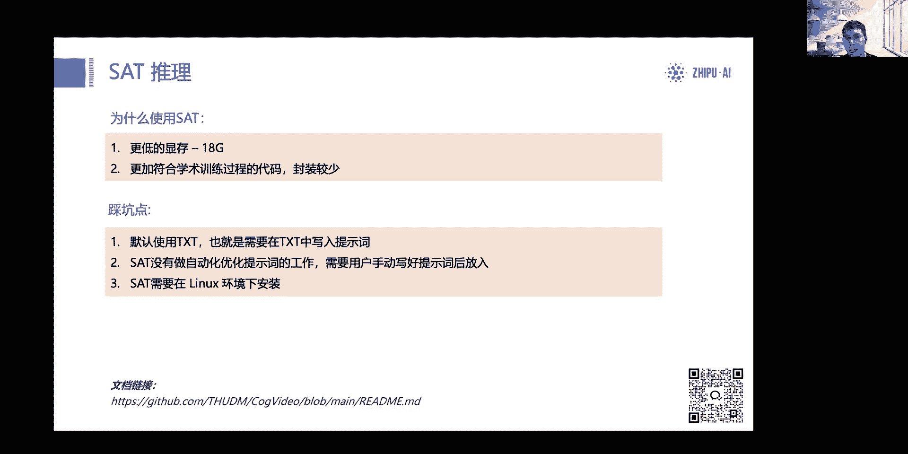

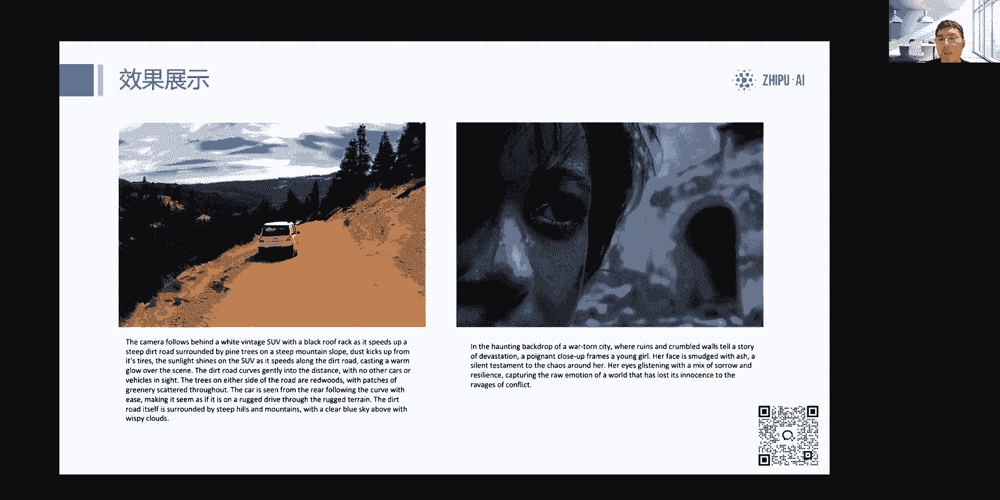

以下是使用Diffusers库推理的关键步骤和注意事项：
1.  **环境准备**：安装Diffusers 0.30或更高版本 (`pip install diffusers`)。模型已上传至Hugging Face、ModelScope等平台。
2.  **提示词优化**：模型针对长而详细的提示词进行了优化。团队提供了提示词润色代码，可以使用GPT-4等大模型将简短提示词扩展为详细描述。
3.  **核心代码示例**：
    ```python
    # 1. 导入管道
    from diffusers import CogVideoXPipeline
    # 2. 启用CPU卸载，这是单卡（如3090）运行的关键，可将峰值显存从36G降至约24G
    pipe = CogVideoXPipeline.from_pretrained("THUDM/CogVideoX-2B", torch_dtype=torch.float16).to("cuda")
    pipe.enable_model_cpu_offload()
    # 3. 准备提示词（建议使用润色后的长提示词）
    prompt = "A detailed description of your scene..."
    # 4. 生成视频
    video_frames = pipe(prompt, num_inference_steps=50, guidance_scale=6.0).frames[0]
    ```
4.  **重要参数**：
    *   `num_inference_steps=50`：推理步数，不建议减少，否则影响质量。
    *   `guidance_scale=6.0`：指导系数，不建议修改。
    *   `negative_prompt`：负向提示词效果有限，目前主要使用正向提示词。
5.  **硬件要求**：**单张RTX 3090（24G）或4090显卡即可流畅推理**。需确保显存几乎无其他占用。
6.  **多卡推理**：注释掉 `enable_model_cpu_offload()` 一行即可，但峰值显存需求仍在，需根据显存规划。

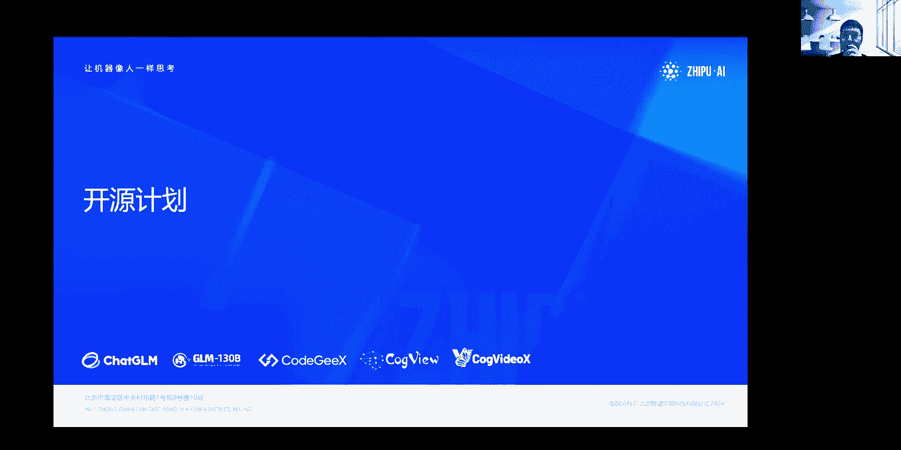

### 2.4 模型部署与推理指南（SAT版）

除了Diffusers，还可以使用智谱自研的**Swift-Armory Transformer (SAT)** 框架进行推理和微调。

以下是SAT版本的特点与注意事项：
*   **优势**：显存占用更低（约18G），代码结构更简洁，更适合学术研究和底层修改。微调支持完善。
*   **模型下载**：权重存放在清华云盘，需单独下载Transformer和VAE两部分，并组合。
*   **T5文本编码器**：需要从Hugging Face获取T5-v1_1-xxl模型，并推荐转换为`safetensors`格式以提升兼容性。
*   **运行限制**：SAT依赖Triton等库，**目前仅支持Linux系统**。Windows用户请使用Diffusers方案。
*   **提示词**：SAT的示例脚本未内置提示词润色功能，需直接输入详细提示词。

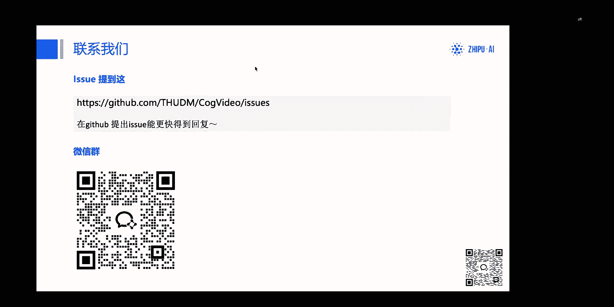

---

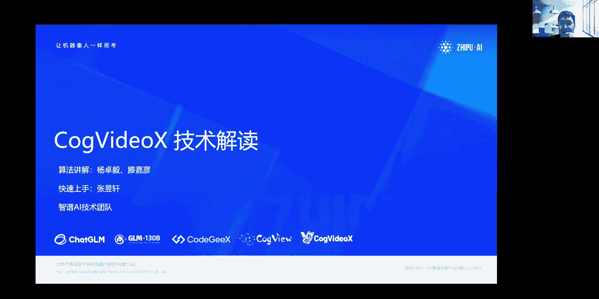

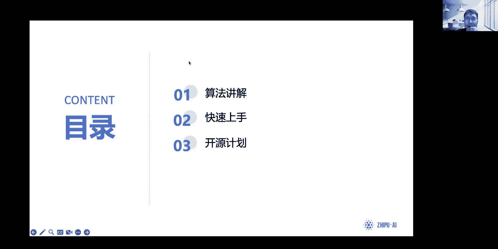

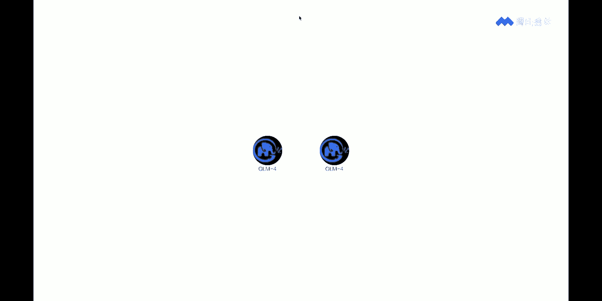

## 第三部分：开源计划与社区共建 🌱

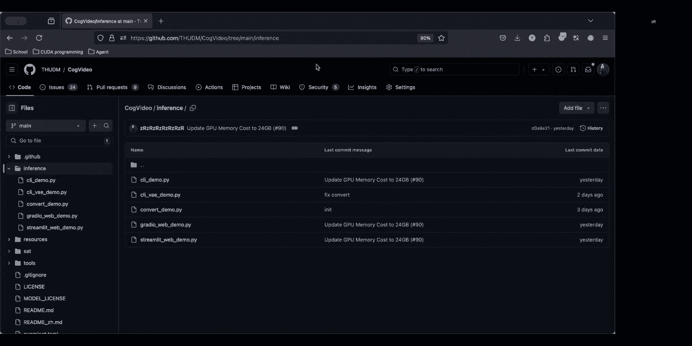

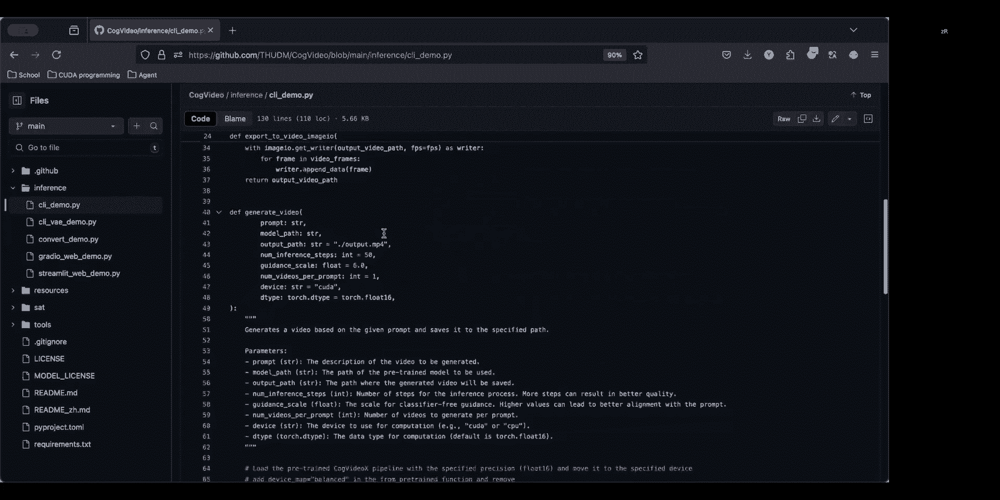

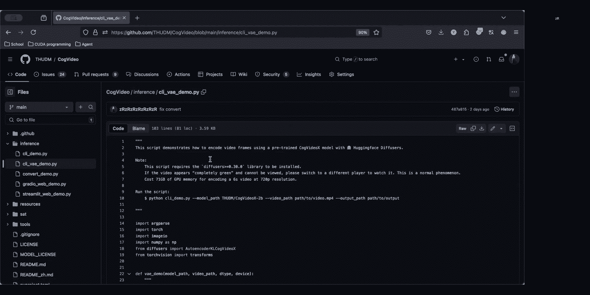

上一节我们完成了模型的部署教学，本节中我们将一起了解CogVideoX的未来发展路线和社区参与方式。

### 3.1 近期开源计划

团队致力于持续推动开源生态的发展。

以下是已公开的计划：
*   **更大规模模型**：将开源参数量更大、能力更强的CogVideoX模型，并与当前2B版本架构兼容，便于现有代码迁移。
*   **框架与工具完善**：
    *   持续优化**Diffusers**库集成，包括显存优化和新模型适配。
    *   适配**XInference**等部署框架。
    *   在项目首页展示并推荐优秀的社区二次开发项目（如CFUI等）。

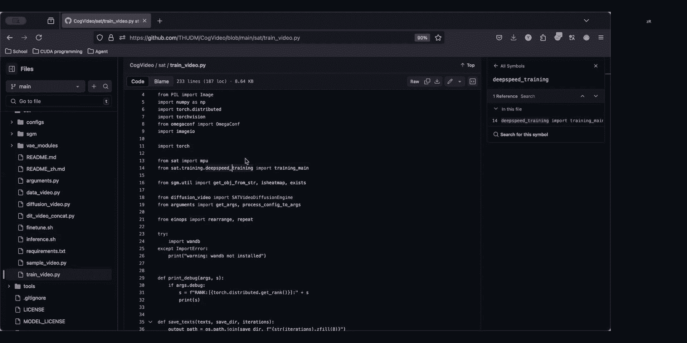

### 3.2 社区贡献指引

CogVideoX的成功离不开社区的共同努力。

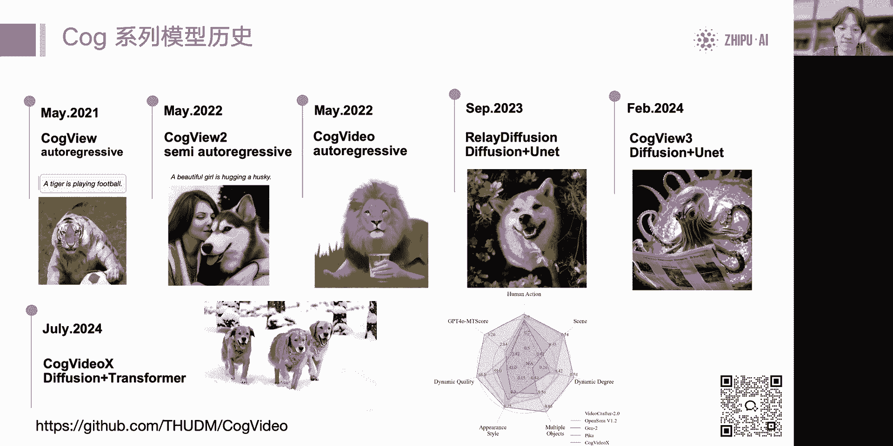

以下是鼓励社区参与的方向：
*   **算法与性能**：
    *   在非CUDA架构（如AMD GPU、NPU）上的测试与适配。
    *   低精度量化（如Int4）的探索。
*   **应用与工具链**：
    *   开发视频**超分辨率**、**插帧**等后处理工具，提升生成视频的帧率与分辨率。
    *   基于CogVideoX开发有趣的Demo和完整的上层应用。
*   **模型微调与下游任务**：
    *   使用提供的代码对模型进行**LoRA微调**，定制个性化风格。测试表明，在百段视频数据内微调几十个Epoch即可获得不错效果。
    *   开发**ControlNet**等可控生成功能。
    *   探索**图生视频**等扩展任务。

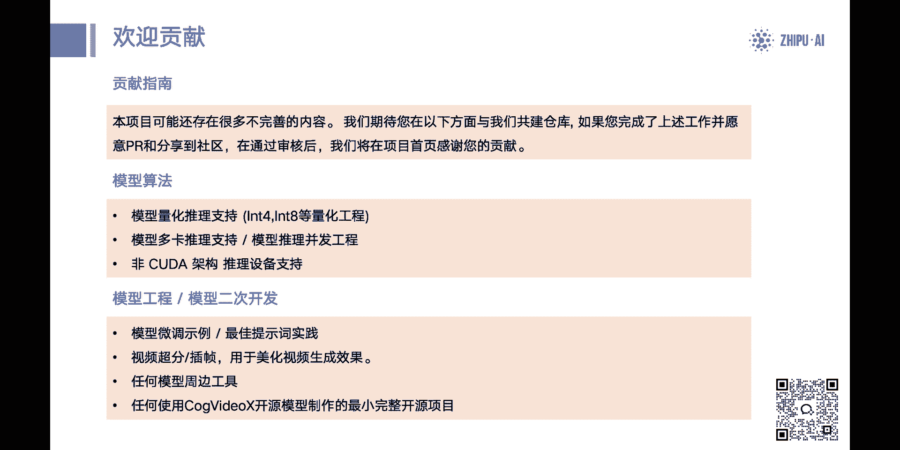

团队欢迎所有形式的贡献，并将优秀贡献展示在项目首页。遇到问题或有好建议，推荐在GitHub仓库提交Issue或Pull Request。

---

## 总结 🎯

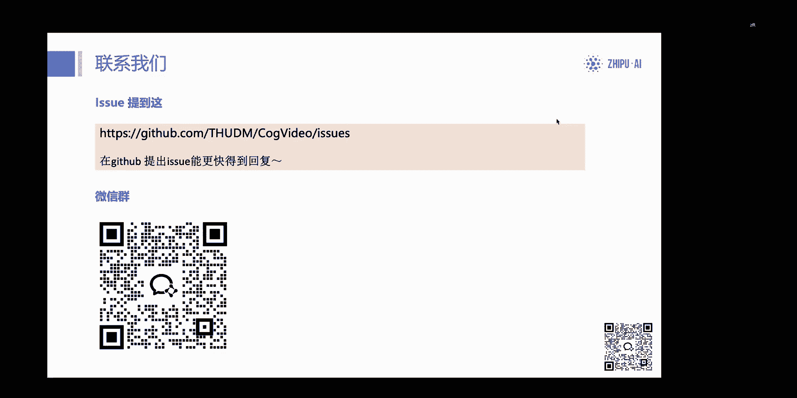

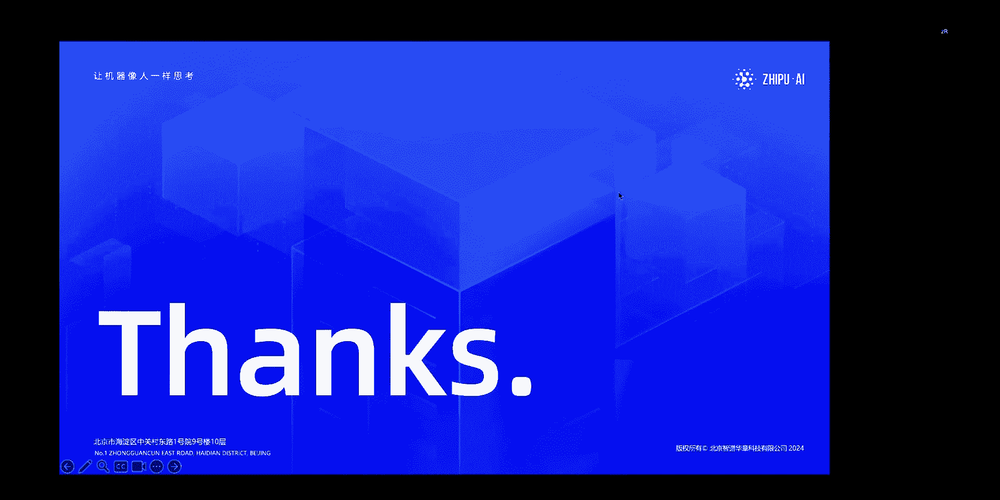

本节课中我们一起学习了CogVideoX视频生成模型的完整知识体系。我们从其**3D Transformer with Full Attention**和**3D VAE**的核心算法开始，理解了模型如何实现高质量的文生视频。接着，我们探讨了其背后的**高质量数据生成Pipeline**和**渐进式混合训练策略**。然后，我们提供了两种清晰的部署方案：标准化的**Diffusers库**方案和更灵活、显存友好的**SAT框架**方案，并明确了单卡3090/4090即可运行的条件。最后，我们展望了未来的开源计划，并鼓励社区在算法优化、工具链开发和模型微调等方面共同参与建设。希望本教程能帮助你顺利踏入视频生成的大门。