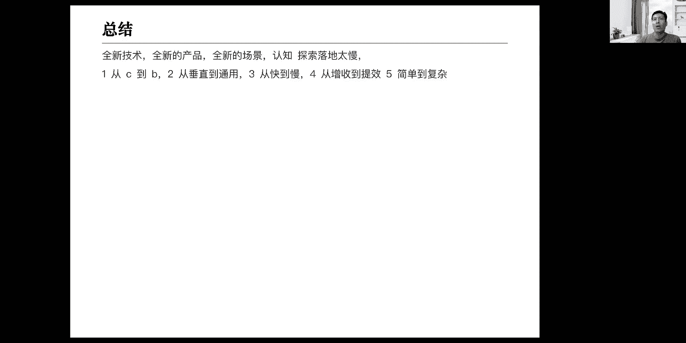
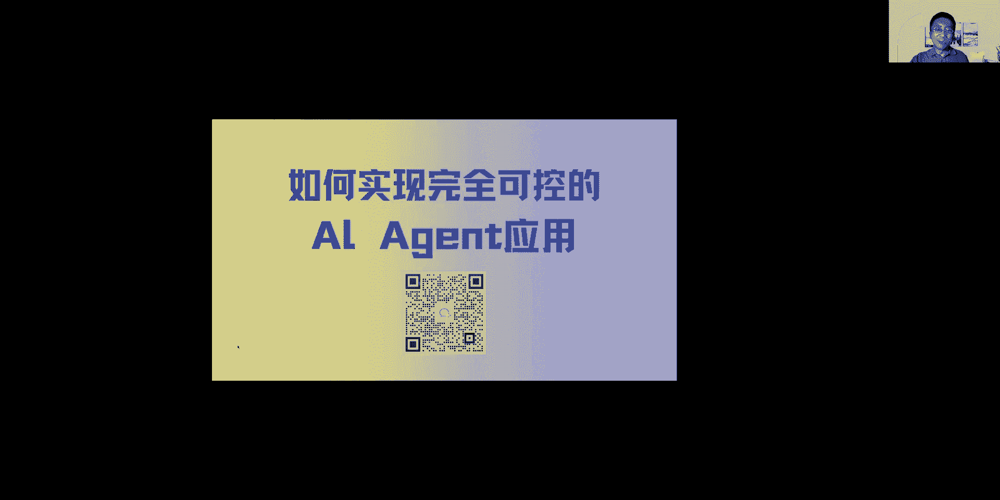

# Agent工作流课程 - P1：如何实现完全可控的Agent应用 🚀

在本节课中，我们将学习如何构建一个“完全可控”的AI智能体（Agent）。我们将从一个具体的例子——日程助手出发，剖析如何将一个复杂的任务拆解为稳定、可预测的工作流。课程内容将涵盖核心概念、设计思路以及实践中的关键考量。

## 概述：为什么“可控”至关重要

在将AI应用于商业场景，尤其是像销售这样的关键领域时，模型的“靠谱性”往往比其“强大能力”更为重要。AI可以“不作为”，但绝不能“做错事”。例如，一个汽车品牌的客服AI错误推荐了竞品车型，这就是不可接受的。因此，实现Agent的“完全可控”是其在To B场景中落地的核心前提。

## 第一部分：理解大模型的能力与局限

上一节我们概述了可控性的重要性，本节中我们来看看为什么大模型本身难以做到完全可控。

大模型存在固有的能力不足，主要体现在以下几个方面：
*   **缺乏深度推理**：对于需要多步骤逻辑判断的任务，表现不稳定。
*   **知识更新滞后**：无法获取训练数据截止日期之后的新知识。
*   **“幻觉”问题**：可能生成看似合理但实际错误的内容。

正因为这些不足，行业提出了多种技术来增强大模型，例如**提示词工程（Prompt Engineering）**、**检索增强生成（RAG）** 和**微调（Fine-Tuning）**。然而，这些方法通常是在概率上提升效果（例如从60%正确率提升到80%），难以达到业务要求的100%确定性。

## 第二部分：定义我们的解决范畴

在探讨具体方案前，需要明确我们试图用Agent替代人类工作中的哪一部分。我们可以将人的智力任务分为三层：
1.  **L1 提出问题**：定义目标和方向（如老板）。
2.  **L2 拆解问题**：规划解决方案和步骤（如中层管理者）。
3.  **L3 执行任务**：根据明确指令进行具体操作（如一线员工）。

**本课程讨论的“可控Agent”，旨在替代的是L3层——即“执行任务”层面。** 我们可以将大模型视为一个专业基础好但缺乏公司具体经验的新员工，我们的目标是让它在我们设定的“受限场景”内，可靠地完成被拆解好的具体任务。



## 第三部分：Agent与工作流的两种模式

上一节我们明确了Agent的定位，本节中我们来看看实现Agent的两种主要工作流模式。

我对Agent工作流的理解是：**协调组织各种AI基础能力与外部工具，分工协作，最终实现对指定任务稳定、有效的解答。** 工作流大致可分为两种类型：

以下是两种主要的工作流模式：
1.  **全自动规划型**：人类不知道具体解题步骤，但为AI设定角色和规则，让多个AI通过博弈、沟通自行寻找解决方案（如AutoGPT）。这对应人类“不知道步骤”的场景。
2.  **人类编排型**：人类自己完全清楚解决问题的标准和步骤，并将这些步骤明确编排成工作流，指导AI逐步执行。这对应人类“知道步骤”的场景。

**本课程聚焦于第二种——“人类编排型”工作流。** 它的本质是**将一个复杂问题简化、拆解**，让大模型在每个简单的子步骤中稳定发挥，从而在整体上实现确定性的输出。

## 第四部分：实战拆解——以“日程助手”为例

理论需要结合实际，本节我们将以构建一个“日程助手”Agent为例，展示如何将一个真实需求拆解为可控的工作流。

首先，我们需要对“日程管理”这个任务进行完整的业务逻辑拆解。核心操作无非“增删改查”，但每个操作都可能涉及复杂的子判断。

以下是“日程助手”的核心功能与逻辑拆解：
*   **查询日程**
    *   按日期范围查询（如“查询下周的日程”）。
    *   按关键词查询（如“查询所有与‘会议’相关的日程”）。
    *   组合条件查询（如“查询明天所有与‘项目’相关的会议”）。
*   **新建日程**
    *   需要从自然语言中提取关键要素：事件内容、开始时间、结束时间、参与人等。
    *   处理信息不完整的情况（如用户只说“明天开会”，需要询问具体时间）。
*   **编辑/删除日程**
    *   **前提**：必须先唯一确定要操作的目标日程（复用“查询”逻辑）。
    *   **编辑**：可能修改时间、内容、参与人等。
    *   **删除**：通常需要增加确认环节，防止误操作。

通过以上拆解，我们可以设计出对应的工作流架构。其核心思想是：**让大模型专注于它擅长的意图理解和信息提取，而将逻辑判断和确定性操作交给编排好的流程和外部工具（如数据库）。**

工作流的核心节点设计如下：
1.  **意图判断节点**：使用大模型分析用户输入，判断属于“新建”、“查询”、“编辑”还是“删除”，并输出标准化指令。
2.  **信息提取与生成节点**（用于新建/编辑）：使用大模型从自然语言中提取结构化数据，或根据指令生成数据库操作语句（如SQL）。
    ```python
    # 示例：大模型需要将用户输入“明天下午三点和团队开会”转化为结构化数据
    {
      “event”: “团队会议”，
      “start_time”: “2023-10-27 15:00:00”，
      “end_time”: “2023-10-27 16:00:00”
    }
    ```
3.  **查询代理节点**：这是一个抽象化的公共模块，专门处理所有“查找日程”的需求。无论是为了查看、编辑还是删除，都先通过此节点精准定位目标数据。
4.  **工具调用节点**：执行具体的数据库操作（增删改查），或调用其他外部API。
5.  **确认与补充节点**：当关键信息缺失时，引导用户补充。

## 第五部分：总结与展望

本节课中，我们一起学习了如何通过“人类编排型”工作流来实现一个完全可控的Agent应用。我们从“可控性”的需求出发，明确了Agent的适用范畴（L3执行层），并以“日程助手”为例，详细演示了如何将一个业务场景拆解为标准化、可编排的工作流节点。

**关键总结如下：**
*   **核心理念**：将复杂任务拆解为一系列简单的、大模型能稳定处理的子任务，通过流程控制实现整体确定性。
*   **技术本质**：大模型在工作流中扮演“聪明但需指导的执行者”角色，负责理解、提取和生成，而流程本身确保了业务的逻辑正确性。
*   **适用场景**：适用于业务逻辑清晰、步骤可定义的“受限场景”，如垂直领域的SOP（标准作业程序）自动化。
*   **创业启示**：对于创业者而言，从简单、能快速验证和变现的垂直场景入手，利用工作流技术小成本试错，是当前阶段一个行之有效的策略。


Agent的落地，尤其是将行业隐性知识（如金牌销售的话术）通过工作流显性化、产品化，蕴含着巨大的机会。未来，随着大模型能力的进化，我们期待它能更多地自动完成工作流的规划和编排，但在此之前，人工设计的高确定性工作流仍是实现商业价值可靠、稳健的路径。



---
**课程名称**：Agent工作流 - P1：如何实现完全可控的Agent应用  
**核心工具**：工作流编排、大模型API（如智谱AI）、数据库  
**关键输出**：一个逻辑清晰、节点分明、可稳定执行的Agent业务流程设计图。