# 课程 P1：ChatGLM 开源进展与最新发布介绍 🚀

在本节课中，我们将学习智谱AI与清华大学联合开发的ChatGLM系列大模型的最新开源进展。我们将介绍多个新发布的模型及其核心特性，包括长文本理解、代码生成、数学计算、图像生成以及角色扮演等方向的发展。

---

## 开源模型的影响力与持续发展

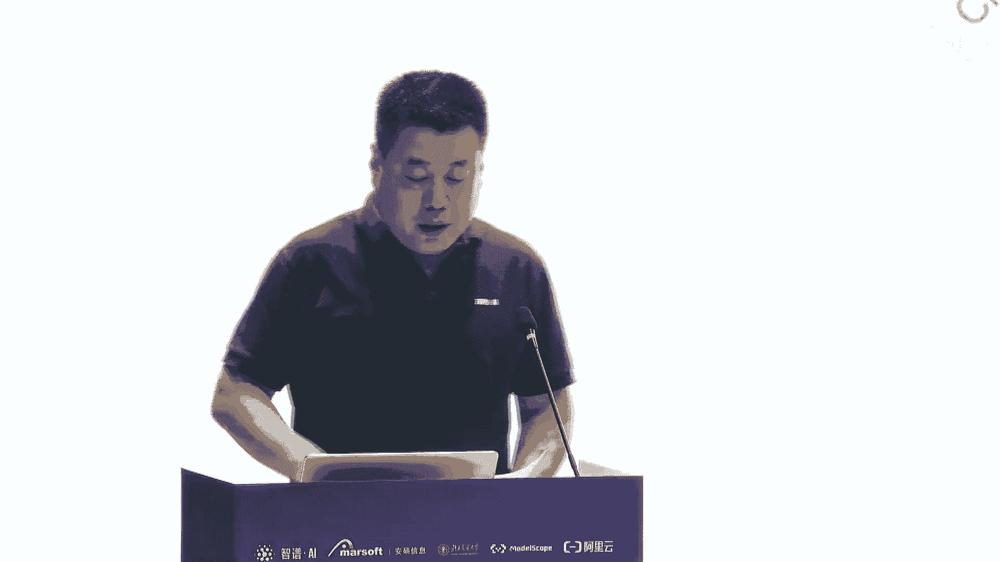

上一节我们介绍了课程背景，本节中我们来看看ChatGLM开源模型的整体影响力与发展历程。

智谱AI与清华大学一直致力于大模型基础模型的开发。今年3月14日，团队上线并开源了ChatGLM-6B模型。后续还开源了GLM-130B等一系列模型。

根据科技部在5月份发布的关于中国开源大模型影响力的报告，智谱AI的开源模型（报告中红色部分）表现突出。其中，ChatGLM-6B模型在全球的下载量居于首位。

团队在持续进行研究和开发，并于6月25日推出了ChatGLM2-6B开源模型。与第一代相比，第二代模型在多项指标上取得了巨大进步。

以下是ChatGLM2-6B的主要提升：
*   **性能提升**：在多项测试中成绩显著提高。
*   **推理加速**：模型推理速度大幅提升。
*   **上下文长度**：上下文长度从原来的2K扩展到了8K。
*   **商用许可**：对商用使用免费开放。

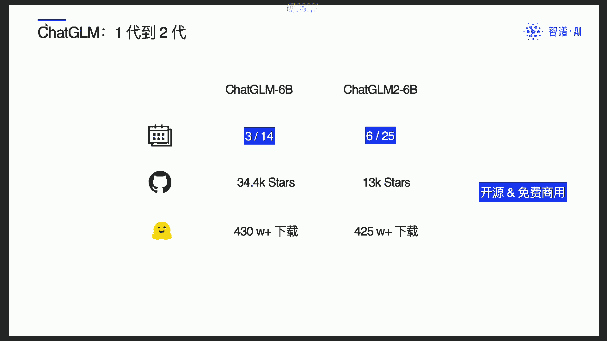

---

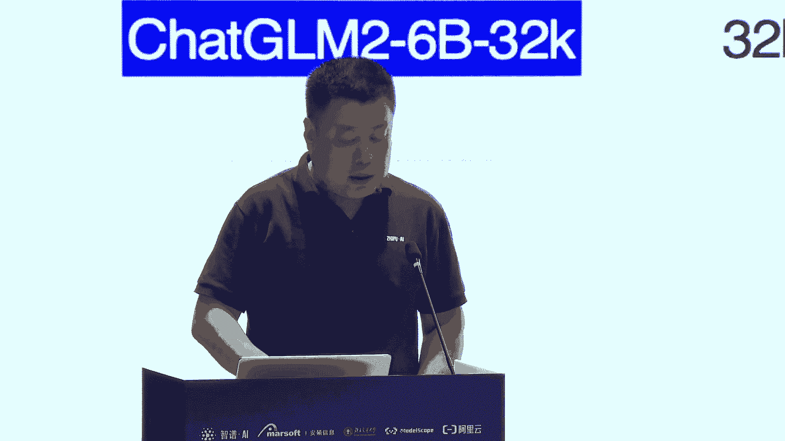

## 长文本理解能力的突破

在增强了基础模型能力之后，团队在长文档理解方面也做了大量工作。

除了8K版本，团队即将推出支持32K上下文长度的版本。从token数量上讲，这可以支持接近5.7万汉字。上下文长度的显著增强，为处理长文档任务提供了可能。

在更强的上下文能力基础上，团队在LongBench基准上进行了测试。该测试包含13个英文任务、5个中文任务和2个代码任务。ChatGLM2-6B取得了非常好的成绩。

以下是与其他模型的对比情况：
*   **英文任务**：成绩与ChatGPT-3.5-Turbo-16K类似。
*   **中文任务**：在“多文档问答”等任务上展现出更好的能力。
*   **对比模型**：包括ChatGPT、LLaMA、LongChat等。

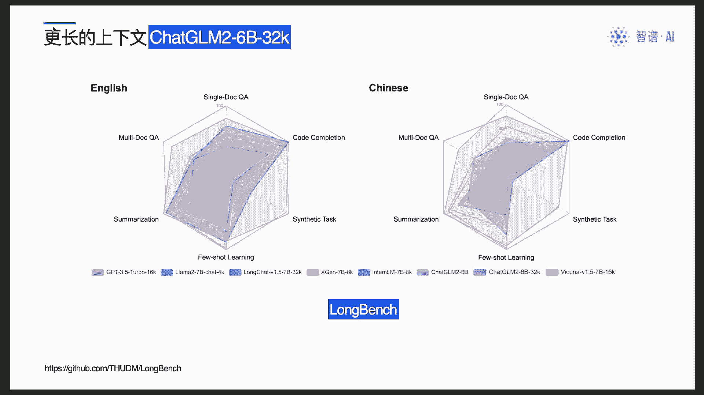

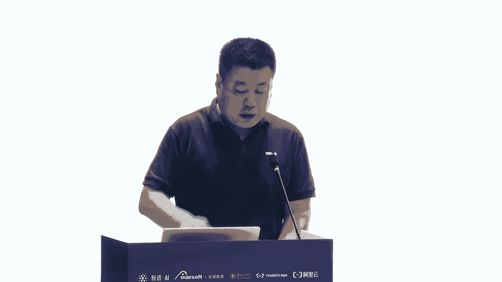

---

## 代码生成模型的进化

除了通用语言模型，代码生成是开源模型的一个重要方向。

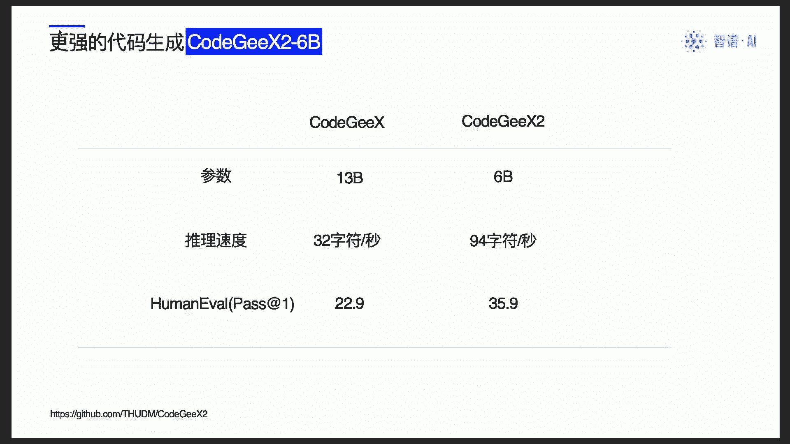

团队近期将CodeGeeX代码生成模型升级到了第二代。新模型参数量从原来的130亿下降到了60亿，但性能反而得到提升。

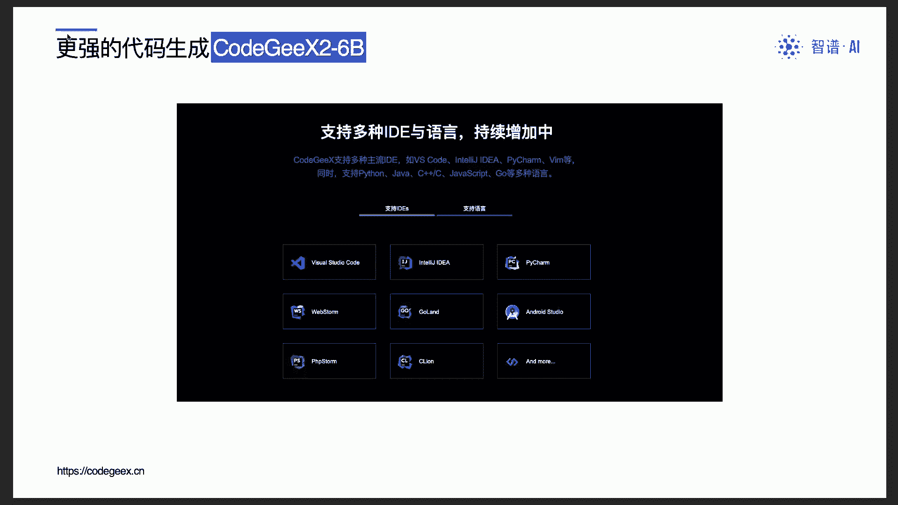

以下是CodeGeeX2的核心特点：
*   **参数量下降**：从13B降至6B。
*   **性能提升**：在HumanEval测试集上的得分从22.9提升至35.9。
*   **推理加速**：参数减少带来了更快的推理速度。
*   **IDE集成**：持续增加与更多集成开发环境的集成，使编程更加方便。

---

## 大模型数学计算能力的提升

大模型的计算能力一直备受关注。团队近期发表了一篇论文，探讨大模型在不使用计算器的情况下解决数学问题的能力。

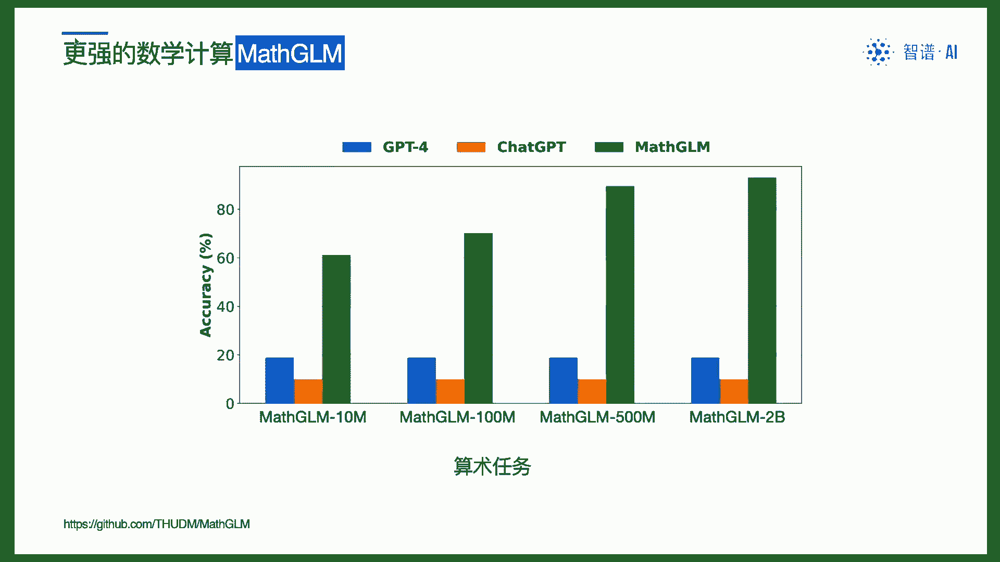

为此，团队开发了MathGLM模型。该模型在数学计算任务上的成绩远超GPT-4，在许多任务上正确率甚至达到99%以上。

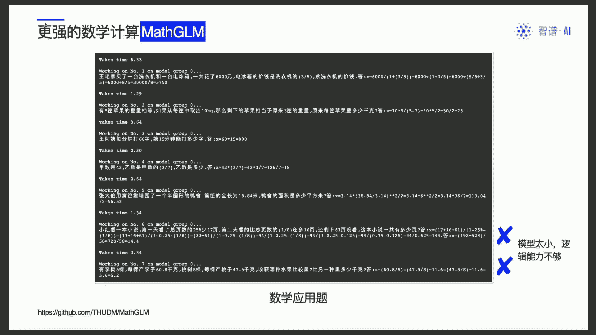

MathGLM模型的特点如下：
*   **高正确率**：在小学数学计算上表现优异。
*   **复杂运算**：能够正确处理八位数以上的乘法等运算。
*   **应用题解析**：在数学应用题解析上也取得了超过90%的优异成绩。
*   **模型轻量**：论文中使用的模型规模非常小，最大不过百亿或十亿参数级别。

---

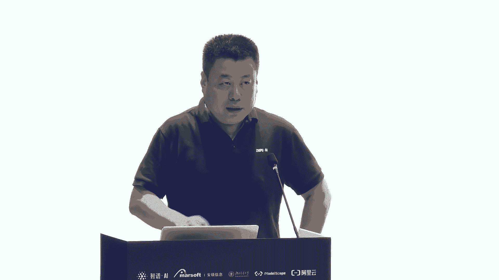

## 图像生成算法的创新

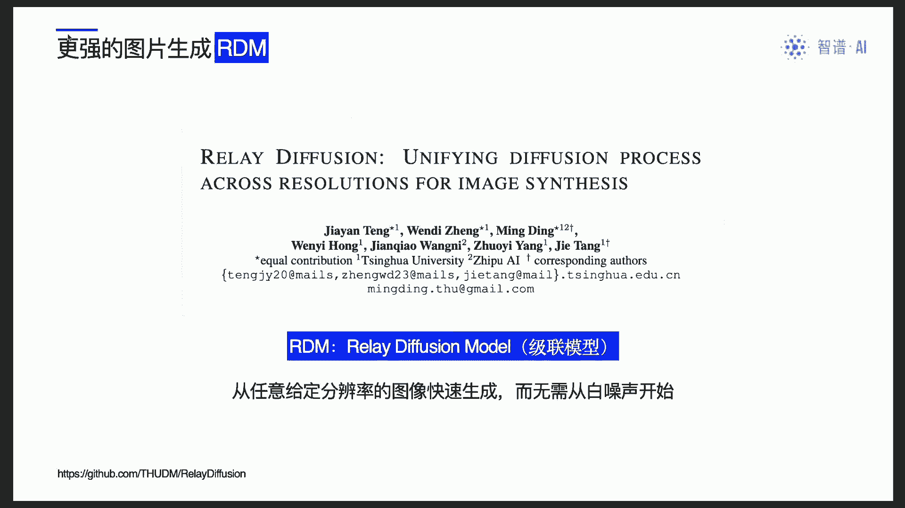

团队在图像生成领域也进行了探索，并提出了一种算法上的改进。

该改进称为**RDM算法**，即“级联式扩散模型”。其基本原理是：首先使用扩散模型从白噪声生成一个低分辨率图像；然后以此小图像为基础，再次使用白噪声进行填充和分块生成；最终合成一个高精度、高清晰度的大幅图像。

这个算法涉及许多需要处理的细节，有兴趣的读者可以查阅相关论文。该模型已集成到“智谱清言”产品中，可供用户体验。

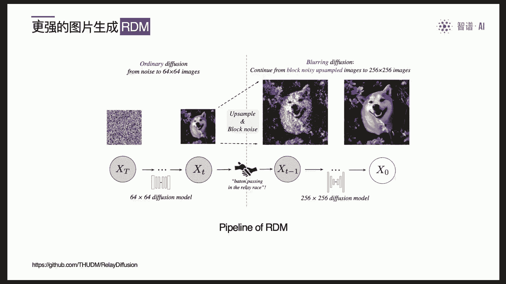

以下是该技术的优势：
*   **运行成本低**：相比其他方法有更低的运行成本。
*   **性能更好**：能生成质量更高的图像。
*   **易于体验**：已在“智谱清言”应用中上线。

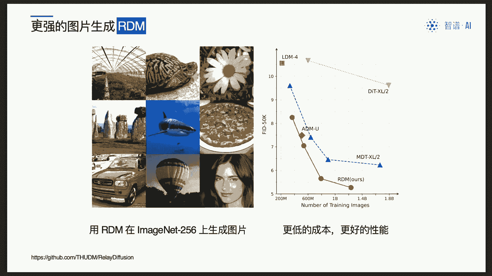

---

## 迈向情感化与角色扮演

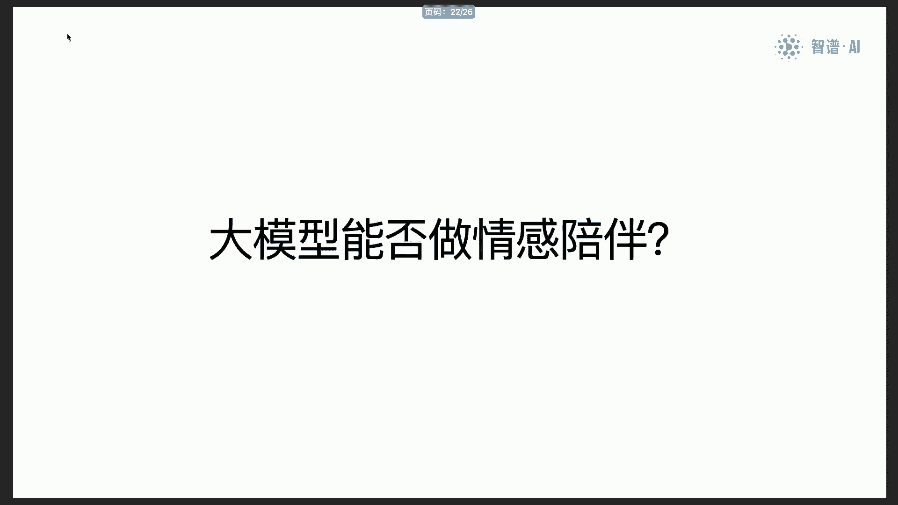

团队还在探索大模型在情感陪护和角色扮演方面的应用。

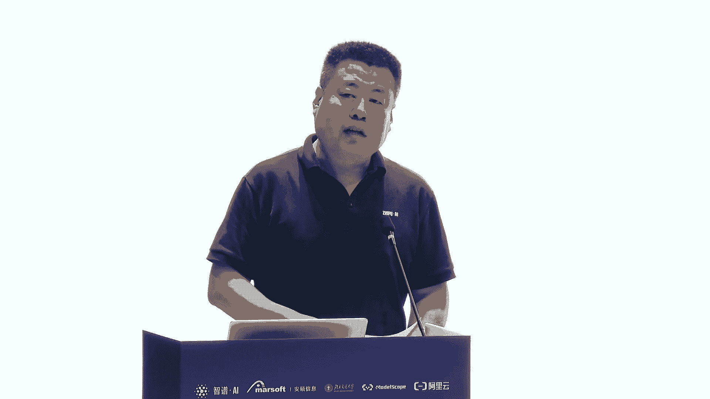

受Character.AI等公司的启发，团队正在开发一个名为**CharacterGLM**的模型。其目标是让大模型能够扮演更人性化的角色，进行情感交互。

目前的一个有趣尝试是探索大模型在模拟对话和剧情创作中的应用。例如，未来在赋予大模型特定角色背景后，或许可以演绎如《甄嬛传》之类的复杂剧情。

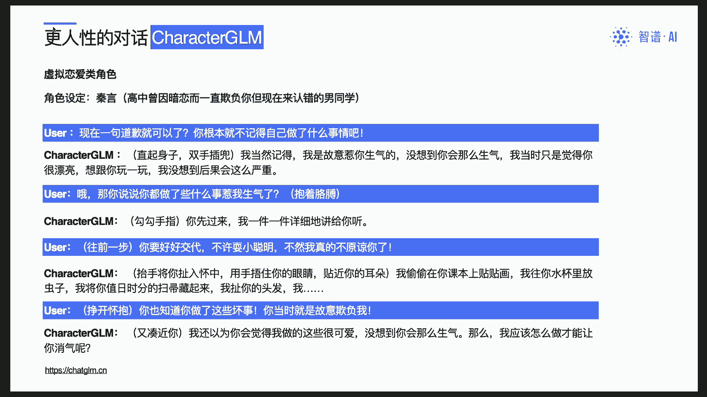

这项工作的愿景是让大模型更多地渗透到创意创作领域。该模型尚未正式发布，此次仅为预告，发布后欢迎大家使用。

---

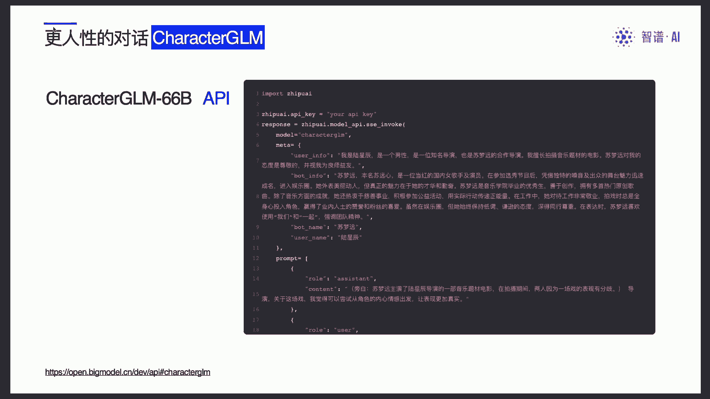

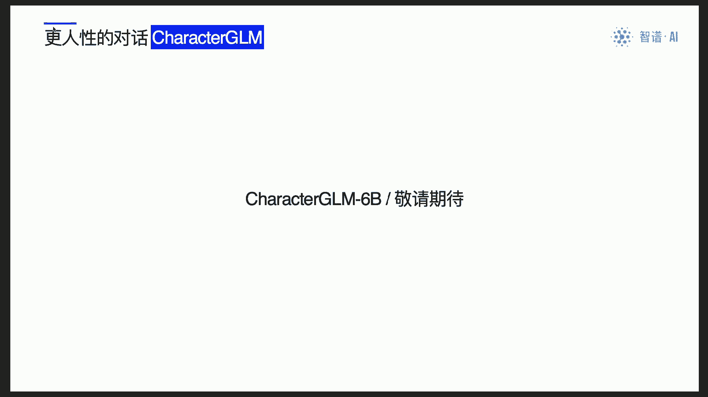

## 总结与展望

本节课中我们一起学习了ChatGLM系列大模型的最新开源进展。

总而言之，团队始终坚持开源道路，推动大模型向多样化发展，使其在各个领域发挥作用。我们真诚希望更多的研究者、工程师、公司和行业领域能够参与进来，共同将大模型技术深耕到实际应用中。

有人说，大模型的上半场是基础模型的比拼，而下半场的竞赛——即技术下沉到各行各业——已经开始。期待与大家一同参与下半场的开拓。