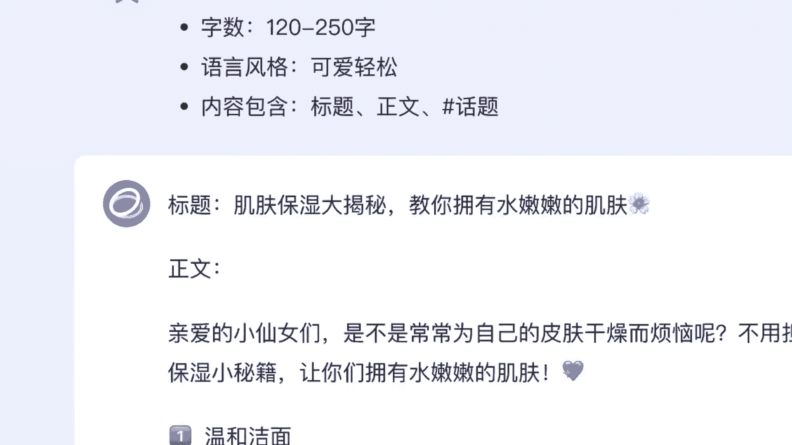

# 课程 P1：认识智谱清言与ChatGLM2 🚀

在本节课中，我们将一起了解智谱清言及其背后的ChatGLM2模型。我们将介绍它的基本概念、特点以及如何开始使用它。

---

## 概述

智谱清言是一个基于ChatGLM2模型构建的智能对话服务。ChatGLM2模型现已全面开放，正式对外提供服务。本教程旨在帮助初学者理解其核心概念并掌握基本使用方法。

---

## 什么是智谱清言？🤖

智谱清言是一个人工智能对话助手。它的名字来源于“清言的「清」”和“清言的「言」”，寓意清晰、智慧的言语交流。


上一节我们介绍了课程目标，本节中我们来看看智谱清言的具体定义。

智谱清言的核心是一个大型语言模型，它能够理解人类的自然语言输入，并生成流畅、相关的文本回复。其目标是提供高效、准确的信息服务和对话体验。

---

## 认识ChatGLM2模型 🧠

ChatGLM2是支撑智谱清言服务的底层人工智能模型。它是一个经过大规模数据训练的语言生成模型。


上一节我们了解了智谱清言，本节中我们将深入其技术核心——ChatGLM2模型。

ChatGLM2模型基于Transformer架构，这是一种在自然语言处理领域取得巨大成功的深度学习模型。其核心工作原理可以简化为根据输入的文本序列，预测下一个最可能的词或字，公式可以表示为：

**`P(下一个词 | 已输入的文本序列)`**

模型通过不断重复这个过程，从而生成完整的句子或段落。

---


## 主要特点与能力 ✨

ChatGLM2模型和智谱清言服务具备多项特点，使其成为一个强大的工具。

以下是其主要能力列表：

*   **强大的语言理解与生成**：能够处理复杂的对话上下文，生成连贯、合乎逻辑的回复。
*   **多领域知识**：在训练中学习了广泛的互联网文本，涵盖科技、文化、生活等多个领域。
*   **代码理解与生成**：支持多种编程语言的代码解释、补全和错误排查。
    ```python
    # 例如，它可以帮你解释一段Python代码
    def greet(name):
        return f"Hello, {name}!"
    ```
*   **逻辑推理与问题解决**：能够进行简单的数学计算、逻辑推理和分步骤的问题解答。



---

## 如何开始使用 🛠️

使用智谱清言服务通常非常简单，无需复杂的配置。

上一节我们介绍了它的能力，本节中我们来看看如何实际使用它。

一般来说，你可以通过以下方式访问：


1.  访问官方网站或指定的平台入口。
2.  在提供的对话框或输入框中，直接输入你的问题或指令。
3.  模型会处理你的输入并返回相应的文本回复。

整个过程类似于与一个知识渊博的朋友进行即时文字聊天。

---

## 总结

本节课中，我们一起学习了智谱清言及其背后的ChatGLM2模型。我们了解了智谱清言是一个智能对话服务，其核心ChatGLM2模型是一个基于Transformer架构的强大语言模型。我们还列举了它的主要特点，包括语言生成、多领域知识和代码处理能力，并简述了开始使用它的基本步骤。希望本教程能帮助你顺利开始与智谱清言的交互。