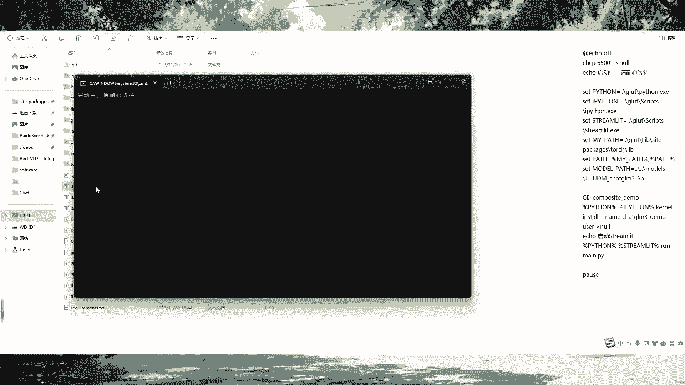
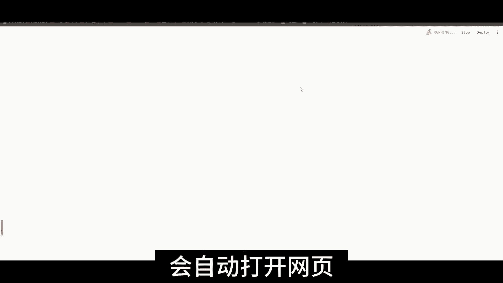
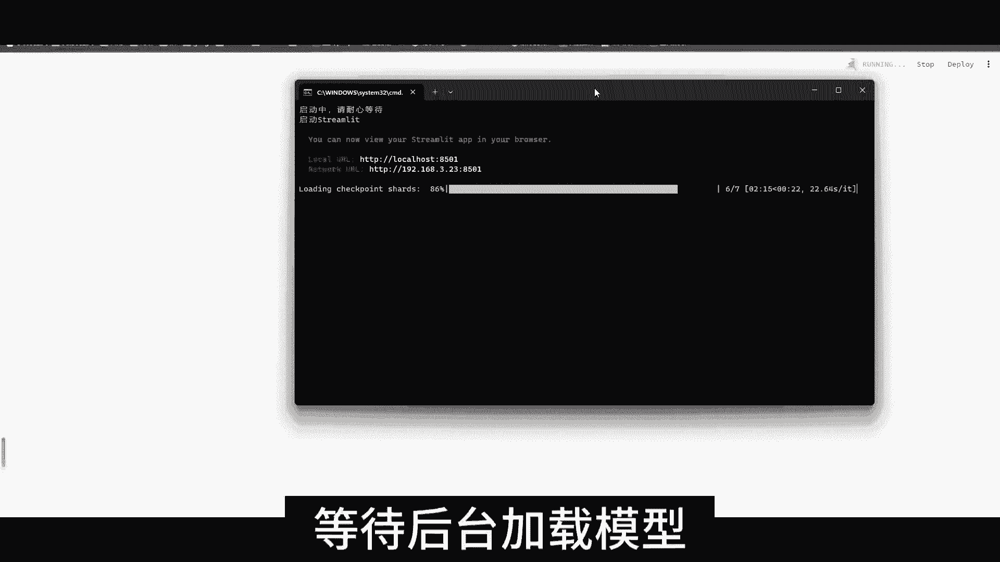
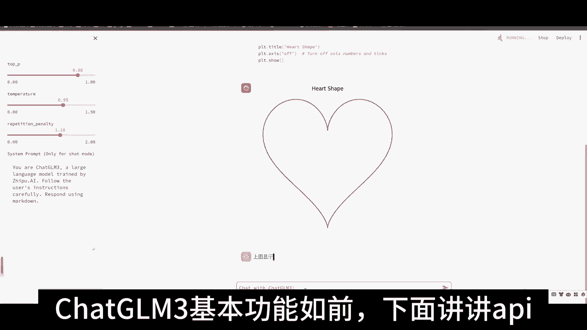
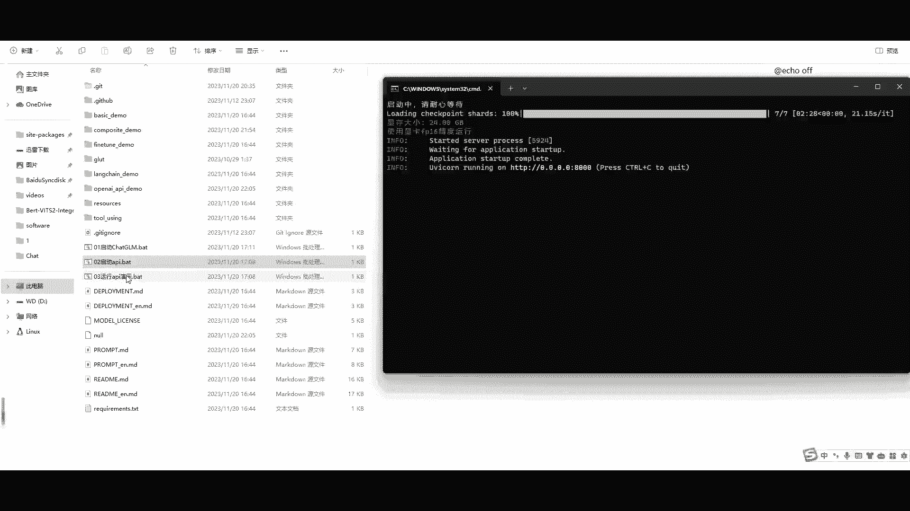
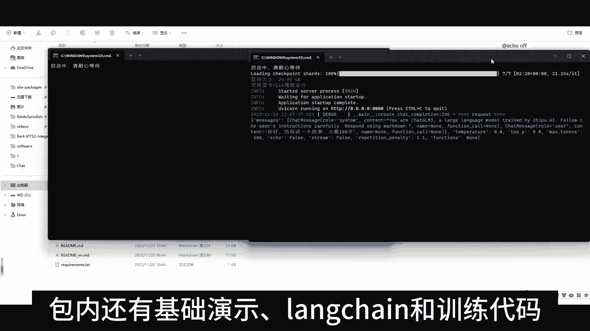
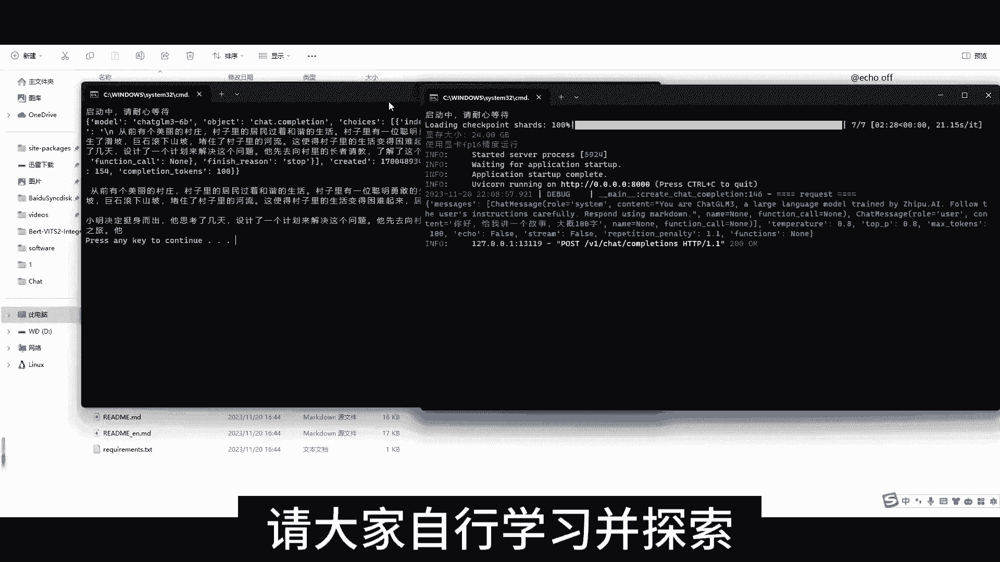
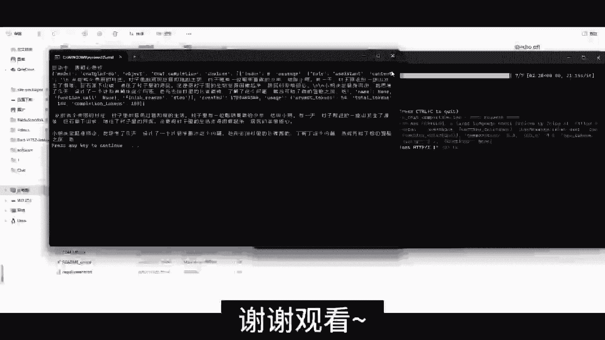

# 课程 P1：ChatGLM3 一键安装与基础使用指南 🚀

在本课程中，我们将学习如何通过一键安装包快速部署 ChatGLM3 大语言模型，并了解其基本的聊天、工具调用和代码生成功能。

## 概述

本节教程将引导你完成 ChatGLM3 的本地部署与初步体验。我们将从启动 Web 聊天界面开始，逐步探索其核心功能，最后简要介绍其 API 服务能力。

---

## 启动 Web 聊天界面 💬

上一节我们概述了课程内容，本节中我们来看看如何启动 ChatGLM3 的 Web 聊天界面。

打开名为“零一”的启动程序，系统将自动打开默认浏览器并加载 ChatGLM3 的 Web 界面。

如果系统未设置默认浏览器，你需要手动复制终端中显示的网址，在浏览器中打开。随后，请等待后台程序加载模型。

---

## 探索聊天功能与角色扮演 🎭

模型加载完成后，页面将默认进入 **Chat（聊天）** 模式。你可以开始与 ChatGLM3 对话，测试其各项能力。

以下是基础操作指南：
*   **刷新网页**：此操作可以清空当前的聊天记录。
*   **使用左侧设定栏**：你可以在此调整对话参数，例如让模型扮演特定角色（如“猫娘”）。
*   **调整参数**：将“温度”等参数调整至 `0.8`，可以测试模型在创造性任务（如算术）上的表现。

测试结果表明，其回答基本正确。

---

## 使用工具调用与代码生成模式 ⚙️

了解了基础聊天功能后，我们进一步探索 ChatGLM3 更强大的工具调用与代码生成能力。

以下是其他模式的使用方法：
*   **切换到 Tool（工具）模式**：在此模式下，你可以让模型调用内置工具，例如查询“北京天气”。用户也可以自行添加自定义工具。
*   **切换到 Code（代码）模式**：此模式专为代码生成与执行设计。例如，你可以输入指令“用Python画一个爱心”，模型会生成相应代码并展示运行效果。

至此，ChatGLM3 的基本功能已介绍完毕。

---

## 启用 API 服务端 🌐

除了交互式网页，ChatGLM3 还提供了 API 服务，可供其他应用程序调用。

首先，关闭之前打开的网页和后台进程。然后，打开名为“零二”的启动程序。启动成功后，该 API 服务即可作为后端，供诸如 **ChatGPT-Next-Web** 等基于 ChatGPT 的应用连接使用。

为了演示 API 的连通性，此时可以打开“零三”测试程序进行验证。

---

## 关于安装包与进阶学习 📚

本一键安装包基本基于官方 Git 仓库的原版文件构建，主要针对 **NVIDIA 显卡**用户添加了自动量化代码以优化运行效率。

安装包内还包含更多资源供你探索：
*   **基础演示脚本**：帮助你快速上手。
*   **Lag Train 及训练代码**：为有兴趣进行模型微调或进阶学习的用户提供起点。

请大家利用这些资源自行深入学习与实践。

---

## 总结

在本节课中，我们一起学习了 ChatGLM3 大语言模型的一键安装与启动流程。我们体验了其 **Chat（聊天）**、**Tool（工具调用）** 和 **Code（代码生成）** 三种核心模式，并了解了如何启用其 **API 服务** 以供其他应用集成。最后，我们也介绍了安装包内包含的进阶学习资料。现在，你可以开始尽情探索 ChatGLM3 的各项能力了。