# 课程一：金融领域大模型应用的核心认知与场景概览 🧠

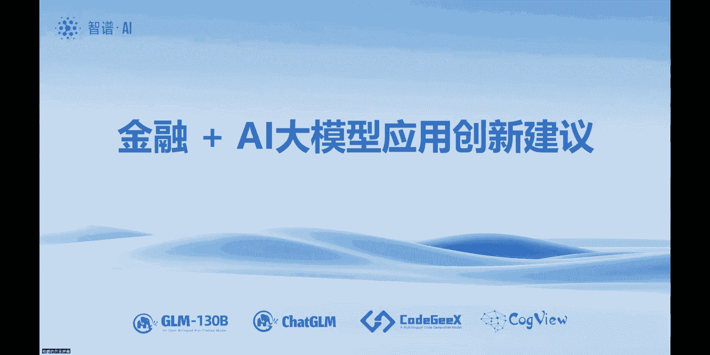

在本节课中，我们将学习大模型在金融行业应用的核心逻辑、关键挑战以及典型应用场景。我们将从基础认知出发，理解大模型如何“思考”，并探讨其在银行、保险等具体业务中的落地路径。

---

## 概述：大模型是什么？它能做什么？

大模型的核心功能是实现“认知对齐”，即让机器像人一样思考。从技术形态上看，它需要知识库作为基础，并具备听说读写等交互能力。然而，最关键的部分在于中间的“思考过程”。简单的问答（一问一答）本质上是搜索能力的体现，而复杂的、需要多轮交互和逻辑推理的任务，则依赖于对“思考过程”的精心设计和编程。

因此，大模型的应用开发，其关键与难点在于对特定业务场景下“思考逻辑”的复现与优化，而不仅仅是提供知识库。

---

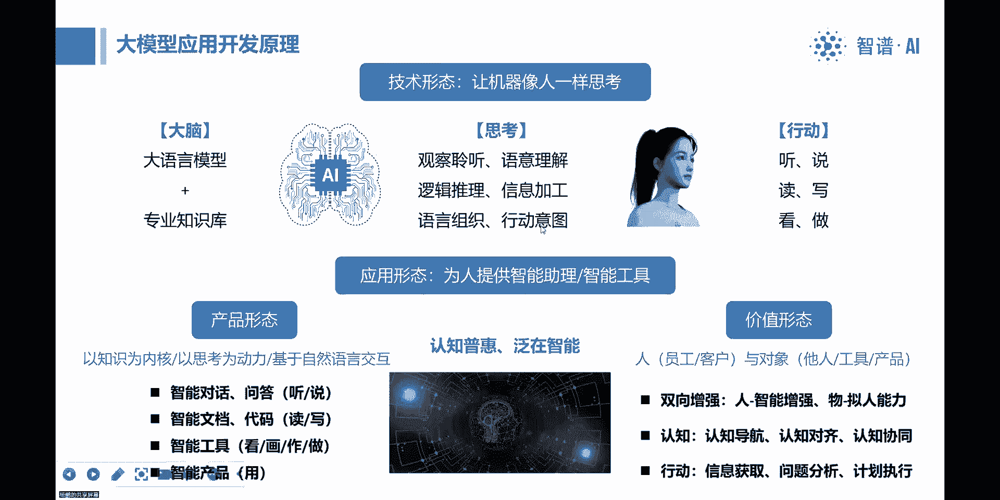

## 大模型的应用形态与价值

上一节我们介绍了大模型的核心是“思考”，本节中我们来看看它的具体应用形态和带来的价值。

从产品形态上看，大模型的应用非常广泛：
*   **智能对话问答**：对应人的“听”和“说”的能力。
*   **智能文档与代码处理**：对应人的“读”和“写”的能力。
*   **智能工具与多模态应用**：例如图像生成、内容创作，对应“看”、“画”和“做事”的能力。
*   **自然语言调用工具**：通过自然语言交互调用现有的专业工具（如CAD、CAE软件）。

从应用价值上看，大模型可以实现双向赋能：
*   **对人（员工或客户）**：增强人的智能，充当智能助理。
*   **对物（产品、工具）**：赋予物拟人化的交互能力，实现“假如产品会说话”的体验。

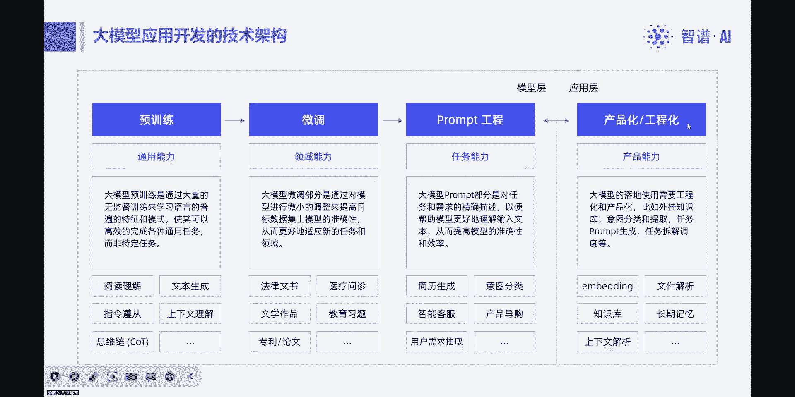

最终，大模型的目标是实现**认知的普惠**或**泛在智能**，让智能能力无处不在。目前，逻辑和技术路径是通的，主要难点在于每个专业领域“思考过程”的设计。

---

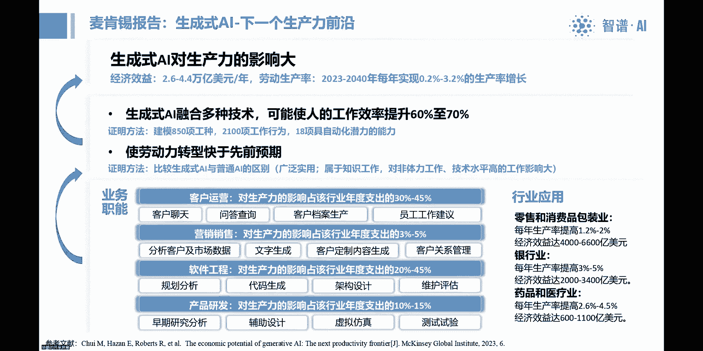

## 大模型应用的开发路径与难点

理解了应用价值后，我们来看看将一个通用大模型变成专业领域工具需要经历什么。

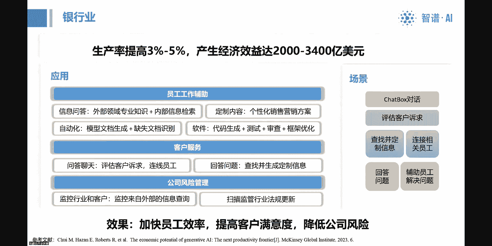

以下是典型的大模型应用开发路径：
1.  **通用预训练模型**：拥有广泛但浅层的知识。
2.  **领域专业知识注入**：通过微调等方式，让模型掌握特定领域知识。
3.  **提示工程与任务适配**：设计提示词，引导模型完成特定任务。
4.  **产品化与工程化**：将能力封装成稳定、可用的产品。

我们近期的体会是，真正的难点和重点工作在于**产品化和工程化**。微调可以改变模型回答的风格和准确性，但无法直接赋予其复杂的业务思维逻辑。这好比医学教科书无法代替医生问诊。必须深入理解业务场景（如信贷审批、保险核保）的思维链条，并将其“编程”到大模型的应用流程中，才能打造出客户期待的产品。

---

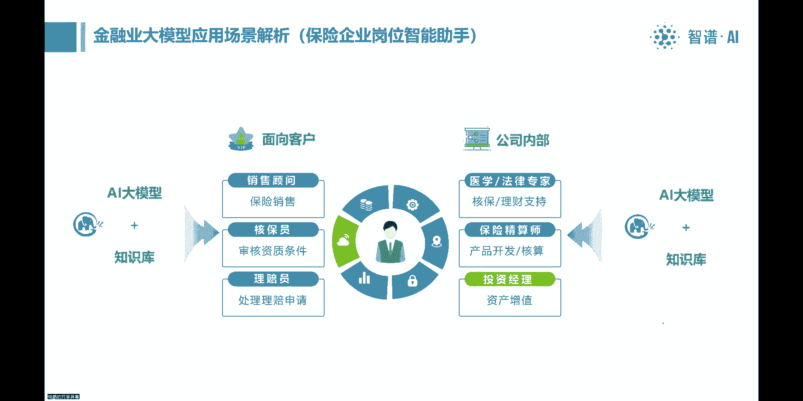

## 行业报告洞察：哪些领域价值最大？

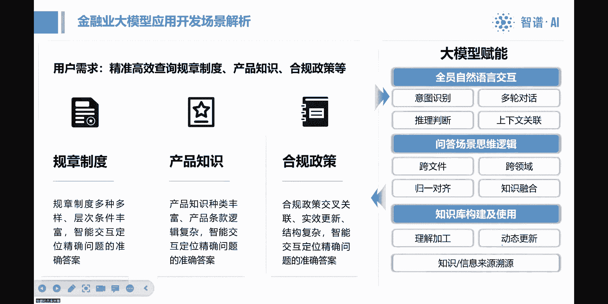

根据麦肯锡的报告分析，大模型对需要“动脑”的工作影响最大。报告通过对大量工种的分析，指出了四个价值最显著的方向：

以下是麦肯锡报告指出的四大高价值方向：
1.  **客户运营**：包括客户交互、档案查询、生成工作建议等。
2.  **营销与销售**：提升营销内容生成、销售对话的质量与效率。
3.  **软件工程**：辅助代码生成、测试、文档编写等。
4.  **产品研发**：加速产品设计、市场调研等创新过程。

这些方向的共同点是都需要高度的“思考”和“实时交流”。在银行业的具体应用中，则体现在员工辅助（信息查询、知识问答）、自动化流程、客户服务以及风险管理等方面，核心目标是**提升效率、满意度和降低风险**。

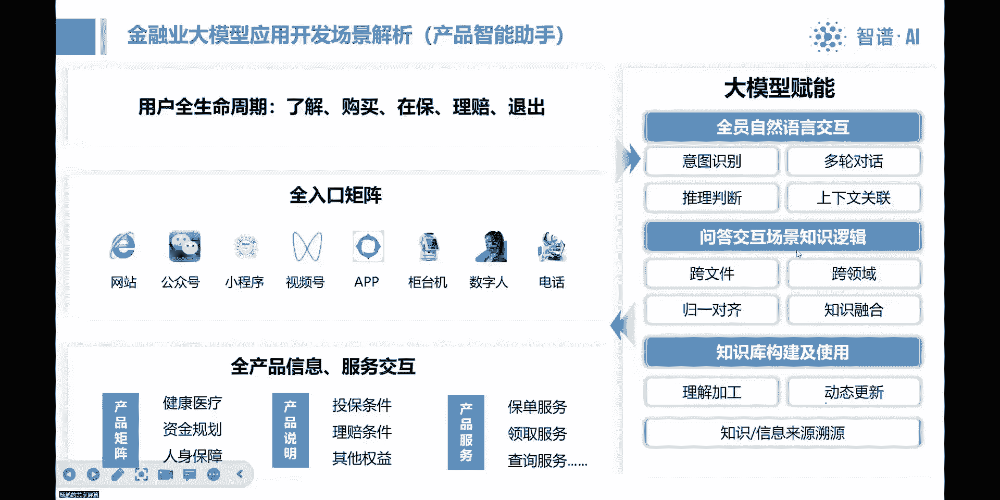

---

## 金融行业典型应用场景解析

基于与客户的共创实践，我们总结出一些金融领域的具体应用场景。其核心思路是为每个岗位打造“智能助手”。

### 场景一：保险销售与客服助手 🛡️

在保险行业，大模型可以赋能多个环节。

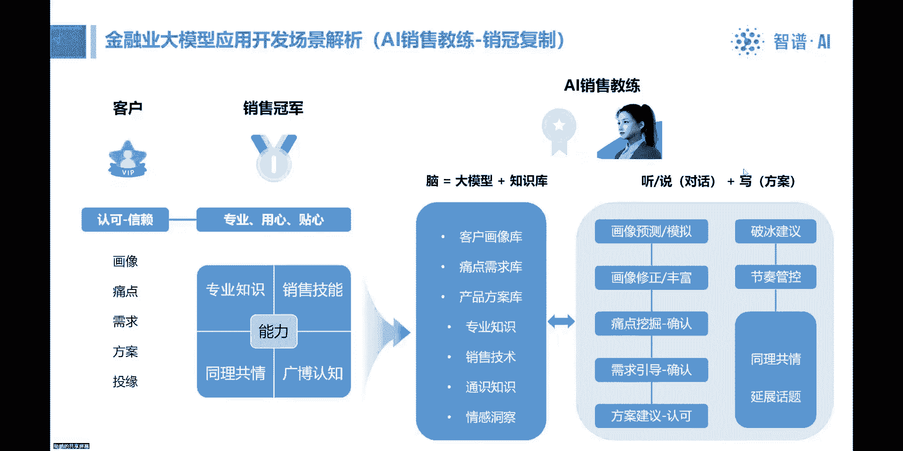

以下是保险领域的几个关键助手应用：
*   **销售助手**：辅助保险销售人员理解产品、应对客户咨询。
*   **核保助手**：帮助核保人员快速审核保单，提示风险点。
*   **理赔助手**：引导用户完成理赔流程，自动审核材料。
*   **产品知识助手**：将复杂的保险条款转化为通俗易懂的解答，方便内外勤人员及客户查询。

其技术逻辑可以概括为一个公式：**智能应用 = 自然语言交互界面 + 场景思维逻辑 + 知识库系统**。难点在于构建符合业务逻辑的“思维链条”和高效的信息调取机制。

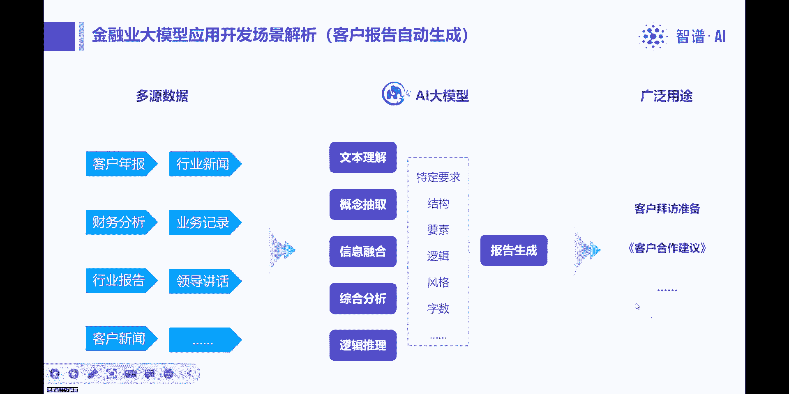

### 场景二：全生命周期保险管家 🔄

围绕一个保险产品，从客户了解、购买、保全到理赔的全生命周期，都可以嵌入智能助手。这可以形成覆盖App、小程序、客服系统等**全入口的智能矩阵**。背后需要整合产品说明、投保规则、理赔条件、配套服务等海量信息，并提供连贯的、个性化的问答交互，价值巨大。

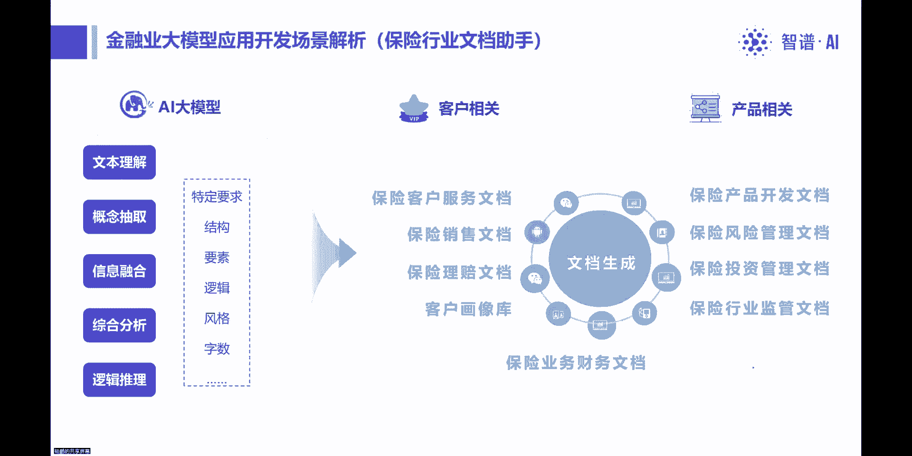

### 场景三：智能销售教练 💬

销售的本质是建立信任，而非简单推销。优秀的销售过程是一个精细化的对话和需求引导过程。

一个智能销售教练系统应能模拟以下思维链：
```
客户画像预测 -> 沟通中挖掘痛点 -> 确认并引导需求 -> 生成定制化方案 -> 方案讲解与促成
```
它需要集成客户画像库、痛点需求库、产品知识库以及销售技巧库。通过大模型复现“听说读写”的销售过程，从而提升销售人员的专业度、用心度和成交率。这是价值高、难度也高的应用方向。

### 场景四：金融文档自动生成与报告助手 📊

在金融业，如客户经理拜访前需要准备客户分析报告。大模型可以整合企业年报、新闻、内部数据等多源信息，进行总结、提炼，并按照特定格式**自动生成报告**，甚至提供初步的合作建议。这极大地提升了前台人员的工作效率。

从企业管理角度看，文档即流程。几乎企业中的所有文档（如尽调报告、合规报告、审计底稿）都可以规划其自动生成路径。这反过来会推动与数据库、BI系统等工具的深度集成。**大模型正成为人与系统交互的“第一入口”**，负责调度各类工具完成复杂任务。

---

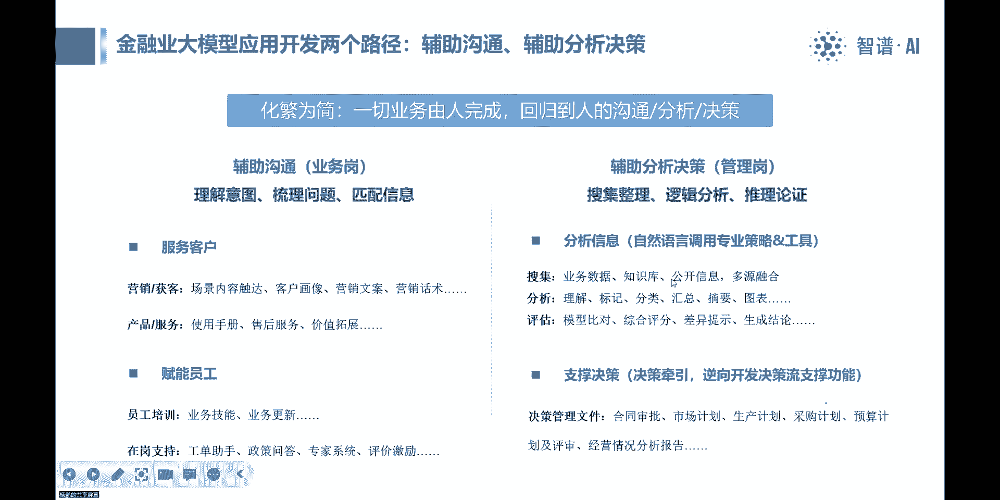

## 总结：核心理念与开发建议

本节课中，我们一起学习了金融大模型应用的核心逻辑与落地场景。

我们可以将大模型的应用归结为一个核心：**做人的智能助手**。人的工作无非“沟通、分析、决策”。
*   **对于沟通岗（业务岗）**，助手以**问答**为核心，关键是从“等待提问”变为**主动引导和帮助用户思考**，这需要对业务思维过程进行“编程”。
*   **对于分析决策岗（管理岗）**，助手以**生成**为核心，集成各类工具进行信息分析，支撑决策。

目前，大模型技术与应用之间存在鸿沟。成功的开发需要**业务方与技术方深度协同**，甚至业务方要承担70%的工作（定义场景、梳理逻辑、准备知识、持续测试），技术方则提供方法论和工程实现。

对于企业而言，引入大模型应用是一个创新过程。建议以“创新副驾驶”的心态，从小场景切入，快速迭代，让大模型真正赋能业务，走向认知普惠。

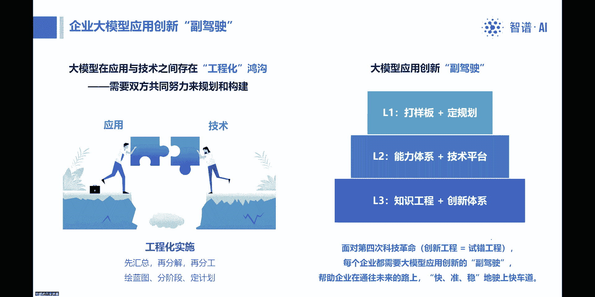

---
**（注：文末的二维码及联系人信息在此教程中略去）**