# CogVLM2 课程：第二代视觉大模型详解与应用 🚀

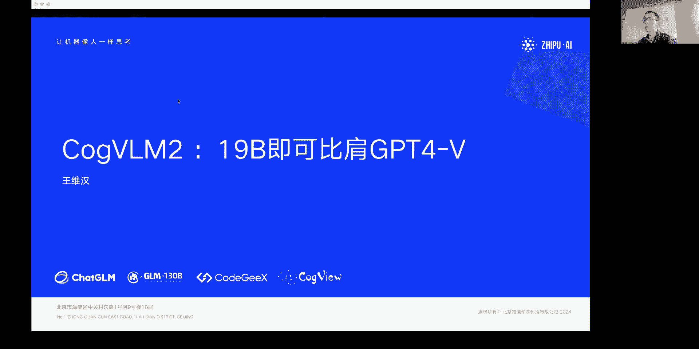

## 概述

在本节课中，我们将学习智谱AI与清华大学联合研发的第二代开源视觉大模型 **CogVLM2**。该模型仅用190亿参数，即可在多项任务上达到媲美GPT-4V的性能。课程将分为两部分：首先深入解析模型原理与架构，然后介绍其实际应用与快速上手方法。

---

## 第一部分：模型原理与技术细节

上一节我们概述了课程内容，本节中我们来看看CogVLM2的核心技术原理。

### 多模态大模型的发展背景

自GPT-4发布以来，大语言模型在众多任务上展现出强大性能。它能够通过少量样本学习和思维链解决复杂问题。但由于大语言模型训练使用的是纯文本语料，缺乏对视觉概念和真实物理世界的理解，它们常常会在一些简单问题上犯错。

今年以来，头部科技公司无一例外地将多模态能力作为主要卖点。例如，谷歌在去年3月提出了PaLM-E模型，将多模态大模型与机器人相结合，从而响应人类指令并执行动作。其今年发布的Gemini 1.5支持原生动态输入，并能处理长达十小时的视频。今年5月，OpenAI发布的GPT-4o可以实现实时输入、解析以及输出包括音频、图片、视频、文字在内的所有模态内容。

我们相信，训练一个强大的语言模型，然后在它的基础上添加各种模态，是实现AGI比较可行的技术路线。

### 现有多模态模型的痛点与CogVLM的演进

虽然最新的多模态大模型在过去一年发展迅速，但仍然存在一些关键痛点。例如，模型往往会输出图片中的“幻觉”，分不清图片中物体的形状和位置，或者只能处理224分辨率的模糊图片，以及完全无法识别中文场景和文字等。

我们团队针对这些痛点持续进行改进，并且很早就意识到多模态模型的OCR能力是模型能否落地的关键因素。

以下是CogVLM系列的演进过程：

*   **2023年5月 (VisualGLM)**：模型只能回答一些简单问题，例如“图片中有几个人”或“图片里的人在干什么”。
*   **2023年9月 (CogVLM初代)**：模型已具备较强的指代能力和初步的文字识别能力。
*   **2023年11月 (CogAgent)**：模型在GUI交互和通用领域取得较好结果，具备T2I能力，可以进行关于图片的对话和OCR对话。例如，将表格转化为Markdown格式或分析折线图中的具体数字。

具体来说，我们在去年10月发布的CogAgent模型已经可以高效完成十个多模态任务，包括传统的视觉问答、世界知识，以及一些高级任务，如涉及数据和代码的逻辑问答、图表问答等。其另一大特点是能够直接与生活场景交互，即让模型模仿人类与手机、电脑等设备的GUI界面进行交互。

### CogVLM2的核心架构创新

上一节我们回顾了模型的发展，本节中我们聚焦于CogVLM2解决核心问题的关键技术。

#### 1. 高分辨率视觉输入处理

对于CogAgent，相对于初代CogVLM的一个重要改进是使其适应高分辨率输入图片。我们知道，网页截图或文档至少需要720P分辨率，可能需要上千像素的输入才能支持模型很好地识别信息。但如果直接使用原始的CogVLM结构，会导致视觉序列非常长。

假设CogVLM的输入是一个224分辨率的图片，它大概有256个token。但如果扩展到1000以上分辨率，可能会达到6400个token的图片序列，接近纯文本输入十页PDF的计算量。这个巨大的计算开销可能难以接受，虽然现在的一些长文本语言模型可以训练，但速度会非常缓慢，不利于快速推理和迭代。这也是现在大多数多模态模型面临的问题。

我们的解决方案是引入了一个**高分辨率的Cross Attention分支**。思路很简单：完全保留CogVLM的原始结构，只是加上了一个以Cross Attention形式桥接的高分辨率图像输入。它对应一个很小的图像编码器，并与原有的CogVLM结合。原始参数是170亿，加上这个模块后只增加了约1亿参数，并且通过减少输入到语言模型中的序列长度，最终实现了十倍左右的加速。

#### 2. Visual Expert（视觉专家）模块

在CogVLM2中，我们延续了一代模型和CogAgent使用的Visual Expert模块。其实我们刚提出Visual Expert时，像BLIP-2和Flamingo这类只微调视觉编码器和语言模型之间少量参数（即“浅层融合”）的模型还比较流行。它们所有的语言模型参数在训练过程中完全不变，可能在VQA这样的简单数据上能取得较好效果。

但我们实测发现，这种浅层融合的模型在一些困难任务（如MathVista和视觉推理任务）上的效果并不理想，比相似参数量的LLaVA要低几十个点，并且模型输出“幻觉”的概率也远高于训练了语言模型参数的模型。我们分析，这种现象是因为在浅层融合过程中，大语言模型并不能理解多出来的图像序列是什么，导致视觉特征和文本特征难以对齐。

一个直观的方法是在预训练时连同语言模型的参数一起训练，例如谷歌的PaLI就做了这样的事。但这可能带来另一个问题：模型会完全忘记之前学过的纯文本语料知识。我们希望训练后的模型既能保持原有的大语言模型知识和推理能力，而不是一个只能输入图片的模型。因此，如何在深度融合视觉和语言特征的同时，又保留原本的语言理解能力，是我们需要解决的问题。

CogVLM给出了一个比较优雅的解决方案。因为很多视觉概念是语言空间里所不具备的，因此我们想让视觉和语言空间还是各自占据一个空间。我们在冻结的预训练语言模型中，引入了一个可以训练的视觉专家模块。

具体来说，这个视觉专家是在语言模型的每一层（注意力和前馈神经网络里）添加了为视觉特征单独学习的参数。在调节参数时，我们只调节这部分参数。所以当输入不含图像时，模型就会自动退化为原来的语言模型。这样就既实现了视觉语言特征在所有层的深度融合，又可以完全保留语言模型的知识。

它的总体机制类似于一种**硬路由的MoE机制**，也就是说每个token只激活模型参数中的一部分，因此没有增加任何计算开销。当然，最近的一些开源模型，如LLaVA-NeXT和MiniGPT，没有使用Expert也取得了比较好的效果。所以我们同时基于LLaMA 3训练了一个有Expert和一个没有Expert版本的模型，发现训练原始的语言模型也可以取得比较好的效果，这也算一种深度融合的手段，只是模型的纯文本能力会损失大一些。我们的实验结果显示，加上Expert之后，模型在MMBench等数据集上的分数会平均高出2%左右，所以我们最后决定开源这个带Expert的版本。

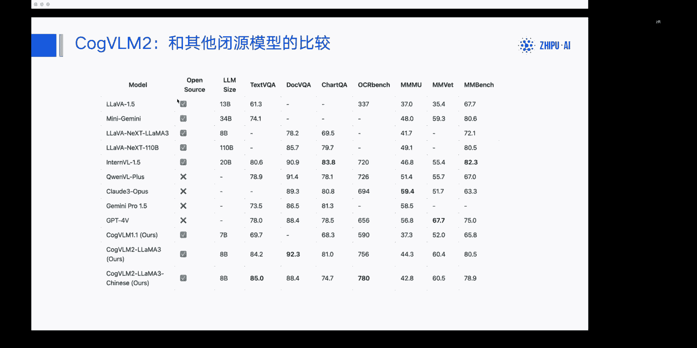

#### 3. 视觉-语言特征对齐与位置编码

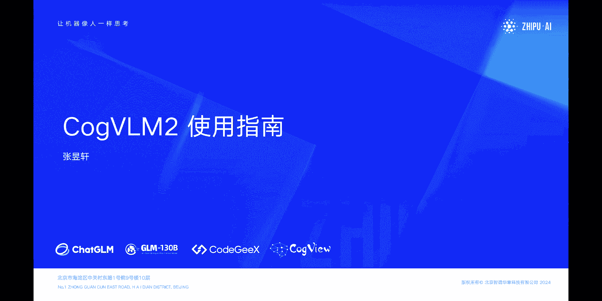

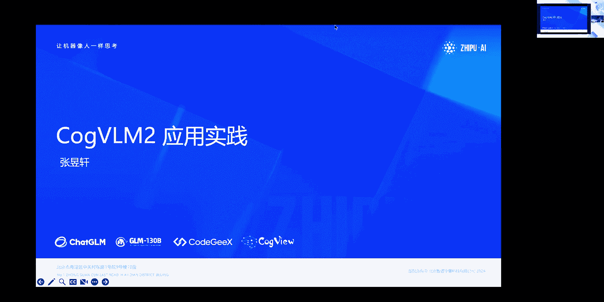

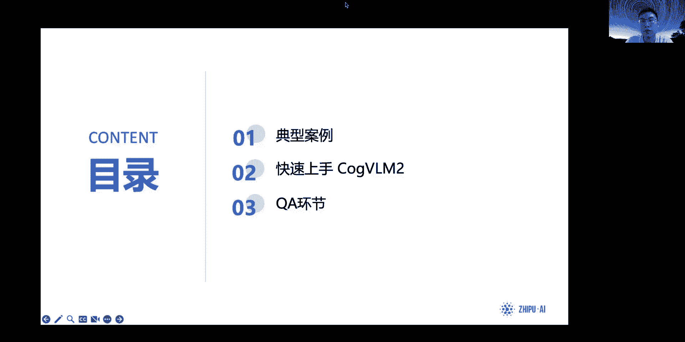

在设计CogVLM2的结构时，一个比较重要的问题是如何来桥接视觉和语言的特征。像BLIP-2和Flamingo采用了Q-Former，它的好处是可以很好地压缩信息来减少token，因此训练和推理的速度都很快。但是一个比较明显的坏处是，它的Query无法保证哪些图像的特征被保留。特别是像InstructBLIP，它的Query会和每轮的Prompt强相关，这样每一轮输入的图像特征都不同，甚至无法使用像KV Cache这样的推理加速方法。

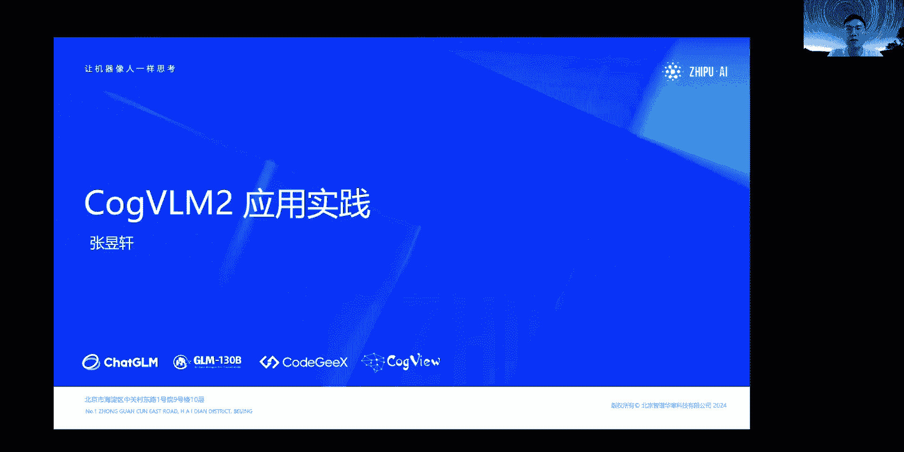

另一个缺点是它也很难保留原始图片在语言空间中的位置信息，因为它将图片序列完全转成新的查询序列。我们测试时也发现，如果使用Q-Former，会导致模型输出“幻觉”的概率明显变大。第三个缺点是，如果我们要测试的图像内容与训练Q-Former的图像有差距，它就不一定能很好地泛化。这其实很好理解：假如我们用一个自然图像来训练Q-Former，那么可能就会丢弃掉那些适用于文本的特征，最终导致其在OCR和文档理解等任务上的能力变弱。而在另一方面，在低分辨率上训练的Q-Former，也很难迁移到高分辨率场景。

我们采用的方法是直接用一个MLP和一个Linear层，从而起到一个模态翻译的功能，尽可能减少在桥接过程中信息的压缩或损失。我们最终的结论是，把一个两层的MLP和一个2×2的卷积层相结合，就可以在尽可能保证图像特征的前提下，降低四倍左右的计算量，同时实现一种无损压缩。

我们针对高分辨率图像的另一个重要改进是修正了图片序列的位置编码。原始的位置编码对于文本中的某个token，只需要一个标量（例如N）来记录它是第N个token。但是对于一个图片序列来说，即使我们进行了patchify操作，它也可能保留宽度和高度两个方向的维度，那么我们就需要一对坐标来准确编码这个patch在语言序列中的位置。

总的来说，文本的位置是一个标量，而图像的位置是一个向量(X, Y)，它们两者并不一致。因此我们在处理图文混合输入时，就需要一些技巧来调和这两个模态之间的不一致性。

一个直接的方案是把图片展成一个一维的序列，然后把它当成普通的文本来处理，文本怎么加位置编码，它就怎么加位置编码。但是这样的话，如果图片序列很长，又会带来新的问题。例如，在一个序列长度2000的图片后面拼接一个Prompt，如果这个Prompt是关于图片下半部分的信息可能还好，但如果是关于图片上半部分的信息，就会受到比较大的注意力衰减的影响。

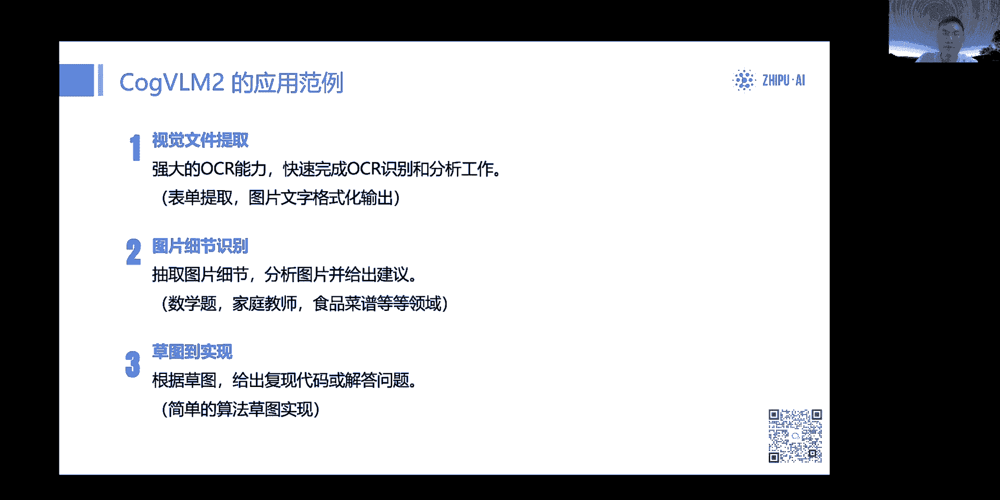

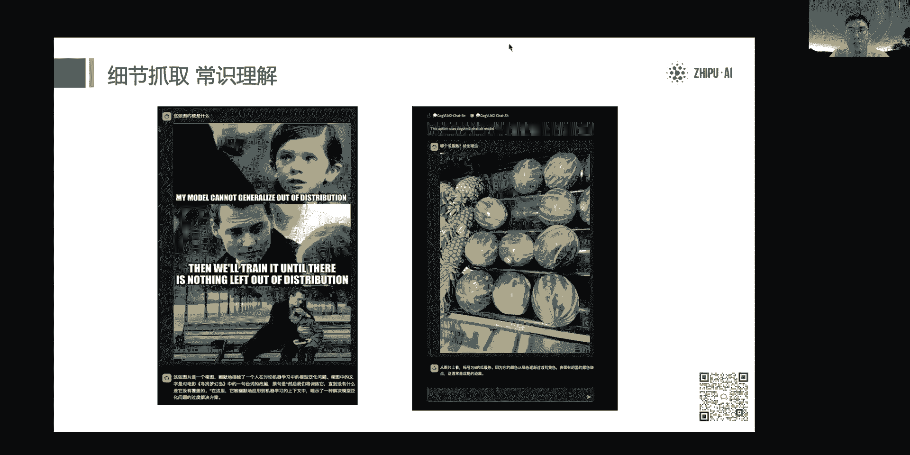

我们采用了一个比较直接的方法：**同一张图片内的所有token共享一个位置ID**。这样既减少了位置ID的消耗，方便位置外推，又可以避免注意力衰减影响。而图片中序列的相对位置关系就完全通过视觉编码器来获取。这样做的好处是，可能在低分辨率的图片上效果不太明显，但是对于1000分辨率以上的文档和图片，可能会看到比较大的提升。

最近RoPE的原作者苏剑林也发现了多模态模型位置编码的问题。他认为位置编码的概念不应该和Attention的用法相绑定，它应该适用于Decoder、Encoder和一种任意的Attention Mask。所以说只有保持图片的二维性，才能最大程度保证模型关于相对位置的先验。如果我们将序列直接展平，就没有办法保证所有邻近位置的相近性，因为少了一个维度，所以可表达的相似性也就少了很多。他提出的另一种方法是把图片序列中的位置编码用2D的RoPE表示，从而无损地保留图片patch的位置信息。而对于纯文本输入，它又会退化为原始的1D RoPE，从而兼容已有的大语言模型。感兴趣的同学可以在会后查看他的相关分享。

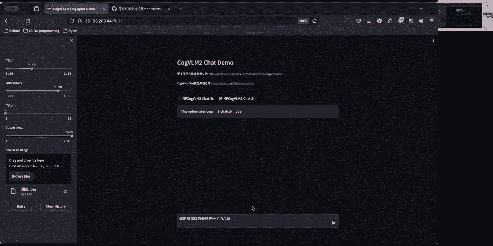

#### 4. 视觉编码器选择与中文能力优化

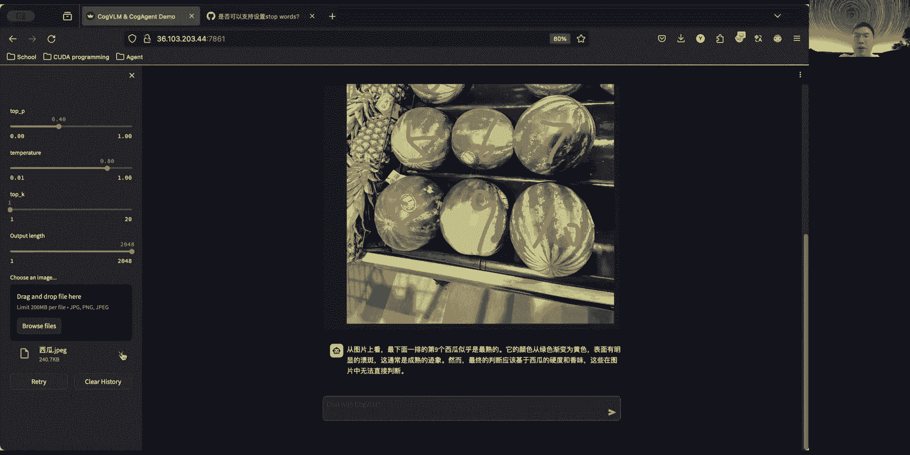

在视觉编码器方面，可能有同学会好奇，为什么我们在去年的CogAgent中使用了EVA-CLIP-large和EVA两个ViT，但在二代CogVLM中只回归到了一个EVA。其实这也是基于我们充分的实验观察到的现象：虽然CogAgent可以在结合高分辨率和低分辨率的同时进行比较高效的推理，但是很多情况下，两个ViT的特征是冲突的。例如，可能一个ViT认为图片中有三个人，但另一个ViT认为有两个人，或者两个ViT的特征会显示图片中写着不同的字，导致语言模型并不知道该输出什么信息，从而影响OCR任务的结果。

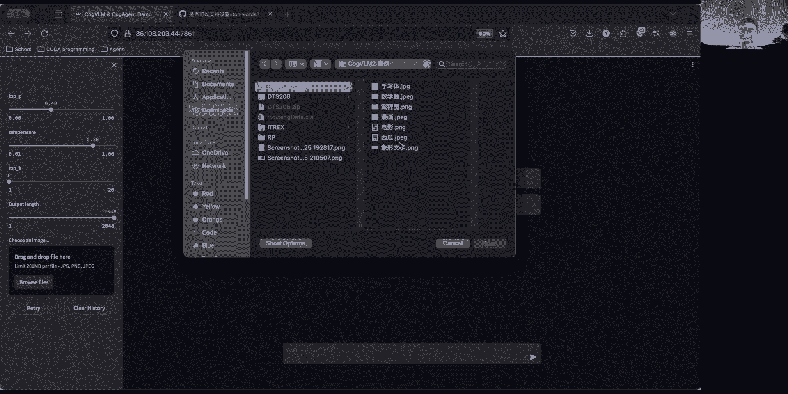

所以为了保证模型效果，我们在CogVLM2中只用了一个40亿参数的ViT。这样做的问题可能是很多同学会反馈它占用的显存比较大。未来我们也会基于一些新的视觉编码器，例如效果持平但参数少得多的SigLIP，来方便大家的部署。最近也有一些其他研究工作会把两个、四个甚至八个ViT的编码器特征拼到一起。个人观点是这样做的效果可能还需要进一步验证，很可能不如使用一个更大的视觉编码器效果好。

我们发布之后，大家常问的另一个问题是：Meta官方发布的LLaMA 3可以理解中文，但很难用中文来回答。那么CogVLM2怎么可以用这个语言模型为基础，做到理解并支持中文？其实主要是在训练数据方面的一些优化。

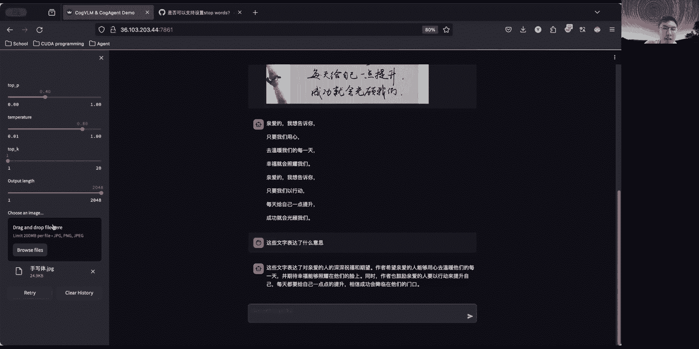

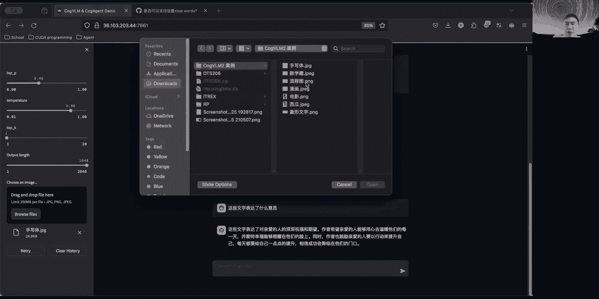

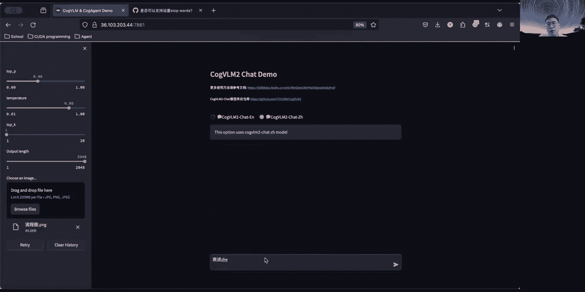

首先是在预训练阶段，我们收集了比较大量的中文图文数据，这些数据会涵盖中文场景中的各种情况。但我们在实际训练时也发现，中文图文对的质量远远低于已有的开源英文数据。在训练一个CLIP模型时，可能用英文数据能达到70左右的效果，但是中文只有50甚至40。因此我们的训练策略是以英文图文对为主，结合少量高质量的中文图文数据。

另一个比较关键的步骤是我们针对中文场景进行了OCR和文档等特定数据类型的数据收集。例如，我们将一些纯文本语料库的数据渲染成了图片，得到了大概8000万张图片。我们还借助了一些已有的OCR工具，如PaddleOCR，来标注约1800万张自然图片。我们还从arXiv上爬了大概900万篇中文的学术论文，以获取比较高质量的LaTeX和PDF配对。在这个过程中，模型可以学到比较好的中文能力。

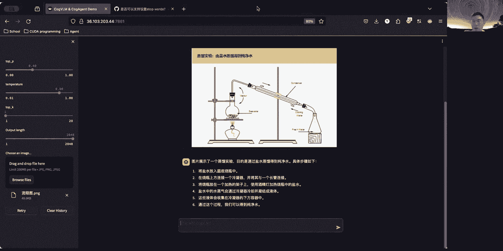

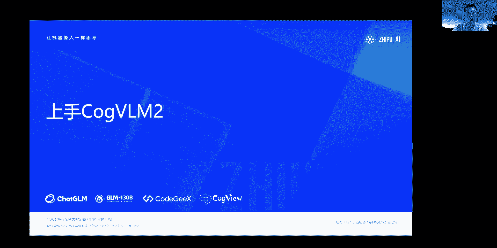

在接下来的指令微调阶段，我们又确保了中英数据的比例在一个合理的范围内，从而使得模型在处理一些中文问题时可以更加得心应手。通过这些措施，我们的CogVLM模型在支持中文方面相比前一代取得了比较显著的提升，无论是在理解中文问题方面，还是用中文回答论述这方面，都能展现出比较良好的性能。这也是我们构建CogVLM模型的一个比较大的亮点和优势。

#### 5. 实验结果与消融实验

最后我们进行了一系列比较彻底的消融实验，研究多模态训练过程中的不同设定，也有了一些比较有意思的发现。

例如，我们尝试引入了图像自监督的损失，让模型预测patch的特征或原始像素，但是发现这样并没有提升模型的效果。我们猜测，这样虽然可能学到一些更好的视觉表征，但是对于模型的自然语言生成能力的帮助可能不大。这一点在谷歌的PaLI工作中也得到了一些印证。

另一个发现是，在图像序列中使用下三角注意力编码，会比使用全注意力编码效果更好。这个也比较反直觉，因为一般情况下，如果一个图像token能看到序列的所有内容，按理说是能取得更好的效果。我们猜测这是因为下三角注意力的掩码更加契合语言模型原有的结构，而全注意力会破坏这种机制。

我们也尝试使用了一个30亿参数的EVA-CLIP模型来替换现在的40亿参数的EVA模型作为视觉编码器，发现在绝大多数任务上可能影响很小，但是对OCR任务的影响比较大。在训练中文OCR图片的时候，也发现了这个现象：30亿参数的ViT学会中文字符的速度要远远慢于40亿的ViT。这也会为大家未来的工作提供一些新的启发。

在实验结果方面，我们与一系列优秀的开源和闭源模型进行了对比，例如同参数量最优的LLaVA-1.5和LLaVA-NeXT模型。我们在所有数据集上的表现都要领先10%到20%左右。相比于Claude-3和GPT-4这些闭源模型，在OCR-Bench等能体现模型识别文字、文档、表格方面能力的数据集上，也可以说是有比较大幅度的领先。仅仅在MMMU这样需要模型有特别强的纯文本语言能力的情况下，大概落后了5%到10%左右。

---

## 第二部分：模型应用与快速上手

上一节我们详细介绍了CogVLM2的技术原理，本节中我们来看看它的实际应用效果以及如何快速部署使用。

### 典型应用场景演示

我们已经看到CogVLM2在很多榜单上取得了成就，在一些领域有比较大的提升。大家可能会有疑问：经历了这么多代视觉模型的进步，我们是否能在更多的应用层面进行新的探索？本次直播的后半部分将为大家提供这方面的简单介绍。

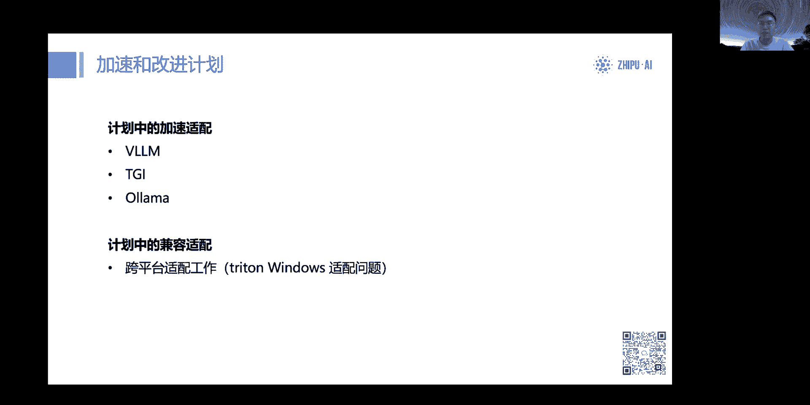

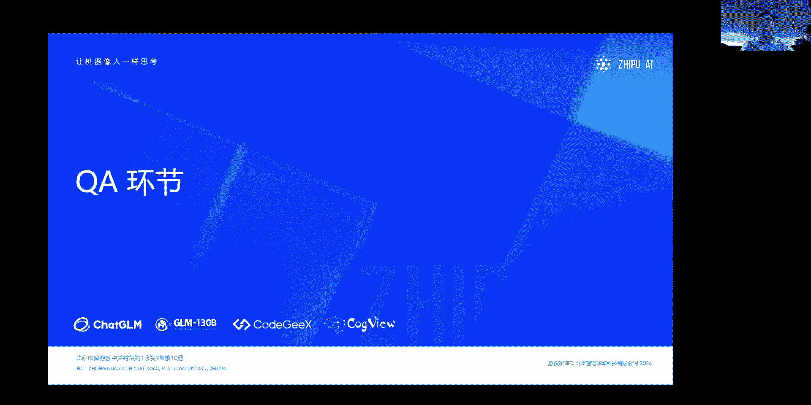

大家对多模态模型有很多憧憬，包括最常见的图表分析和OCR任务。特别是对于一些不规则的文档，无法使用传统的OCR工具进行扫描时，大家就会把这个场景寄托于多模态模型。同时，对于一些不太好用Python或其他编程语言直接读取的图表和文件，我们也希望能通过视觉的方式，用多模态模型进行理解并给出简单分析。此外，还有大家经常提到的拍照解数学题，或者拍照看漫画去体会漫画寓意等带有图像和文本双重模态的任务，我们都对多模态模型有一定的期待。

以下是几个具体的应用场景及其经典案例：

*   **图片细节识别与文件提取**：这是CogVLM2在应用层面能够以肉眼感受到的强大提升。
*   **OCR能力**：包括表单拾取与识别，相对于一代模型甚至比一些专业OCR工具还有更出色的表现。
*   **复杂理解与推理**：例如，给到一个前端页面草图，然后生成代码；或者给一个数学题，要求给出带有解答过程的答案。

### 在线演示与快速上手

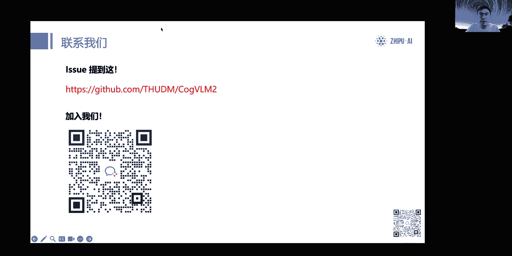

#### 在线体验

我们提供了一个在线的Demo页面供大家体验，地址是：`https://chat.cogvlm.ai/`。该页面部署了BF16精度的模型，性能较好，可以免费公开使用。

在Demo中，我们提供了英文和中文两个版本的模型。英文版本基于原始的LLaMA-3-Instruct训练，只能理解中文但难以用中文回答。中文版本（模型名称中带有“chinese”）则具有完整的中文对话能力，也是我们今天演示使用的版本。

演示案例包括：
1.  **“选西瓜”挑战**：上传一张有多个西瓜的图片，让模型选择其中最熟的一个。
2.  **手写体OCR识别**：上传手写文字图片，让模型识别并输出内容。
3.  **流程图理解**：上传化学流程图，让模型用简单语言描述其过程。

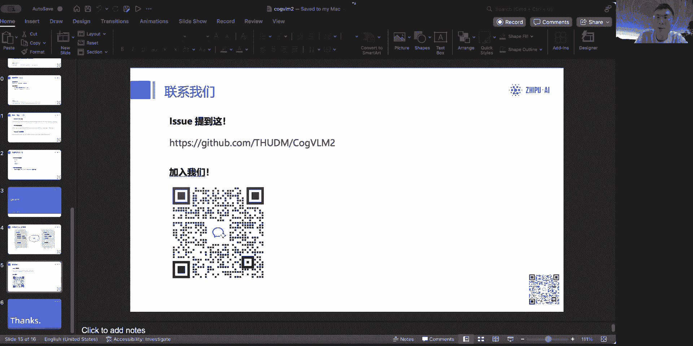

模型能够准确完成这些任务，展示了其在视觉理解和语言生成方面的强大能力。它不仅能完成常规的视觉问答，也能在没有图片输入时作为传统的对话模型使用。

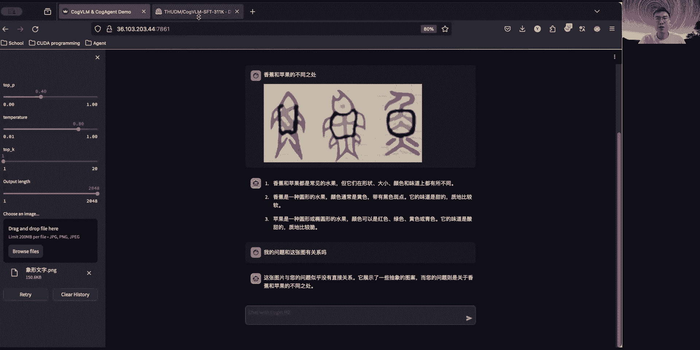

#### 本地部署与硬件要求

如果希望进行更深入的体验，包括各种方式调用或微调模型，则需要本地部署。

**模型下载地址**：
*   **Hugging Face**：搜索 `CogVLM2` 专栏，可以看到四个模型：
    *   `cogvlm2-llama3-chat-19B` (英文版)
    *   `cogvlm2-llama3-chat-19B-int4` (英文版，INT4量化)
    *   `cogvlm2-llama3-chinese-chat-19B` (中文版)
    *   `cogvlm2-llama3-chinese-chat-19B-int4` (中文版，INT4量化)
*   **ModelScope**：同样有上述四个模型，若无法访问Hugging Face可在此下载。

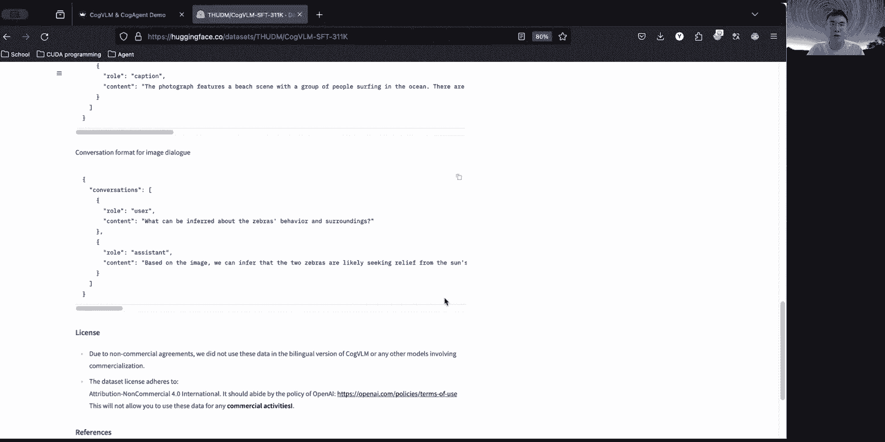

**代码仓库**：模型的调用和实现代码位于GitHub: `https://github.com/THUDM/CogVLM2`。其中包含了基础的调用方式，方便大家入门。

**硬件与软件要求**：
目前所有模型都需要在 **Linux** 环境下搭配 **英伟达显卡** 运行，因为依赖了 `triton` 库。

以下是硬件配置建议：

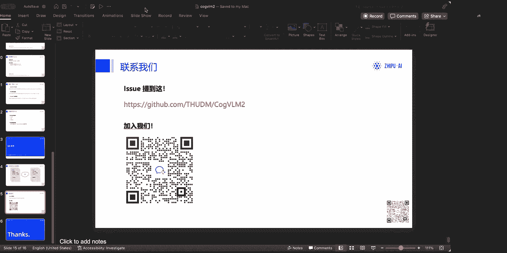

*   **最低配置 (运行INT4量化版)**：
    *   显卡：至少16GB显存的英伟达显卡。
    *   内存：建议32GB系统内存用于加载模型。
*   **推荐配置 (运行BF16原版)**：
    *   显卡：单卡显存42GB以上（如A100 40GB可能勉强，建议A100 80GB或类似卡）。
    *   原因：加载模型瞬间需要约38-39GB显存，对话过程中随着上下文增长，显存占用会增加。
*   **多卡方案**：
    *   可以使用多张显卡进行推理，例如三张16GB的英伟达显卡（需型号相同）。
    *   测试过两卡或三卡均可，但单卡必须16GB以上以避免前向