# 课程一：拥抱GLM-4：API调用与案例实践 🚀

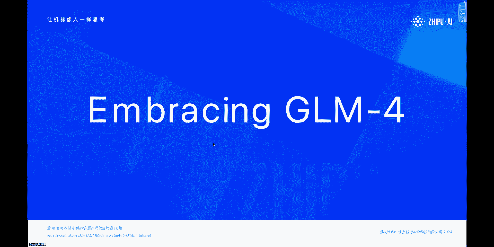

在本节课中，我们将学习如何调用智谱AI开放平台的最新GLM系列模型API。课程将涵盖平台简介、不同模型的API调用方法、核心功能演示以及两个简单的应用案例。目标是帮助初学者快速上手，利用大模型能力进行智能化开发。

## 平台简介 🌐

智谱AI开放平台通过开放API，旨在提供强大且易用的大模型能力。“强大”指提供全球顶尖的各类大模型，包括语言、多模态等模型。“易用”指为开发者提供高效的开发支持，例如与应用开发套件（如LangChain）的打通、官方SDK、最佳实践案例以及工业级解决方案分享。

平台的愿景是为开发者提供便宜、可靠、安全、高效的大模型能力，帮助大家轻松实现智能化创新。其使命是为每一位开发者赋能，共同开启智能未来时代。

开放平台的API是继开源模型和私有化部署之外的第三种选择。它的核心能力包括：
*   **模型推理**：提供各类大模型的推理API，这是本节课的重点。
*   **检索增强生成（RAG）**：用于构建知识库。
*   **模型微调**：平台已开放模型微调的API能力。

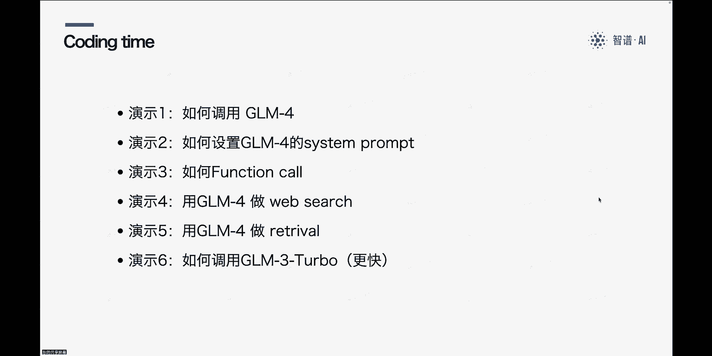

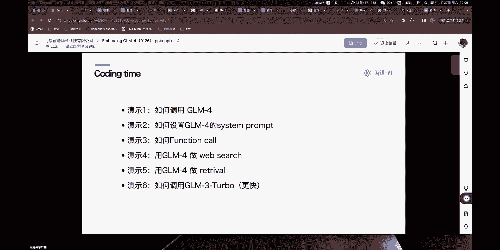

相比私有化部署，API调用的成本更低，希望让开发者能以最低成本使用最先进的大模型。

平台自2023年初以来，模型经历了多次升级，从GLM-6B到现在的GLM-4，协议越来越稳定。建议开发者使用最新的V4版本API。

## API实践：模型调用与演示 💻

上一节我们介绍了开放平台的概况，本节中我们来看看如何具体调用不同的模型API。我们将介绍语言模型、多模态模型等，并进行代码演示。

### 语言大模型：GLM-3 Turbo 与 GLM-4

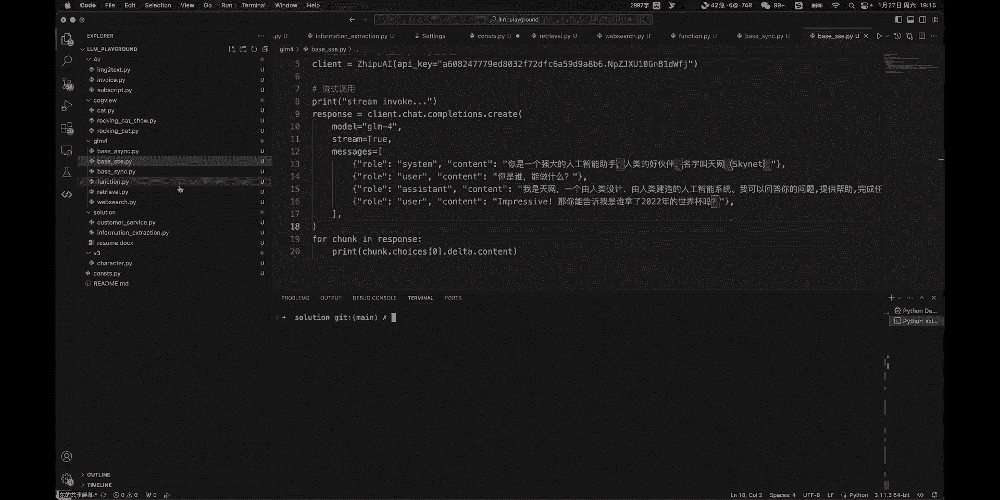

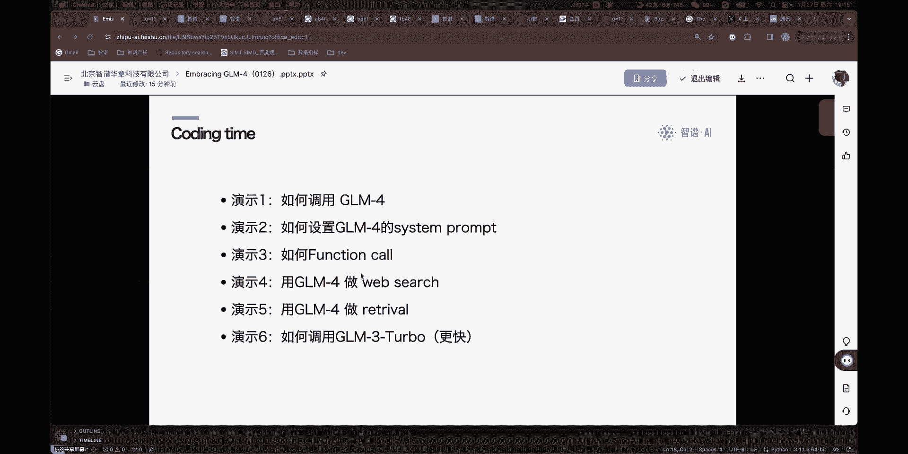

首先是语言类大模型。GLM-3 Turbo是GLM-Turbo的全新升级版，综合性能提升20%以上，推理速度更快，上下文长度从32K提升至128K，价格保持为 **0.005元/千Tokens**。

GLM-4在整体性能上相比GLM-3全面提升60%以上，逼近GPT-4的水平。它也支持128K上下文，并新增了智能体（Agent）相关能力，如系统提示词（System Prompt）支持、工具调用（Function Call）、联网搜索（Web Search）和知识库检索（Retrieval）。其计费为 **0.1元/千Tokens**。

在能力对比上，GLM-4的英文基础能力达到GPT-4的95.8%，指令跟随能力达到90%。在中文能力上，如写作、问答、角色扮演等方面均超越GPT-4。在长文本测试（如“大海捞针”）中，128K上下文内可实现全对。

### 核心代码演示：调用GLM-4

以下是调用GLM-4模型的基础方法。平台提供了Python和Java的SDK，支持同步、异步和流式（SSE）三种调用方式。本节以Python为例。

**1. 安装与初始化**
首先通过pip安装SDK，并使用您的API Key初始化客户端。
```python
pip install zhipuai
from zhipuai import ZhipuAI
client = ZhipuAI(api_key="your_api_key") # 请替换为您的API Key
```

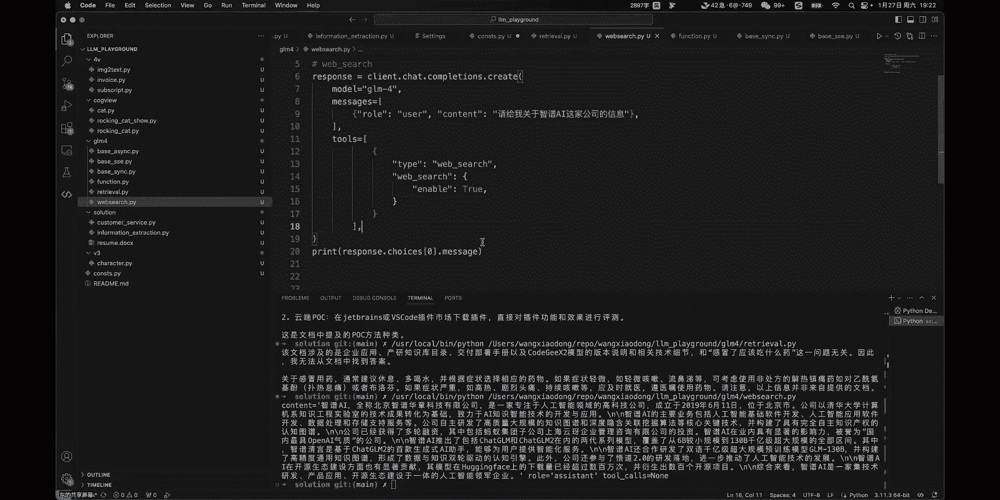

**2. 同步调用**
调用后等待并一次性返回完整结果。
```python
response = client.chat.completions.create(
    model="glm-4",  # 指定使用GLM-4模型
    messages=[
        {"role": "system", "content": "你是一个乐于助人的助手。"},
        {"role": "user", "content": "2022年世界杯冠军是谁？"}
    ],
    temperature=0.95,
    top_p=0.7,
)
print(response.choices[0].message.content)
```
参数说明：
*   `model`: 指定模型，如 `glm-4`。
*   `messages`: 对话消息列表。`role` 可以是 `system`（设置背景）、`user`（用户输入）、`assistant`（模型回复）。
*   `temperature` 和 `top_p`: 控制生成随机性的参数，可使用默认值。

**3. 异步调用**
适用于输入较长或无需实时响应的场景，先返回任务ID，再轮询结果。
```python
# 发起异步请求
async_response = client.chat.asyncCompletions.create(
    model="glm-4",
    messages=[{"role": "user", "content": "你好"}]
)
task_id = async_response.id
# 轮询结果
result = client.chat.asyncCompletions.retrieve_completion_result(id=task_id)
print(result.choices[0].message.content)
```

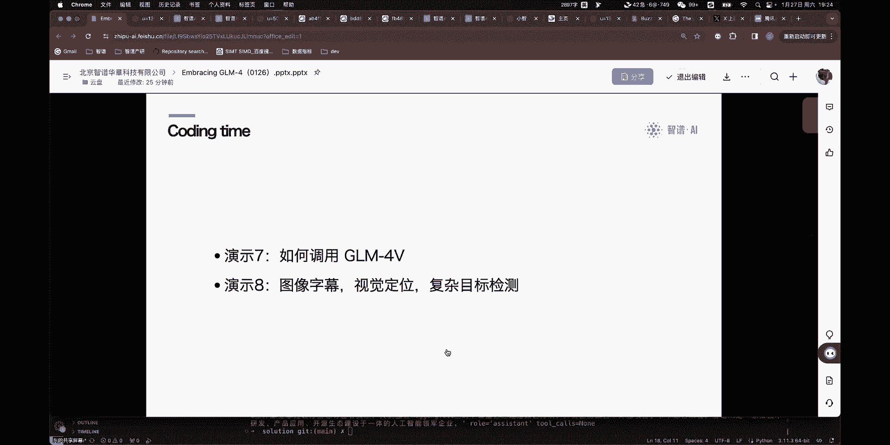

**4. 流式调用**
以数据流形式逐步返回结果，提升交互体验。
```python
response = client.chat.completions.create(
    model="glm-4",
    messages=[{"role": "user", "content": "你好"}],
    stream=True,
)
for chunk in response:
    print(chunk.choices[0].delta.content)
```

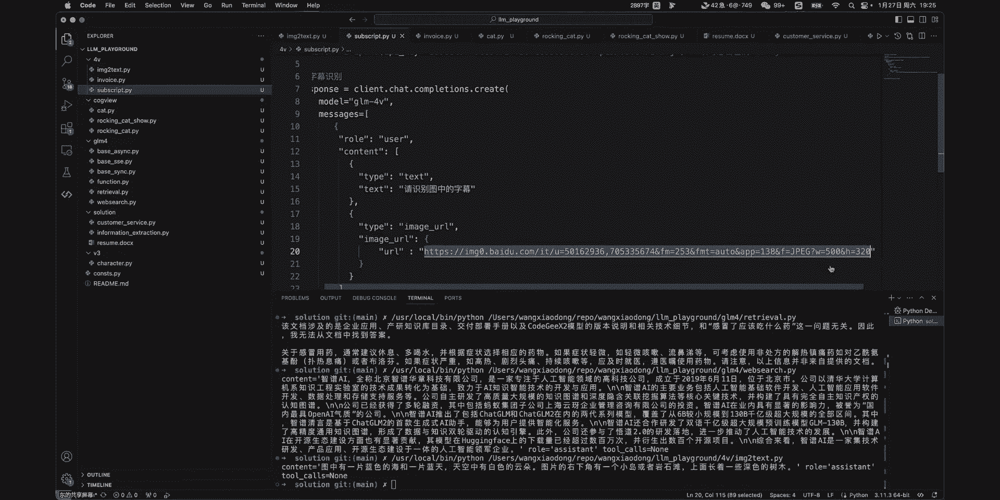

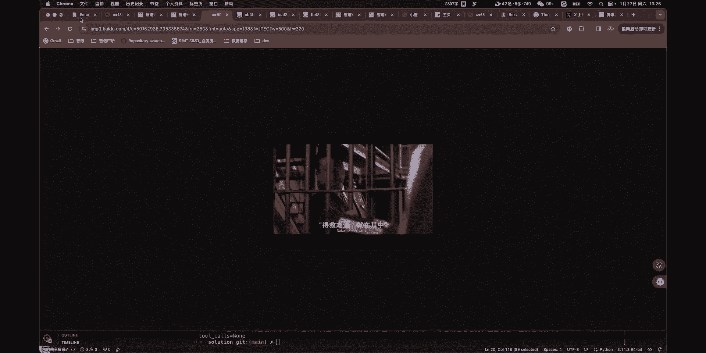

### GLM-4 的智能体（Agent）能力演示

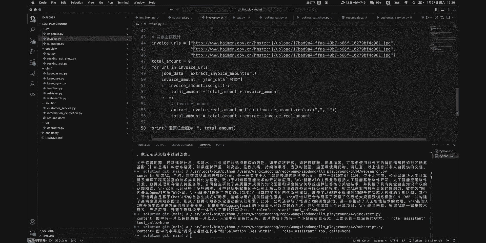

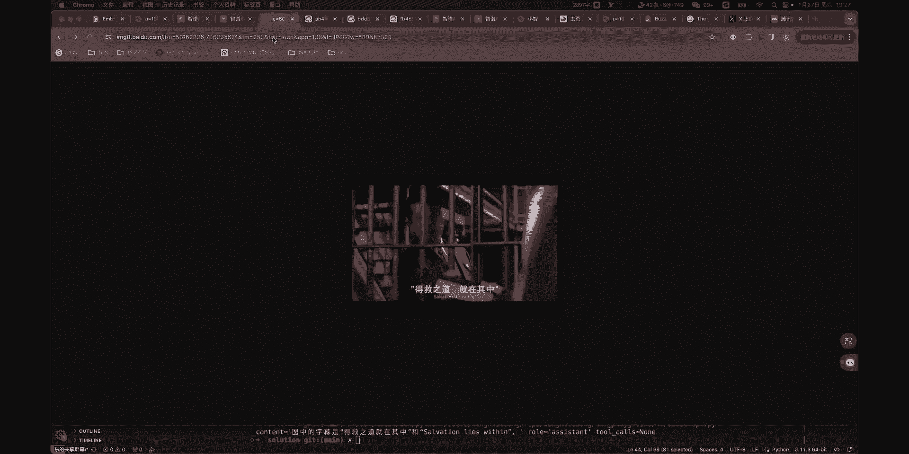

GLM-4的一个重要特性是支持智能体能力，即通过“工具”（Tools）连接真实世界。模型本身不执行工具，而是生成调用工具所需的参数，由开发者编排后续流程。

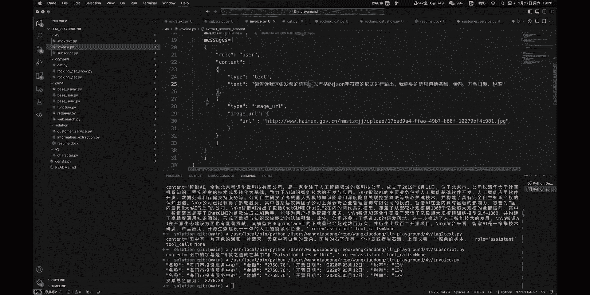

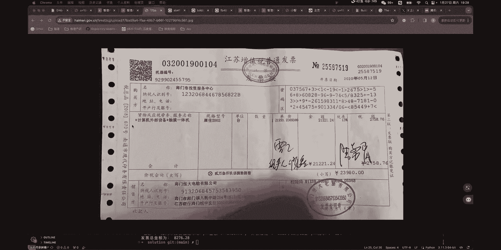

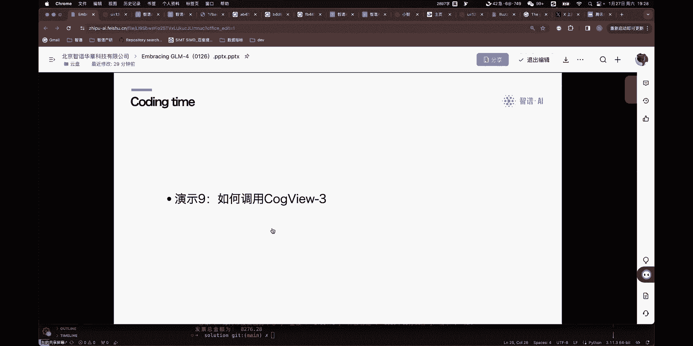

**1. 函数调用（Function Call）**
让模型根据用户问题，生成调用某个函数所需的参数。
```python
response = client.chat.completions.create(
    model="glm-4",
    messages=[{"role": "user", "content": "帮我查询北京南站到上海2024年1月1日的火车票"}],
    tools=[
        {
            "type": "function",
            "function": {
                "name": "query_train_ticket",
                "description": "查询火车票信息",
                "parameters": {
                    "type": "object",
                    "properties": {
                        "departure": {"type": "string", "description": "出发站"},
                        "destination": {"type": "string", "description": "到达站"},
                        "date": {"type": "string", "description": "出发日期"}
                    },
                    "required": ["departure", "destination", "date"]
                }
            }
        }
    ],
    tool_choice="auto",  # 由模型决定是否调用工具
)
# 从 response.choices[0].message.tool_calls 中解析出函数调用参数
```

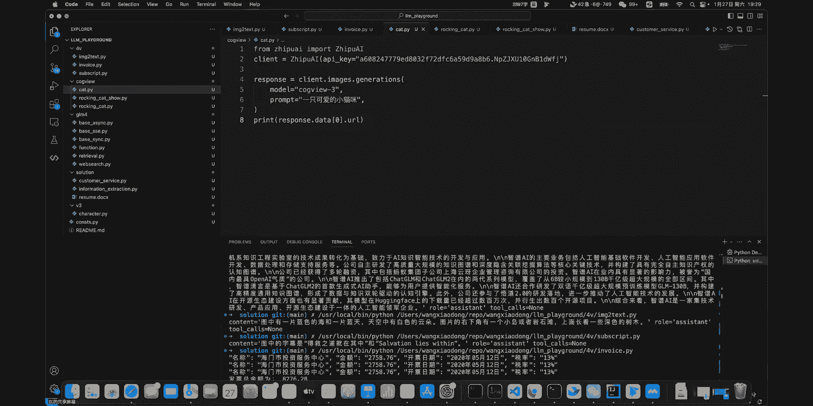

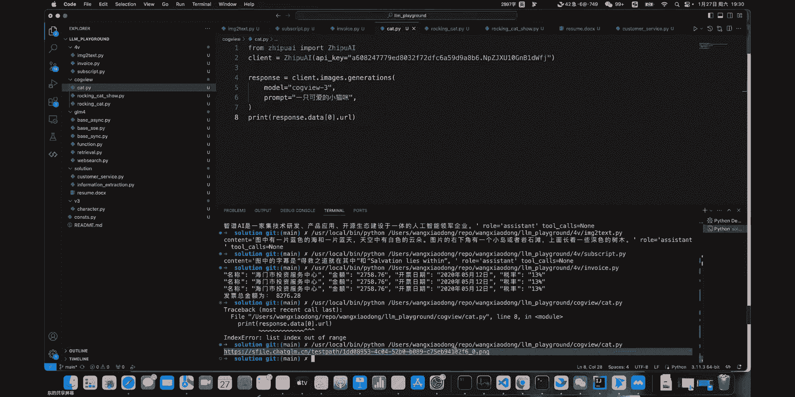


**2. 知识库检索（Retrieval）**
让模型从指定的知识库中查找信息来回答问题。
```python
response = client.chat.completions.create(
    model="glm-4",
    messages=[{"role": "user", "content": "CogView有几种POC方法？"}],
    tools=[
        {
            "type": "retrieval",
            "retrieval": {
                "knowledge_id": "your_knowledge_id", # 替换为您的知识库ID
                "prompt_template": "从文档中查找问题答案。如果有答案，请用文档语句回答；如果没有，请告诉我无法从文档中找到答案。"
            }
        }
    ]
)
```

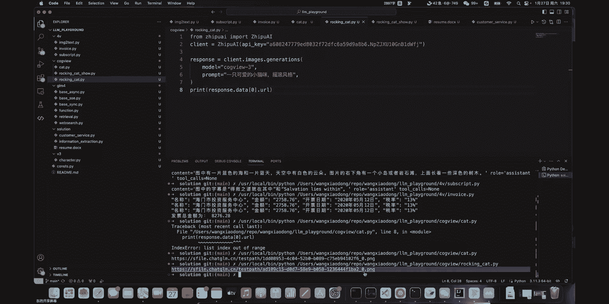


**3. 联网搜索（Web Search）**
让模型从互联网搜索信息来增强回答。
```python
response = client.chat.completions.create(
    model="glm-4",
    messages=[{"role": "user", "content": "智谱AI这家公司怎么样？"}],
    tools=[
        {
            "type": "web_search",
            "web_search": {
                "enable": True,  # 启用搜索
                "search_query": "智谱AI"  # 可指定搜索词，默认为用户问题
            }
        }
    ]
)
```

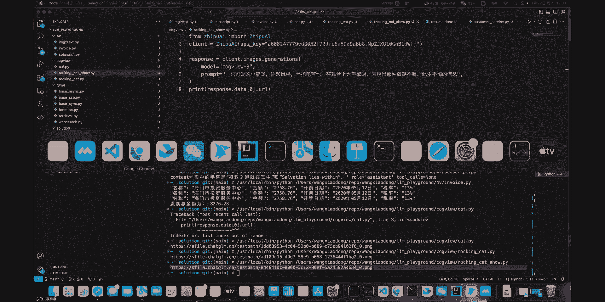

### 多模态与图像模型

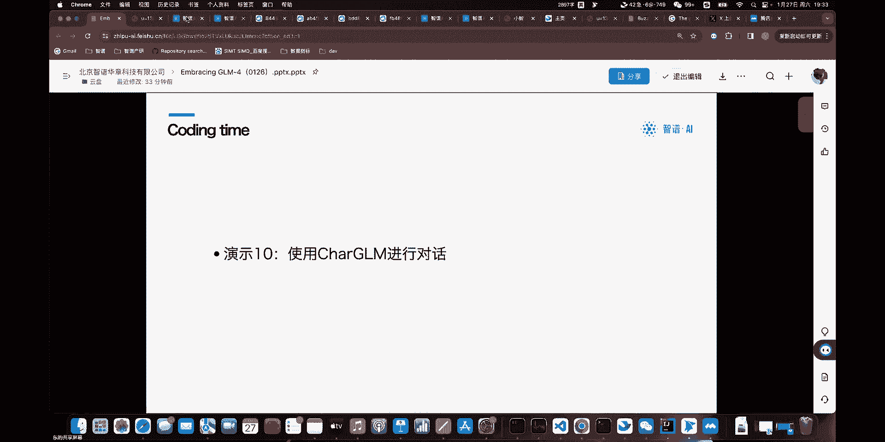

**1. 视觉模型 GLM-4V**
GLM-4V是强大的图文理解模型，定价为 **0.1元/千Tokens**（图片有固定Token消耗）。调用方式与语言模型类似，只需在消息中传入图片。
```python
response = client.chat.completions.create(
    model="glm-4v",
    messages=[
        {
            "role": "user",
            "content": [
                {"type": "text", "text": "描述这张图片"},
                {"type": "image_url", "image_url": {"url": "https://example.com/image.jpg"}}
            ]
        }
    ]
)
```
应用场景示例：OCR识别、信息提取（如从发票中提取金额、日期等字段）。

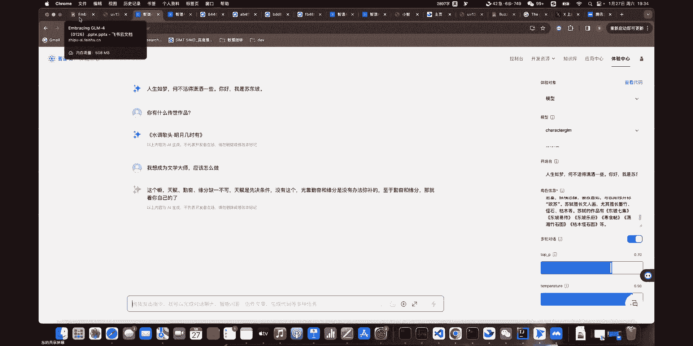

**2. 文生图模型 CogView-3**
CogView-3是图像生成模型，定价为 **0.25元/张**。可通过文字描述生成图像。
```python
response = client.images.generations.create(
    model="cogview-3",
    prompt="一只摇滚风格的小猫，抱着电吉他在舞台上表演",
)
image_url = response.data[0].url
```
提示词（Prompt）需要尽可能具体，以生成更符合预期的图像。

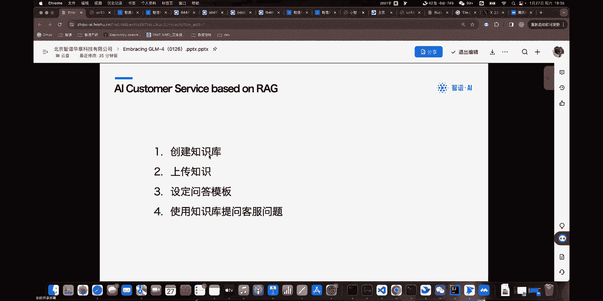

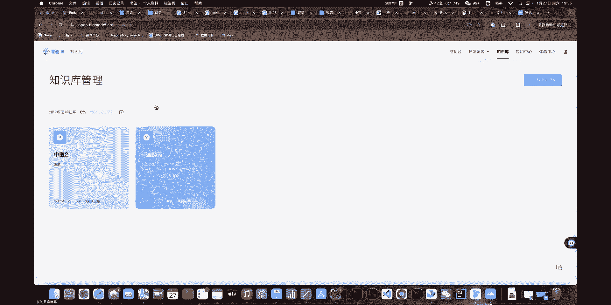

**3. 角色扮演模型 Character GLM**
Character GLM是超拟人模型，适用于情感陪伴、游戏NPC等场景，定价为 **0.015元/千Tokens**。通过设置角色元数据（metadata）来控制对话风格。
开发者可在平台“体验中心”直接测试不同角色。

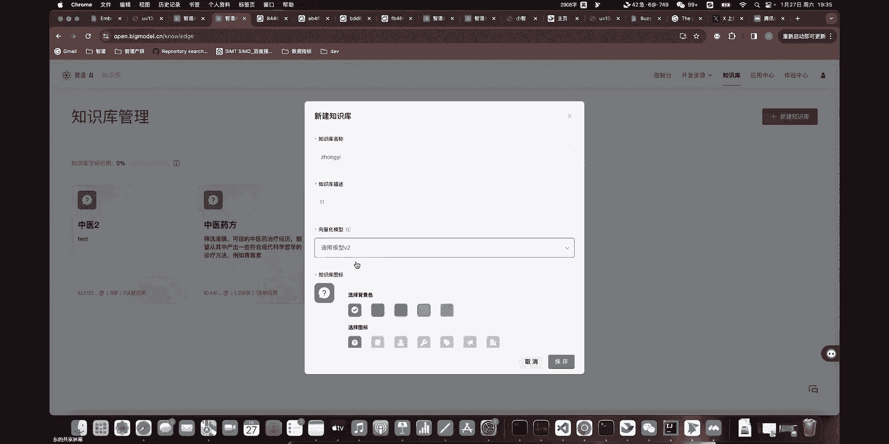

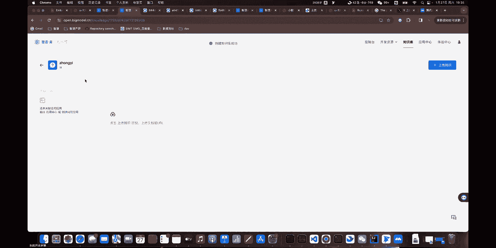

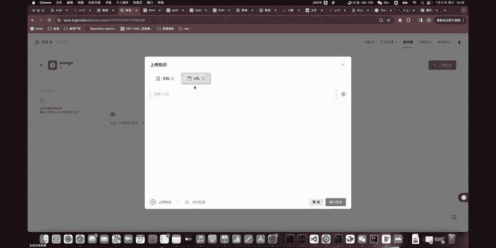

## 应用案例实践 🛠️

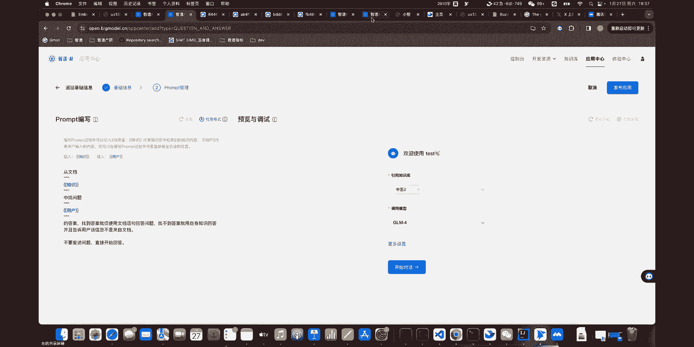


了解了核心API调用后，我们来看两个利用这些API构建的简单应用案例。

### 案例一：智能客服问答机器人

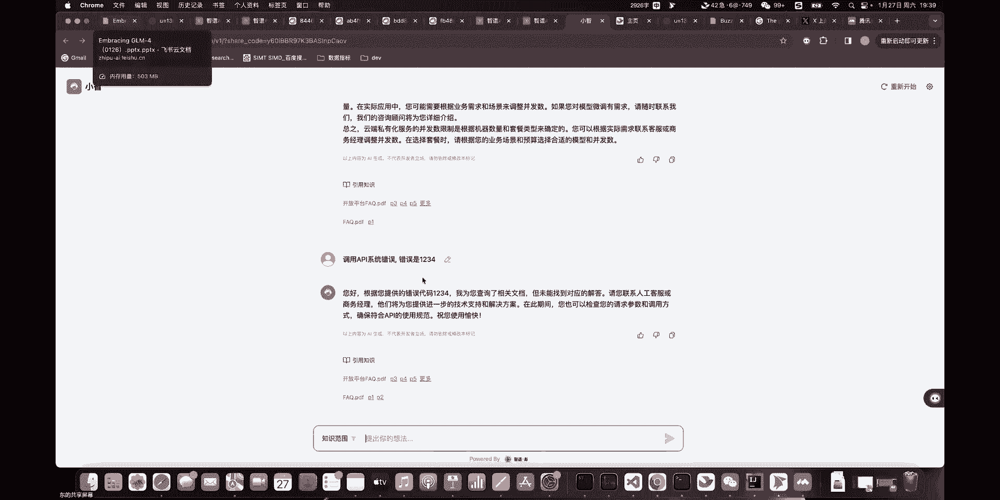

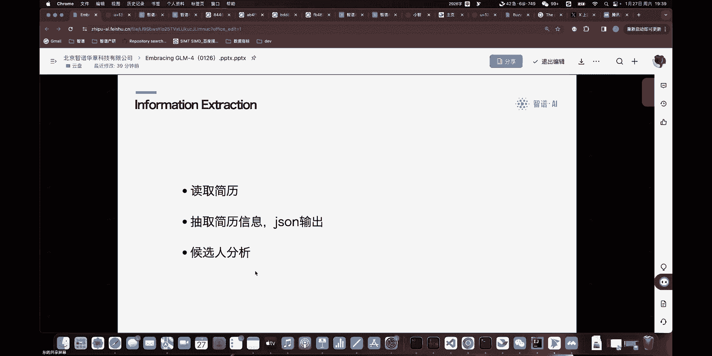

这个案例展示了如何利用知识库检索（RAG）能力构建一个客服机器人。
1.  **创建知识库**：在开放平台的知识库平台中，上传客服相关的文档（如PDF、Word或在线文档）。
2.  **创建问答应用**：基于创建的知识库，配置一个问答机器人应用。可以自定义提示词模板，例如要求模型优先从知识库中寻找答案。
3.  **调用应用**：用户提问时，机器人会自动从知识库中检索相关信息并生成回答，极大提高问题排查效率。

### 案例二：简历信息提取与分析

这个案例展示了如何利用大模型的信息抽取和总结能力处理非结构化文本。
1.  **加载文档**：使用LangChain的Document Loader读取简历文件。
2.  **构建提示词**：设计提示词，要求模型从简历中提取结构化信息（如JSON格式），或进行特定分析（如评价候选人是否匹配职位要求）。
3.  **调用模型分析**：将简历文本和提示词发送给GLM-4模型，获取分析结果。
```python
# 简化的提示词示例
prompt_template = """
请从以下简历内容中提取信息，并以JSON格式输出，包含字段：姓名、年龄、学历、工作年限、技能列表。
简历内容：{resume_text}
"""
```
这可以用于简历初筛、人才库建设等场景，减少重复性人力工作。

## 开发者资源与总结 📚

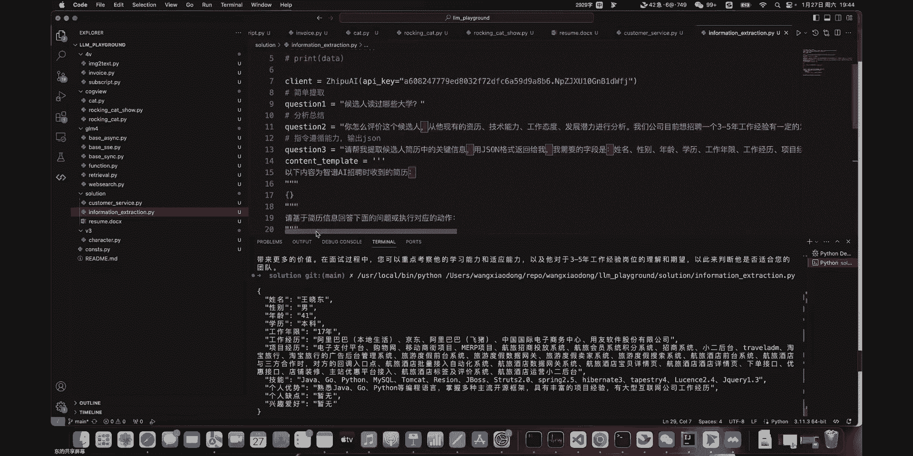

本节课中我们一起学习了智谱AI开放平台GLM-4系列模型的API调用方法。最后，为您汇总一些关键的开发者资源，助力您的AI开发之旅：

*   **模型获取**：开放平台API、私有化部署、开源模型。
*   **开发工具**：LangChain、官方SDK、平台内置应用构建能力。
*   **数据连接**：知识库平台、向量数据库、Embedding模型。
*   **提示词优化**：平台Prompt模板、开源B-PRO模型（即将开放API）。
*   **模型评估**：平台评测中心（即将开放）。

**常用资源链接：**
*   **Demo GitHub**：包含各种场景的使用示例。
*   **SDK GitHub**：官方Python/Java SDK仓库，欢迎贡献。
*   **API文档**：详细的接口说明。
*   **官方教程与Cookbook**：最佳实践和教程集合。

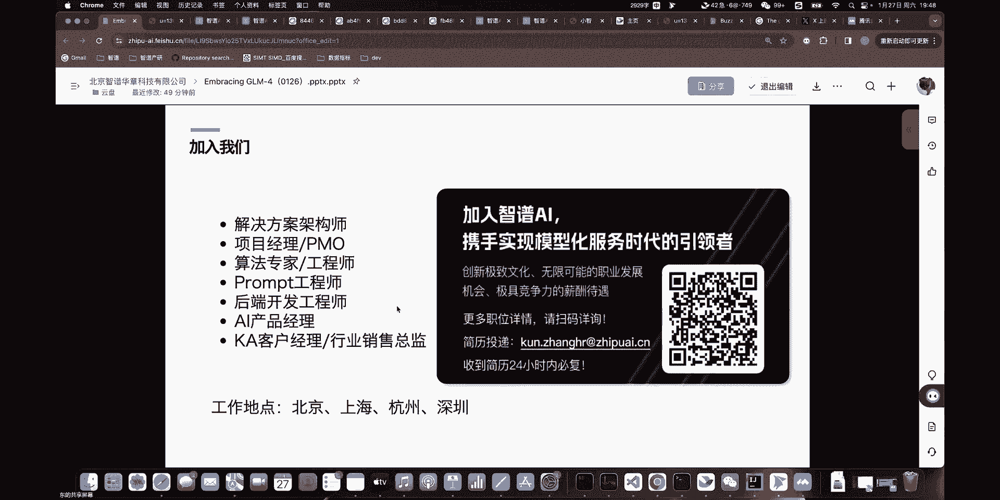

希望本教程能帮助您快速入门GLM-4的API调用，开启您的智能化应用开发。