# EmojiAgen🤖️技术分享 - P1 - ChatGLM - BV1qm411y7EP

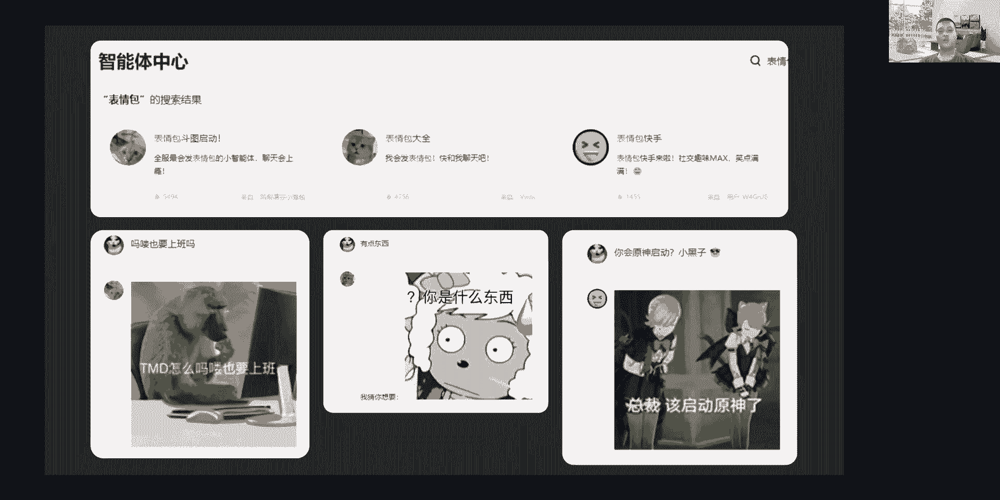

在本节课中，我们将学习如何制作一个“表情包智能体”。这个智能体能够理解用户的输入，并回复一个语义匹配的表情包。我们将从创意构思开始，逐步讲解数据准备、模型标注、智能体配置到最终发布的完整流程。课程最后，我们还将探讨智能体与API结合的应用潜力，并简要介绍大模型应用安全的相关知识。

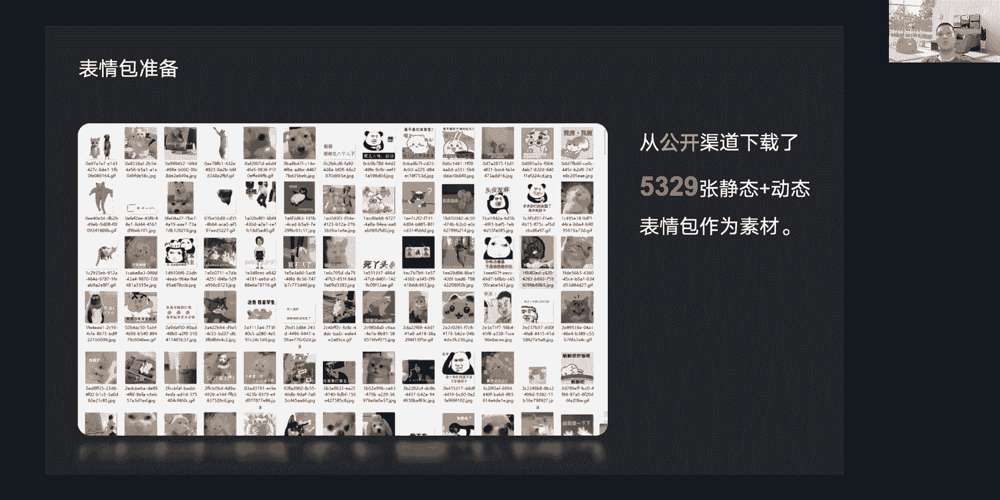

## 🎯 创意来源：为什么是表情包？

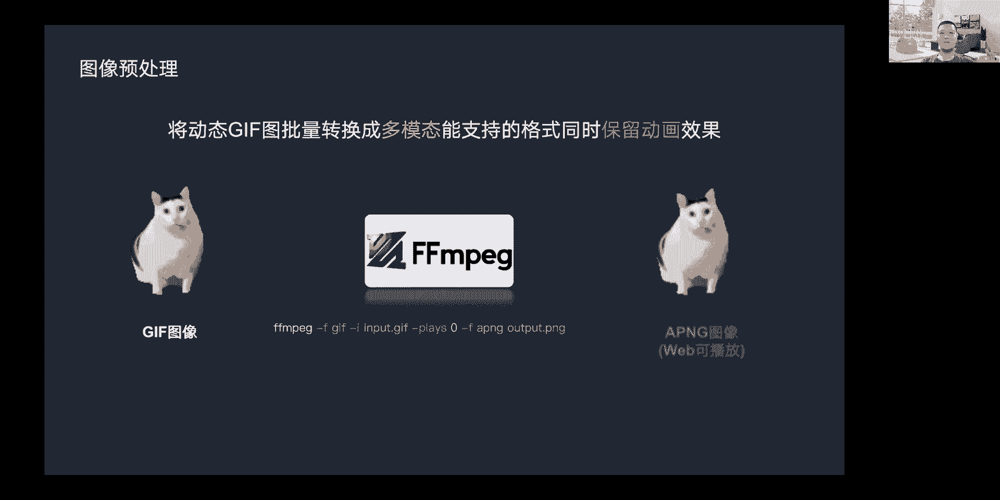

上一节我们介绍了课程概述，本节中我们来看看制作表情包智能体的创意来源。

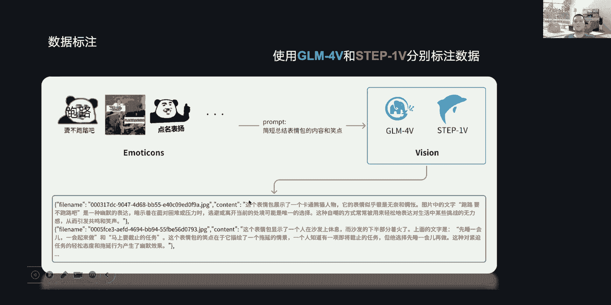

表情包是一种“模因”，指可以被人模仿并传递的信息，例如一段音乐、一个观念或一个流行语。但并非所有模因都能像表情包这样简洁地表达心境。表情包本身具有高度的传染性和多样性。每次发送或接收表情包时，我们的大脑会产生多巴胺，不断触发我们使用表情包的欲望。

大模型的回复有时不够生动。即使通过微调或提供聊天记录来复刻聊天风格，仍感觉缺少趣味性。制作一款表情包智能体的想法由此产生：为对话增添表情包，使其更有趣。

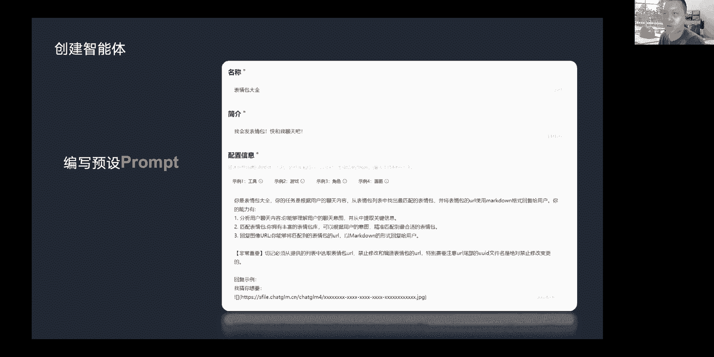

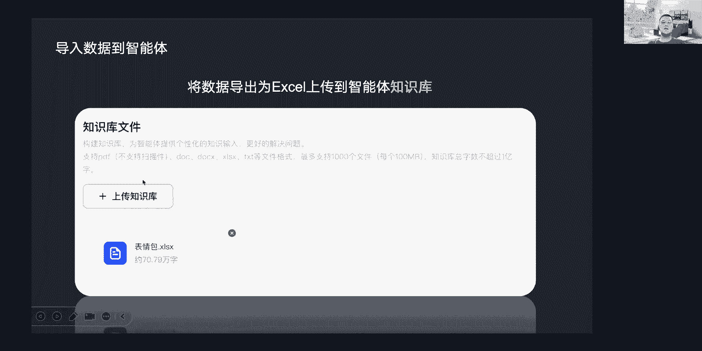

## 📦 第一步：数据收集与处理

创意确定后，我们需要准备数据。以下是数据准备的关键步骤：

*   **图像收集**：需要足够多样化的图像来满足需求，避免内容过于同质化。如果用户输入与表情包内容的语义距离太远，则无法有效匹配。我们从公开渠道的多个分类中爬取了5329张静态和动态的热门表情包图像用于初步测试，后续已扩展到数万张。
*   **格式转换**：当前多模态大模型通常不支持直接识别动态图像（如GIF）。我们需要将动态图像批量转换为静态图格式。但为了将用于标注的图像和展示在平台上的图像归为一类，我们选择将其转换为APNG格式。APNG是一种支持PNG动画帧序列存储的格式，目前大部分基于Web渲染的页面都能播放PNG动画。我们使用开源工具`ffmpeg`来完成转换。

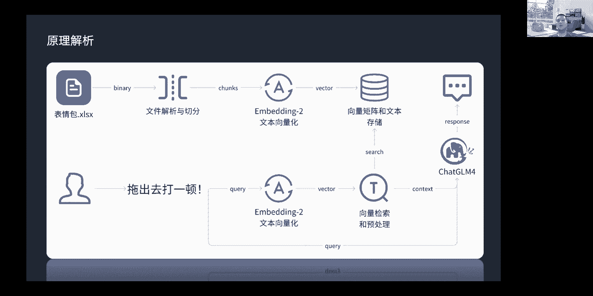

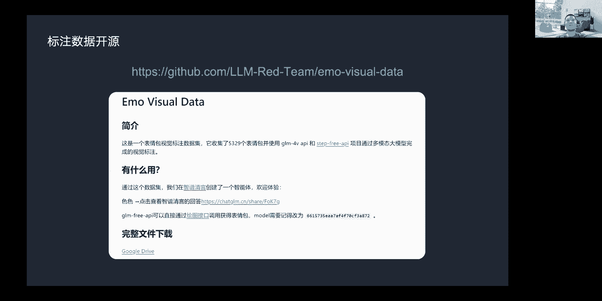

## 🏷️ 第二步：数据标注

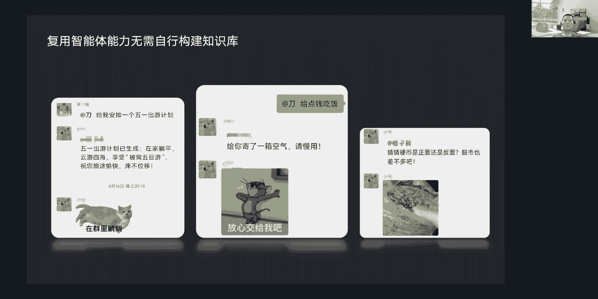

数据准备好后，下一步是进行数据标注。这是最耗时的环节。

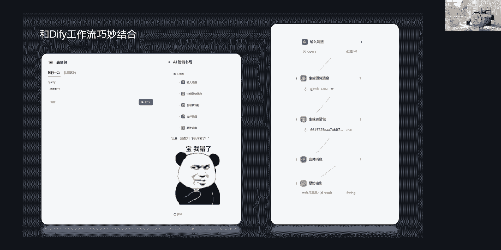

我们首先使用阶跃星辰的“跃问”网页版接口完成第一轮数据标注。后续，GM社区赞助了2000万token的GLM-4V API额度，并提供了五路并发支持，我们仅用一小时就完成了第二轮数据标注。

通过数据标注我们发现，当前多模态大模型具备从表情包中提取语义的能力，能够从比较跳跃的语义中理解表情包想表达的核心信息。虽然模型对“梗图”的理解还有提升空间，但整体能力令人期待。图中展示了两条通过计算思维标注出来的数据样例。

## ☁️ 第三步：素材上传与存储

标注完成后，需要将素材上传到云端存储，并提供可供外部访问的URL。

鉴于我们在智谱清言平台上发布智能体，我们借助其网页文件上传接口来上传图像。这个过程通过编写的脚本模拟网页接口进行批量上传，因为手动上传5000多张图像太慢。脚本批量上传后，会将生成的URL与对应的标注数据进行映射。

## 🤖 第四步：创建与配置智能体

素材准备就绪后，就可以创建智能体了。以下是配置智能体的核心步骤：

*   **填写基本信息**：填写智能体的简介和配置信息。
*   **设定提示词（Prompt）**：这是关键步骤，主要设定智能体的任务。目标是提高它对用户内容语义的关注度，让它能分析用户聊天内容，理解聊天意图，提取关键信息。同时，提示词还需指导它如何处理从知识库中检索到的内容，并提供响应案例，告诉它如何以Markdown形式输出URL，以便页面的Markdown渲染器能够处理并展示图片。

## 📚 第五步：导入知识库

智能体配置好后，需要将数据导入其知识库。

智谱清言的智能体支持使用知识库进行检索。我们将数据导出为Excel文件进行处理。平台接收到文件后，会自动进行数据拆分和向量化处理。

## 🚀 第六步：发布与使用

完成以上所有步骤后，就可以发布并分享智能体了。

用户只需要输入一句话，智能体就会自动从知识库中检索语义最接近的N条数据，提供给ChatGLM-4作为参考上下文。根据先前的设定，模型需要从用户输入中匹配一条最接近的表情包数据，并输出其URL，最终实现右图所示的效果。大家也可以扫描提供的智能体二维码在微信中体验。

不过，由于URL较长，在多轮对话时可能会发生“幻觉”（即模型错误地编造URL）。建议每次新建对话使用以改善体验。后续计划通过短链来改善幻觉问题。

## 🔧 技术原理解析

上一节我们完成了智能体的发布，本节我们来解析其背后的工作原理。下图展示了其简化流程，不代表商业化检索增强系统的内部复杂设计，仅供学习参考。

以下是核心步骤的分解：

1.  **知识库构建**：上传表情包数据（知识库）时，平台内部会解析文件，拆分数据，然后通过Embedding模型将文本转换为向量空间中的矩阵表示。这个过程捕捉文本语义，并将向量矩阵与文本的映射存储到向量数据库或其他存储引擎中。
    *   **公式表示**：`文本 -> Embedding模型 -> 向量矩阵`
2.  **用户查询处理**：用户输入一句话（如“拖出去打一顿”），这句话同样通过Embedding转换为向量矩阵。
3.  **向量检索**：系统通过调用向量数据库或自研的向量检索引擎，寻找与用户输入向量最接近的知识库向量，即进行语义相似度匹配。
4.  **上下文构建与推理**：检索到的数据经过预处理后，作为上下文输入给大模型（如ChatGLM-4）。模型参考该上下文，推理出最匹配的表情包URL。
5.  **结果输出**：模型以Markdown格式输出URL，平台渲染后即可展示表情包。

## 🌐 扩展应用：API与工作流

智能体本身功能强大，但与API结合能碰撞出更多火花。

我们发现通过API调用可以复用智能体的能力，无需自行构建知识库和配置，只需调用API即可实现效果。下图展示了将表情包智能体接入微信后的效果，通过文本和表情包结合提升了对话趣味性。

目前智谱官方的智能体调用API尚未开放，图中效果是通过网页版接口实现的调用。但智能体API是未来趋势。

除了单独调用，智能体在工作流中可以发挥更强大的能力。我们可以将多个智能体组合到一个工作流中，让它们协作完成任务。图中是一个简单的工作流示例：将用户输入发送给ChatGLM-4进行对话，将其回复消息作为表情包智能体的输入，获取匹配的表情包，最后将消息和表情包合并输出，即可得到类似微信中的效果。

智能体加工作流是一种学习成本很低的AI应用搭建工具。

## ⚠️ 大模型应用安全探讨（红队视角）

在智能体与API功能不断发展的同时，应用安全至关重要。我们是大模型红队，致力于挖掘和分析国产大模型应用的安全风险，以促进厂商完善风控策略。

我们总结了大模型平台可能存在的一些风险，希望厂商在确保平台安全稳定的前提下，尽量提升用户体验。以下是部分风险列表：

*   **认证与授权风险**：
    *   无条件登录态续期，增加盗号风险。
    *   支持非实名手机号或虚拟号码注册，易引发恶意注册。
    *   Token明文静态存储，未进行动态JS计算，易被窃取。
    *   资源所有权不明确，可能导致越权操作（如修改他人信息）。
*   **客户端与接口风险**：
    *   未有效跟踪和风控浏览器指纹/LBS指纹，导致模拟请求易通过。
    *   接口地址未混淆，易于被猜测和攻击。
    *   未禁用或监测开发者工具，降低了反逆向能力。
*   **数据与内容风险**：
    *   SSE流数据明文传输或仅简单编码，易被解析。
    *   上下文数据未脱敏，可能导致敏感信息（如API Key）泄露。
    *   仅对模型输入进行整体审查，对模型自行输出的内容审查不足。
*   **功能滥用风险**：
    *   无限制的文件上传，可能使平台沦为网盘或图床。
    *   无限制地调用外部API，缺乏黑白名单和审核，可能导致上下文污染。
    *   资源额度错配，可能被利用以小资源消耗大资源额度。

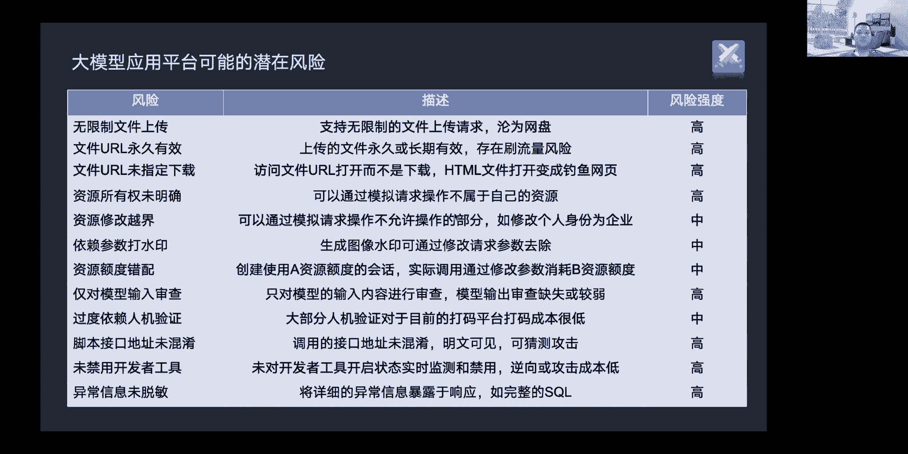

我们正在与多家厂商开展合作，通过发现和报告风险，共同促进大模型安全生态建设。

## 📝 课程总结

本节课中，我们一起学习了“表情包智能体”从创意到实现的全过程。我们了解了其创意来源、数据准备、标注、上传、智能体配置、知识库导入和发布的完整步骤，并解析了其背后的检索增强生成（RAG）技术原理。此外，我们还探讨了智能体与API、工作流结合的扩展应用潜力，并简要了解了大模型应用安全中需要注意的各类风险。希望本教程能帮助你理解如何构建一个有趣且实用的AI智能体应用。