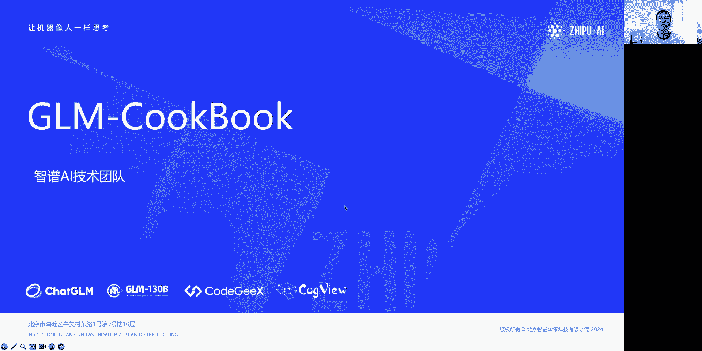
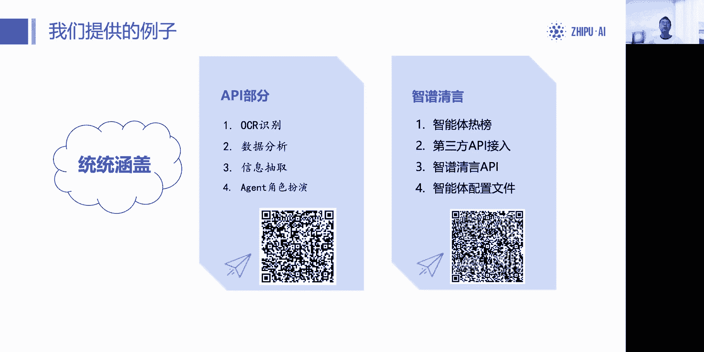
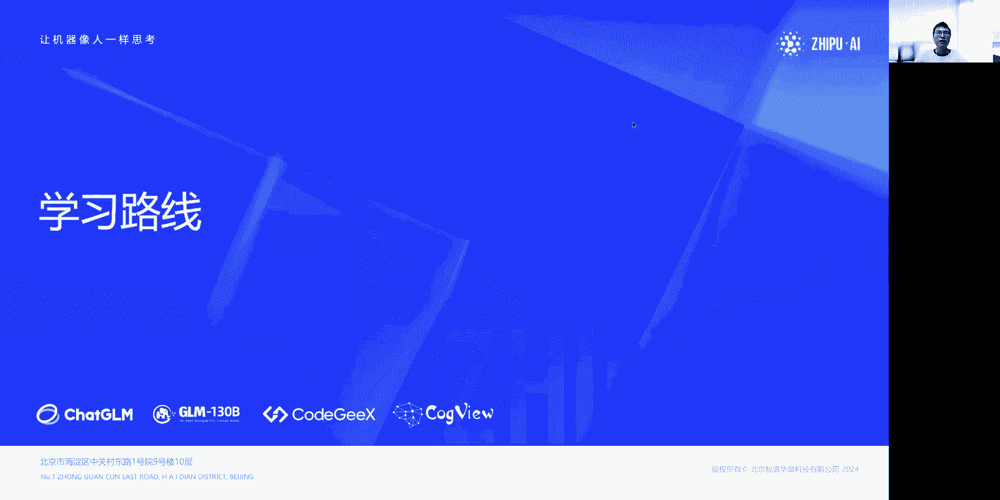
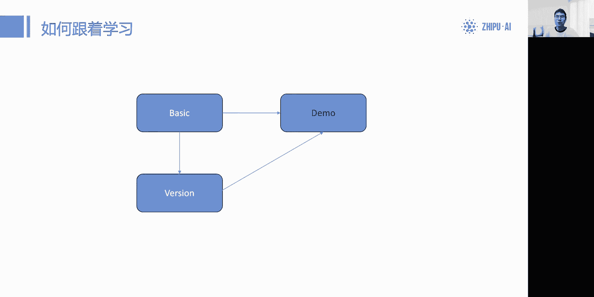
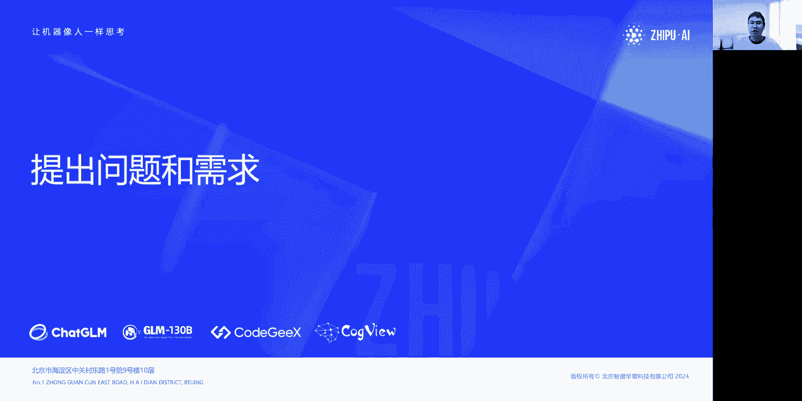
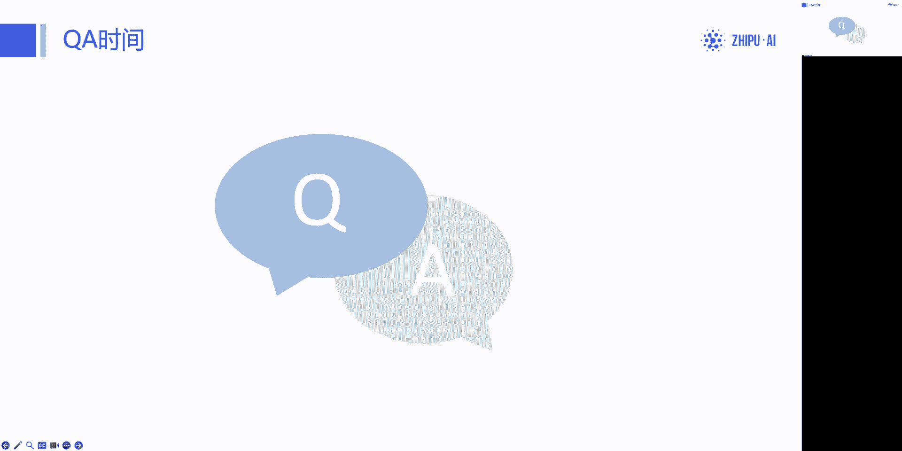
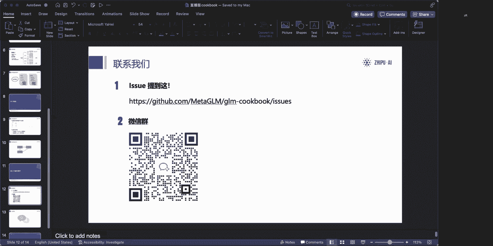
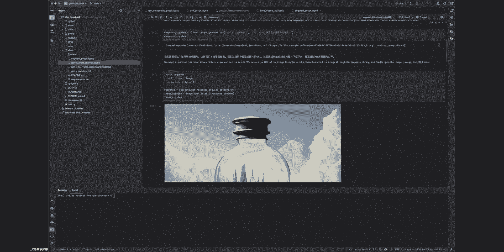

# GLM 使用指南：入门 GLM API（一）🚀

在本节课中，我们将要学习如何开始使用智谱 AI 的 GLM 系列大模型 API。我们将介绍官方教程 `GLM CookBook` 的设计理念、内容结构以及为你规划一条清晰的学习路径，帮助你从零开始快速上手大模型 API 的调用。

## 课程概述与背景

我是来自智谱 AI 技术团队的成员，也是 `GLM CookBook` 的作者。本次直播作为系列的第一期，旨在为刚刚接触大模型的开发者或学生提供一个清晰的学习起点。我们将聚焦于如何快速上手大模型 API 调用这一核心问题。

后续的第二场和第三场直播将深入讲解具体的 `demo` 和实战案例。

## 为什么需要 `GLM CookBook`？

许多开发者最初接触大模型开发是通过 OpenAI 的 API。然而，国内大模型的 API 接口各异，导致学习成本高、适配工作繁琐。开发者们面临几个核心痛点：

1.  **API 不统一**：学习过 OpenAI API 的开发者，在切换至国内不同厂商的模型时，常遇到接口不兼容的问题。
2.  **缺乏从零开始的教程**：部分开发者完全没有大模型 API 使用经验，需要一个系统的入门指南。
3.  **不清楚 API 能做什么**：即使掌握了基础调用，许多开发者也不清楚如何利用 API 构建一个最小可行产品（MVP）。

`GLM CookBook` 正是为了解决这些问题而设计的。

## `GLM CookBook` 的设计理念与特点

与一些专注于前沿论文复现的教程不同，`GLM CookBook` 的核心目标是降低使用门槛，提升开发效率。

*   **降低门槛，注重实用**：我们优先提供入门级内容和常见的、可执行的最小方案。教程中的代码可以直接复用或进行二次开发。
*   **整合两大平台**：智谱 AI 目前有两套 API 系统：
    *   **开放平台 API**：提供 `GLM-4`、`GLM-4V`、`ChatGLM` 等模型的接口，功能对标 OpenAI。
    *   **智谱清言 API**：主要面向智能体（Agent）的构建和调用。
    `GLM CookBook` 将这两部分内容整合在一本教程中，方便开发者按需选择。
*   **开源与社区驱动**：教程完全开源并托管在 GitHub 上，方便开发者获取代码、提出建议（Issue）甚至贡献代码（Pull Request）。

## 教程框架结构

`GLM CookBook` 的整体结构分为五个主要部分，如下图所示：

以下是各部分的简要说明：

1.  **GLMs（智谱清言）**：
    *   **提示词构建**：介绍如何配置智能体，并提供了一些现成的智能体配置示例。
    *   **智能体 API**：讲解如何接入智谱清言的智能体 API，以及如何让智能体去调用第三方 API。
2.  **Basic（基础）**：API 使用的起点。涵盖计费方式、基础调用方法以及如何与主流开源框架（如 LangChain）进行对接。
3.  **Vision（多模态）**：专门讲解图像理解模型 `GLM-4V` 和文生图模型 `CogView3` 的使用。
4.  **Demos（应用示例）**：在掌握基础后，可以学习如何利用 API 实现具体功能。例如：
    *   推理任务
    *   发挥 `GLM-4` 的 `Agent`、`Function Call`、代码分析、数学计算等特长能力。
    *   如何编写和调试提示词。
5.  **Fine-tune（微调）**：介绍如何使用智谱 AI 的微调平台对模型进行定制化训练，训练后的模型可直接通过 API 调用。

> **注意**：`GLM CookBook` 主要关注 **API 和智谱清言的应用层教程**。关于开源模型（如 ChatGLM3-6B）及其本地部署的教程，请访问智谱 AI 在 GitHub 上的 `THUDM` 组织下的相关仓库。

## 提供的代码示例

教程中包含了大量即拿即用的代码示例。

*   **API 部分**：每个功能都以独立的 `Jupyter Notebook` 形式提供。
    *   **OCR 识别**：结合 Python OCR 库与 GLM，实现文档扫描与问答。
    *   **数据分析**：读取 CSV 文件，让模型完成数据抽取与分析。
    *   **Agent 应用**：包括最简单的工具调用（Function Call）、任务规划（Planning）以及多角色互动的简易仿真。
*   **智谱清言部分**：提供智能体热榜、API 接入方案，并计划分享部分公开的智能体提示词配置。

教程更新迅速，后续会有更多新功能和应用案例加入。

## 学习路线图

对于初学者，我们推荐以下学习路径：

1.  **准备资源**：
    *   **API 部分**：需要在[智谱 AI 开放平台](https://open.bigmodel.cn/)注册并完成实名认证，以获取 `API Key` 和初始赠送的 tokens（约 10万-20万 tokens 即可完成基础部分学习）。
    *   **智谱清言部分**：只需注册智谱清言账号并完成实名认证即可获得 API 调用额度。
2.  **选择学习路径**：建议开发者优先学习 **API 调用** 部分，因其功能更全面，上限更高，更适合应用开发。
3.  **循序渐进**：
    *   从 `Basic` 开始，学习 `GLM-4` 的基础调用。
    *   然后学习 `Vision`，掌握多模态模型的使用。
    *   接着研究 `Demos` 中的各种应用案例。
    *   此时，你已具备将 GLM API 接入各类开源框架（如 LangChain）的能力，可以开始系统性学习这些框架，并构建自己的应用。

这条路径帮助你从最底层的模型调用，平滑过渡到基于框架的完整应用开发。

## 如何获取帮助与反馈

学习过程中遇到问题或有新的想法，可以通过以下渠道反馈：

1.  **GitHub Issues**：这是最主要的反馈渠道。如果你发现教程代码有误、有优化建议，或是有新的功能需求，都可以在项目的 GitHub 仓库中按模板提交 Issue 或 Pull Request。
2.  **官方微信群**：用于开发者之间的交流讨论，链接可在教程相关页面找到。

我们鼓励大家积极提出问题，共同完善教程。

## 常见问题解答（Q&A）

上一节我们介绍了反馈渠道，本节中我们整理了一些直播中的常见问题供你参考。

*   **教程在哪里？**
    教程位于 GitHub：`https://github.com/THUDM/GLM-CookBook`。你可以克隆整个仓库到本地，所有教程都是可交互的 `Jupyter Notebook` 文件。

*   **如何开始调用？需要多少费用？**
    1.  在[开放平台](https://open.bigmodel.cn/)注册并获取 `API Key`。
    2.  对于学习基础调用，使用价格更低的 `GLM-3` 模型完全足够。`GLM-4` 更适合体验 `Function Call` 等高级功能。具体价格请参考平台公告。

*   **API 调用慢怎么办？**
    对于未充值的用户，并发数可能较低。充值达到一定额度后，并发数会动态提升。首 token 时间问题团队正在优化中。

*   **智谱清言 API 和开放平台 API 有什么区别？**
    *   **智谱清言 API**：更侧重于智能体的无代码构建和调用，功能相对简单，适合快速搭建对话应用，但灵活性和性能低于开放平台。
    *   **开放平台 API**：功能全面，对标 OpenAI，提供丰富的参数控制和高级功能（如 `Function Call`, `Planning`），适合复杂、高性能的应用开发。

*   **多模态、RAG（检索增强生成）、Agents 有教程吗？**
    *   **多模态**：在 `Vision` 部分有 `GLM-4V`（图理解）和 `CogView3`（文生图）的详细教程。
    *   **RAG**：这属于应用框架层的能力，建议在学习 LangChain 等框架时，将 GLM 作为模型基座接入。教程 `Demos` 中也会涉及相关思路。
    *   **Agents**：将在后续直播（第二/三期）中详细讲解 `Planning` 和 `Function Call` 等 Agent 相关能力。

*   **提示词能和 ChatGPT 通用吗？**
    大部分基础提示词技巧（如 CoT）是通用的。但由于模型结构差异，对于需要精确控制输出的场景，提示词可能需要针对 GLM 进行微调。许多开源框架（如 LangChain）的 Agent 提示词可以直接复用。

*   **数据安全如何保障？**
    开放平台承诺不会使用用户的 API 调用数据做二次训练。如果对数据出境有极端严格的要求，建议使用本地部署的开源模型。

*   **如何实现“找不到答案时用模型自身知识回答”？**
    这是可以实现的。通过提示词工程进行控制即可：在 RAG 流程中，如果检索结果为空，则指示模型忽略检索内容，直接运用自身知识库回答；如果检索到内容，则基于检索内容回答。这也可以通过 LangChain 等框架的流程编排来实现。

## 下期预告与总结

本节课中我们一起学习了 `GLM CookBook` 的定位、结构和学习路线，为你使用智谱 AI 大模型 API 奠定了坚实的基础。

从下一期开始，我们将进入实战环节。**第二期直播将聚焦于具体的 `Demo`**，我会选择一两个应用案例，从第一行代码开始，详细讲解设计思路、实现步骤以及模型在其中扮演的角色，帮助你更深入地理解如何将 API 用于实际工程。

期待在接下来的课程中与你继续探索！

