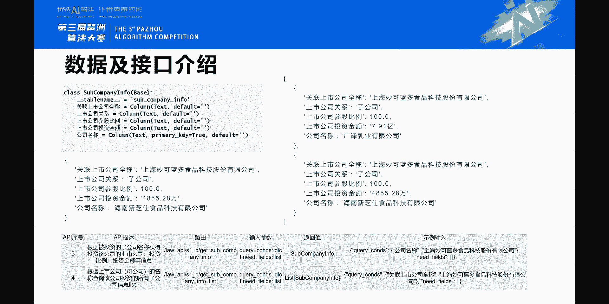
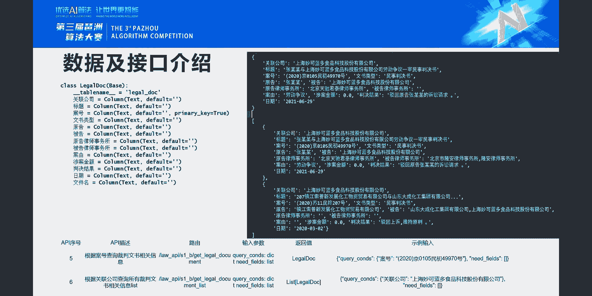
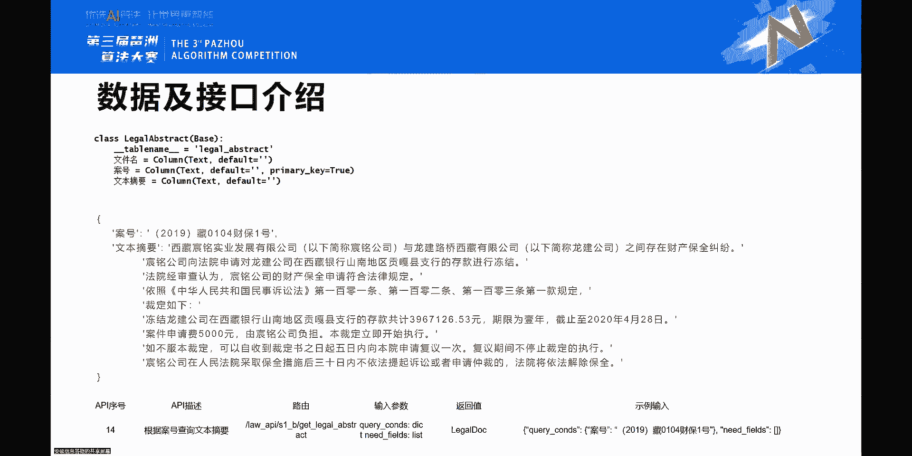
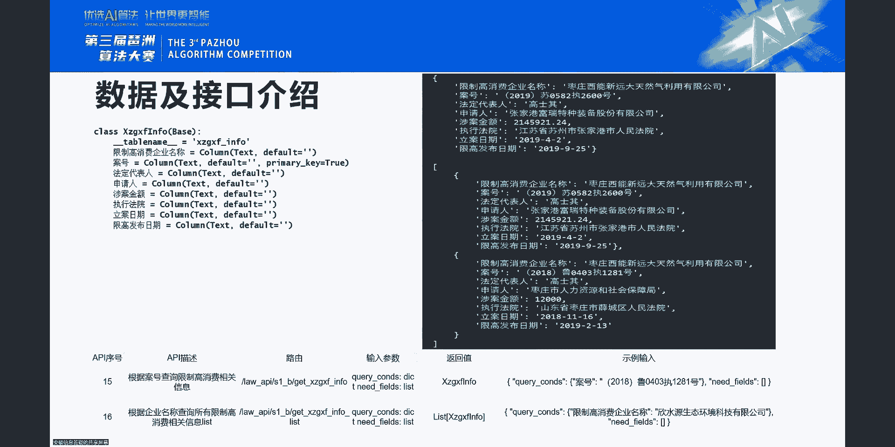
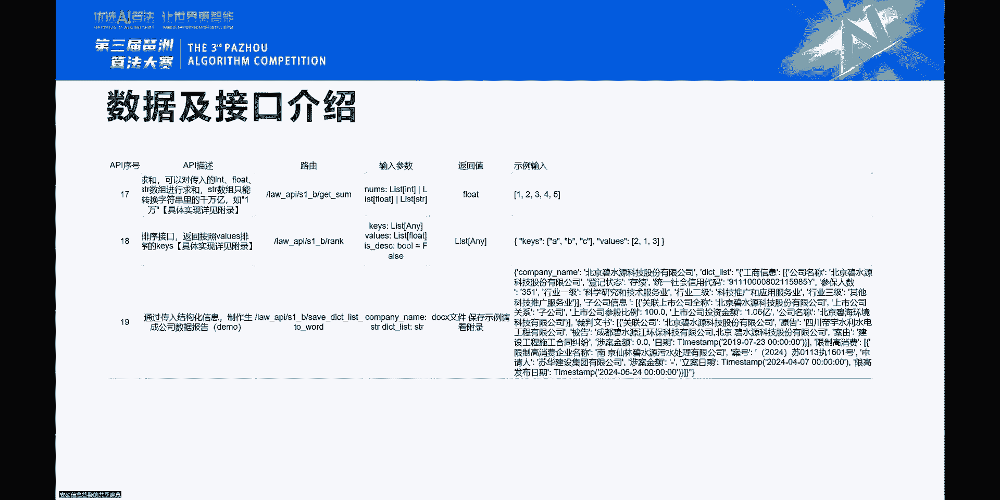
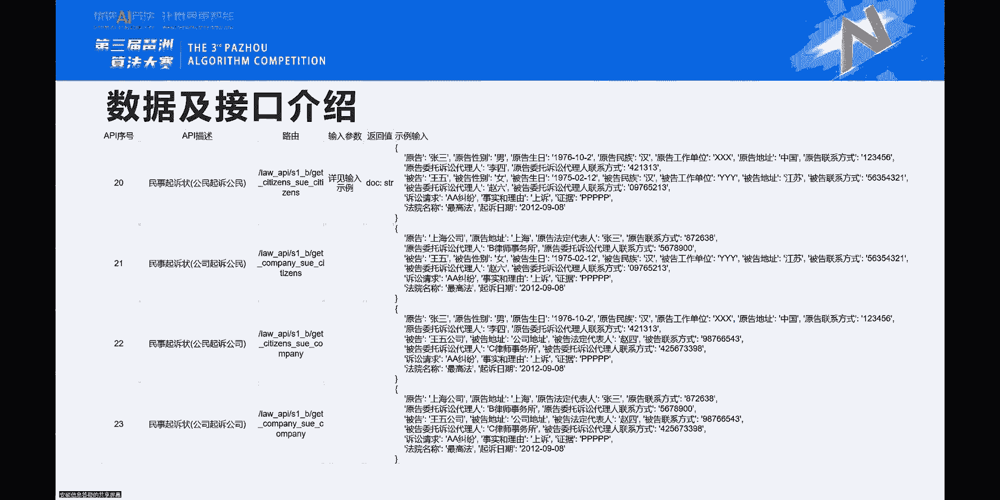
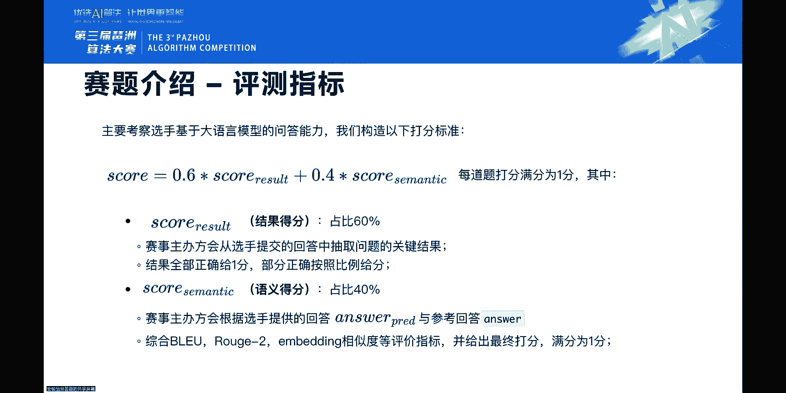
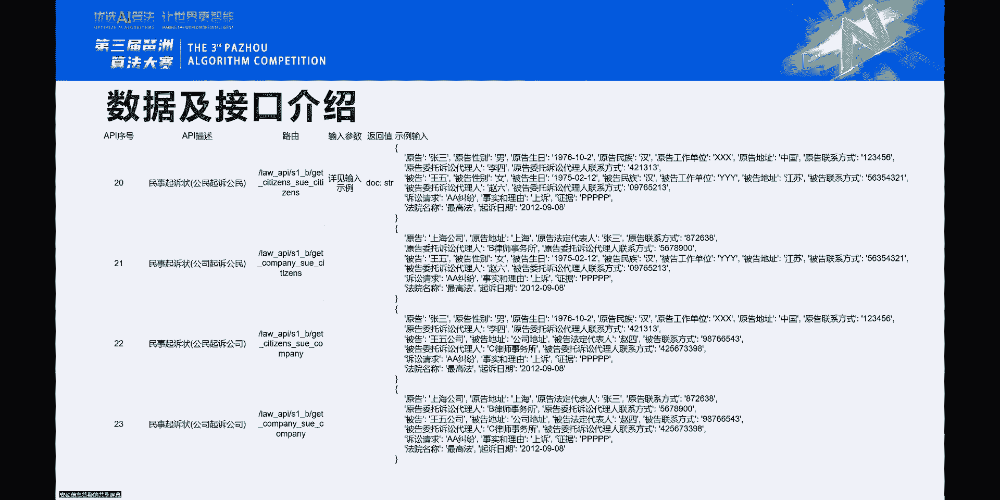
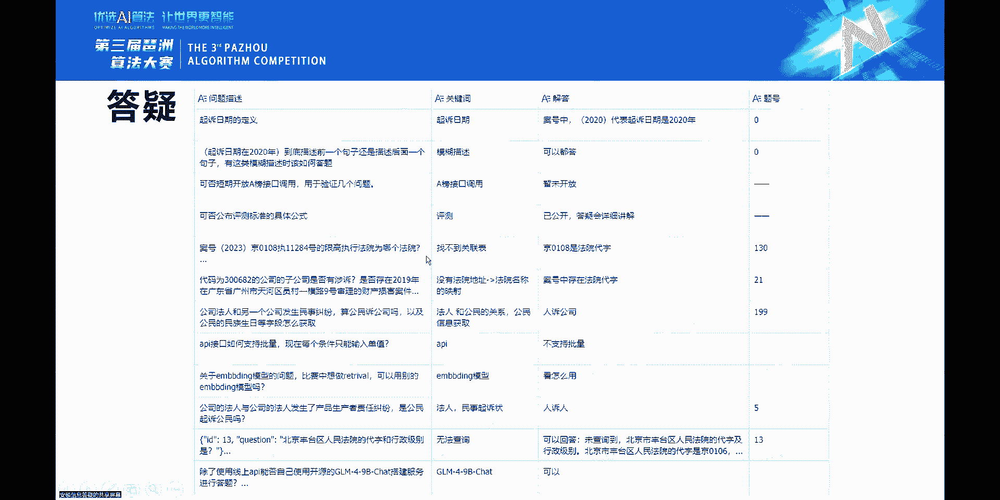

# 课程名称：GLM法律大模型挑战赛 · 初赛B榜数据与接口详解 🧠

## 概述
在本节课中，我们将详细解析GLM法律大模型挑战赛初赛B榜所使用的全部数据表、API接口设计以及评分标准。我们将逐一介绍13个核心数据表的结构、功能、关联关系，并通过具体示例说明如何调用接口来解答赛题。课程旨在帮助参赛者清晰理解数据全景，掌握解题的关键路径。

---

## 数据表总览与赛制说明

初赛B榜共涉及13个数据表。每个赛区的前十名将晋级复赛。最终的复赛名单将于7月22日公布。

评审方案会结合所有选手的表现进行灵活调整。选手无需对某一道特别困难的题目过于纠结。赛题设计留有一定空间，不会卡得特别死，目的是让努力参赛并对赛题感兴趣的人，能尽量获得更多机会。因此，遇到确实难以回答的题目，可以先解决大部分问题。

---

## 核心数据表详解

上一节我们介绍了赛制，本节中我们来看看构成赛题基础的13个数据表。

### 1. 上市公司基本信息表
此表数据来源于随机抽取的上市公司名单，并获取了其相关公开信息。

以下是该表包含的主要字段示例：
*   公司名称、公司简称
*   公司代码（即股票代码）
*   法人代表（亦称法定代表人、法人）
*   总经理、董事会秘书（董秘）
*   注册地址、办公地址
*   联系电话、传真、官网、电子邮箱
*   主营业务范围、机构简介等

**接口特点**：支持通过公司名称、公司简称或公司代码进行查询，三者均可查到同一条信息。例如，输入“妙可蓝多”、“上海妙可蓝多食品科技股份有限公司”或股票代码“600882”，返回结果相同。
**关键关联**：表中的地址字段（注册地址、办公地址）可能与后续的地址解析表产生关联。

---

### 2. 公司工商账面信息表
此表包含了上市公司及非上市公司的工商注册信息，字段与上市公司表有相似也有不同。

**核心区别与答题策略**：
1.  **数据范围**：包含上市公司与非上市公司。
2.  **字段差异**：相同含义的字段可能名称不同（如“法人”与“法定代表人”）；同一家公司的“企业地址”和“注册地址”也可能不同。
3.  **时效性**：两表数据取自不同时间点，信息可能存在变动和不一致。

**答题建议**：若题目未明确指定查询哪个表，最稳妥的方式是同时调用两个相关接口，并分别说明结果。例如：“经查询，该公司在工商信息表中的法定代表人是A，在上市公司信息表中的法定代表人是B。”
**接口设计**：提供两个接口：
    *   `get_company_info_by_name`：根据公司名称查询全部信息。
    *   `get_company_registered_name`：**仅能**输入统一社会信用代码，输出对应的公司名称。此设计用于增加查询链的复杂性。

---

### 3. 上市公司投资子公司关联信息表
此表记录了上市公司（母公司）与其投资子公司之间的关系。

以下是字段说明：
*   `上市公司`：母公司名称。
*   `关联公司`：此字段实际指代“子公司”名称。
*   `参股比例`：母公司对子公司的投资比例。
*   `投资金额`：母公司的投资额。

**接口功能**：
1.  根据子公司名称，查询其被哪些上市公司投资，以及投资比例和金额。
2.  根据上市公司名称，查询其投资了哪些子公司（返回列表）。

---

### 4. 法律文书信息表
此表基于母公司及子公司清单，抽取了部分裁判文书信息。

以下是该表的核心字段：
*   `关联公司`：涉案公司。
*   `案号`：案件的唯一编号。
*   `标题`：案件标题。
*   `文书类型`：如民事判决书、刑事判决书等。
*   `原告`、`被告`：注意在实际场景中，称谓多样（如申请人、被执行人、被申请人等）。
*   `原告律师事务所`、`被告律师事务所`
*   `案由`：案件事由。
*   `涉案金额`
*   `判决结果`
*   `日期`：此为**审理日期**。案号中的括号年份（如(2020)）代表**立案年份**，两者可能不同。

**关键概念：案号解析**
案号格式例如：`(2020)京0105民初49970号`
*   `京0105`：法院代字，可唯一对应具体法院。
*   `民`：案件类型（民事）。
*   `初`：审级（初审）。
*   `49970`：案件序号。

**接口功能**：
1.  通过唯一案号查询单条案件详情。
2.  通过公司名称查询其关联的所有案件列表。

---

### 5. 法院基础信息表 & 6. 法院代字信息表
这两个表用于管理法院信息。

*   **法院基础信息表**：相当于法院名录，包含法院标准化名称、地址、联系电话等。但实际文书中法院名称可能有多种叫法。
*   **法院代字信息表**：核心表，建立了法院代字（如“京0108”）与法院全称（如“北京市海淀区人民法院”）的一一对应关系。这是连接案号与法院实体的关键。

**接口功能**：支持通过法院代字查名称，或通过法院名称查代字。

---

### 7. 律师事务所信息表 & 8. 律师事务所业务数据表
这两个表管理律师事务所信息及其业务数据。

*   **律师事务所信息表**：名录信息，包含名称、负责人、规模、地址、电话等。
*   **律师事务所业务数据表**：记录了某一年度，律师事务所服务上市公司的情况，如服务公司数量、涉及违规事件数等。

---

### 9. 通用地址省市区信息表 & 10. 通用地址编码表
这两个表用于地址的解析和标准化。

*   **通用地址省市区信息表**：输入一个完整地址，输出解析后的省、市、区信息。此为简化版，未包含街道等更细粒度信息。
*   **通用地址编码表**：根据省、市、区名称，查询其对应的行政区划编码。当前也仅支持省市区三级。

---

### 11. 天气数据表
根据日期、省份、城市，查询该日期的天气情况，如最高/最低温度、湿度等。

---

### 12. 文书摘要表
模拟了一个NLP摘要接口。输入案号，返回该对应裁判文书的摘要内容。为保证赛题可验证，实际数据是预设好的。

---

### 13. 限制高消费数据表
此表为格式化数据，与法律文书信息表类似，以案号为核心。

包含字段有：案号、被限制高消费企业名称、涉案金额、立案日期、发布限制消费令的日期、执行法院等。
**接口功能**：支持通过案号查询单条，或通过公司名称查询多条记录。

---

## 高级功能与接口（初赛未强制要求）

上一节我们介绍了基础数据表，本节中我们来看看一些为复赛或更复杂场景设计的高级功能接口。

### 求和与排序接口 (`get_sum`, `get_rank`)
设计初衷是为增加挑战性，但因数据单位（港币、美元、日元等）不统一等问题，在初赛阶段**不强制调用**。复赛可能会优化并引入。

### 结构化报告生成
这是比赛希望导向的应用场景之一：针对一家公司，自动生成一份整合其工商信息、投资子公司、涉案文书、限制消费令等信息的综合报告，并可加入图表和分析描述。

### 法律文书生成（如起诉状）
提供了生成起诉状等法律文书模板的接口。需要填入当事人（公司或个人）信息、诉讼请求等字段，系统会填充模板。此功能旨在展示更广阔的应用可能性。

---

## 评分标准与例题解析

### 评分机制
总得分由两部分加权构成：
`最终得分 = 0.6 * 关键结果得分 + 0.4 * 语义相似度得分`
*   **关键结果得分**：答案中是否包含了所有预设的**关键词(Key)**。目前规则是需**全部命中**才能获得这0.6分，否则为0分。
*   **语义相似度得分**：在关键结果正确的基础上，评估整体答案的语义质量。

### 例题解析
以下是按难度抽取的六道例题及解题思路：

**简单题示例**
1.  **题目**：北京市金杜律师事务所服务上市公司的数量是多少家？
    *   **关键词**：`北京市金杜律师事务所`, `68家`
    *   **接口**：调用律师事务所业务数据表接口。
2.  **题目**：浙江省丽水市景宁畲族自治县对应的区划代码是什么？
    *   **关键词**：`浙江省`, `丽水市`, `景宁畲族自治县`, `区划代码`
    *   **接口**：调用通用地址编码表接口。

**中级题示例**
3.  **题目**：统一社会信用代码是91331007200456372的这家公司的法人是谁？
    *   **解题步骤**：
        1.  调用 `get_company_registered_name` 接口，通过信用代码得到公司全称“浙江百达精工股份有限公司”。
        2.  调用上市公司信息表接口，查询该公司法人。
        3.  调用工商信息表接口，查询该公司法人。
    *   **串行调用**：步骤2和3依赖于步骤1的结果，因此存在**两次**串行调用。
    *   **答案建议**：分别给出两个表的查询结果。
4.  **题目**：某案号案件的被告律师事务所的地址是什么？
    *   **解题步骤**：
        1.  调用法律文书接口，通过案号查询到“被告律师事务所”为“安徽永盛律师事务所”。
        2.  调用律师事务所信息接口，查询该律所的地址。
    *   **串行调用**：1次。

**高级题示例**
5.  **题目**：原告是安利股份的案件，审理法院是哪家法院？
    *   **解题步骤**：
        1.  通过“安利股份”简称，查询公司全称“安徽安利材料科技股份有限公司”。
        2.  通过公司全称，查询其作为原告的所有案件列表。
        3.  从列表中确定正确案号。
        4.  从案号中提取法院代字。
        5.  通过法院代字查询法院全称。
6.  **题目**：某案号案件中，审理当天，审理法院所在城市与原告律师事务所所在城市的最低温度相差多少度？本题使用API个数为多少？最小调用次数为多少？
    *   **解题步骤**：此题综合性强，需串联多个接口：
        1.  通过案号查审理法院代字及审理日期。
        2.  通过案号查原告律师事务所名称。
        3.  通过法院代字查法院名称，再解析其所在城市。
        4.  通过律所名称查律所信息，再解析其所在城市。
        5.  根据审理日期和两个城市，分别查询天气数据，获取最低温度。
        6.  计算温度差。
        7.  统计所用API种类和最小调用次数。

---

## 常见问题答疑 (FAQ)

本节汇总并解答参赛者普遍关心的问题。

**关于数据与查询**
*   **问：公司的地址应回答注册地址还是办公地址？**
    *   答：题目明确则按题目答。未明确时，可两者都回答以确保覆盖正确答案。
*   **问：某些子公司为何在工商信息表中查不到？**
    *   答：数据可能存在噪声或缺失。若广泛存在此问题，可联系组委会核查。策略上，查不到可如实返回“未查询到相关信息”。
*   **问：“关联公司”与“原告/被告”是什么关系？**
    *   答：“关联公司”指案件中涉及的公司，它可能是原告、被告，也可能是第三人、案外人等角色。题目若未特指，则包含所有角色。
*   **问：案号中的括号格式不统一（中括号`[]`/小括号`()`）怎么办？**
    *   答：这是故意加入的噪声。建议在提示中让模型学会识别标准案号格式，或尝试两种格式进行查询。答题时可按标准格式书写。

**关于接口调用与答案格式**
*   **问：什么是串行API调用？**
    *   答：指调用B接口时，必须依赖A接口的输出结果作为输入。这种有依赖关系的调用计为串行调用。
*   **问：金额单位如何处理？**
    *   答：题目问“XX万”，则答案含“万”字；问“XX亿”，则含“亿”字。若题目只问“金额”，则答案仅输出数字，不含单位。货币单位默认人民币，通常不在答案中额外标明。
*   **问：必须输出查询过程中的公司名等中间步骤吗？**
    *   答：不是必须。评分主要看最终答案的关键词。但清晰的中间步骤有助于模型推理和人工审阅。
*   **问：可以合并多个API请求或使用本地模型吗？**
    *   答：可以，但需注意，复赛评审会考察方案设计，过度合并可能影响得分。使用本地开源模型（如GLM-4-9B）搭建服务是允许的。

**关于评分**
*   **问：关键关键词（Key）没有全部命中能得分吗？**
    *   答：当前初赛规则是，需全部命中才能获得关键结果分（0.6分）。部分命中可能不得分。此规则后续可根据反馈调整。
*   **问：“否定”答案如何评分？**（如“查无信息”）
    *   答：只要正确反映了“无法查到”的事实，即可命中关键词得分。

---

## 总结与建议

本节课中，我们一起学习了GLM法律大模型挑战赛初赛B榜的完整数据体系、接口设计逻辑和评分细则。

**核心要点总结**：
1.  **理解数据关联**：重点是掌握“公司-子公司-案号-法院/律所-地址/天气”这条核心查询链路。
2.  **掌握串行调用**：复杂问题需要分解为多步查询，理清接口间的依赖关系。
3.  **灵活应对噪声**：数据中存在格式不统一、别称等问题，需在提示词或后处理中设计应对策略。
4.  **明确评分标准**：以命中全部关键词为首要目标，确保答案的精确性。

**给参赛者的建议**：
*   **先完成，再优化**：优先保证大部分题目的正确率，不必在个别难题上耗时过多。
*   **注重提示工程**：设计清晰的提示词，引导模型理解任务、处理噪声、分步思考。
*   **为复赛做准备**：思考如何优化调用效率、设计更鲁棒的流程，并探索结构化报告等高级应用场景。

祝各位参赛者取得优异成绩！