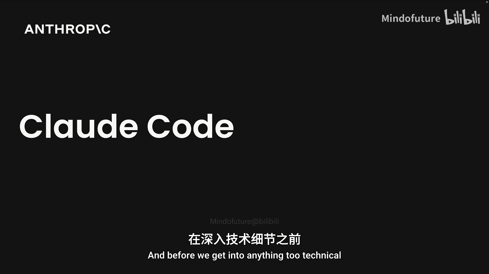
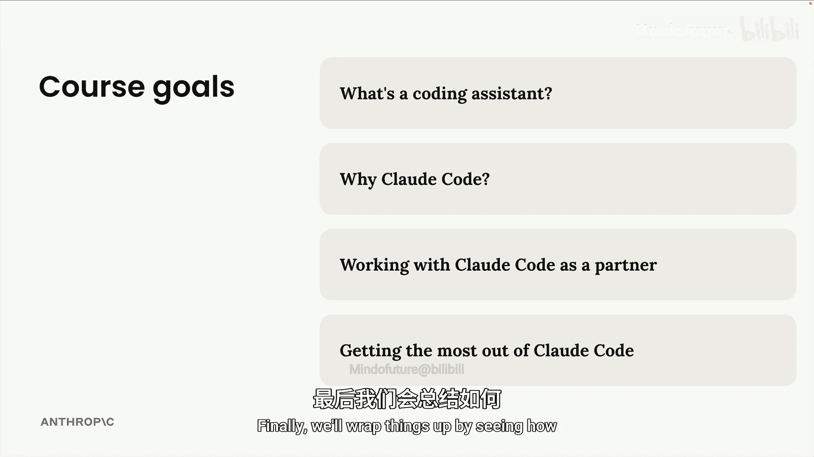

# 001：课程介绍

在本节课中，我们将要学习 Claude-Code 官方教程的概述，了解课程的整体结构和学习目标。

大家好，我是 Stephen Grder，Anthropic 的技术团队成员。

在这门课程中，我们将帮助大家快速掌握 Claude-Code。

在深入任何技术细节之前，我想先简要概述一下我们将要学习的内容。

这门课程分为四个部分。我们将首先花一些时间来准确理解什么是编码助手。

接着，我们将深入了解 Claude-Code 本身，并理解它如何在市场上众多不同的编码助手中脱颖而出。

在明确了这些概念之后，我们将通过一个典型项目来演练 Claude-Code 的使用，并获得一些实践经验。

最后，我们将通过了解如何在您自己的项目中充分利用 Claude-Code 来结束课程。

本节课中我们一起学习了 Claude-Code 官方教程的课程介绍，明确了课程分为四个主要部分：理解编码助手、认识 Claude-Code 的独特之处、进行实践演练以及学习如何将其应用于个人项目。