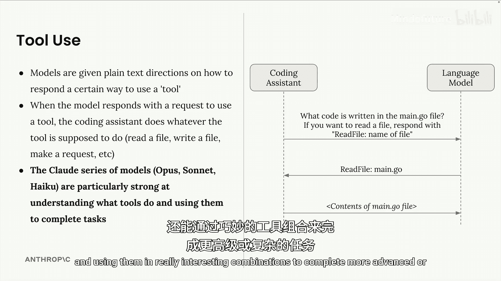
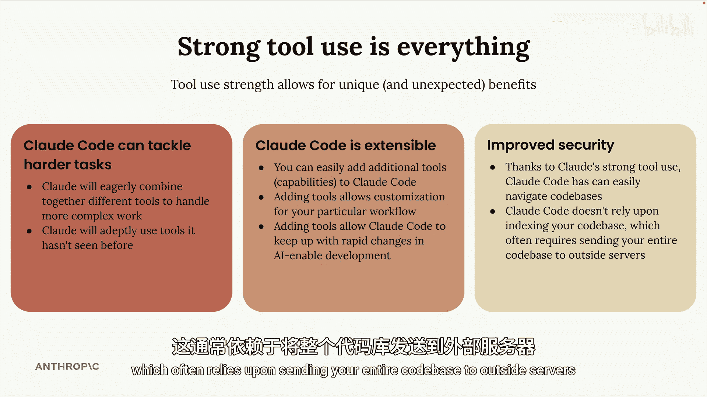
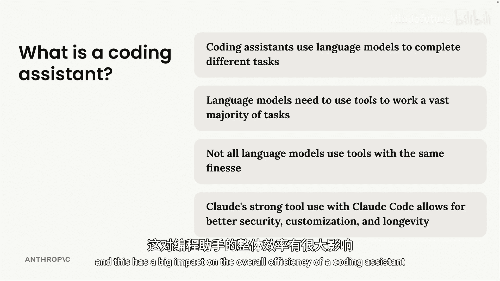

# 002：什么是编程助手？🤖

在本节课中，我们将深入理解什么是编程助手。我们将探讨其背后的工作原理，以及为何Claude Code能成为一个出色的团队辅助工具。

编程助手是一种编写代码的工具。但要真正理解其价值，我们需要了解其幕后的运作机制。理解编程助手的实际功能和运作方式，能让你更好地认识到什么才是真正出色的、能补充团队能力的助手。

## 理解编程助手的工作流程 🔄

以下是理解编程助手工作方式的一种视角。

编程助手首先会收到一个任务。例如，助手可能需要根据某个错误信息来修复一个Bug。这个任务会被内部传递给一个语言模型，该模型需要找出解决问题的方法。

不同的语言模型以非常不同的风格解决问题，这取决于任务的复杂性。但在许多情况下，它们的工作方式与人类非常相似。

### 任务执行步骤

以下是编程助手执行任务时可能遵循的步骤：

1.  **收集上下文**：首先，它需要理解错误信息指的是什么、代码库中哪个区域出现了错误，以及哪些文件看起来是相关的。
2.  **制定计划**：在收集了信息之后，它需要制定一个计划，说明将如何实际完成任务。
3.  **采取行动**：最后，它将采取行动。在这个例子中，它可能决定修改一些代码，然后运行或编写一个测试来验证问题是否真的被修复了。

## 与外部世界的交互 🌍

我想为你提供更多关于这个完整过程的信息。特别需要注意的是，上述流程的第一步和最后一步要求编程助手实际**做**一些事情。换句话说，它需要从外部世界收集信息，或者以某种方式影响外部世界。

*   为了收集上下文，助手可能需要读取一个文件或从网上获取一些文档。
*   为了采取行动，助手可能需要实际运行一个命令或编辑一个文件。

然而，让一个语言模型实际做这些事情，比听起来要复杂一些。让我帮你理解其中的原因。

## 语言模型的局限性与“工具使用” 🛠️

让我们想象一下，我们正在直接与一个语言模型交互。也就是说，它没有在任何编程助手或类似工具中运行。

接着，想象我们直接问这个语言模型：`main.go` 文件里写了什么代码？在任何编程助手或类似工具的上下文之外运行的语言模型，本身并不具备读取文件、运行命令等能力。

语言模型接收文本内容，并返回文本。这就是它们全部的能力范围。所有语言模型都是如此。

所以，如果你向一个普通的语言模型发送一些文本，要求它读取一个文件，它很可能会回答说它没有读取文件的能力。

那么，让我展示一下编程助手以及许多其他工具是如何让一个语言模型能够“读取”文件的。

以下是具体过程。每当你向编程助手发送一个请求时，编程助手在幕后会自动在你的请求中附加大量文本。

在这个特定情况下，我们可以想象编程助手会添加一些文本，内容大致是：“如果你（语言模型）想读取一个文件，请用这种非常精心设计的格式来回复。”例如，格式可能是：`read file: [文件名]`。

因此，在这种情况下，语言模型会意识到，为了回答我们的问题，它需要通过读取该文件来回应。所以它可能会回复：`read file: main.go`。

然后，编程助手将负责接收这条精心设计的消息，并理解语言模型希望通过读取文件来采取某种行动。接着，编程助手将负责实际读取该文件，并将文件内容发送回语言模型。

现在，语言模型收到了该文件的实际内容，它就可以写一个有趣的回复发送给我们。它可能会说：“我读取了这个文件，它包含了一些代码或其他内容，无论文件里有什么。”

这种给予语言模型额外指令、要求它以特定格式回复的完整系统，被称为**工具使用**。

*   **工具**用于赋予模型额外的能力。
*   **模型**负责以特定的方式回应。
*   然后，像我们的编程助手这样的工具，将负责实际执行所请求的操作，例如真正读取文件、写入文件或其他操作。

同样，这是所有语言模型的工作原理，它们都基于“工具使用”这个概念。

## Claude 的核心优势：强大的工具使用能力 ⚡

现在，这是需要理解的关键部分：Claude 系列模型（Sonnet 和 Haiku）在理解工具功能、有效使用工具完成任务，以及以非常有趣的组合方式使用工具来完成更高级或更复杂的任务方面，表现得特别出色。

**Claude 强大的工具使用能力是 Claude Code 作为编程助手的绝对核心优势。**

以下是原因：

1.  **处理复杂任务**：正如我刚才提到的，凭借更好的工具使用能力，Claude 可以处理更复杂的任务。
2.  **可扩展性**：Claude Code 本身是可扩展的，因此很容易向 Claude Code 添加新工具，而 Claude 会很乐意使用这些工具。考虑到开发领域日新月异的变化，这对于保持持续的相关性尤为重要。换句话说，Claude Code 是一个在未来几年里能与你共同成长的助手。
3.  **提升安全性**：最后，随着工具使用能力的提升，你通常会获得更好的安全性。因为 Claude 可以有效地搜索你的代码库以找到相关代码，而无需依赖索引。索引通常需要将你的整个代码库发送到外部服务器。

## 总结 📝

本节课中，我们一起学习了编程助手的本质。

*   请记住，编程助手在内部使用语言模型来完成不同的任务。
*   这些语言模型需要知道如何使用工具来处理它们收到的大多数任务。
*   工具用于读取文件、写入文件、运行命令，以及本质上所有不仅仅是生成一些文本的操作。
*   并非所有语言模型都能在同一水平上使用工具，这对编程助手的整体效率有很大影响。