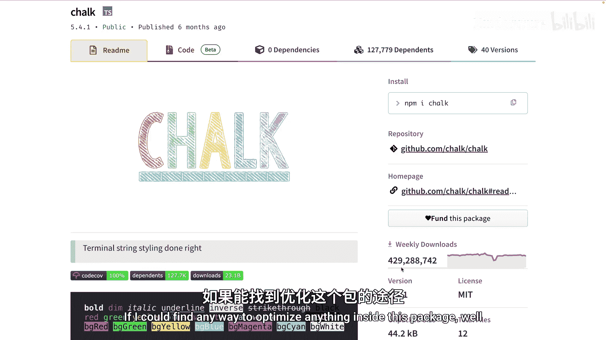
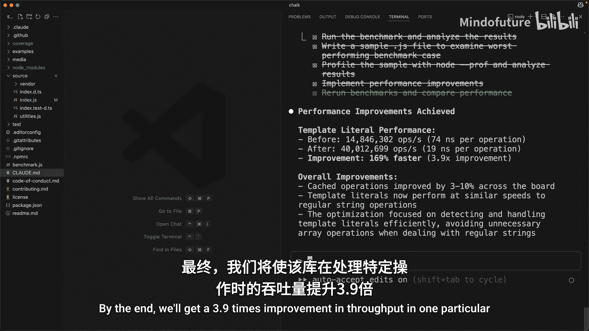
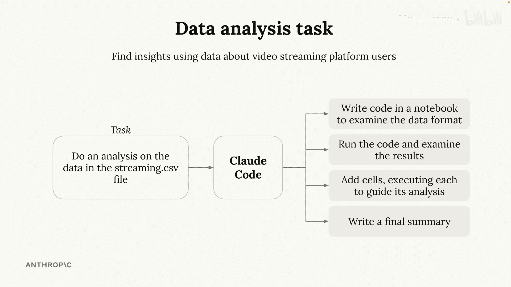
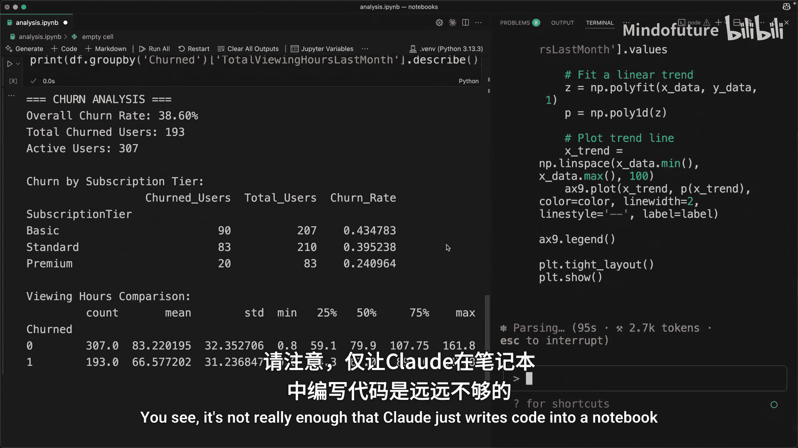
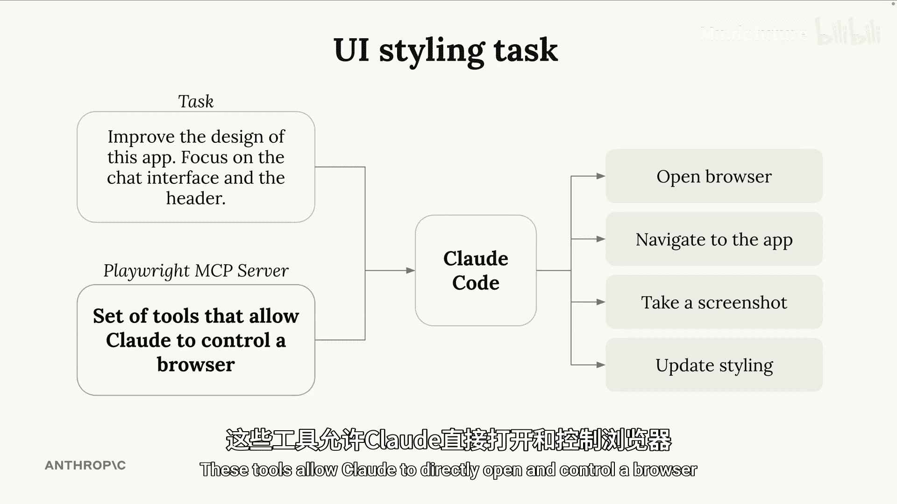
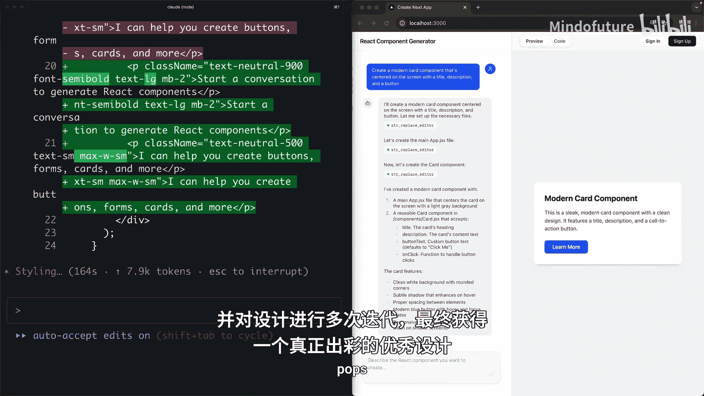
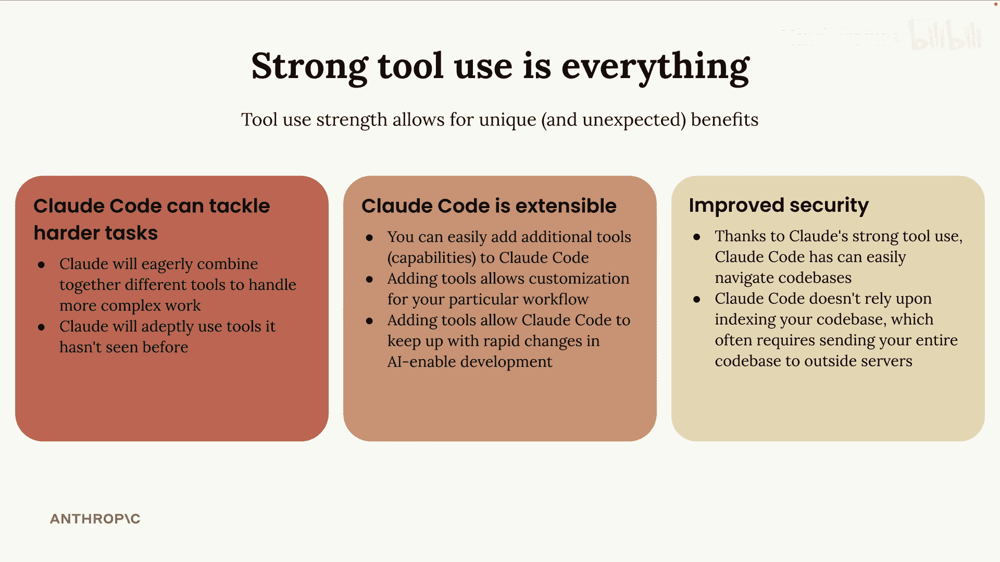

# 003：Claude Code 实战演示 🚀

在本节课中，我们将通过几个具体的任务演示，深入了解 Claude Code 如何智能地使用其内置及扩展的工具集来解决问题。你将看到 Claude Code 在性能优化、数据分析、UI 改进和代码审查等场景下的实际应用。

---

## 内置工具与智能应用

上一节我们介绍了 Claude Code 的核心能力。本节中我们来看看它如何利用默认工具集完成实际任务。

Claude Code 默认具备一系列工具能力，例如读取文件、写入文件、执行命令等。以下是 Claude Code 利用这些工具智能完成任务的两个示例。

### 示例一：性能分析与优化

我要求 Claude Code 在 `chalk` 库中查找并优化性能问题。`chalk` 是一个用于在终端输出彩色文本的 JavaScript 包。虽然功能简单，但它是整个 JavaScript 生态系统中下载量第五大的包，上周下载量达 4.29 亿次。优化此库的性能具有显著价值。

我要求 Claude 运行基准测试，识别性能最差的用例，使用分析工具找出运行缓慢的原因并进行修复。

Claude Code 将使用多种工具来智能地解决此问题。以下是其执行步骤：
*   它会创建一个待办事项列表来跟踪进度。
*   执行命令来运行基准测试。
*   写入文件以更精确地聚焦于特定用例。
*   使用 CPU 分析器来理解该用例运行缓慢的原因。
*   最后实施改进。

最终，我们在该库的某个特定操作上获得了 **3.9 倍** 的吞吐量提升。

### 示例二：交互式数据分析

这个例子展示了 Claude 如何将不同的工具调用串联起来完成复杂任务。

我交给 Claude 一个 CSV 格式的数据集，其中包含一个视频流媒体平台的不同用户信息。我要求它对数据进行通用分析，识别平台上用户流失的一些原因，并且所有分析都要在 Jupyter Notebook 中完成。

这是有效使用工具的重要示例。Claude 不仅仅是将代码写入 Notebook，它还能在不同的单元格中执行代码并查看执行结果。这意味着 Claude 可以先在 Notebook 中初步查看数据，然后定制后续的每个单元格，以深入探究特定细节。

---

## 扩展工具能力

上一节我们看到了 Claude Code 使用内置工具的能力。本节中我们来看看如何通过添加新工具来扩展其功能。

我想展示一个任务示例，通过赋予 Claude Code 访问新工具集的能力来扩展其功能。我构建了一个小型应用，可以根据左侧屏幕输入的描述生成 UI 组件，生成的组件会显示在右侧。该应用可以轻松生成外观良好的组件，但左侧的聊天界面和顶部的标题栏看起来不太美观。

因此，我将使用 Claude Code 来改进样式。如果我只是要求它修复聊天界面和标题栏的样式，它可能会做得很好。但我的目标是向你展示向 Claude Code 添加额外功能是多么容易。

除了样式任务，我还将赋予 Claude Code 访问由 **Playwright MCP 服务器** 提供的新工具集的能力。这些工具允许 Claude 直接打开和控制浏览器。

以下是该过程的实际操作。我要求 Claude 改进我的应用样式，并使用浏览器来完成。它将在屏幕右侧打开一个浏览器，导航到我的应用，截取屏幕截图以查看当前样式，然后更新样式。我们甚至可以要求 Claude 在完成后再次截取页面截图，并多次迭代设计，以获得真正有组织、美观且突出的设计。

不久之后，我们就得到了一个看起来相当合理的设计。

---

## GitHub 集成与自动化审查

Claude 出色利用工具的能力，使得 Claude Code 能够随着你和你的团队在未来共同成长。让我立即展示一个例子。

Claude Code 与 GitHub 有非常紧密的集成。你可以将 Claude Code 设置在 GitHub Action 中运行，它会根据特定事件（如创建拉取请求或在 Issue 中被直接提及）自动执行。当 Claude Code 在 GitHub 上运行时，它不仅能够查看和运行你的代码，还能获得一套用于与 GitHub 交互的新工具，例如创建评论、提交或拉取请求等。

你可以利用此集成来自动审查拉取请求。让我展示一个例子。

首先让我为你设置一个小场景。假设我们正在 AWS 上构建一些基础设施，我们所有的基础设施都定义在一组 Terraform 文件中，这些文件被提交并存储在 GitHub 上。因为我们所有的基础设施都定义在 Terraform 文件中，所以 Claude Code 非常清楚信息是如何在我们的基础设施中流动的。

现在假设在这个应用中，我有一个 DynamoDB 表。我在其中存储了一些关于用户的不同信息，包括可能看过的节目计划和注册日期。出于某种原因，我们可能希望与某个内部营销团队以及某个外部营销团队共享这些节目计划和注册日期信息。因此，另一家公司可以访问我们写入此存储桶的数据。对我们来说，始终了解随时间推移有哪些信息被写入该存储桶非常重要。

我们可能每晚运行一个 Lambda 函数，提取所有已添加到该表中的不同用户，然后仅提取看过的节目计划和注册日期，并将其存储在 S3 存储桶中。这样，这两个营销团队就可以访问这些信息。

现在，假设几个月后，内部营销团队要求我们也将电子邮件存储在此 S3 存储桶中。因此，我们可能会进入 Lambda 函数，仅添加一行代码，将用户的电子邮件也存储到存储桶中。由于这是几个月后的事情，我们可能已经完全忘记了这个 S3 存储桶是与外部营销合作伙伴共享的。所以此时，我们正在将个人身份信息放入这个可由另一家公司访问的存储桶中。这是一个很大的错误，绝对是我们不想做的事情。但同时，这确实是一种可能发生的错误，如果我们不清楚这个 S3 存储桶到底发生了什么，就很难发现。

事实证明，Claude Code 可以很容易地在拉取请求中发现这种情况。

具体来说，因为我们所有的基础设施都定义在这些 Terraform 文件中。

以下是一个快速示例。我构建了刚才在图表中向你展示的那个项目。我创建了一个拉取请求，以在 Lambda 函数中添加用户的电子邮件。因此，我更改的唯一一行代码就是那里，我说对于每个用户，我想获取他们的电子邮件并将其也添加到存储桶中。

现在，Claude Code 对我的基础设施有非常清晰的了解，因此它能够在我们现在看到的自动审查中，查看我在这个拉取请求中所做的所有更改。它能够准确弄清楚我的基础设施是如何工作的，并且能够识别出我正在向合作伙伴暴露一些个人身份信息。

它在这里列出了数据流，即发生的具体步骤，并详细说明了这个存储桶是如何与外部合作伙伴共享的。在开发过程中发现此类问题，而不是在部署此更改之后，是利用 Claude Code 在 GitHub 上集成的巨大优势。我将在后面详细介绍，并确切展示如何设置与此完全相同的流程。

---

## 总结

本节课中我们一起学习了 Claude Code 如何通过智能使用工具来解决实际问题。我们看到了它在性能优化、交互式数据分析、UI 样式改进以及与 GitHub 集成进行自动化代码审查等方面的强大能力。请记住，你应当将 Claude Code 视为一个灵活的助手，它可以被定制，并随着时间推移不断成长和变化，以满足你团队的需求。