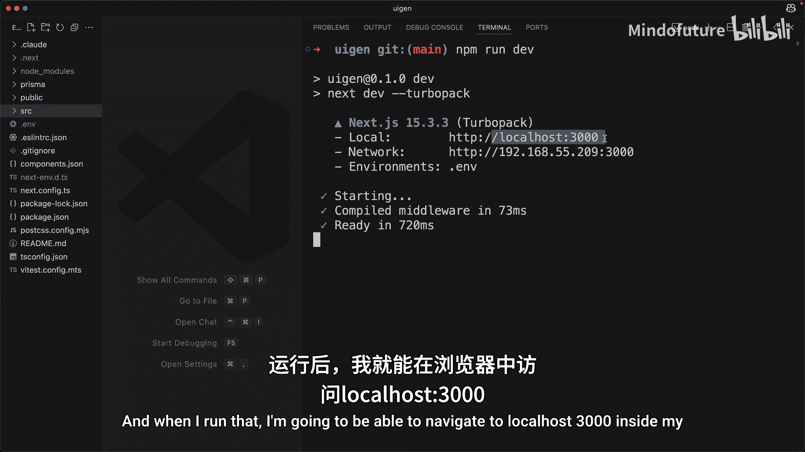
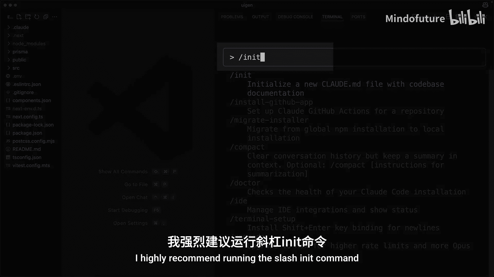
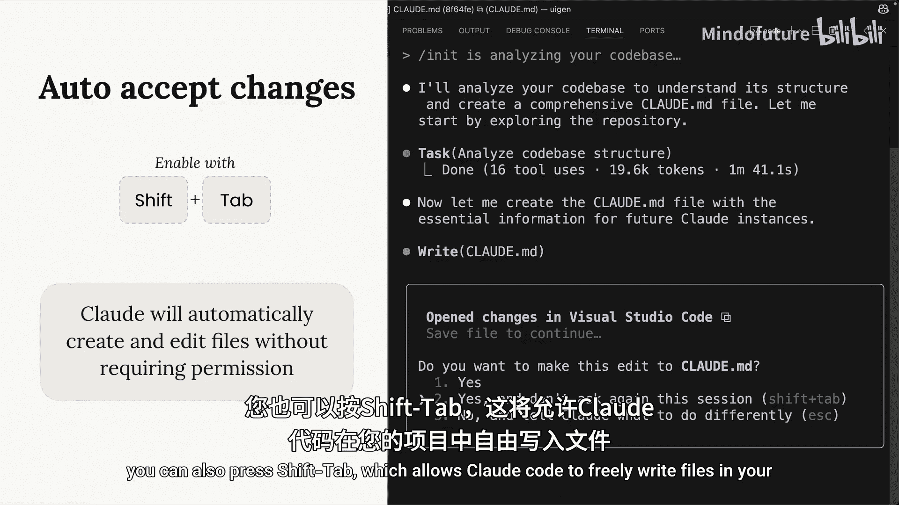
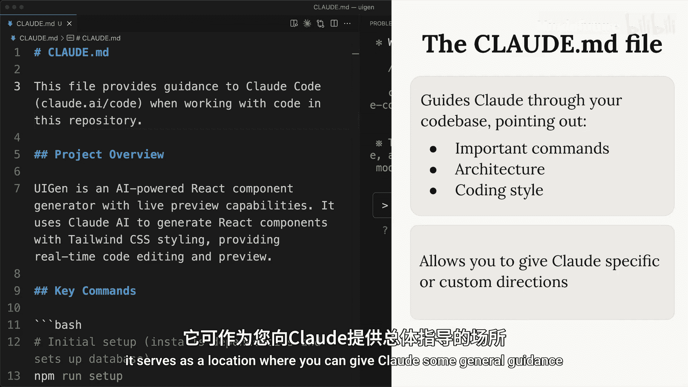
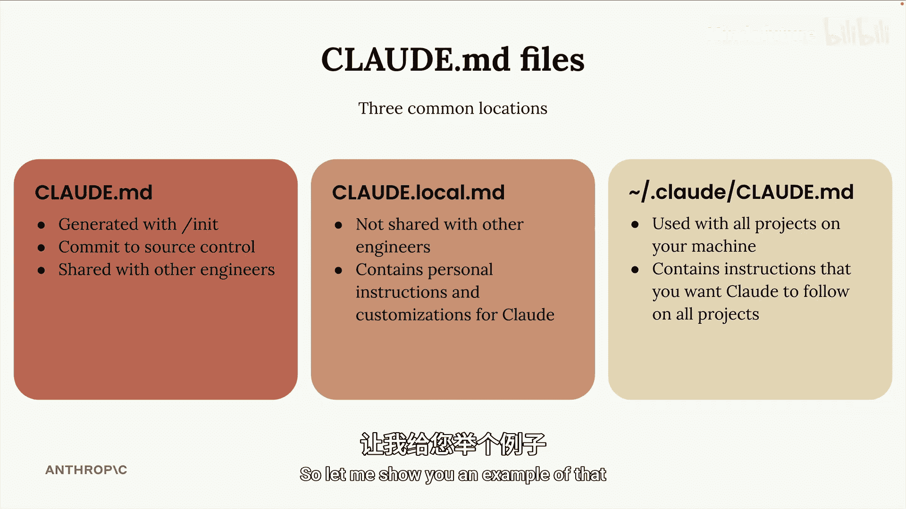
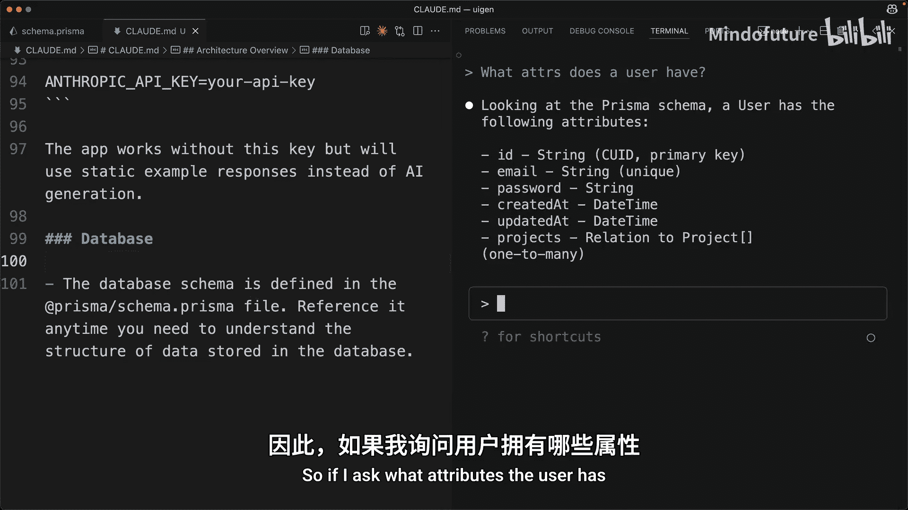

# 004：添加上下文

在本节课中，我们将学习如何为 Claude Code 提供最佳的项目上下文，以提升其理解和协助编程的效率。核心在于理解并管理提供给 Claude 的信息量，确保其获得足够且相关的信息。

## 概述：上下文管理的重要性

在典型的项目中，可能存在数十甚至数百个文件，每个文件都包含大量信息。当我们向 Claude Code 提问或分配任务时，存在一个理想的信息量，即 Claude 恰好需要足够的信息来理解如何回答问题或完成任务。一旦我们开始添加不相关的额外信息，Claude Code 的有效性就会开始下降。因此，引导 Claude 关注项目中相关的文件或文档至关重要。Claude Code 当然可以在没有引导的情况下工作，但如果你能提供一点指导，你将获得最佳结果。

## 初始化项目上下文

上一节我们介绍了上下文管理的重要性，本节中我们来看看如何为 Claude 初始化项目上下文。

在我的编辑器中，我打开了终端，并通过运行 `claude` 命令来启动 Claude Code。

当你第一次在项目中运行 Claude Code 时，我强烈建议运行 `/init` 命令。这会让 Claude 深入查看你的整个代码库。它会弄清楚项目的用途、总体架构、相关命令、关键文件等。完成这次搜索后，它会总结其发现，并将其放入一个名为 `claude.md` 的文件中。

当 Claude 尝试创建此文件时，它会请求权限。你可以按回车键接受，或者，如果你不想为每个文件写入请求都授予权限，也可以按 `Shift` 键，这将允许 Claude Code 在你的项目中自由写入文件。

我鼓励你打开生成的 `claude.md` 文件并查看其内容。如前所述，该文件的内容会包含在我们之后向 Claude 发出的每个请求中。这个文件主要有两个不同的目的：第一，它帮助 Claude 更好地理解你的代码库，从而能更快地找到相关代码；第二，它作为一个位置，你可以在此向 Claude 提供一些通用指导。

## 理解不同层级的 Claude 配置文件

现在，我们来了解一下 Claude Code 会使用的多个 `claude.md` 文件。

*   **项目级**：这是我们通过运行 `/init` 命令生成的文件。我们通常会将其提交到像 Git 这样的源代码控制中。我们将与其他工程师共享此文件，并且它会包含一些我们想要传递给 Claude 的特定于项目的指导。
*   **本地级**：我们还可以创建一个 `claude.local.md` 文件。此文件不会被提交，通常也不会与其他任何工程师共享。在此文件中，你可以放入一些你希望 Claude 仅为你遵循的个人指令。
*   **全局级**：你可以在你的机器上拥有一个全局 `claude.md` 文件。此文件将包含适用于你在本地运行的所有项目的指令。

## 添加自定义指令

我一直提到给 Claude 特殊或自定义的指令，现在让我给你展示一个例子。

假设 Claude 在编写的代码中过于频繁地使用注释。我们可以通过更新我们的 `claude.md` 文件来解决这个问题。我们可以手动修改文件，或者在 Claude Code 内部使用一个快捷方式：输入一个 `#` 号。这会让我们进入“记忆模式”，允许我们智能地编辑我们的一个 `claude.md` 文件。

因此，我们可以输入一个请求，例如“不要如此频繁地编写注释”。然后我会指定我想将此指令添加到项目的 `claude.md` 文件中。接着，Claude 会智能地将此指令合并到该文件中。如果我随后打开该文件并进行搜索，我会看到它确实添加了那条新指令。

## 在对话中引入特定上下文

现在我们已经创建了 `claude.md` 文件，我想让你更好地理解如何在对话中引入特定的上下文。

假设我们想更好地了解这个项目中的身份验证系统是如何工作的。我们可以直接让 Claude 告诉我们相关信息，在这种情况下，它会搜索我们的代码库并找到与身份验证系统相关的文件。这当然可行，但会花费一些时间。

或者，如果我们已经知道一些与身份验证系统相关的文件，我们可以使用 `@` 字符来提及它们。当我们提及一个文件时，它会被自动包含在发送给 Claude 的请求中。这是引导 Claude 关注特定方向的一个绝佳技巧。

你可以使用相同的语法在 `claude.md` 文件中提及文件。让我给你展示一个例子，说明为什么这非常有用。

在这个项目的 `prisma` 文件夹中，有一个名为 `schema.prisma` 的文件。此文件包含了 SQLite 数据库中存在的所有不同表和记录类型的完整定义，该项目使用该数据库来存储信息。因为这个信息非常重要，并且与项目的许多方面都相关，我可能决定在我的 `claude.md` 文件中提及这个文件。

让我向你展示如何操作。首先，我会输入 `#` 进入记忆模式。然后我会提及那个模式文件，并特别告诉 Claude，每当它需要更好地理解数据库中数据的结构时，就参考该文件。更新完成后，我会查看 `claude.md` 文件，以确认备注已添加。

当你像这样提及一个文件时，其内容会自动包含在你的请求中。因此，如果我询问用户具有哪些属性，Claude 可以立即回答，而无需读取模式文件。

## 总结

本节课中，我们一起学习了如何为 Claude Code 有效管理上下文。我们了解了运行 `/init` 命令创建项目级 `claude.md` 文件的重要性，认识了项目级、本地级和全局级配置文件的不同用途，并掌握了通过“记忆模式”添加自定义指令，以及使用 `@` 语法在对话中直接引入特定文件来为 Claude 提供精准、高效的上下文指导。这些技巧将帮助你显著提升与 Claude Code 协作编程的效率。