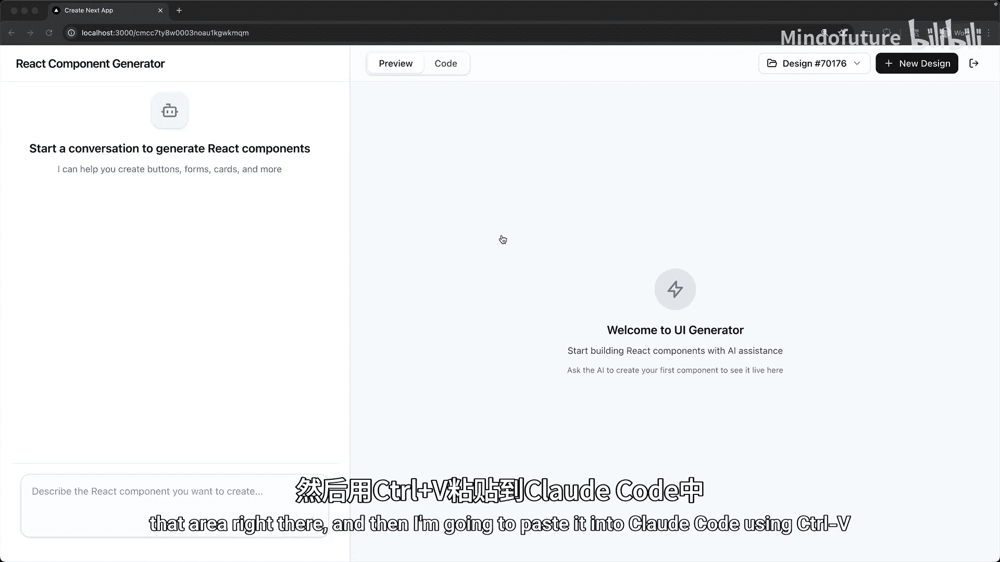
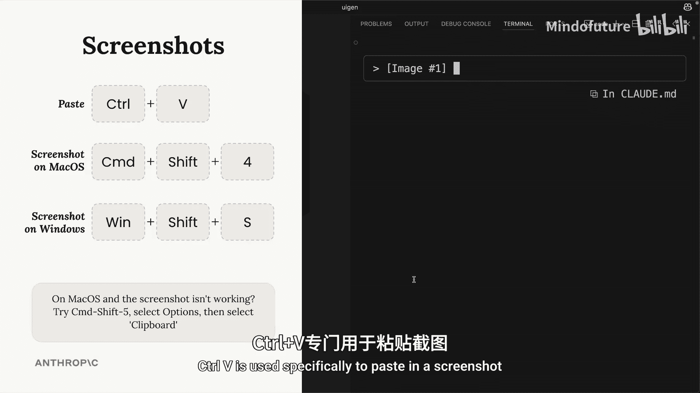
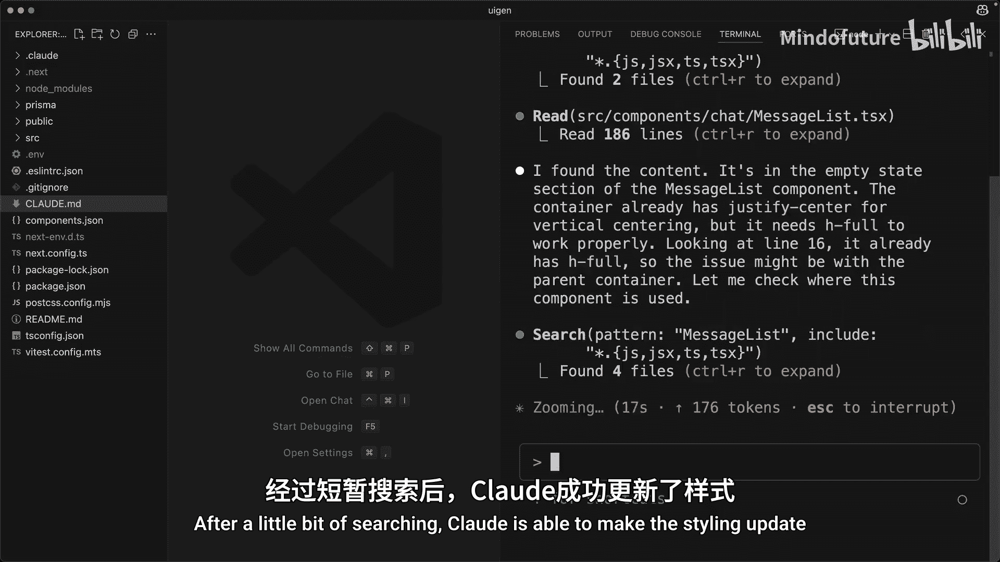
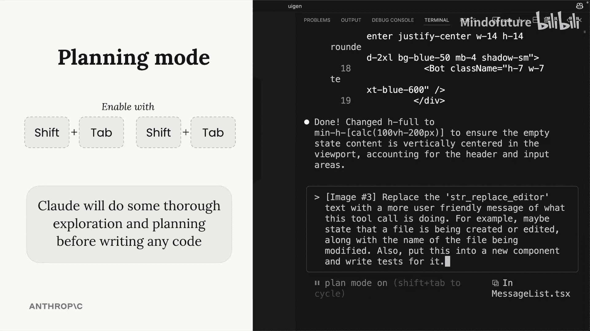
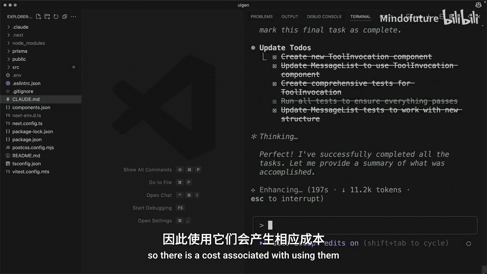
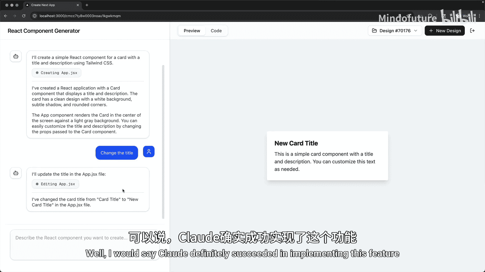
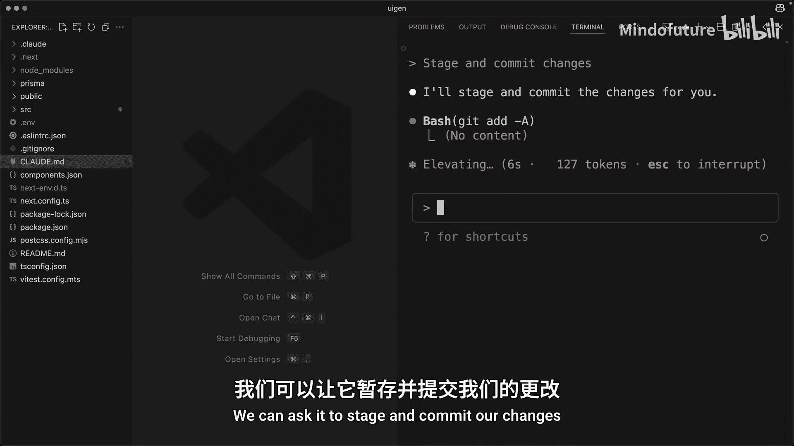

# 005：进行项目修改 🛠️

在本节课中，我们将学习如何利用 Claude Code 对项目进行修改，并探索其核心功能，如截图引导、计划模式和深度思考模式，以提升代码编辑的效率和准确性。

---

## 截图引导与界面调整 📸

上一节我们介绍了 Claude Code 的基本操作，本节中我们来看看如何通过截图来精确引导 Claude 进行界面调整。

首先，我想将左侧面板中的占位文本移动到面板中央，以帮助 Claude 准确理解我希望移动的内容。我将对该区域进行截图。

然后，我将使用 `Ctrl + V` 将截图粘贴到 Claude Code 中。请注意，在 Windows 上使用 `Ctrl + V` 粘贴截图，而非 Mac 上常用的 `Command + V`。

粘贴截图后，我可以要求 Claude 将那个占位文本居中。经过短暂搜索，Claude 成功更新了样式。回到浏览器中查看，效果很好。

---

## 生成组件与优化用户提示 🃏

接下来，我想在这个应用中修改另一处内容。我将要求生成一个显示标题和描述的卡片组件。

卡片组件顺利生成，但在聊天界面的左侧出现了一个尴尬的术语：“字符串替换编辑器”。这个小面板本意是向用户提示正在创建文件，但目前使用了非常技术性的术语。

我希望向用户展示更友好的文本，直接告知用户正在创建文件及其名称。当然，我们也应该处理其他情况，例如编辑或删除文件，以更好地引导 Claude 的注意力。

我再次对该区域进行截图，以确保 Claude 完全理解我的意图。

回到 Claude Code，我粘贴图片，并要求 Claude 用更用户友好的信息替换那段特定文本。

---

## 提升 Claude 智能：计划模式与思考模式 🧠

这是一个稍具挑战性的任务，需要 Claude 在项目中做相当多的研究才能完成。当你给 Claude 一个较难的任务时，有两种方法可以轻松提升其智能。

以下是两种提升智能的方法：

1.  **启用计划模式**：通过按两次 `Shift + Tab` 启用（如果已开启自动接受文件编辑，则按一次）。在计划模式下，Claude 会对项目内容进行更深入的研究，阅读更多文件，并制定完成任务的详细计划。计划完成后，Claude 会告诉你它打算如何执行。此时，你可以接受该计划让 Claude 实施，或者在某些方面（例如它忽略了某个文件或未考虑某些场景）引导 Claude。

2.  **启用思考模式**：这会开启 Claude 的扩展思考功能，允许它对特定任务进行更深入的推理。有多种触发短语可以启用思考模式，每个短语都为 Claude 提供了逐步增大的思考令牌预算。鉴于这是一个较复杂的任务，我可能会要求 Claude “深入思考”最佳实现方式。

最后需要理解的是，计划模式和思考模式可以结合使用。因此，除了要求“深入思考”，我还将同时开启计划模式。然后运行任务，观察 Claude 实现此功能的效果。

---

## 模式选择指南：广度 vs 深度 ⚖️

你可能会疑惑，何时该使用计划模式，何时该使用思考模式。

可以将这两者视为处理**广度**与**深度**的工具：
*   **计划模式**适用于需要广泛理解代码库、查看不同区域的任务，也适用于需要多个步骤才能完成的复杂任务。
*   **思考模式**则在你专注于某个特定的棘手逻辑点或排查困难错误时非常有用。

第二个问题可能是：是否应该始终启用思考和计划模式？你当然可以这样做。但请记住，计划模式和思考模式会消耗额外的令牌，因此使用它们会产生相应的成本。

---

## 验证修改结果与提交更改 ✅

经过几分钟的工作，功能似乎已完成。我回到编辑器进行测试。

我们立刻可以看到，状态信息比以前更友好了。用户现在被告知正在创建文件。如果我发送一个后续请求，例如更改标题，希望在后续操作中能看到关于编辑该文件的提示。果然，现在我们看到的是正在编辑 `App.jsx` 文件。可以说，Claude 成功实现了这个功能。

现在我们已经对项目做了一些修改，应该提交这些更改。Claude Code 是一个可靠的 Git 助手。我们可以要求它暂存并提交更改，它会为我们编写描述性的提交信息。

---

## 总结 📝

本节课中我们一起学习了如何利用 Claude Code 进行项目修改。我们掌握了通过截图精确引导界面调整的方法，生成了新的组件，并优化了用户提示文本。更重要的是，我们深入探讨了提升 Claude 智能的两种核心模式：**计划模式**（`Shift + Tab`）用于处理需要广度和多步骤的任务，以及**思考模式**（通过特定短语触发）用于攻克深度逻辑难题。最后，我们还使用 Claude Code 完成了 Git 提交操作。合理运用这些功能，将能显著提升你的开发效率。