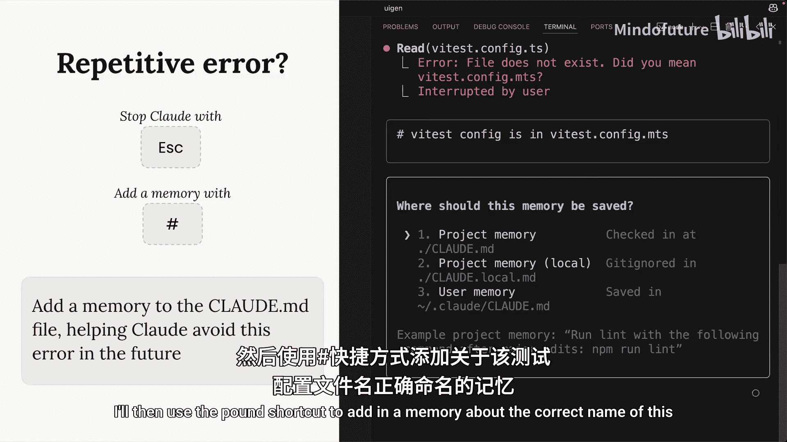
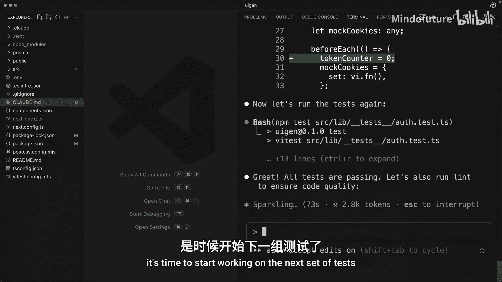
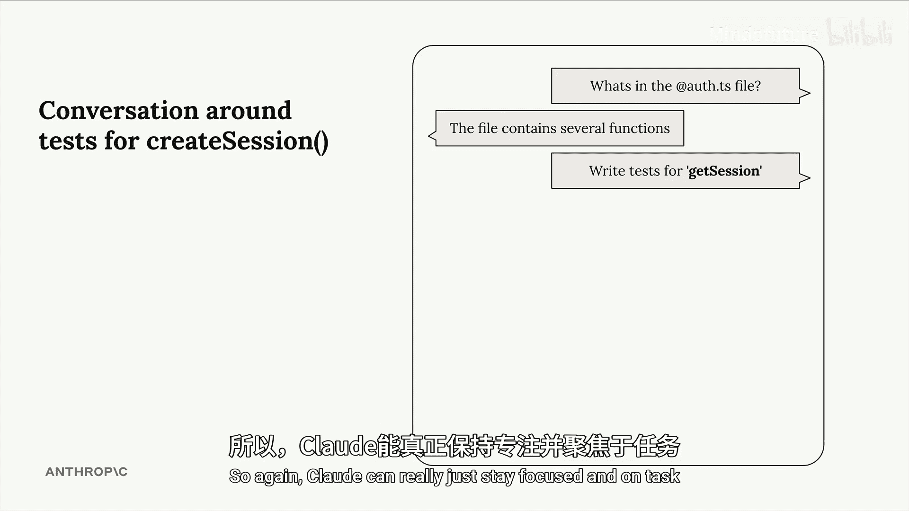
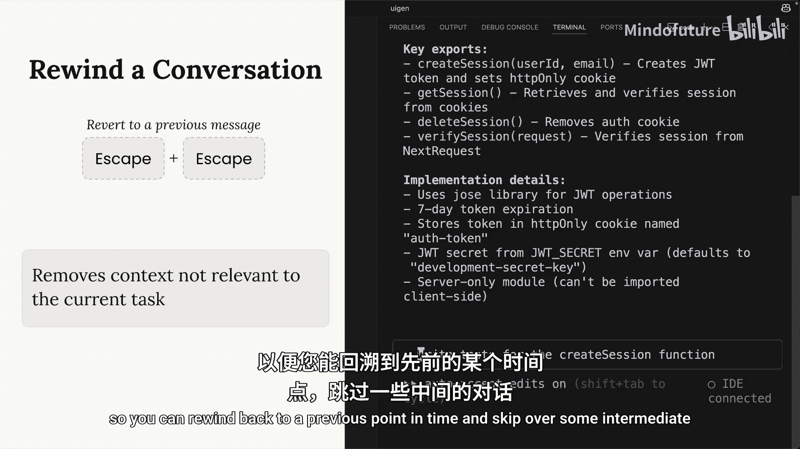
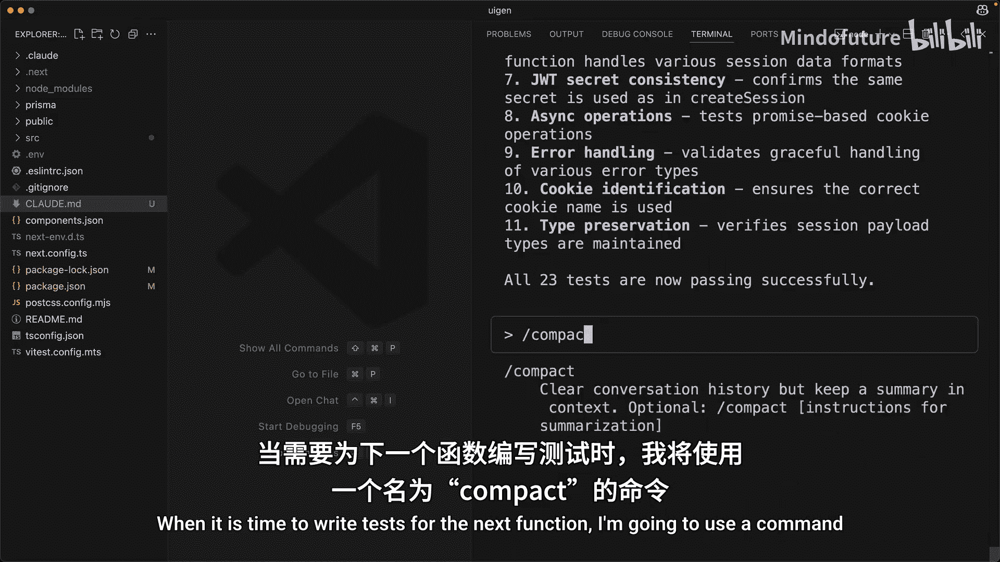
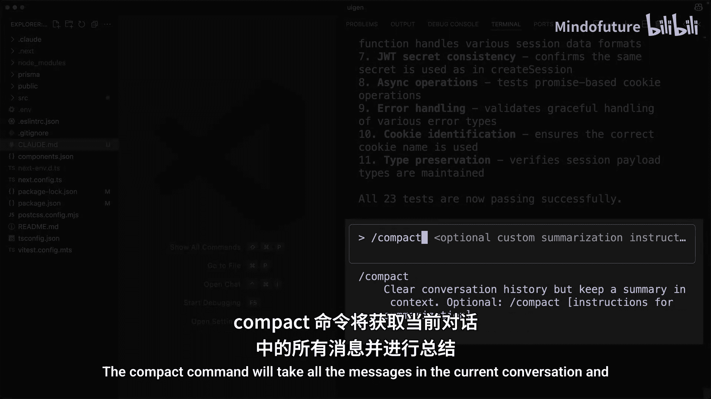
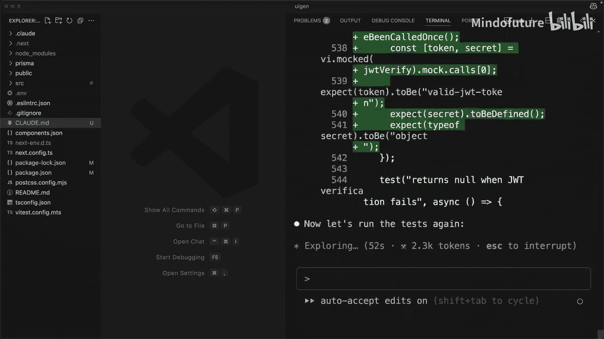
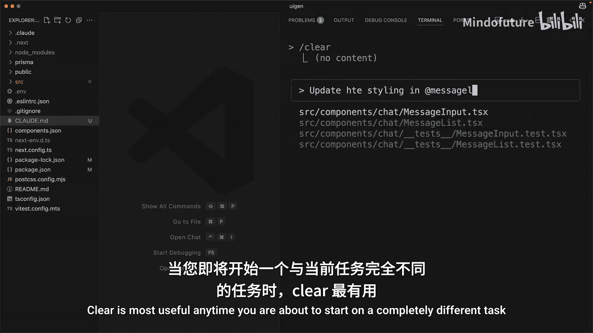
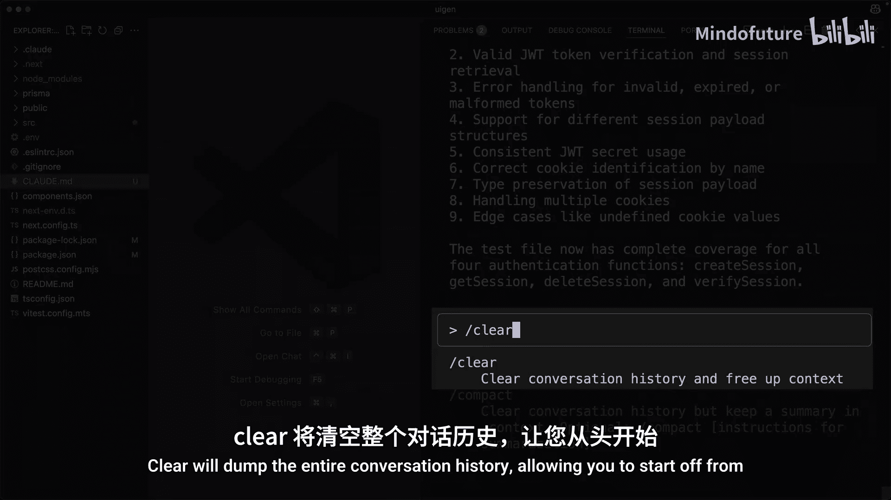
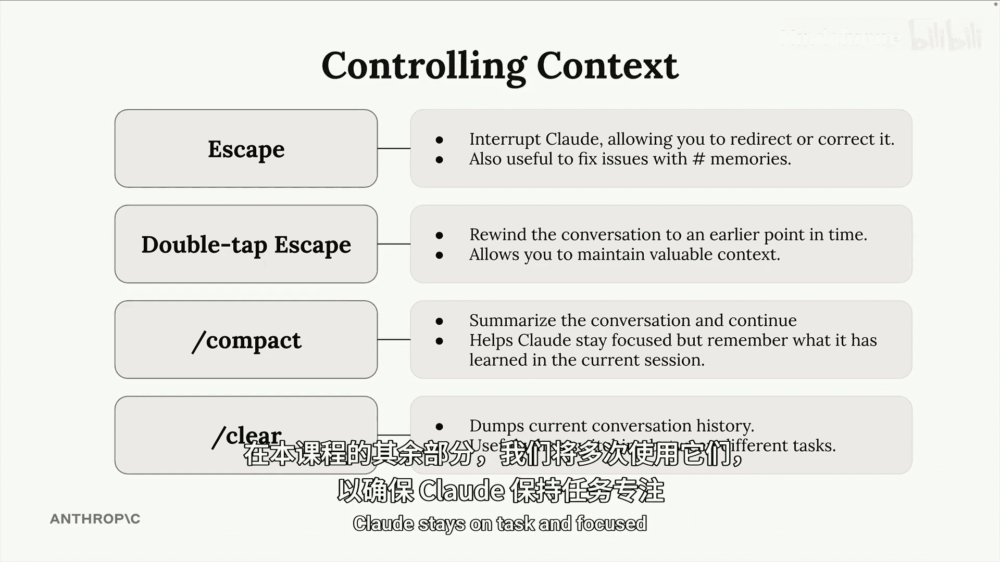

# 006：控制对话上下文 🎛️

在本节课中，我们将学习几种不同的技术，用于控制和引导与 Claude 的对话流程。掌握这些技巧能有效提升 Claude 的工作效率和专注度。

## 概述

与 AI 助手进行长时间对话时，上下文管理至关重要。无关的对话历史会分散 Claude 的注意力，导致其偏离当前任务。本节将介绍几个核心快捷键和命令，帮助你清理、回溯和压缩对话历史，确保 Claude 始终保持专注。

## 中断当前生成：Escape 键

当 Claude 正在生成内容，但你希望其停止并转向其他任务时，可以使用 `Escape` 键。

**基本示例**：我要求 Claude 为一个认证文件中的函数编写测试。Claude 迅速制定了一个编写多个测试的计划。然而，我知道测试这个文件有些困难，希望 Claude 一次只测试一个功能。

此时，我可以按下 `Escape` 键来中断 Claude。这将使 Claude 立即停止生成，允许我建议一条不同的路径。

结合 `Escape` 键和“记忆”功能，是纠正 Claude 重复性错误的强大方法。

**示例**：我再次要求 Claude 为同一个文件编写测试。这次，它试图读取一个实际并不存在的测试配置文件。这是一个我在本项目上见过 Claude 犯过的错误。

为了阻止这个错误再次发生，我迅速按下 `Escape` 键中断它。然后，我使用 `#` 快捷键添加一条关于该测试配置文件正确名称的记忆。这样，我可能就不会再看到这个错误了。

## 回溯对话历史：Escape + Escape

一些对话控制快捷键看似只是为了方便，但若使用得当，能显著提升 Claude 有效工作并保持专注的能力。

让我们看一个更实际的例子。在 `O.ts` 文件中有四个不同的函数，我希望让 Claude 为它们逐个编写测试，首先从名为 `createSession` 的函数开始。

Claude 会尝试编写测试，但在运行过程中遇到了一个错误，并花了一些时间进行调试。结果发现是我忘记安装一个包。

最终，测试完成并运行通过。是时候开始编写下一组测试了。但问题是：在我的对话历史中，现在充满了关于那个缺失包的来回讨论。这些上下文与编写下一组测试完全无关。

理想情况下，我们能够“时光倒流”，回到之前发送的消息，并将其更新为“为 `getSession` 函数编写测试”。这样做的好处是，我们保留了 Claude 已经查看过 `O.ts` 文件内容的上下文，并且当我们提到 `getSession` 时，它已经知道我们在说什么。同时，因为我们丢弃了所有关于调试的额外消息，Claude 在这里受到的干扰会少很多。这样，Claude 就能真正保持专注和任务导向。

要回溯对话历史，请按两次 `Escape` 键。这将显示你迄今为止发送的所有不同消息，从而允许你回退到之前的时间点，跳过一些中间的对话。

## 压缩对话上下文：Compact 命令

Claude 现在开始处理下一组测试。这一次，Claude 保持了高度专注，但不幸的是，它遇到了许多问题。最终它解决了这些问题并使测试通过。此时，Claude 已经独立工作了几分钟，并且对如何为此文件编写测试有了很好的理解。

同时，我们的对话历史中再次积累了大量上下文。当需要为下一个函数编写测试时，我将使用一个名为 `Compact` 的命令。

`Compact` 命令将获取当前对话中的所有消息并对它们进行总结。当 Claude 已经对当前任务学习了很多知识，并且你希望将这些知识保留到下一个任务中时，`Compact` 命令非常有用。

## 清空对话历史：Clear 命令

最后一个需要了解的上下文相关命令是 `Clear` 命令。Claude 将清空整个对话历史，允许你从头开始。

`Clear` 命令在你即将开始一个与当前任务完全无关的新任务时最为有用。

## 总结与建议

本节课中，我们一起学习了控制 Claude 对话上下文的几种核心方法：

1.  **`Escape`**：中断 Claude 的当前生成，以便引导新方向。
2.  **`Escape` + `Escape`**：回溯对话历史，跳过无关的中间对话，回到干净的上下文起点。
3.  **`Compact`**：压缩并总结当前对话，保留关键知识，移除冗余细节，为后续任务做准备。
4.  **`Clear`**：清空整个对话历史，为全新的、不相关的任务做好准备。

我建议频繁使用这些快捷键，特别是在切换任务时，或者任何与 Claude 进行长时间对话的场景中。在本课程的剩余部分，我们将多次使用这些技巧，以确保 Claude 保持专注和任务导向。

