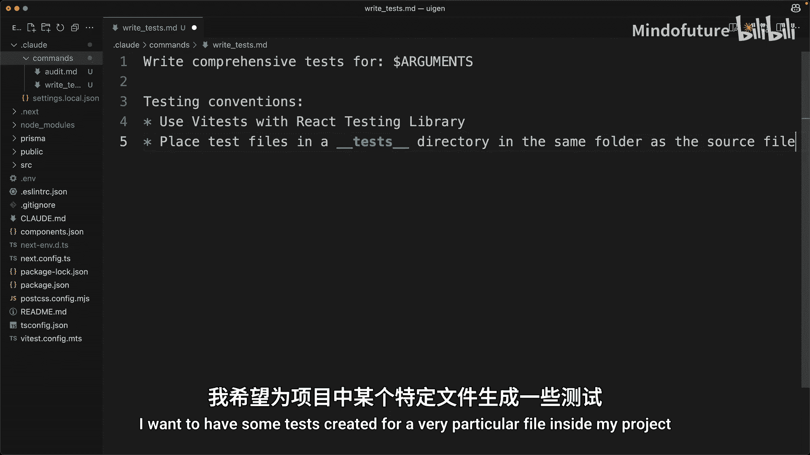
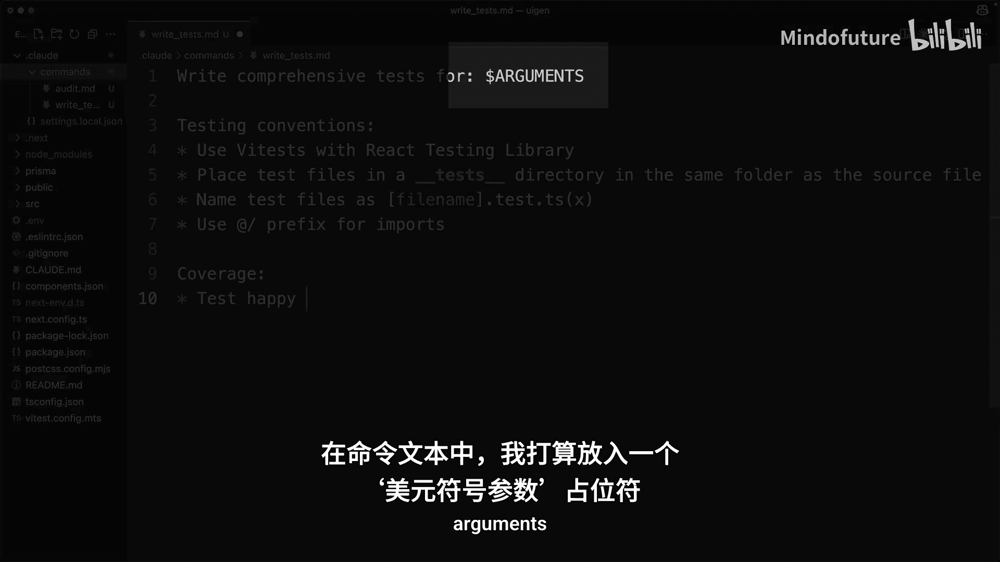
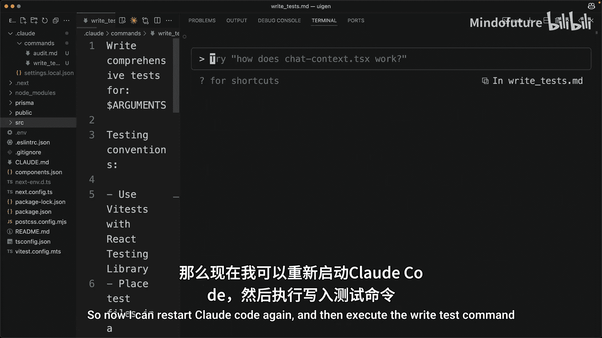
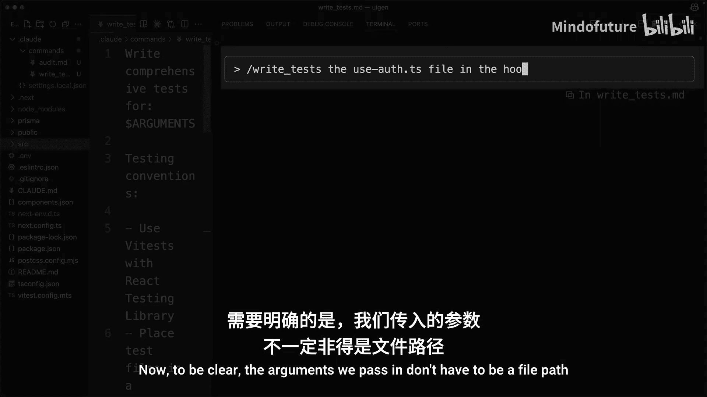
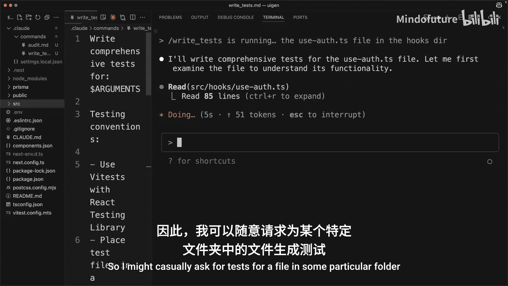

# 007：自定义命令 🛠️

在本节课中，我们将要学习如何在 Claude-Code 中创建和使用自定义命令。自定义命令可以帮助你自动化那些频繁执行的重复性任务，从而提升开发效率。

## 概述

运行 Claude-Code 时，你可以输入一个斜杠 `/` 来查看一系列由 Claude-Code 默认内置的命令。除了这些默认命令，你还可以轻松地添加自己的自定义命令。

自定义命令对于自动化那些你发现自己经常运行的重复性任务非常有用。

## 创建自定义命令

上一节我们介绍了自定义命令的概念，本节中我们来看看如何实际创建一个自定义命令。

让我们通过一个例子来了解如何创建一个自定义命令。在我的项目目录中，我需要找到 `.cloud` 文件夹。在该文件夹内，我将创建一个名为 `commands` 的新目录。然后，在该目录中，我将创建一个名为 `audit.md` 的新文件。

我们创建的文件名（在本例中是 `audit`）将成为我们最终运行的命令名称。这个命令的目标是审计所有已安装到该项目中的不同依赖项，如果存在任何漏洞则更新它们，然后运行测试以确保没有实际破坏任何功能。

## 使用自定义命令

创建命令文件后，你需要重启 Claude-Code。请不要忘记重启它。当你重启 Claude-Code 后，输入 `/audit`。这将显示你刚刚创建的命令。然后你可以运行这个命令。在本例中，它将完全按照我们要求 Claude 做的去执行：运行命令，检查是否存在任何易受攻击的包，必要时修复它们，然后运行测试。

## 为命令添加参数

命令也可以接收参数。让我展示一个例子。我将创建另一个名为 `write_tests` 的命令。当我运行这个命令时，我希望为项目中一个非常特定的文件创建一些测试。

在命令文本中，我将放入一个占位符 `$arguments`。当我运行命令时，如果我传入一个文件路径，该路径将被插入到 `$arguments` 的位置。

所以现在我可以再次重启 Claude-Code，然后执行 `write_tests` 命令。需要明确的是，我们传入的参数不一定必须是文件路径。它可以是任何我们想要传入的字符串。因此，我可能会随意地要求为某个特定文件夹中的文件编写测试，给 Claude 一点关于在哪里查找的指示。

## 总结

本节课中我们一起学习了如何在 Claude-Code 中创建和使用自定义命令。我们了解了创建命令文件的步骤，即：在项目的 `.cloud/commands/` 目录下创建 `.md` 文件。我们还学习了如何通过 `$arguments` 占位符为命令传递参数，这极大地增强了命令的灵活性。通过自定义命令，你可以将重复的工作流程封装起来，让 Claude-Code 更高效地辅助你的开发工作。