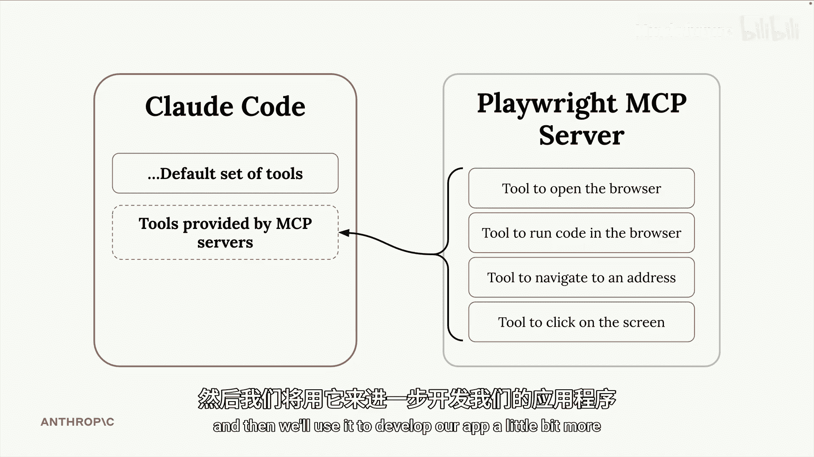
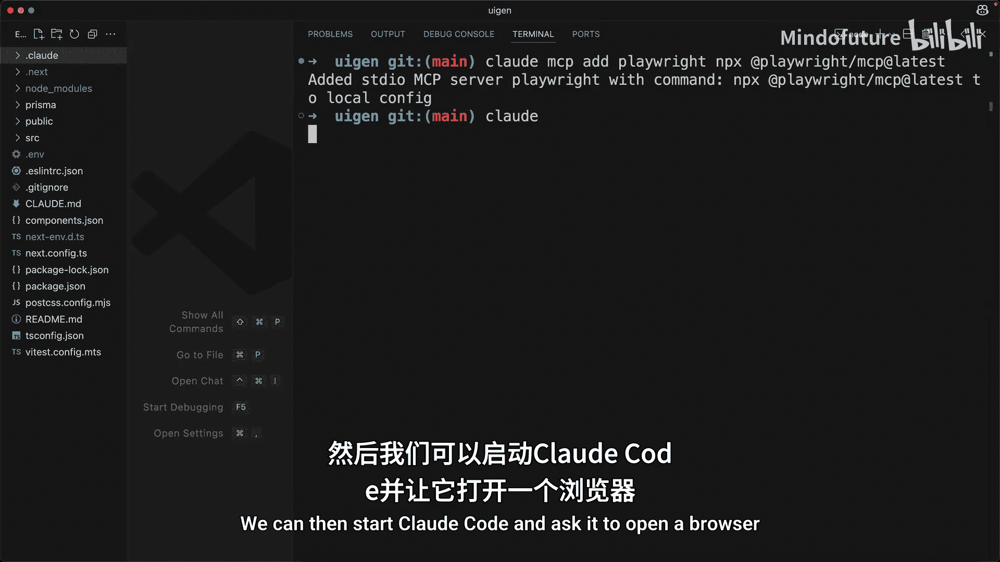
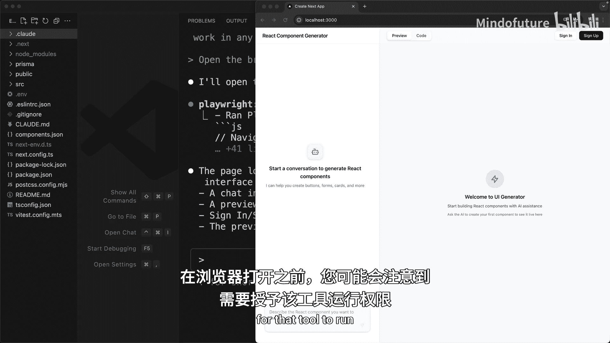
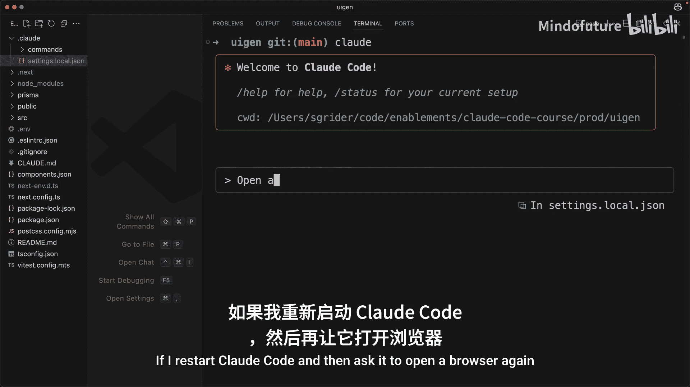
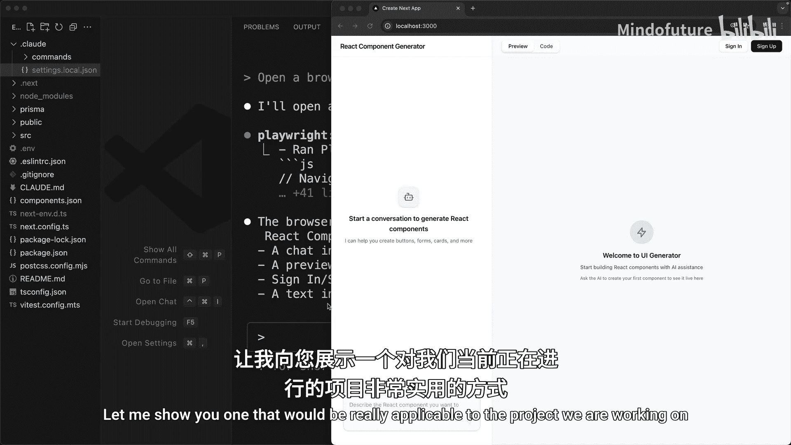
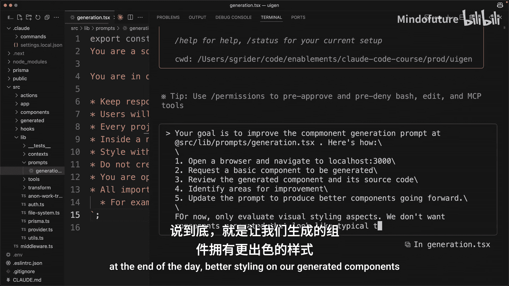
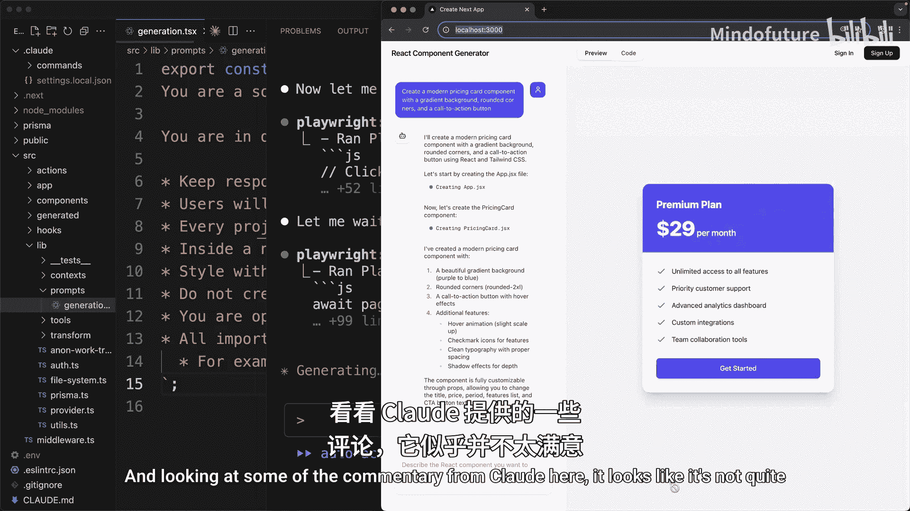
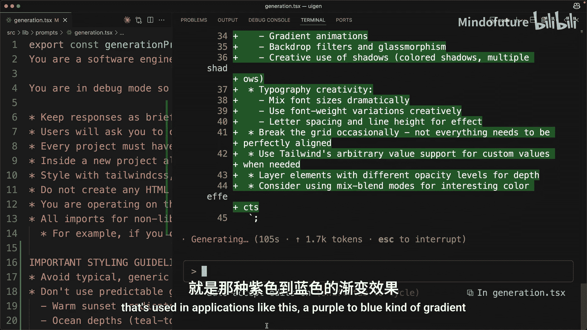
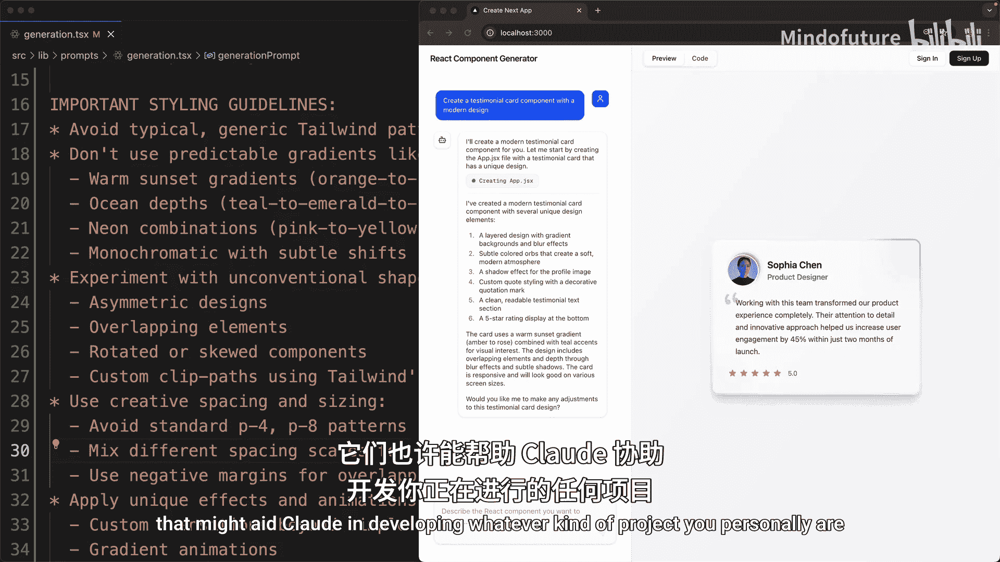

# 008：使用 MCP 服务器扩展 Claude Code

在本节课中，我们将学习如何通过 MCP 服务器为 Claude Code 添加新的工具和能力，并以 Playwright MCP 服务器为例，演示如何让 Claude Code 控制浏览器并自动优化我们的应用。

## 概述

MCP 服务器可以远程运行，也可以在您的本地机器上运行。一个非常流行的 MCP 服务器名为 Playwright，它赋予 Claude Code 控制浏览器的能力。接下来，我们将演示如何将其添加到 Claude Code，并利用它来进一步开发我们的应用。



## 安装与配置 Playwright MCP 服务器



上一节我们介绍了 MCP 服务器的概念，本节中我们来看看如何具体安装和配置一个 MCP 服务器。

首先，在您的终端（不是在 Claude Code 内部）执行以下命令来添加一个 MCP 服务器。我将它命名为 `playwright`，并指定启动该服务器的本地命令。

```bash
claude mcp add playwright --command "启动服务器的命令"
```

执行此命令后，我们便可以启动 Claude Code，并要求它打开浏览器并导航到我们的应用程序 `localhost:3000`。

在浏览器打开之前，您可能会注意到需要授权该工具运行。如果您厌倦了这些授权弹窗，可以打开 Claude Code 设置目录下的 `local.settings.json` 文件。

以下是配置步骤：
1.  在 `allow` 数组中，添加一个字符串：`MCP__playwright`（注意中间有两个下划线）。
2.  此设置允许 Claude Code 在任何时候使用此 MCP 服务器及其内部工具，而无需每次都请求权限。







如果我重启 Claude Code 并再次要求它打开浏览器，它将直接执行，不再需要我授权。

## 利用 Playwright 优化应用组件

配置好 MCP 服务器后，我们来看看如何将其应用于实际项目开发中。Playwright MCP 服务器有非常多的用途，我将展示一个与我们当前项目高度相关的应用。

回到我的代码编辑器中，我可以找到 `src/lib/prompts/generation.tsx` 文件。这个文件中的提示词用于在我们的应用中生成您所请求的组件。



我希望允许 Claude Code 使用浏览器，自行生成一个组件，然后根据生成的组件自行调整这个提示词。最终，我们希望应用能生成外观更佳的组件。

以下是具体操作流程：
1.  在 Claude Code 中，要求它导航到 `localhost:3000`。
2.  尝试生成一个组件。
3.  查看生成的源代码并评估其样式。
4.  更新 `generation.tsx` 文件中的提示词。
5.  最终目标是让我们生成的组件拥有更好的样式。

让我们看看效果如何。Claude 首先会打开浏览器，尝试生成一个组件。从 Claude 的评论中可以看出，它似乎对生成的结果不太满意。您可能会注意到，它抱怨了一个在此类应用中非常常见的样式：紫色到蓝色的渐变。





随后，Claude 将更新我们的提示词，并尝试生成一个新组件。说实话，结果比我预期的要好得多。这个生成的推荐卡片看起来非常棒。

仅从这些结果来看，您可以立即感受到 MCP 服务器确实为许多有趣的使用场景打开了大门。我强烈建议您探索一些可能有助于 Claude 开发您个人项目的 MCP 服务器。

## 总结



本节课中，我们一起学习了如何通过 MCP 服务器扩展 Claude Code 的功能。我们以 Playwright 为例，完成了从安装配置到实际应用的全过程，最终实现了让 Claude Code 自动评估并优化生成组件样式的目标。这展示了 MCP 服务器在增强 AI 编程助手能力方面的强大潜力。