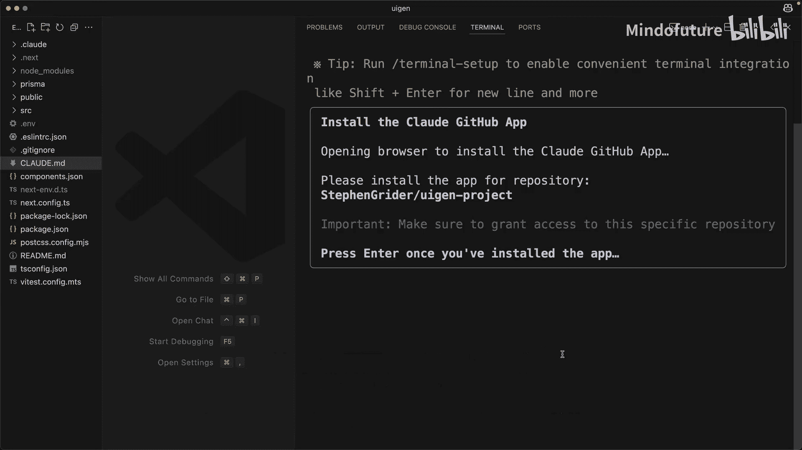
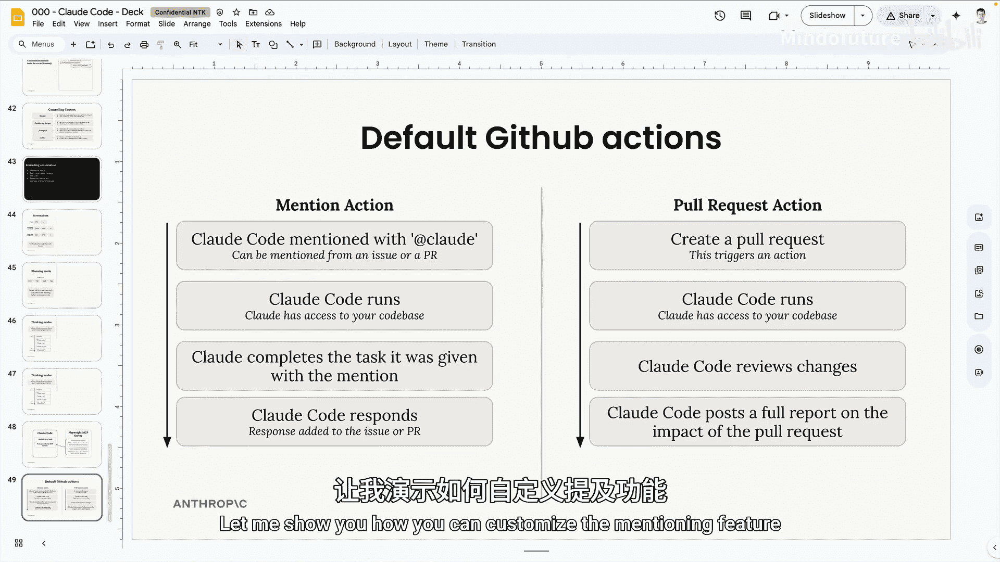
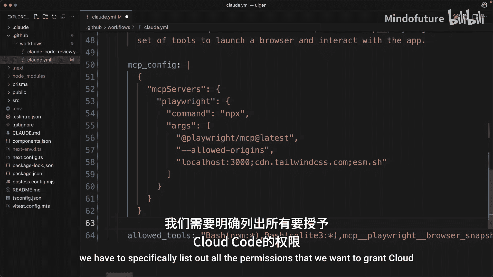
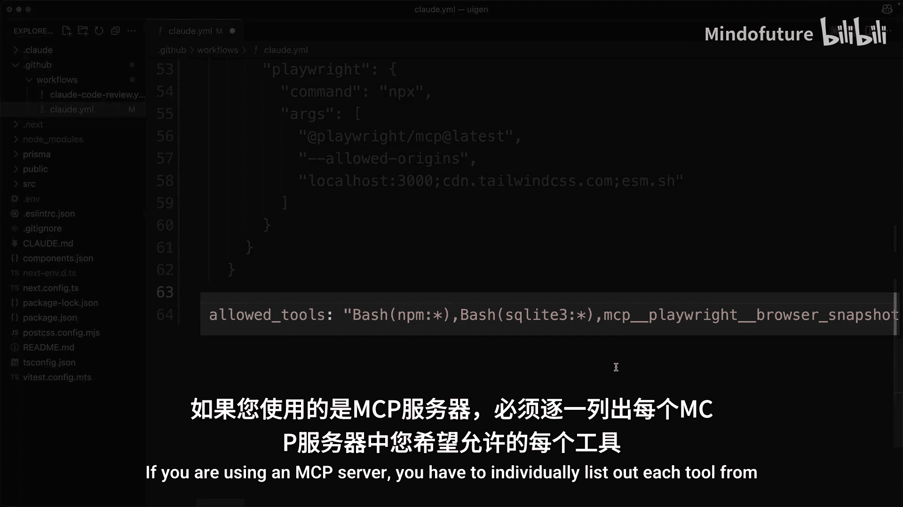
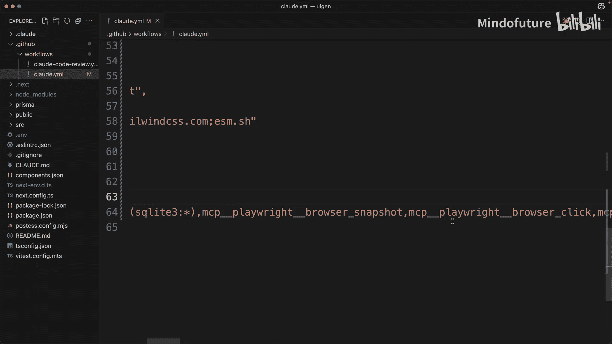
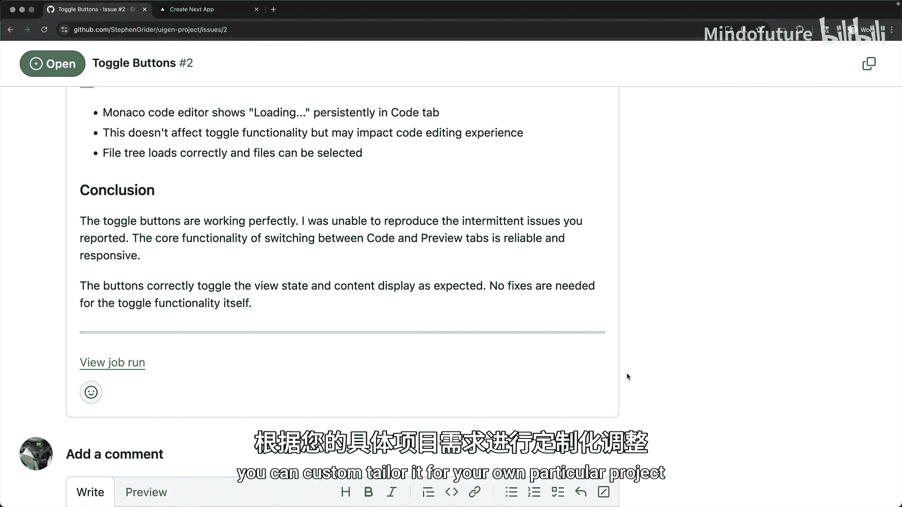

# 009：GitHub 集成 🚀

在本节课中，我们将学习如何为 Claude Code 设置官方的 GitHub 集成。此集成允许 Claude Code 在 GitHub Actions 工作流中运行，从而实现自动化的代码审查和任务处理。

## 概述

Claude Code 提供了一个官方的 GitHub 集成。通过此集成，Claude Code 可以在 GitHub Action 工作流中运行。这为自动化代码审查和响应特定事件（如在 Issue 或 Pull Request 中 @ 提及 Claude）提供了可能。

## 设置集成

上一节我们了解了集成的概念，本节中我们来看看如何具体设置。

你可以通过运行 **`/install Github app`** 命令来设置此集成。此过程将引导你完成几个步骤。

以下是设置步骤：
1.  你需要在 GitHub 上安装 Claude Code 应用。
2.  接下来，你需要添加一个 API 密钥。
3.  完成上述步骤后，一个 Pull Request 将被自动生成。

这个自动生成的 Pull Request 会添加两个不同的 GitHub Action 工作流配置文件。

## 集成的功能

现在我们已经完成了基本设置，让我们深入了解这两个自动添加的 Action 具体能做什么。

第一个 Action 添加了 @ 提及支持。这意味着在 Issue 或 Pull Request 中，你可以通过 **`@Claude`** 来提及 Claude，并给它分配一些任务去执行。

第二个 Action 添加了对 Pull Request 的审查支持。每当你创建一个 Pull Request 时，Claude Code 会自动运行并审查提议的代码变更。

这两个 Action 都可以进行自定义。你也可以基于其他类型的事件（如推送代码）来添加额外的 Action 以触发 Claude Code。

## 自定义 @ 提及功能

了解了基本功能后，本节我们将通过一个实例来学习如何自定义 @ 提及功能的工作流程。

首先，我们需要将 GitHub 上自动生成的那两个 Action 配置文件合并到我们的代码仓库中。然后，将这些变更拉取到本地机器。

接着，在新创建的 `.github/workflows` 目录下，你会看到这两个 Action 配置文件。一个用于支持 Pull Request 审查，另一个用于处理 @ 提及。

现在，我来演示如何自定义 @ 提及功能。当我在 Issue 或 Pull Request 中 @Claude 时，我希望它能够在 GitHub Action 环境中运行项目，并使用 Playwright MCP 服务器在浏览器中访问应用。

为了实现这个目标，我首先需要在这个工作流文件中，于 Claude Code 运行之前添加一个步骤。这个步骤将执行项目安装并启动开发服务器。

然后，我将更新 Claude Code 的配置。我会添加一些自定义指令，这些指令会直接传递给 Claude，允许我们提供额外的方向或上下文。在本例中，我会告诉 Claude 开发服务器已经启动，并且如果需要，可以使用 Playwright MCP 服务器在浏览器中访问应用。

接下来，我还需要添加一些配置来设置 Playwright MCP 服务器本身。

这里还有一个需要注意的事项。当你在 Action 中运行 Claude Code 时，必须明确列出你想要授予 Claude Code 的所有权限。这里有一个棘手的地方：如果你使用 MCP 服务器，你必须逐个列出你希望允许的、来自每个 MCP 服务器的每个工具。没有像我们之前看到的权限快捷方式。不幸的是，Playwright MCP 服务器有很多不同的工具，因此每个都需要被列出。

完成此配置更新后，务必提交并推送这些更改。

## 测试工作流

配置完成后，现在是时候测试这个更新后的工作流了。

我将在我们的实际应用中给 Claude 一个小任务。看这里的两个按钮，目前它们工作正常，我可以在预览面板和代码面板之间切换。

但我要假设它们没有按预期工作。我将用那个按钮截一张图。然后，我去创建一个 Issue，粘贴截图，并用 **`@Claude`** 提及它，要求它验证这两个按钮是否按预期工作。

创建 Issue 后，等待即可。Action 启动和 Claude 响应需要一两分钟。请记住，正如我们刚才看到的，在 Claude Code 开始运行之前，Action 会先完成整个应用的安装和启动。

😊 最终，Claude 会做出响应。它通常会创建一个步骤清单来完成给定任务。在本例中，它将尝试访问应用，手动测试按钮，并修复发现的任何问题。Claude 会注意到按钮实际上工作正常，因此它会提前终止，并附上记录其发现的信息。

## 总结

本节课中，我们一起学习了 Claude Code 官方 GitHub 集成的设置与使用方法。我们了解了如何通过简单的命令完成集成安装，探索了其核心的 @ 提及和 PR 审查功能，并通过一个实际案例学习了如何自定义工作流以满足特定需求，例如在 Action 中启动开发服务器并集成 MCP 工具。这只是使用 Claude Code GitHub 集成的一个小例子，建议你花时间思考如何根据你自己的项目需求进行定制。