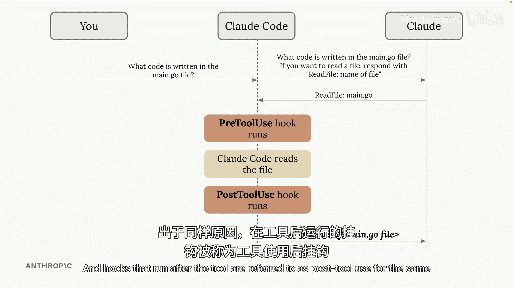
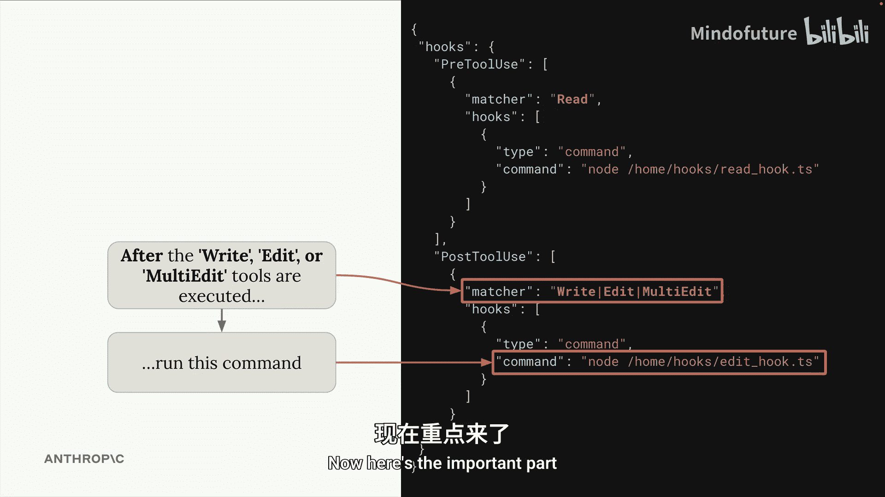
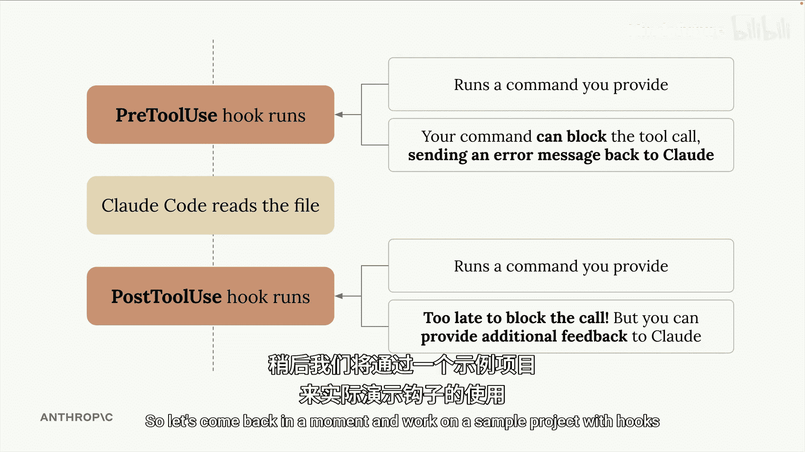

# 010：引入钩子 (Hooks) 🪝

在本节课中，我们将要学习 Claude-Code 中一个强大的功能：钩子 (Hooks)。钩子允许你在 Claude 尝试运行一个工具之前或之后执行自定义命令，从而实现非常有趣且实用的功能。

## 钩子是什么？

上一节我们介绍了 Claude-Code 的基本工具调用流程。本节中我们来看看如何通过钩子来干预和扩展这个流程。

当你在 Claude-Code 中提出请求时，你的查询会连同一些工具定义一起发送给云端模型。Claude 模型随后可能决定通过提供一个精心格式化的响应来运行一个工具。此时，就由 Claude-Code 来运行所请求的工具，例如读取一个文件，然后返回该工具调用的结果。

钩子赋予我们在工具执行**之前**或**之后**立即执行代码的能力。在工具之前运行的钩子被称为 **预工具使用钩子**，因为它们运行在工具之前。在工具之后运行的钩子则被称为 **后工具使用钩子**。

## 钩子的应用场景

以下是钩子可以实现的一些具体功能示例：
*   在 Claude 决定写入一个文件后，你可以自动在创建的文件上运行代码格式化工具。
*   在文件被编辑后，你可以运行测试。
*   你可以阻止 Claude 读取特定的文件。

可能性是无穷的，我们稍后会展示几个很好的例子，为你提供如何在特定项目中使用钩子的思路。

## 如何配置钩子

要定义钩子，我们需要在 Claude 的设置文件中添加配置。请记住，有几种不同的设置文件：一个用于你机器上所有项目的全局设置，一个用于你的特定项目并与其它工程师共享，还有一个仅用于你在特定项目上的个人设置。



你可以通过两种方式添加钩子：手动在此文件中编写，或者在 Claude-Code 内部使用内置的 `/hooks` 命令。

配置本身看起来像你在此屏幕右侧看到的内容。让我带你浏览这个示例文件，以便你更好地理解发生了什么。


## 配置文件解析

首先，请注意文件中有两个不同的部分。一个部分列出了所有应在工具使用**之前**执行的命令，即**预工具使用钩子**。另一个部分列出了所有应在工具使用**之后**执行的不同命令，即**后工具使用钩子**。

在每个部分中，我们提供一个**匹配器 (matcher)**。这指明了我们正在寻找哪种工具使用类型。例如，在预工具使用部分，配置可能如下：

```json
{
  "preToolUse": [
    {
      "match": "Read",
      "command": "echo '即将读取文件'"
    }
  ]
}
```

在这个例子中，每当 Claude-Code 尝试读取一个文件时，我都希望运行那里列出的命令。

同样，在后工具使用部分，配置可能如下：

```json
{
  "postToolUse": [
    {
      "match": ["Write", "Edit", "MultiEdit"],
      "command": "./format_file.sh"
    }
  ]
}
```

在 `Write`、`Edit` 或 `MultiEdit` 工具的使用之后，有一个我想运行的不同命令。

## 钩子的核心机制

这是重要的部分，也是钩子真正设计用来做的事情。你看到的那些命令将被提供关于 Claude 想要运行的工具调用的详细信息。

对于**预工具使用钩子**，你可以检查 Claude 想要做什么。如果出于任何原因你不想允许它，你可以**阻止**工具使用操作，并向 Claude 发送一条错误消息。

对于**后工具使用钩子**，工具调用已经发生，因此阻止它为时已晚。但是，你可以基于该工具调用执行一些后续操作，比如格式化刚刚编辑的文件。你也可以向 Claude 提供关于该工具使用的消息。

例如，你可能会决定运行一个单独的程序来检查编辑的代码质量，或者进行类型检查，然后将该反馈提供给 Claude。Claude 随后可能会根据该反馈对其刚刚写入的文件进行更新。



## 实践准备

如果仍然对钩子是什么或其设计目的感到困惑，这完全没关系。理解钩子可能真的很有挑战性。

所以，让我们稍后回来，在一个示例项目中实践钩子的使用。




---


本节课中我们一起学习了 Claude-Code 中钩子的基本概念。我们了解了钩子是什么，它们如何在工具调用前后运行，以及如何通过配置文件来定义它们。我们还探讨了钩子的一些潜在应用场景，例如自动代码格式化、运行测试或实施访问控制。在接下来的实践中，我们将通过具体示例来加深理解。