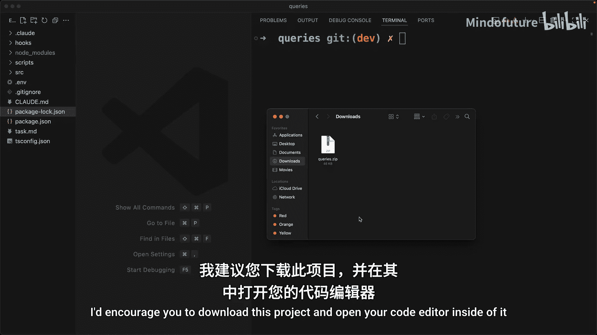
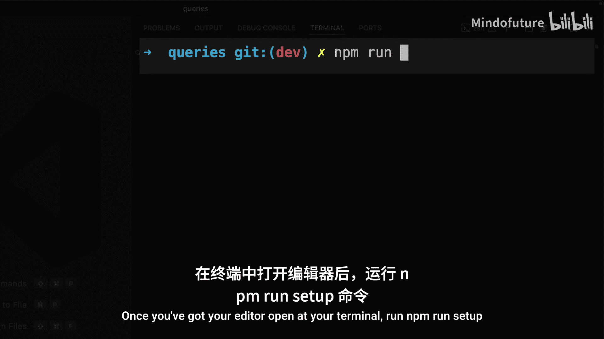
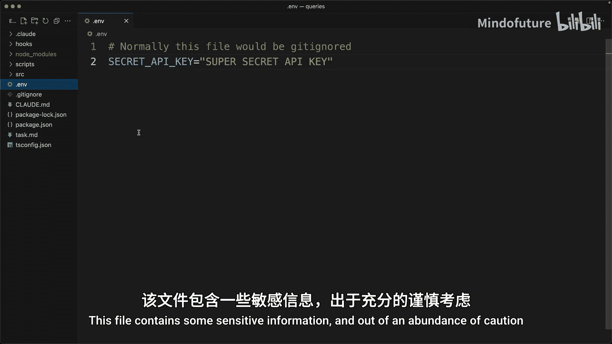
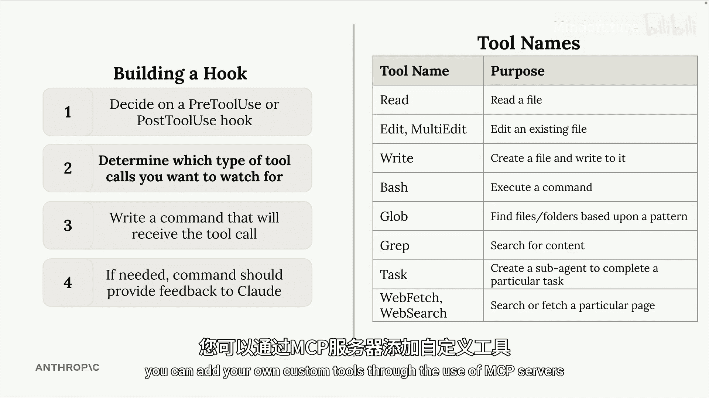
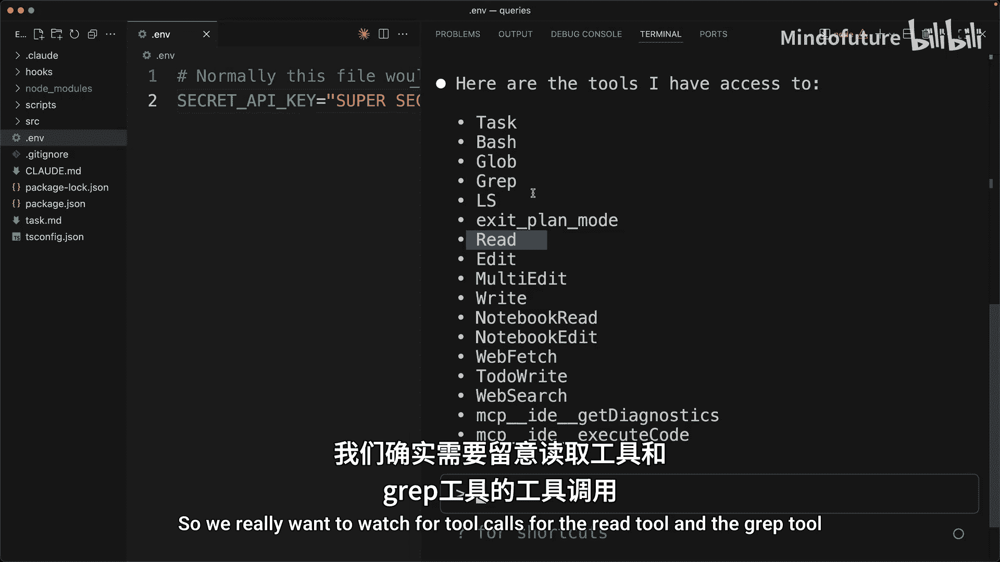
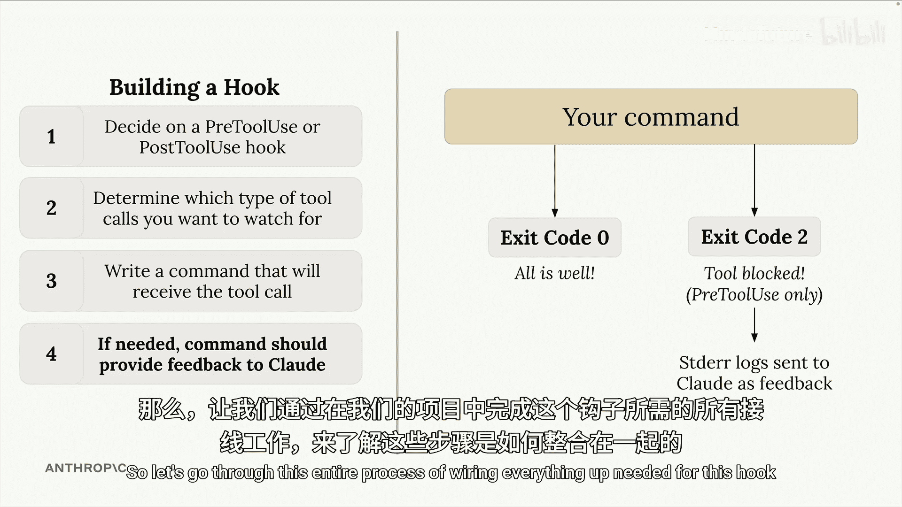

# 011：定义钩子

在本节课中，我们将学习如何为 Claude Code 创建自定义钩子（hooks）。钩子是一种强大的机制，允许你在 Claude 执行特定操作（如读取文件）之前或之后运行自定义代码。我们将通过一个实际项目，创建一个用于阻止 Claude 读取敏感文件的钩子。

上一节我们介绍了钩子的基本概念，本节中我们来看看如何一步步构建一个实际的钩子。

## 项目准备

为了更好地理解钩子的工作原理，我们将查看一个新的示例项目。

请将本讲座附件 `queries_do.zip` 下载并解压。建议你下载此项目，并在你的代码编辑器中打开它。

打开编辑器后，在终端中运行以下命令：
```bash
npm run setup
```
此命令将安装一些依赖项，并为使用钩子做好准备。

为了更深入地理解钩子，我们将在该项目中创建自己的钩子。







## 钩子目标

我们的钩子目标是：项目根目录下有一个名为 `.env` 的文件，该文件包含一些敏感信息。出于谨慎考虑，我们希望完全阻止 Claude 直接读取此文件。

让我们通过几张图来帮助你理解如何构建这个钩子。

## 第一步：选择钩子类型

第一步是决定我们需要一个 `pretooluse`（工具使用前）钩子还是一个 `posttooluse`（工具使用后）钩子。


在这个场景中，我们希望阻止 Claude 读取特定文件。如果我们使用 `posttooluse` 钩子，那么钩子或命令将在 Claude 已经读取文件之后执行。因此，在这种情况下，我们肯定需要一个 `pretooluse` 钩子，以确保我们能够阻止读取操作的发生。



## 第二步：确定要监视的工具调用

接下来，我们需要确定要监视哪些类型的工具调用。

图表右侧列出了所有当前可用的工具名称。记住 Claude Code 中包含的所有不同工具名称可能非常具有挑战性，特别是因为你可以通过 MCP 服务器添加自己的自定义工具。

这里有一个小技巧可以帮你。如果我回到 Claude Code 界面，可以直接要求 Claude 列出它当前有权访问的所有不同工具名称的要点列表。



在所有这些不同的工具中，有两个工具可以非常容易地读取文件内容。第一个是 `read` 工具。另一个容易被忽略，但同样可以读取文件内容的是 `grep` 工具。`grep` 可以搜索文件内容。

因此，我们确实需要监视 `read` 工具和 `grep` 工具的调用。


## 第三步：编写接收工具调用信息的命令

接下来，我们需要编写一个命令，该命令将接收有关 Claude 想要进行的工具调用的一些信息。

以下是这部分的工作原理。我们将编写一个命令，Claude 会自动执行它。然后，Claude 会将一些工具调用数据以 JSON 格式通过标准输入（stdin）传递给该进程。

图表右上角有一个工具调用数据的示例。它将是一个大的 JSON 对象，包含有关工具名称和该工具输入的信息。在本例中，工具名称是 `read`。这意味着 Claude 正试图调用 `read` 工具，并且它可能正试图读取指向那个 `.env` 文件的特定文件路径。重申一下，这就是我们想要阻止读取操作的文件。

因此，在我们的程序或命令内部，需要通过标准输入接收此信息，解析该 JSON，然后读取工具名称、工具输入参数等，并决定我们想要如何处理这个工具调用。

## 第四步：通过退出码提供反馈

进入第四步。在我们的命令接收到提议的工具调用数据后，我们将退出。我们的退出码将向 Claude Code 提供一个信号。

退出码 `0` 表示一切正常，我们希望允许此工具调用发生。

然而，退出码 `2` 是向 Claude Code 发出的信号，表示我们希望阻止此工具调用。这仅适用于 `pretooluse` 钩子。因为请记住，只有在 `pretooluse` 钩子中，我们才能实际阻止工具调用。

如果我们以代码 `2` 退出，那么在此期间我们在命令内生成的任何标准错误日志也将作为反馈发送给 Claude。这样，我们既可以拒绝工具调用，同时也可以给 Claude 一个理由。

## 总结与后续

以上就是整个过程。我知道这里涉及很多内容，所以让我们通过实际项目来演练连接此钩子所需的所有步骤，以理解所有这些步骤是如何结合在一起的。




本节课中我们一起学习了如何为 Claude Code 定义钩子。我们了解了钩子的两种类型（`pretooluse` 和 `posttooluse`），确定了需要监视的工具调用（`read` 和 `grep`），并理解了钩子命令如何通过标准输入接收 JSON 数据以及如何通过退出码（0 允许，2 阻止）向 Claude Code 提供反馈。下一节，我们将动手实现这个保护敏感文件的钩子。