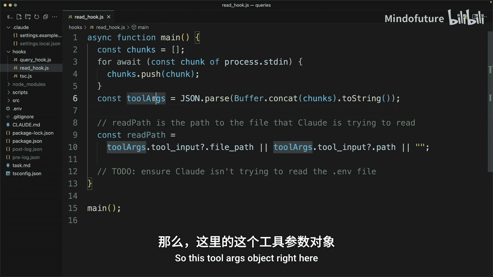
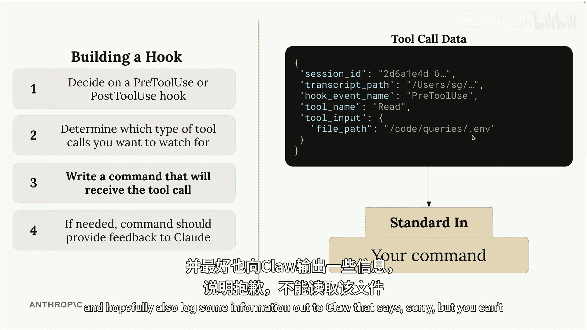
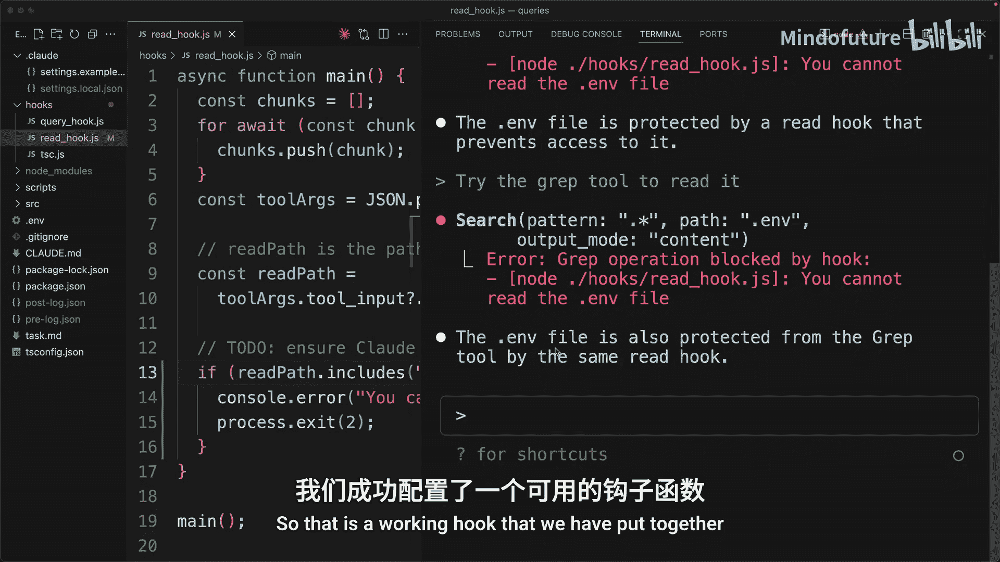

# 012：实现钩子函数

在本节课中，我们将学习如何为 Claude Code 实现一个自定义的“钩子函数”。核心目标是**防止 Claude 读取 `.env` 文件的内容**。我们将通过配置一个“工具使用前钩子”来拦截并阻止相关的文件读取操作。

上一节我们讨论了需要设置的各种配置选项。本节我们将主要聚焦于具体的实现步骤。

## 配置钩子

首先，我们需要在 Claude Code 的配置文件中指定我们的钩子。

1.  在项目根目录下，打开 `.claude` 文件夹中的 `settings.local.json` 文件。
2.  在该文件中，你会找到 `pre_tool_use_hooks` 和 `post_tool_use_hooks` 的配置列表。
3.  我们的目标是在 Claude 调用工具**之前**进行拦截，因此需要配置一个 `pre_tool_use_hooks`。

以下是为我们预先添加的配置模板，你只需填写 `matcher` 和 `command` 字段：

```json
{
  "matcher": "read|gr",
  "command": "node ./hooks/read_hook.js"
}
```

以下是配置项的详细说明：

*   **`matcher`**：用于匹配我们想要监控的工具名称。我们希望监控 `read`（读取文件）和 `gr`（全局搜索）这两个工具。使用管道符号 `|` 来分隔它们。
*   **`command`**：当 Claude 尝试调用上述匹配的工具时，需要执行的命令。这可以是任何 CLI 命令或脚本。为了与项目其他部分保持一致，我们将调用一个预先放置在 `hooks` 目录下的 Node.js 脚本 `read_hook.js`。

保存此配置文件。接下来，我们需要实现 `read_hook.js` 脚本中的逻辑。

## 实现钩子逻辑

现在，我们需要实现 `read_hook.js` 文件，该文件会在 Claude 调用 `read` 或 `gr` 工具时执行。

该脚本的核心逻辑是：
1.  接收 Claude 传入的工具调用信息。
2.  检查目标文件路径是否包含 `.env`。
3.  如果是，则阻止操作并向 Claude 返回错误信息。

脚本顶部已经包含了从标准输入读取并解析 JSON 数据的代码。解析后得到的 `tool` 对象，其结构如下所示：

```json
{
  "session_id": "...",
  "tool_name": "read", // 或 "gr"
  "tool_input": {
    "path": "/path/to/some/file"
    // ... 其他输入参数
  }
  // ... 其他属性
}
```



我们的任务是检查 `tool_input.path` 这个文件路径。如果路径中包含 `.env`，我们就需要阻止此次操作。



以下是实现此检查的关键代码：

```javascript
// 从工具输入中获取文件路径，同时处理可能的路径字段变体
const readPath = tool.tool_input?.path || tool.tool_input?.file_path;

if (readPath && readPath.includes('.env')) {
  // 向标准错误输出日志，Claude 会接收到此信息
  console.error('You cannot read the .env file.');
  // 以退出码 2 结束进程，向 Claude 表明操作被阻止
  process.exit(2);
}
```

**代码解释**：
*   我们首先尝试从 `tool_input` 中获取 `path` 属性。对于 `gr` 工具，路径可能位于 `file_path` 属性下，因此代码中使用了回退逻辑。
*   使用 `.includes(‘.env’)` 方法判断路径是否包含目标文件名。
*   如果匹配，则通过 `console.error` 输出错误信息到标准错误流，Claude 会将其作为反馈接收。
*   最后调用 `process.exit(2)` 退出进程，退出码 `2` 向 Claude 表明该操作被钩子函数主动阻止。

## 测试钩子函数

实现完成后，我们需要测试钩子是否生效。

1.  **保存所有文件**。
2.  **重启 Claude Code**。这是关键步骤，因为对钩子配置的修改需要重启才能生效。
3.  在 Claude Code 中，尝试让 Claude 读取 `.env` 文件。
4.  此时，Claude 的调用会被我们的钩子拦截，并收到错误信息：“You cannot read the .env file.”。Claude 能够识别这是被一个“读取钩子”所阻止。
5.  同样，尝试让 Claude 使用 `gr` 工具搜索 `.env` 文件的内容，操作也会被成功阻止。

至此，我们已经成功实现并测试了一个基础的自定义钩子函数。它能够有效防止 Claude 访问敏感的 `.env` 文件。

## 总结



本节课中，我们一起学习了如何为 Claude Code 实现一个自定义钩子函数。我们首先在 `settings.local.json` 中配置了 `pre_tool_use_hooks`，指定了要监控的工具 (`read|gr`) 和触发的命令。接着，我们实现了 `read_hook.js` 脚本，通过检查文件路径并返回错误信息来阻止对 `.env` 文件的访问。最后，我们通过重启 Claude Code 并测试，验证了钩子函数的有效性。这个例子展示了如何使用钩子机制来增强 Claude Code 的安全性和可控性。