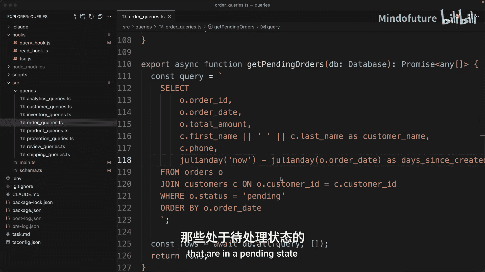
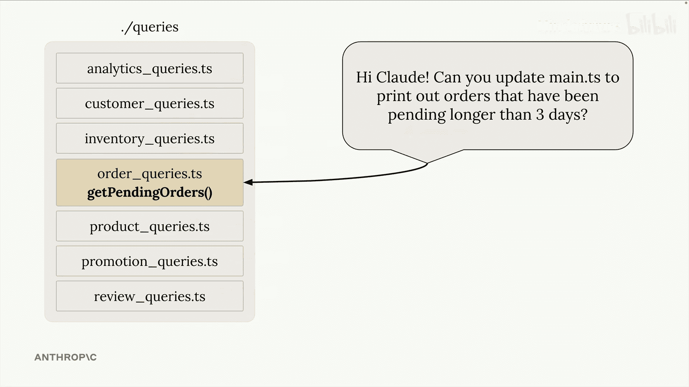
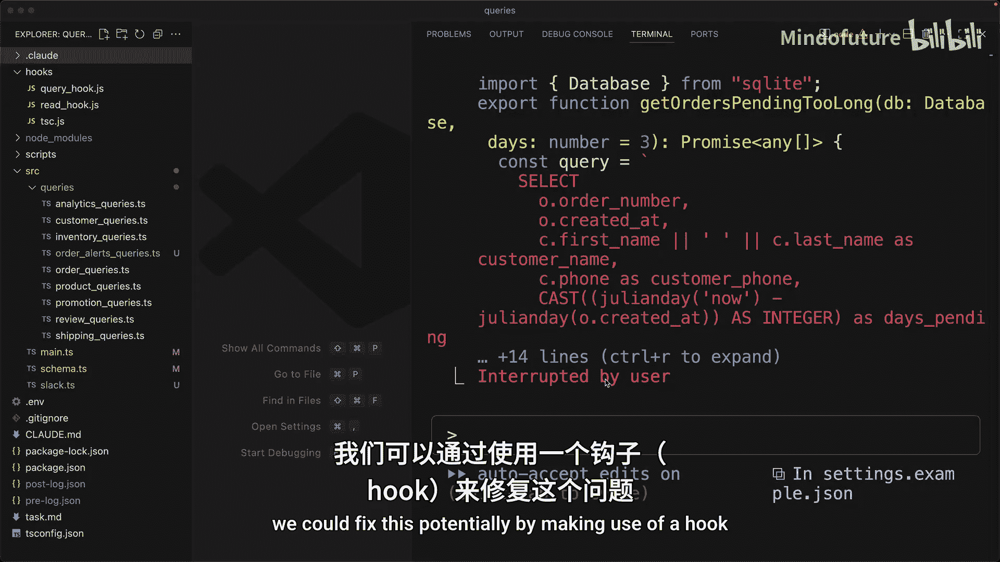
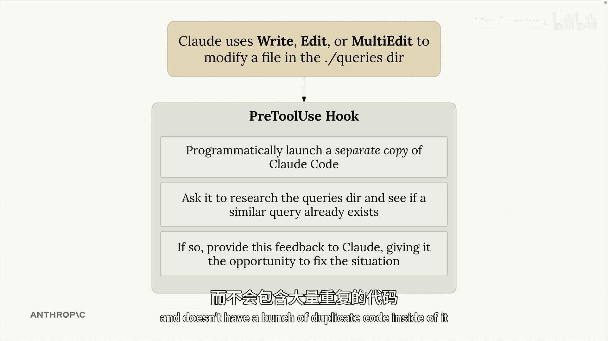
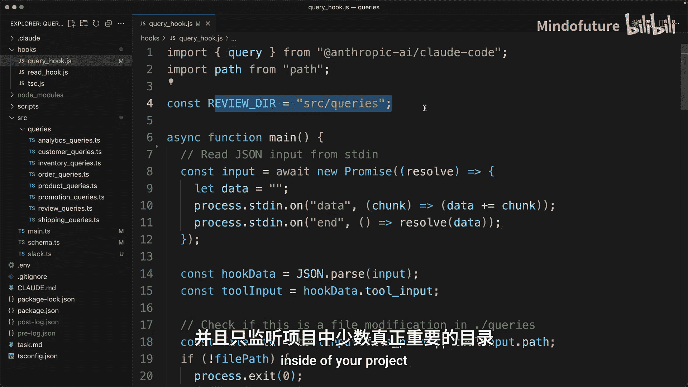

# 013：实用钩子

在本节课中，我们将学习如何创建和使用“钩子”来增强 Claude Code 的能力，解决它在大型项目中可能遇到的两个常见问题：类型错误传播和代码重复。

## 概述

Claude Code 是一个强大的编码助手，但在处理复杂项目时，它有时会忽略一些重要的上下文。本节课将介绍两种实用的钩子：一种用于在编辑 TypeScript 文件后自动运行类型检查并反馈错误；另一种用于在特定目录（如查询目录）中检测并防止代码重复。通过实现这些钩子，我们可以引导 Claude Code 做出更符合项目整体结构的决策。

---

## 类型检查钩子 🛠️

上一节我们概述了本节课的目标，本节中我们来看看第一个具体问题：Claude Code 在修改函数定义后，可能不会自动更新所有调用该函数的地方，从而导致类型错误。

### 问题演示

假设我们有一个 TypeScript 项目。在 `schema.ts` 文件中，定义了一个函数：
```typescript
function createSchema() {
  // 函数逻辑
}
```
该函数在 `main.ts` 中被调用。现在，如果我们修改 `schema.ts` 中的函数，要求增加一个 `verbose` 布尔参数：
```typescript
function createSchema(verbose: boolean) {
  // 函数逻辑
}
```
Claude Code 可以轻松完成这个修改。但问题是，它**不会**自动去查找并更新项目中所有调用 `createSchema` 的地方。因此，`main.ts` 中的调用会因为缺少参数而立即产生类型错误。

### 解决方案思路

这个问题的核心是 Claude Code 缺乏项目级的类型感知。我们的解决思路是：每当编辑 TypeScript 文件后，自动运行 TypeScript 编译器进行类型检查。如果发现错误，就将这些错误信息反馈给 Claude Code，提示它去修复。

具体步骤如下：
1.  监听文件编辑操作。
2.  编辑完成后，在后台执行命令 `tsc --noEmit` 进行类型检查。
3.  捕获检查结果中的错误。
4.  通过 `postToolUse` 钩子将错误信息发送回 Claude Code。
5.  Claude Code 接收到错误反馈后，尝试定位并修复问题。

### 钩子运行效果

启用这个钩子后，当再次要求 Claude Code 为 `createSchema` 函数添加 `verbose` 参数时，过程如下：
1.  Claude Code 修改 `schema.ts` 文件。
2.  钩子触发，运行 `tsc --noEmit`。
3.  类型检查器发现 `main.ts` 中存在调用错误。
4.  钩子将此错误信息反馈给 Claude Code。
5.  Claude Code 识别到错误，随后自动导航到 `main.ts` 文件，为函数调用添加上缺失的 `verbose` 参数。



**核心概念**：这个钩子不仅适用于 TypeScript，其思想可以推广到任何有类型检查器的语言，甚至可以通过运行测试套件来确保编辑没有破坏现有功能。

---



## 防止代码重复钩子 🔍

解决了类型同步问题后，我们来看一个在大型项目中更棘手的挑战：代码重复。特别是在具有清晰模块结构的项目中，我们希望复用现有代码，而不是创建功能相似的新代码。

### 场景设定

假设项目有一个 `src/queries/` 目录，专门存放所有数据库查询函数。其中，`orderQueries.ts` 文件里已经有一个函数 `getPendingOrders`，用于查找状态为“待处理”的订单。

### 问题演示

当我们给 Claude Code 一个明确且聚焦的任务时，例如“在 main.ts 中打印所有待处理订单”，它能很好地工作：它会查看 `queries` 目录，发现现有的 `getPendingOrders` 函数并直接使用。

然而，如果将同样的需求包装在一个更复杂的任务中，情况就不同了。例如，给出任务：“编写一个 Slack 集成，每天向特定频道发送所有等待时间超过三天的待处理订单列表”。在这个更复杂的上下文中，Claude Code 可能会“失去焦点”，它可能：
1.  在 `queries` 目录下创建一个全新的文件（如 `orderAlertsQueries.ts`）。
2.  在新文件中编写一个与 `getPendingOrders` 功能高度重叠的新查询函数（如 `getOrdersPendingTooLong`）。
3.  这导致了代码重复，增加了维护成本。

### 解决方案：查询目录审查钩子

为了解决这个问题，我们可以创建一个专门的钩子来监控对 `src/queries/` 目录的更改。



以下是该钩子的工作流程：
1.  **触发条件**：每当 Claude Code 试图在 `queries` 目录中创建、编辑文件或使用多编辑工具时，钩子被触发。
2.  **启动审查**：钩子会**程序化地启动一个全新的、独立的 Claude Code 实例**。
3.  **执行分析**：我们向这个新实例提供一个精心设计的提示词，要求它：
    *   分析刚刚做出的更改。
    *   审查 `queries` 目录中现有的所有代码。
    *   判断新增的查询是否与现有查询在功能上重复。
4.  **提供反馈**：如果独立 Claude Code 实例认为存在重复，它会生成一份报告，指出可以复用的现有函数。
5.  **主实例响应**：钩子将此报告通过 `postToolUse` 反馈给最初与我们交互的主 Claude Code 实例。主实例接收到建议后，通常会采纳，并修改其计划——例如，删除新建的重复文件，转而去修改现有的 `getPendingOrders` 函数以满足新需求。



**核心代码逻辑（伪代码）**：
```javascript
if (change.isInDirectory(‘src/queries’)) {
  const reviewPrompt = `请分析更改...并检查重复。`;
  const claudeResponse = await launchClaudeCodeProgrammatically(reviewPrompt);
  if (claudeResponse.suggestsDuplicate) {
    // 通过特定退出码将反馈传回主Claude进程
    process.exit(2);
  }
}
```

### 权衡与建议

这个钩子带来了明显的益处：显著减少了核心目录中的代码重复，保持了代码库的整洁。然而，它也有代价：
*   **性能开销**：每次监控目录的编辑都会启动一个新的 Claude Code 实例进行分析，增加了时间和计算成本。
*   **复杂性**：实现和调试此类钩子需要更多精力。

因此，建议采取折中策略：**不要在所有目录上都启用此类钩子**，而是只将其应用于最关键、最需要保持纯净的少数目录（如 `src/queries/`, `src/utils/`），以最小化额外开销。

---

## 总结

本节课我们一起学习了两种增强 Claude Code 的实用钩子。

1.  **类型检查钩子**：通过在编辑后自动运行类型检查器（如 `tsc`），并将错误反馈给 Claude，我们解决了跨文件类型更新不同步的问题，确保了代码的类型安全。
2.  **防止重复钩子**：通过程序化启动独立 Claude 实例对特定目录（如查询目录）的更改进行审查，我们能够有效防止功能重复代码的产生，鼓励代码复用，提升了大型项目代码库的可维护性。



这两种钩子体现了“引导式AI协作”的思想：我们不是完全依赖AI，而是通过设计巧妙的自动化流程，为AI提供必要的上下文和即时反馈，从而将其引导至更优的工作路径上。你可以根据自己项目的具体需求，借鉴这些思路来设计和实现自定义的钩子。