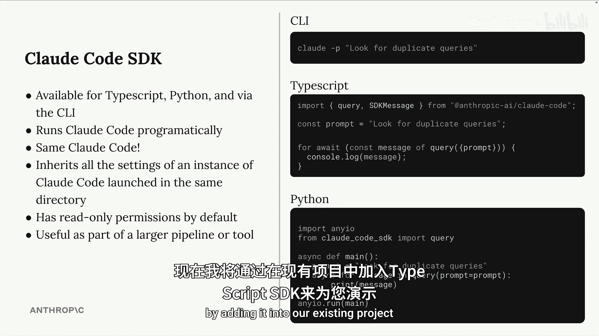
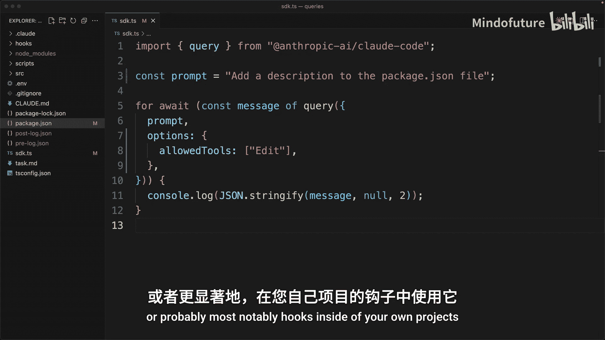

# 014：Claude Code SDK 实战

在本节课中，我们将学习如何使用 Claude Code SDK，以编程方式调用 Claude 的强大功能，并将其集成到你的工作流和工具链中。

## 概述

上一节我们介绍了查询审查钩子，并初步接触了 Claude Code SDK。本节中，我们将深入了解这个 SDK 的具体用法和配置。

Claude Code SDK 允许你以编程方式使用 Claude Code。你可以通过 TypeScript 库或 Python 库来使用它。这个 SDK 与你已经在终端中使用的 Claude Code 完全相同，拥有所有相同的工具，我们可以利用它们来完成给定的任务。

## SDK 的核心用途

SDK 作为大型管道或工具的一部分最为有用，正如我们之前在钩子中看到的那样。你可以轻松地将 Claude Code 作为大型流程的一部分，为某些特定工作流注入大量智能。

现在，我想通过将其添加到我们现有项目中的方式，为你快速演示 TypeScript SDK 的用法。

## 实战演示：在项目中集成 SDK

回到我的编辑器，我将在根项目目录中找到 `sdk.ts` 文件。在这里，我准备了一些代码来帮助我们开始使用 SDK。

我将更新顶部的提示词，要求 Claude 在 `src/queries` 目录中查找重复的查询。然后，我将保存这个文件并运行它。我会打开终端并执行 `npm run sdk`。

这不是一个内置命令，它只是在后台将这个文件作为一个普通的 TypeScript 文件执行。我为我们准备了这个快捷方式，以便更轻松地运行 TypeScript 文件。

当我们运行它时，我们将看到本地 Claude Code 副本与 Claude 语言模型之间逐条消息的原始对话。最终，我们会返回到命令行。打印出的最后一条消息将包含来自 Claude 的最终响应。

## 关于 SDK 权限的重要说明

SDK 有一个需要注意的地方：默认情况下，它只拥有读取权限。换句话说，它只能读取文件、目录，执行 grep 操作等。它不具备写入、编辑或创建文件等能力。

以下是授予写入权限的两种方法：

*   你可以手动在查询调用中添加写入权限。
*   或者，你也可以在 `.claude` 目录下的设置文件中添加一些权限设置。

让我演示一下如何允许 SDK 在此项目中使用编辑工具。

我将找到此处的提示词参数，紧随其后，我将添加 `options`，放入一个对象。`tools` 将是一个数组，我会放入 `edit`。

然后，我将更新顶部的提示词，要求它为 `package.json` 文件添加一个描述。

现在，我将保存并再次运行 `npm run sdk`。完成后，我可以打开 `package.json` 文件，我将看到它确实添加了描述，所以现在它肯定具备了编辑文件的能力。

## 总结

本节课中，我们一起学习了 Claude Code SDK 的集成与使用方法。正如前面提到的，Claude Code SDK 作为其他工具的一部分最为有用。因此，我鼓励你思考在自己的项目中，如何在辅助命令、脚本，或者最显著的是在钩子中使用它的机会。