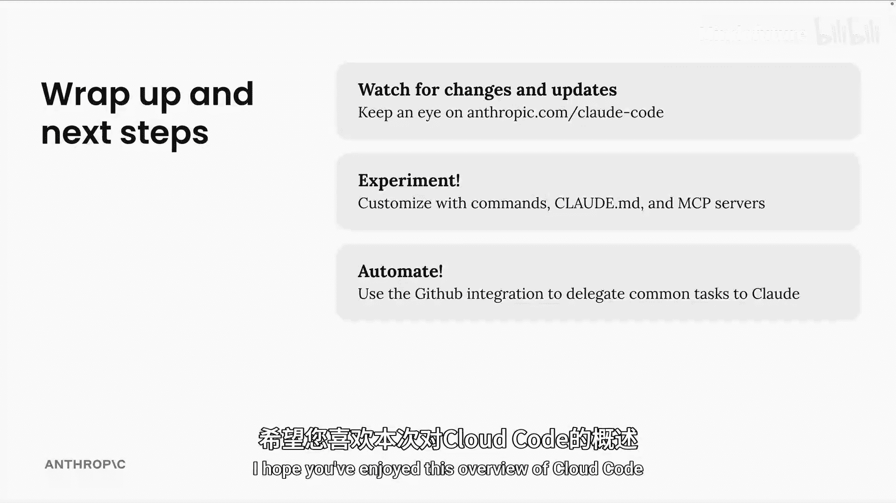
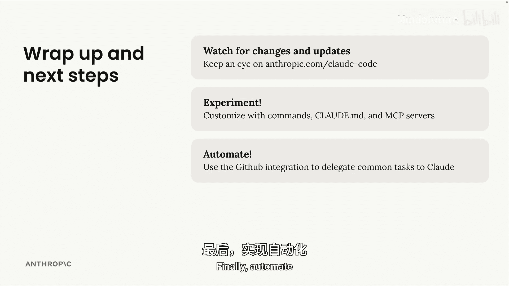
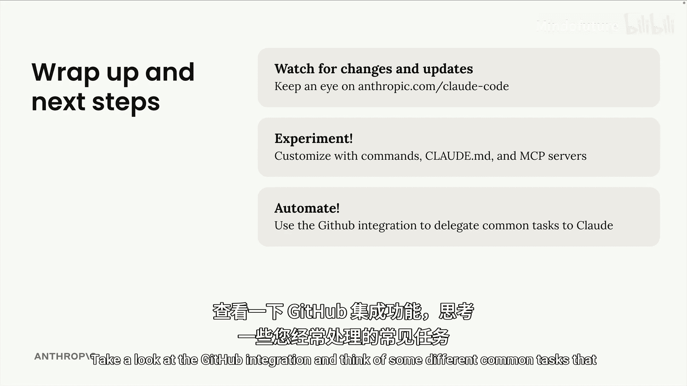
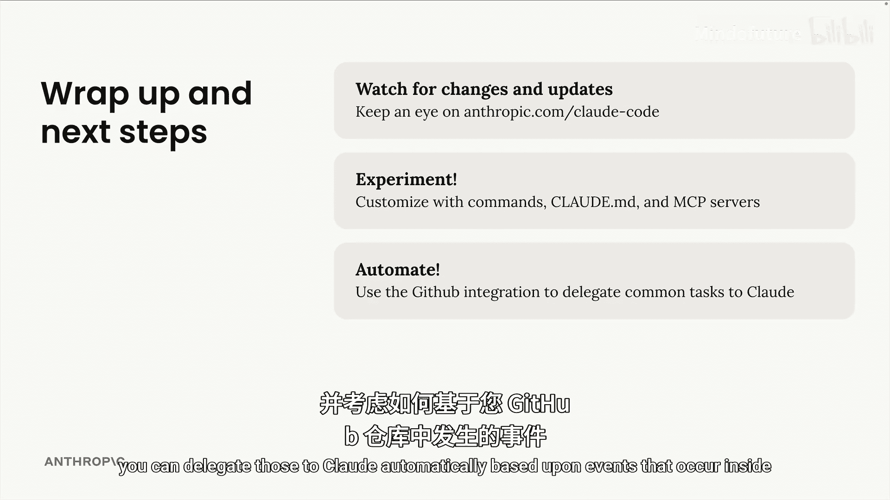
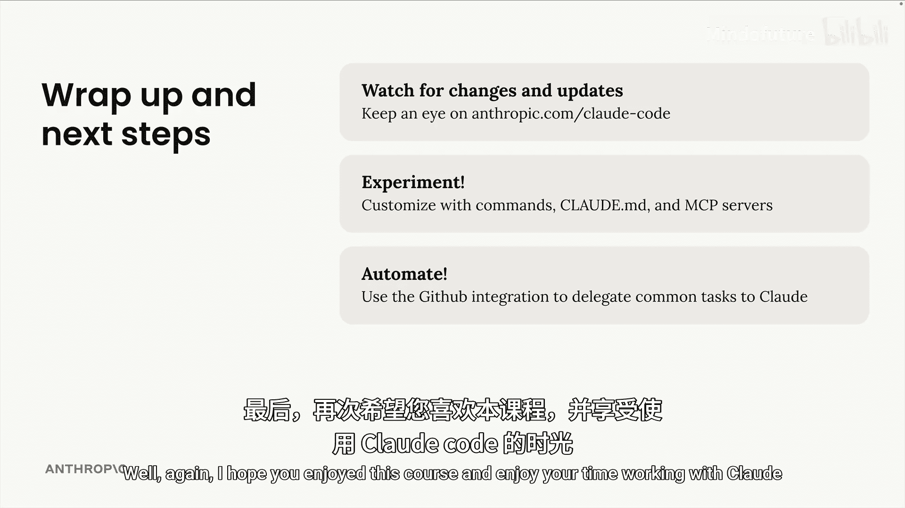

# 015：总结与后续步骤 🚀

在本节课中，我们将对之前学习的内容进行总结，并为你提供一些实用的后续学习建议和行动方向。

## 课程总结

上一节我们深入探讨了 Claude Code 的各种高级功能。现在，让我们对整个课程进行回顾，并规划未来的学习路径。

首先，请记住 Claude Code 正处于**持续变化和积极开发**的阶段。你需要密切关注其官方主页，以获取最新的功能和技术更新。官方主页地址已在课程中提供。

## 后续步骤建议

以下是三个帮助你继续深入学习和应用 Claude Code 的核心建议。

### 1. 保持关注与学习
*   **关注官方动态**：定期查看 Claude Code 的官方主页，留意新发布的特性和技术。
*   **跟踪开发进展**：了解工具的最新变化，确保你的使用方法与最佳实践同步。

### 2. 积极实验与定制
*   **尝试自定义命令**：根据你的具体工作流程，编写一些自定义命令来提高效率。
*   **配置 `claude_desktop_config.md` 文件**：在配置文件中添加额外的指令，以更精细地控制 Claude Code 的行为。
*   **探索更多 MCP 服务器**：除了本课程介绍的之外，尝试使用其他模型上下文协议服务器，以扩展 Claude Code 的能力边界。

### 3. 实现自动化
*   **利用 GitHub 集成**：深入研究 Claude Code 的 GitHub 集成功能。
*   **识别可自动化任务**：思考你日常工作中那些重复、常见的任务。
*   **设计自动化流程**：构思如何基于 GitHub 仓库中发生的事件（如推送、合并请求等），将这些任务自动委托给 Claude 来处理。

## 课程结束语

本节课中，我们一起学习了如何总结 Claude Code 的应用知识，并制定了后续的探索计划。从保持对工具更新的关注，到动手实验进行个性化定制，再到利用集成功能实现工作流的自动化，这些都是将 Claude Code 融入你开发工作的关键步骤。

希望你能享受使用 Claude Code 的旅程，并让它成为你提升生产力的得力助手。