# 002：训练二维斑点上的判别模型逻辑回归 📊

在本节课中，我们将学习如何创建一个简单的机器学习模型，用于区分两组数据点。你可以把它想象成教计算机在两种类型的点之间画一条分界线。

---

## 概述

我们将从创建模拟数据开始，然后使用PyTorch构建一个逻辑回归模型，训练它来区分两组二维数据点，并最终可视化模型学习到的决策边界。

---

## 创建模拟数据 🎯

首先，我们需要一些用于练习的数据。我们的代码会创建300个数据点，并将它们分成两组：紫色和黄色。每个点都有两个特征，类似于X和Y坐标。

以下是创建数据的核心代码：

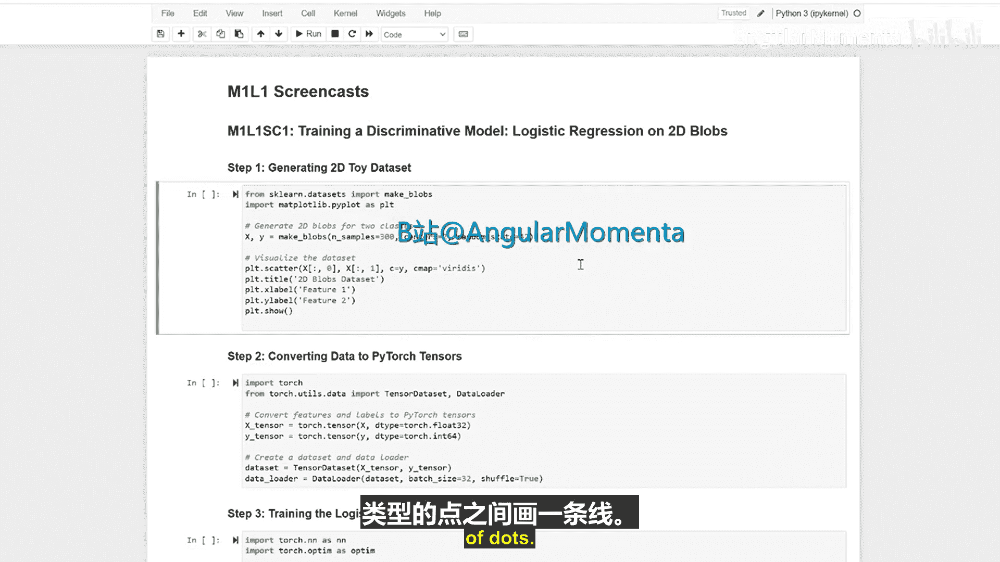

```python
# 示例代码：创建两组二维数据点
import numpy as np

# 生成第一组数据（紫色）
group1 = np.random.randn(150, 2) + np.array([2, 2])
# 生成第二组数据（黄色）
group2 = np.random.randn(150, 2) + np.array([-2, -2])

# 合并数据并创建标签
X = np.vstack([group1, group2])
y = np.hstack([np.zeros(150), np.ones(150)])  # 0代表紫色，1代表黄色
```


观察我们的散点图。可以看到紫色点聚集在一起，与黄色点明显分开。

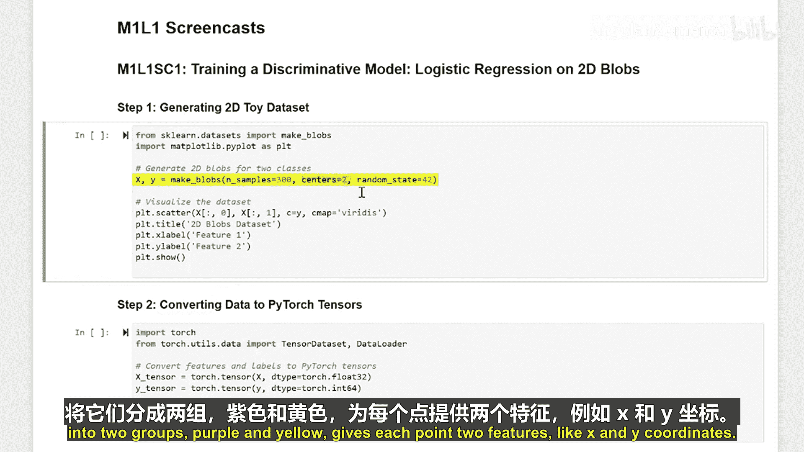


---

## 数据预处理与加载 🔄

上一节我们创建了数据，本节中我们来看看如何为模型训练做准备。

我们需要将数据转换成PyTorch能够理解的格式。这就像将我们的数据翻译成PyTorch的语言。我们还会创建大小为32的数据批次。

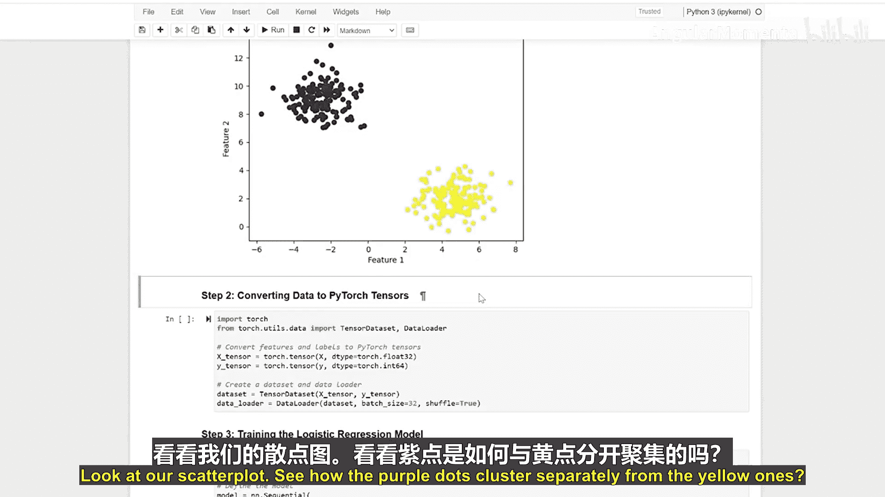

以下是数据加载的核心步骤：

```python
import torch
from torch.utils.data import DataLoader, TensorDataset

# 将NumPy数组转换为PyTorch张量
X_tensor = torch.tensor(X, dtype=torch.float32)
y_tensor = torch.tensor(y, dtype=torch.float32).view(-1, 1)

# 创建数据集和数据加载器
dataset = TensorDataset(X_tensor, y_tensor)
batch_size = 32
dataloader = DataLoader(dataset, batch_size=batch_size, shuffle=True)
```

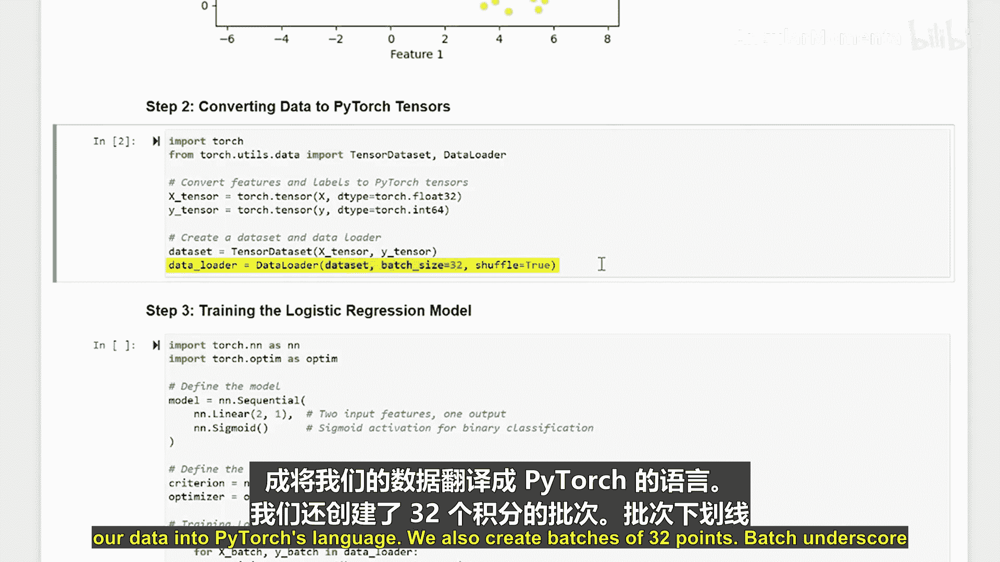

为了获得更好的学习效果，我们对数据进行打乱。

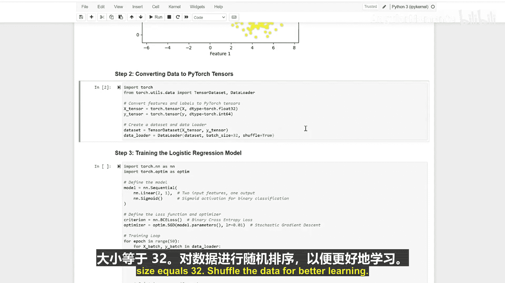

---


## 构建逻辑回归模型 🧠

现在，我们进入核心部分：创建逻辑回归模型。

逻辑回归模型的核心是一个线性层，后接一个Sigmoid激活函数，用于输出一个介于0和1之间的概率值。其公式可以表示为：


**`ŷ = σ(W·X + b)`**

其中：
*   `ŷ` 是预测概率。
*   `σ` 是Sigmoid函数：`σ(z) = 1 / (1 + e^{-z})`。
*   `W` 是权重矩阵。
*   `X` 是输入特征。
*   `b` 是偏置项。

以下是模型的PyTorch实现：

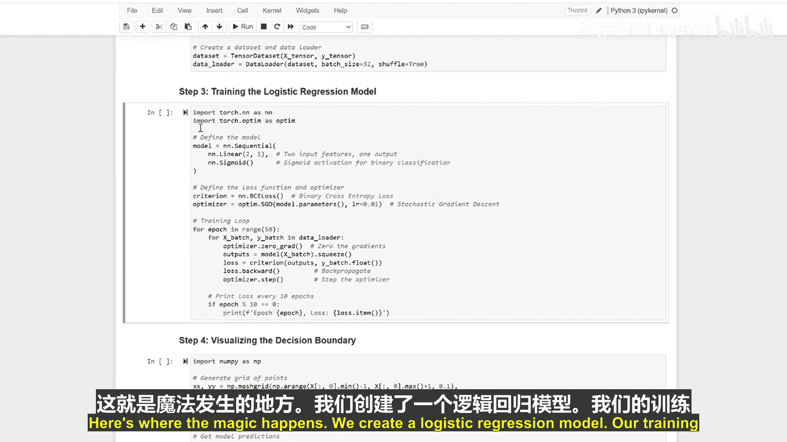

```python
import torch.nn as nn

class LogisticRegressionModel(nn.Module):
    def __init__(self, input_dim):
        super().__init__()
        self.linear = nn.Linear(input_dim, 1)  # 线性层

    def forward(self, x):
        # 线性变换后通过Sigmoid函数
        return torch.sigmoid(self.linear(x))
```


---

## 训练模型 🏋️

模型构建完成后，我们需要训练它。我们的训练过程使用二元交叉熵损失（BCE Loss）来衡量预测错误，并使用随机梯度下降（SGD）优化器来更新模型参数，这就像朝着更准确预测的方向迈出一小步。训练将进行50个周期，即完整遍历数据集50次。

以下是训练循环的核心代码：

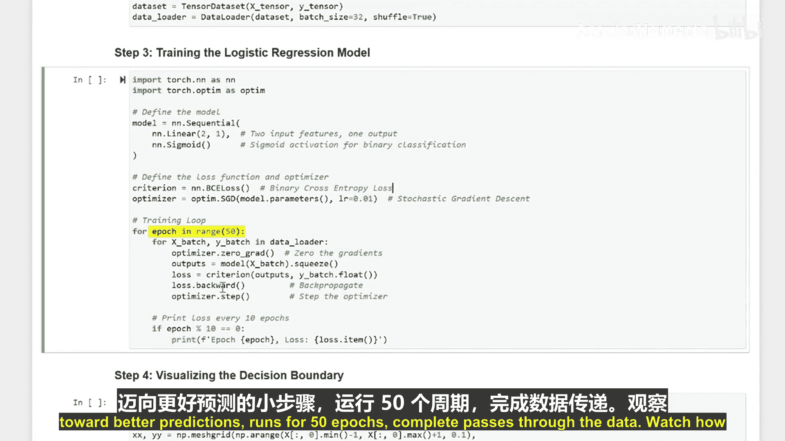

```python
model = LogisticRegressionModel(input_dim=2)
criterion = nn.BCELoss()  # 损失函数
optimizer = torch.optim.SGD(model.parameters(), lr=0.1)  # 优化器

num_epochs = 50
for epoch in range(num_epochs):
    for batch_X, batch_y in dataloader:
        # 前向传播
        predictions = model(batch_X)
        loss = criterion(predictions, batch_y)

        # 反向传播与优化
        optimizer.zero_grad()
        loss.backward()
        optimizer.step()

    # 可选项：打印每个周期的损失
    # print(f'Epoch [{epoch+1}/{num_epochs}], Loss: {loss.item():.4f}')
```

观察损失值（错误的数量）如何随着时间的推移而减小。

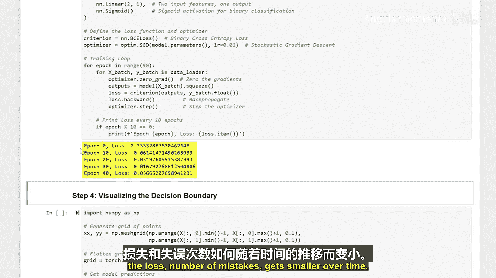


---

## 可视化决策边界 📈

最后，让我们看看训练好的模型是如何区分这两组点的。灰色区域展示了模型的决策边界。

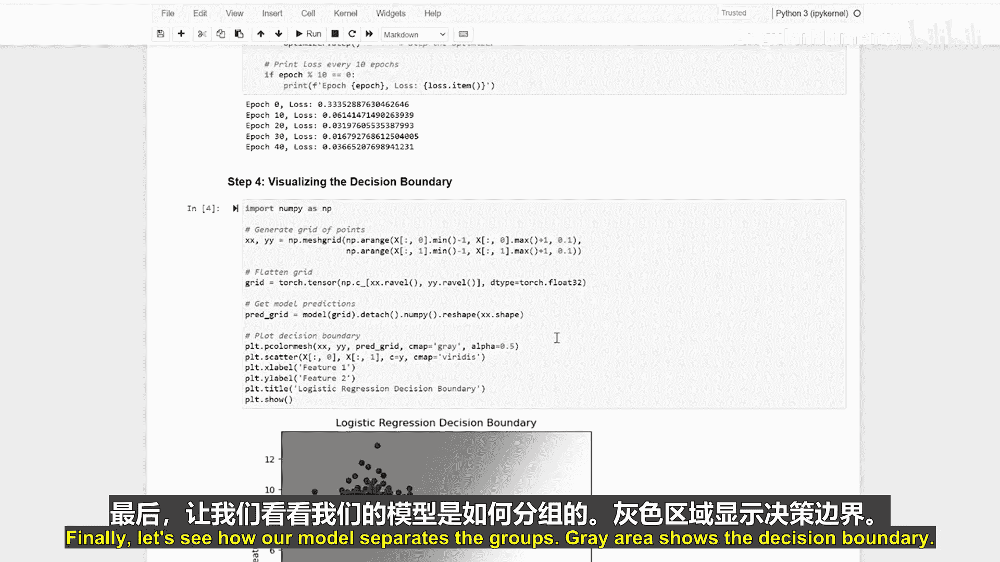

以下是可视化决策边界的思路：

1.  创建一个覆盖整个数据范围的网格。
2.  用训练好的模型预测网格中每个点的类别。
3.  根据预测结果对网格进行着色。

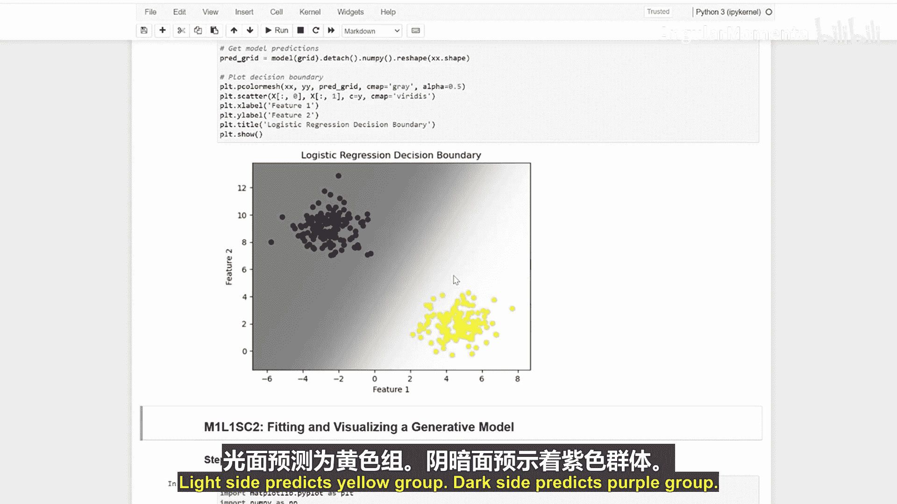

```python
import matplotlib.pyplot as plt

# 创建网格
x_min, x_max = X[:, 0].min() - 1, X[:, 0].max() + 1
y_min, y_max = X[:, 1].min() - 1, X[:, 1].max() + 1
xx, yy = np.meshgrid(np.arange(x_min, x_max, 0.02),
                     np.arange(y_min, y_max, 0.02))

# 模型预测
with torch.no_grad():
    grid_tensor = torch.tensor(np.c_[xx.ravel(), yy.ravel()], dtype=torch.float32)
    Z = model(grid_tensor)
    Z = (Z > 0.5).numpy().reshape(xx.shape)  # 将概率转换为类别（0或1）

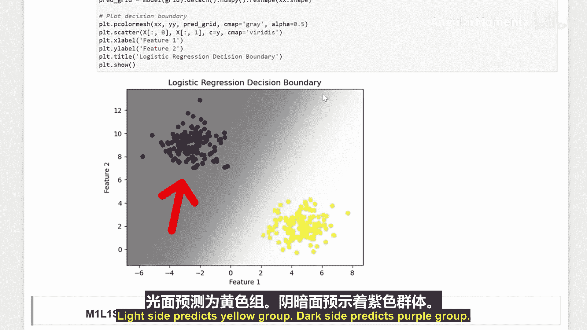

# 绘制背景和散点
plt.contourf(xx, yy, Z, alpha=0.3, cmap='coolwarm')
plt.scatter(group1[:, 0], group1[:, 1], color='purple', label='Group 1 (Purple)')
plt.scatter(group2[:, 0], group2[:, 1], color='yellow', label='Group 2 (Yellow)')
plt.legend()
plt.show()
```


浅色区域预测为黄色组。

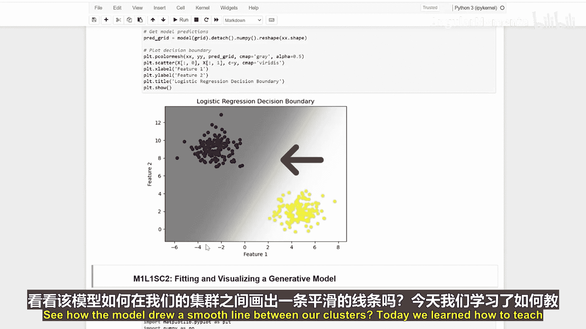


深色区域预测为紫色组。


可以看到，模型在我们的数据簇之间画出了一条平滑的分界线。


---

## 总结

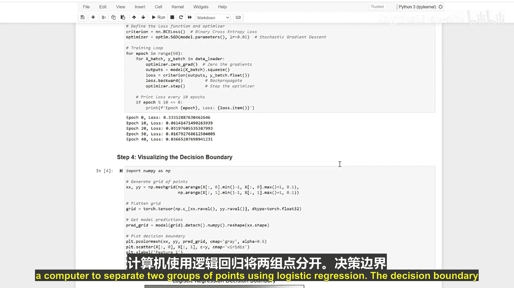

本节课中，我们一起学习了如何使用逻辑回归模型教计算机区分两组二维数据点。我们从创建模拟数据开始，经历了数据预处理、模型构建、训练以及最终的可视化。决策边界清晰地展示了模型是如何做出预测的。逻辑回归虽然简单，但它是理解更复杂分类模型的重要基础。

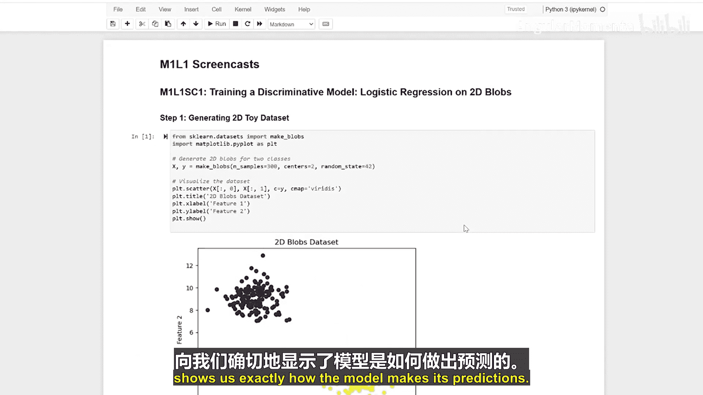


