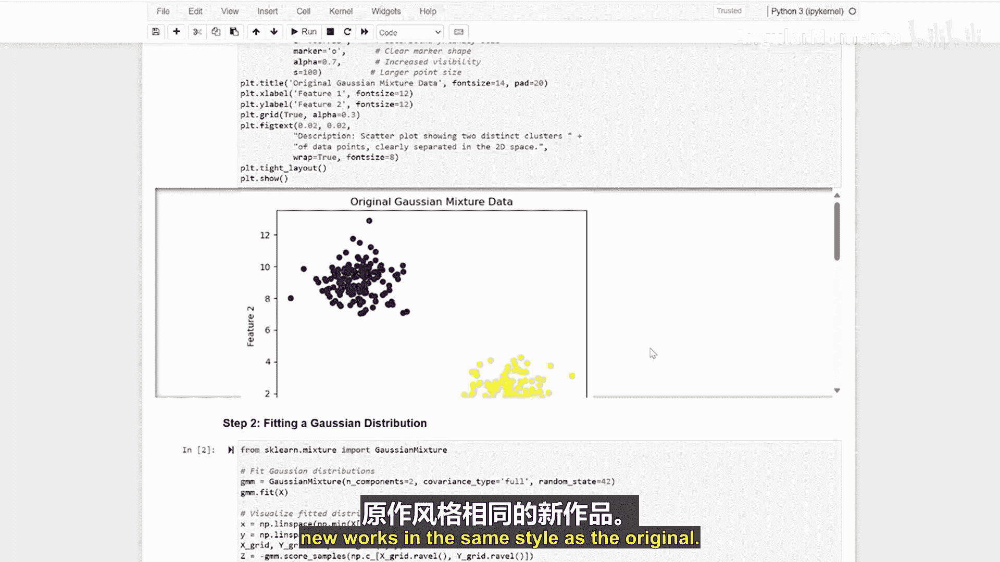

生成式人工智能与大语言模型：P03-01：拟合与可视化生成模型 🎨

在本节课中，我们将学习如何创建一个生成式模型。你可以把它想象成教一台电脑绘画，让它能画出与我们原始数据相似的新数据点。这就像一位艺术家学习模仿他人的绘画风格。

首先，我们需要创建一些用于练习的数据。

以下是创建数据的代码：
```python
# 示例代码：创建包含两个簇的合成数据
import numpy as np
import matplotlib.pyplot as plt
from sklearn.datasets import make_blobs

# 生成300个数据点，形成两个中心，并添加高斯噪声
X, y = make_blobs(n_samples=300, centers=2, cluster_std=1.0, random_state=42)
```

现在，让我们来看看生成的第一张图。图中显示了我们有两个明显不同的点群。这些点以高斯分布（钟形曲线）的形式散布开来。

上一节我们创建了数据，本节中我们来看看如何教会模型理解这些模式。

我们使用**高斯混合模型**。这个模型通过寻找每个簇的中心、理解点围绕这些中心的散布方式，并计算每个点属于各个组的概率来进行学习。

以下是模型拟合的核心公式概念：
**P(X) = Σ [π_k * N(X | μ_k, Σ_k)]**
其中，`π_k` 是混合权重，`N` 是高斯分布，`μ_k` 是均值，`Σ_k` 是协方差。

现在，让我们观察结果图。图中的等高线类似于地形图。

以下是关于等高线的解释：
*   每条线显示了具有相等概率的点。
*   圆圈越紧密，表示该区域点的出现概率越高。
*   模型已经学会了点最可能出现的位置。

最精彩的部分来了：让我们创建新的数据点。

在最终的图中，三角形代表我们的原始数据，而圆形则是我们的模型生成的新数据点。请注意，新生成的点遵循着与原始数据相同的分布模式。

🎼 总结




本节课中，我们一起学习了如何创建一个生成式模型，该模型能够生成与训练数据相似的新数据点。这就像教电脑成为一名艺术家，能够以与原始作品相同的风格创作出新的作品。我们通过生成合成数据、使用高斯混合模型进行拟合、可视化概率分布，并最终生成了新的数据点，完成了整个流程。