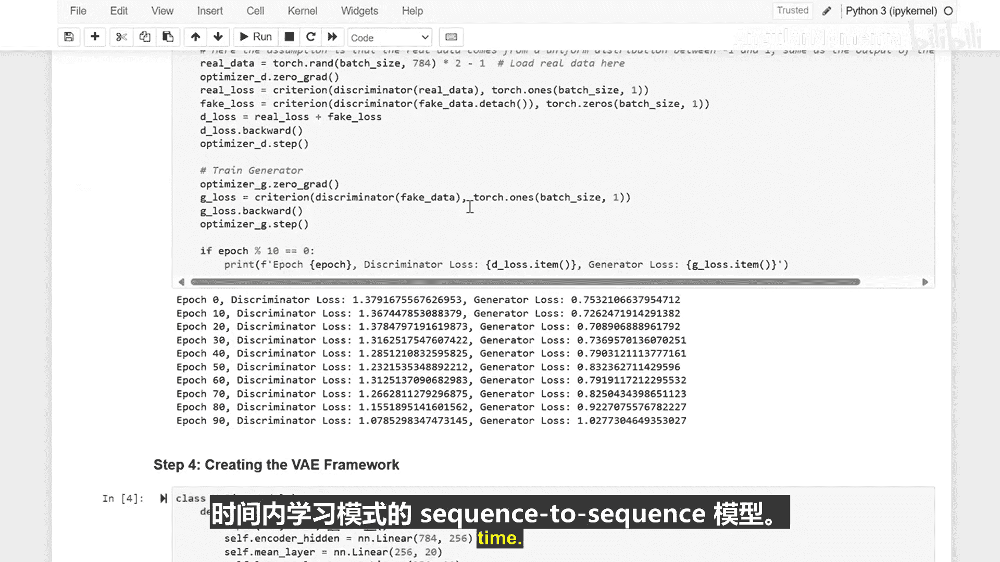

生成式人工智能与大语言模型：P4-01：生成式模型基础实战 🎨

在本节课中，我们将学习三种不同类型的生成式模型：生成对抗网络、变分自编码器和序列模型。你可以把它们想象成三位不同的艺术家，它们通过研究现有数据中的模式来学习创造新数据。

首先，让我们准备好工具。我们将使用 PyTorch 来构建我们的生成式模型，这就像拥有一个配备了所有创意工具的特殊艺术工作室。

### 生成对抗网络：一场创造与识别的游戏 🎭

生成对抗网络就像拥有两位艺术家。一位是生成器，它试图创造假数据；另一位是判别器，它试图识别出假数据。我们的代码将同时创建这两者。这就像一场游戏，一位玩家越来越擅长创造赝品，而另一位则越来越擅长发现它们。

以下是构建 GAN 的关键代码结构：

```python
# 生成器：从随机噪声生成数据
generator = Generator()
# 判别器：判断数据是真实的还是生成的
discriminator = Discriminator()
```

现在我们来训练我们的 GAN。生成器从随机噪声中创造假数据，判别器则学习区分真实与虚假数据。它们轮流进行，不断提升各自的技能。在训练过程中，观察两者损失值的变化，它们正是在相互学习中进步的。

### 变分自编码器：学习压缩与重建 🧩

VAE 的工作原理有所不同。它就像教计算机将数据压缩到一个小的空间（编码），然后从压缩版本中重建出原始数据（解码）。

我们的代码通过构建一个协同工作的编码器和解码器来实现这一点。

以下是 VAE 的核心组件：

```python
# 编码器：将输入数据压缩为潜在表示
encoder = Encoder()
# 解码器：从潜在表示重建数据
decoder = Decoder()
```

接下来是训练 VAE 的时间。它学习如何高效地压缩数据，并准确地重建数据。模型需要在压缩率和重建准确性之间取得平衡。损失函数将向我们展示它在这两项任务上的学习效果。

### 序列模型：预测下一个元素 📝

上一节我们介绍了基于图像数据的模型，本节我们来看看处理序列数据的模型。序列模型就像教某人预测不同句子中的下一个单词。

我们首先创建数据和模型。LSTM 代表长短期记忆网络，它就像是给我们的模型一个记事本，用来记住序列中的模式。我们创建一些随机数据来供模型练习。

以下是定义序列模型的示例：

```python
# 定义一个简单的 LSTM 模型
model = LSTM(input_size, hidden_size, num_layers)
```

现在，让我们训练模型。每经过 10 个训练周期，我们通过查看损失值（错误的数量）来检查模型的学习情况。

我们来观察模型是如何随时间改进的。高损失意味着很多错误。随着训练周期的增加，我们看到损失在变小，模型开始识别出模式。到第 40 个周期时，我们已经可以看到大约 28% 的改进。

### 总结 📚

本节课中，我们一起学习了三种生成新数据的不同方法：
*   **生成对抗网络**：通过生成器和判别器的对抗游戏进行学习。
*   **变分自编码器**：学习压缩和重建数据。
*   **序列模型**：学习随时间变化的序列模式。




每种模型都有其独特的“艺术”创作方式，是构建更复杂生成式人工智能系统的重要基础。