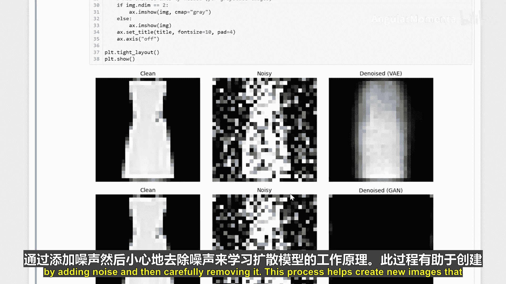
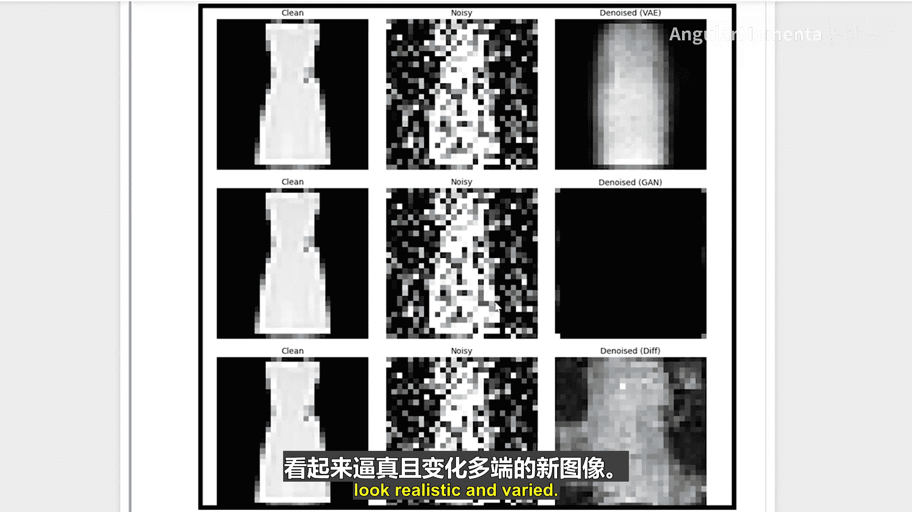
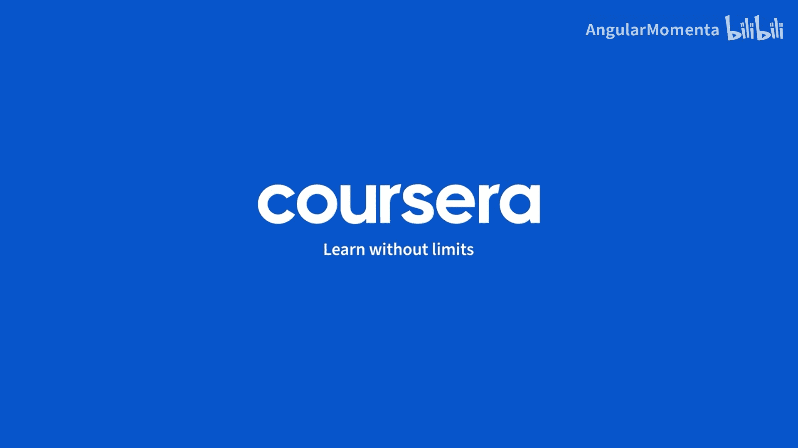

生成式人工智能与大语言模型：05：扩散模型实战：从噪声到逼真输出 🎨

在本节课中，我们将学习扩散模型。这是一种特殊的人工智能模型，它通过学习清理带噪声的图像来工作。你可以把它想象成缓慢地清理一张模糊的照片。

首先，我们需要准备好工具。

我们将使用GPU（如果可用的话）。我们还需要设置超参数。

我们会建立数据分割和加载器。我们将使用这张图片进行快速检查。

以下是创建带有噪声的图像序列的代码。

我们还将使用这个工具函数，计算去噪后的输出与干净图像之间的均方误差（MSE）。

上一节我们介绍了准备工作，本节中我们来看看如何实现变分自编码器（VAE）。VAE是另一种用于去噪的模型。

以下是VAE的实现代码。

接下来，我们将训练我们的VAE模型。

现在，让我们实现生成对抗网络（GAN）。GAN是另一种用于图像去噪的模型。

以下是GAN的实现代码。

接下来，我们将训练我们的GAN模型。

现在，我们将训练我们的DDPM模型，以去除噪声并还原出干净的图像。

以下是DDPM模型的实现。我们的模型从一个带噪声的图像开始，逐步去除噪声，一步一步让图像变得更清晰。这就像在暗房里观看照片显影的过程。

接下来，我们将训练我们的DDPM模型数个周期，以确保模型能高效地学习去噪。

现在，让我们可视化不同模型的去噪结果。

以下是不同模型去噪效果的对比。

*   VAE模型去噪结果
*   GAN模型去噪结果
*   DDPM模型去噪结果

本节课中，我们一起学习了扩散模型的工作原理：通过添加噪声，然后仔细地将其去除。这个过程有助于创造出看起来逼真且多样的新图像。😊