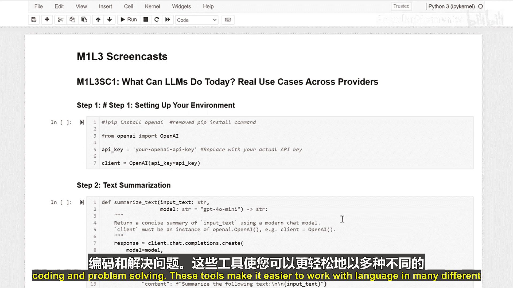
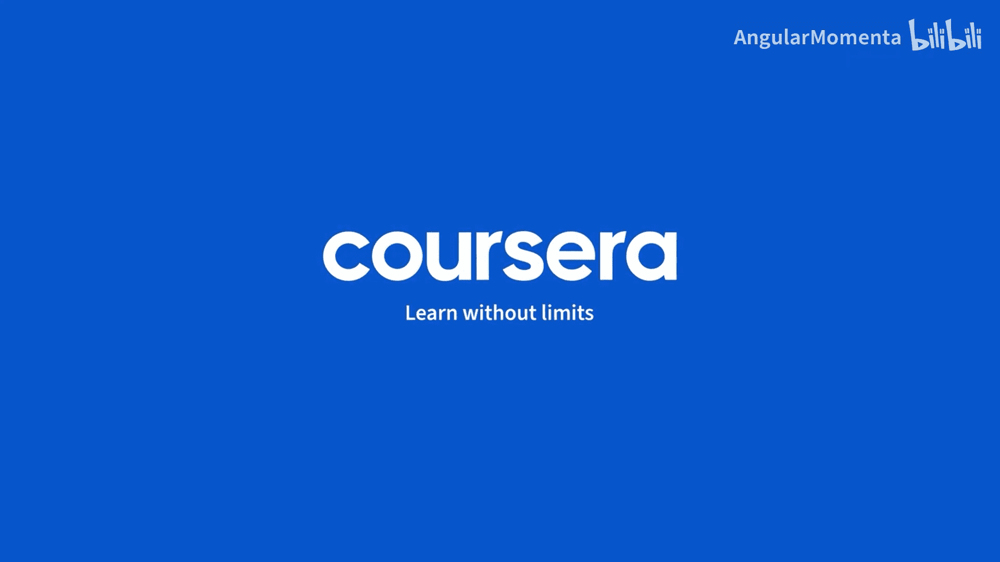

生成式人工智能与大语言模型：P6-01：当今大型语言模型的实际应用案例：跨服务商分析

在本节课中，我们将探索大型语言模型在真实应用中的不同使用方式。我们将通过具体的代码示例，了解如何利用LLM完成文本摘要、代码解释、语言翻译和问题解决等任务。

---

### 准备工作：连接LLM服务

首先，我们需要准备好工具。我们将使用OpenAI的API，这就像一条特殊的电话线，允许我们与其大型语言模型进行对话。以下是一个基础的设置代码示例：

```python
import openai

# 设置你的API密钥
openai.api_key = 'your-api-key-here'
```

通过这段代码，我们建立了与AI模型的连接，为后续的各种任务调用做好准备。

---

### 任务一：文本摘要

上一节我们建立了与LLM的连接，本节中我们来看看如何利用它进行文本摘要。摘要任务要求模型将长文本浓缩为简短的核心内容。

我们的代码指示模型扮演一个摘要专家的角色，并将温度参数设置为0.3以获得更稳定、一致的摘要结果，同时将输出限制在150个单词以内。

以下是实现文本摘要的关键代码步骤：

```python
def summarize_text(text):
    response = openai.ChatCompletion.create(
        model="gpt-3.5-turbo",
        messages=[
            {"role": "system", "content": "You are a helpful text summarizer."},
            {"role": "user", "content": f"Summarize the following text in under 150 words:\n\n{text}"}
        ],
        temperature=0.3,
        max_tokens=150
    )
    return response.choices[0].message.content
```

---

### 任务二：代码解释与生成

除了处理自然语言，LLM在编程领域也大有可为。它们可以帮助解释代码逻辑、提出改进建议，甚至根据描述编写新的代码。

以下代码展示了如何让LLM扮演一个代码助手：

```python
def explain_code(code_snippet):
    response = openai.ChatCompletion.create(
        model="gpt-3.5-turbo",
        messages=[
            {"role": "system", "content": "You are a expert programming assistant."},
            {"role": "user", "content": f"Explain what the following code does:\n\n{code_snippet}"}
        ],
        temperature=0.5  # 稍高的温度允许更有创造性的解释
    )
    return response.choices[0].message.content
```

---

### 任务三：语言翻译

语言翻译是LLM的另一项核心能力。它就像指尖有一位语言专家，可以快速准确地在不同语言间进行转换。

为了实现精准翻译，我们设置模型扮演专业翻译角色，并保持较低的温度值以确保翻译的准确性。

以下是翻译功能的实现：

```python
def translate_text(text, target_language):
    response = openai.ChatCompletion.create(
        model="gpt-3.5-turbo",
        messages=[
            {"role": "system", "content": "You are a professional translator."},
            {"role": "user", "content": f"Translate the following text into {target_language}:\n\n{text}"}
        ],
        temperature=0.1  # 低温度确保翻译忠实于原文
    )
    return response.choices[0].message.content
```

---

### 任务四：分步问题解决

最后，让我们看看LLM如何解决复杂问题。这种方法特别适用于数学难题或逻辑推理。

这个函数要求模型以“一步一步思考”的方式处理问题，并使用低温度值来获得清晰、合乎逻辑的答案。

以下是问题解决功能的代码示例：

```python
def solve_problem(problem_statement):
    response = openai.ChatCompletion.create(
        model="gpt-3.5-turbo",
        messages=[
            {"role": "system", "content": "You are a logical problem solver. Think step by step."},
            {"role": "user", "content": f"Solve this problem: {problem_statement}"}
        ],
        temperature=0.1  # 低温度促进逻辑严谨性
    )
    return response.choices[0].message.content
```



---



### 总结

本节课中，我们一起学习了大型语言模型如何协助完成多种任务，从文本摘要、翻译到代码处理和问题解决。这些工具使得以多种方式处理语言和工作变得更加容易。通过调整参数（如扮演的角色和温度值），我们可以引导模型适应不同的应用场景，满足从创造性到严谨性的各种需求。