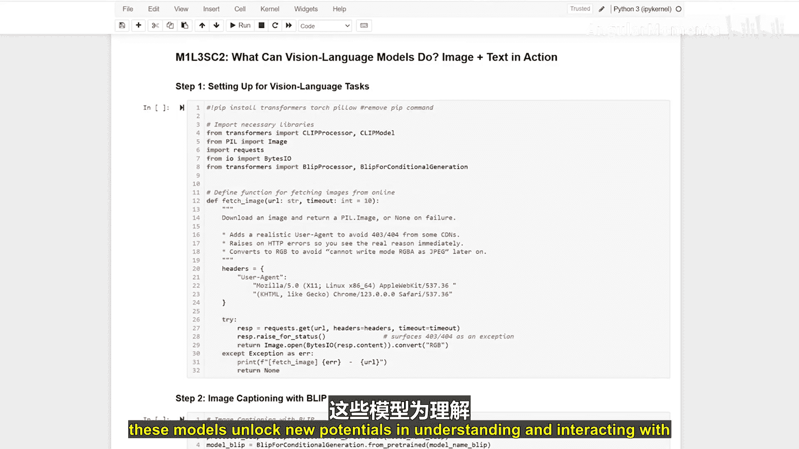

生成式人工智能与大语言模型：P7：视觉语言模型能做什么：图文交互实践 👁️📖

在本节课中，我们将探索视觉语言模型的强大能力。这些模型能够结合文本和图像，执行复杂的任务，例如为图像生成描述、进行零样本图像分类以及视觉问答。

---

上一节我们介绍了视觉语言模型的基本概念，本节中我们来看看如何搭建环境并开始实践。

首先，我们需要确保安装了必要的库。以下是设置环境的步骤：

1.  安装 `transformers` 库。
2.  安装 `PIL` 或 `Pillow` 库用于图像处理。
3.  安装 `requests` 库用于从网络获取图像。

---

现在，让我们从为图像生成描述开始。我们将使用 BLIP 模型来完成这项任务。

以下是使用 BLIP 模型生成图像描述的步骤：

1.  使用 `fetch_image` 函数从提供的 URL 获取图像。
2.  加载 BLIP 模型和对应的处理器来处理图像输入。
3.  模型处理图像并生成描述文本。
4.  解码并打印生成的描述。

```python
# 示例代码：使用 BLIP 生成图像描述
from transformers import BlipProcessor, BlipForConditionalGeneration
from PIL import Image
import requests

# 获取图像
img_url = "https://example.com/image.jpg"
image = Image.open(requests.get(img_url, stream=True).raw)

# 加载模型和处理器
processor = BlipProcessor.from_pretrained("Salesforce/blip-image-captioning-base")
model = BlipForConditionalGeneration.from_pretrained("Salesforce/blip-image-captioning-base")

# 处理图像并生成描述
inputs = processor(image, return_tensors="pt")
out = model.generate(**inputs)
caption = processor.decode(out[0], skip_special_tokens=True)
print(caption)
```

---

接下来，我们将探索零样本图像分类。这意味着模型无需针对特定任务进行训练，就能对图像进行分类。我们将使用 CLIP 模型来实现。

以下是使用 CLIP 进行零样本图像分类的步骤：

1.  使用 `fetch_image` 函数从提供的 URL 获取图像。
2.  加载 CLIP 模型和处理器来处理图像和文本输入。
3.  模型处理输入，根据预定义的标签对图像进行分类。
4.  输出概率最高的预测标签。

```python
# 示例代码：使用 CLIP 进行零样本图像分类
from transformers import CLIPProcessor, CLIPModel
from PIL import Image
import requests

# 获取图像
img_url = "https://example.com/image.jpg"
image = Image.open(requests.get(img_url, stream=True).raw)

# 定义候选标签
labels = ["a photo of a cat", "a photo of a dog", "a photo of a car"]

# 加载模型和处理器
model = CLIPModel.from_pretrained("openai/clip-vit-base-patch32")
processor = CLIPProcessor.from_pretrained("openai/clip-vit-base-patch32")

# 处理输入
inputs = processor(text=labels, images=image, return_tensors="pt", padding=True)
outputs = model(**inputs)
logits_per_image = outputs.logits_per_image  # 图像与文本的相似度分数
probs = logits_per_image.softmax(dim=1)  # 转换为概率

# 输出结果
predicted_label = labels[probs.argmax().item()]
print(f"Predicted label: {predicted_label}")
```

---

最后，我们来模拟视觉问答。虽然 CLIP 模型本身不直接生成答案，但我们可以通过评估图像与不同问题-答案对的相关性来模拟这一过程。

以下是使用 CLIP 模拟视觉问答的步骤：

1.  使用 `fetch_image` 函数从提供的 URL 获取图像。
2.  加载 CLIP 模型和处理器来处理图像和文本输入。
3.  将问题与多个可能的答案组合成文本对。
4.  模型评估图像与每个文本对的匹配程度。
5.  输出匹配度最高的答案作为模拟回答。

```python
# 示例代码：使用 CLIP 模拟视觉问答
from transformers import CLIPProcessor, CLIPModel
from PIL import Image
import requests

# 获取图像
img_url = "https://example.com/image.jpg"
image = Image.open(requests.get(img_url, stream=True).raw)

# 定义问题和候选答案
question = "What is in the image?"
candidate_answers = ["a cat", "a dog", "a tree", "a car"]

# 将问题与每个答案组合
text_inputs = [f"{question} {answer}" for answer in candidate_answers]

# 加载模型和处理器
model = CLIPModel.from_pretrained("openai/clip-vit-base-patch32")
processor = CLIPProcessor.from_pretrained("openai/clip-vit-base-patch32")

# 处理输入
inputs = processor(text=text_inputs, images=image, return_tensors="pt", padding=True)
outputs = model(**inputs)
logits_per_image = outputs.logits_per_image
probs = logits_per_image.softmax(dim=1)

# 输出模拟答案
simulated_answer = candidate_answers[probs.argmax().item()]
print(f"Simulated answer: {simulated_answer}")
```



---


本节课中我们一起学习了视觉语言模型的核心应用。我们实践了使用 BLIP 模型为图像生成描述，使用 CLIP 模型进行零样本图像分类，并模拟了视觉问答的过程。这些技术展示了模型在理解和处理多模态数据方面的巨大潜力。