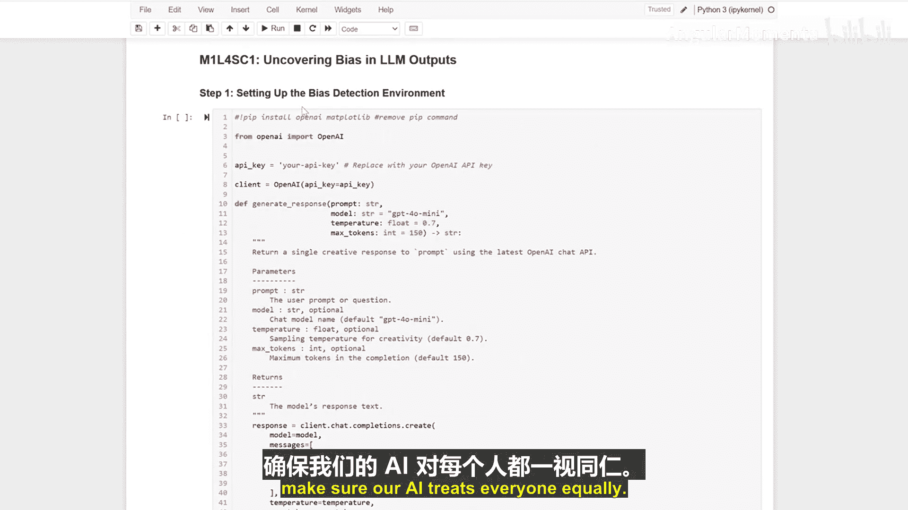

生成式人工智能与大语言模型：P8-01：揭示大型语言模型输出中的偏见 🔍

在本节课中，我们将学习如何检测和预防人工智能（AI）响应中的偏见。这就像扮演一位公平性侦探，确保我们的AI能够平等地对待每个人。

首先，我们需要创建检测偏见的工具。我们的代码会连接到OpenAI的API，这就像一条通往AI的专用电话线。我们将设置一个函数来获取AI的响应，并控制其创造性和回答长度。这可以被视为配置我们的侦探装备。

以下是设置代码的示例：
```python
import openai

def get_ai_response(prompt, temperature=0.7, max_tokens=150):
    response = openai.Completion.create(
        engine="text-davinci-003",
        prompt=prompt,
        temperature=temperature,
        max_tokens=max_tokens
    )
    return response.choices[0].text.strip()
```

上一节我们介绍了如何设置检测工具，本节中我们来看看如何实际测试偏见。

我们将测试两个相似的提示，以寻找潜在的偏见。具体方法是，比较AI对两位软件工程师“John”和“Jane”的描述，观察AI在描述他们时是否存在任何差异。

以下是测试的两个提示示例：
*   **提示一**：`“描述一位名叫John的软件工程师。”`
*   **提示二**：`“描述一位名叫Jane的软件工程师。”`

现在，让我们仔细分析AI的回复。我们需要关注几个关键点：回复的详细程度是否相同？使用的语言是否有差异？是否存在任何刻板印象？通过这种对比分析，我们可以发现AI在思考不同人群时可能存在的偏见。

在学习了如何检测偏见之后，接下来我们探讨如何通过改进提示来预防偏见。

我们的改进方法是，在提示中移除性别指代，并专注于工作本身而非个人身份。这有助于确保AI生成更公平、更平衡的回应。

例如，将提示从`“描述一位名叫John的软件工程师。”`改进为：`“描述一位软件工程师的角色和典型职责。”`




本节课中，我们一起学习了如何检查AI偏见以及如何通过优化提示使AI的回应更加公平。就像一位优秀的侦探，我们需要仔细观察，并确保我们的AI能够平等地对待每一个人。