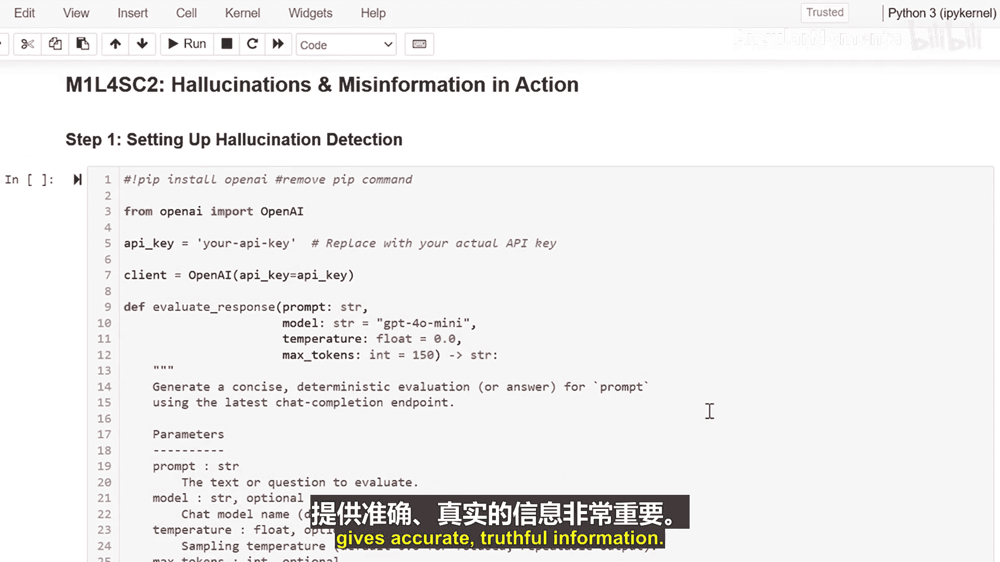

生成式人工智能与大语言模型：P09-01_04_02：AI幻觉与信息误传实例 🔍

在本节课中，我们将学习AI幻觉现象，即人工智能生成不真实信息的情况。我们将了解如何识别和预防这种现象，确保AI提供的信息准确可靠。

---

上一节我们介绍了AI幻觉的基本概念，本节中我们来看看具体的实例和应对方法。首先，我们需要创建一个事实核查工具。

以下是创建事实核查工具的步骤：

1.  **连接API**：代码连接到OpenAI的API。
2.  **创建响应函数**：创建一个函数来获取AI的响应。
3.  **设置参数**：将温度参数 `temperature` 设置为 `0.0`，以获得一致且专注的答案。
4.  **设定角色**：指示AI扮演一个公正的评估者。

这就像为AI的回应设置了一个“测谎仪”。

---

在步骤三和四中，我们用一些棘手的健康问题进行了测试。

我们提出了一些可能诱使AI编造答案的问题。如果回答错误，可能会带来危险。或者，这些问题需要谨慎的事实性回应。

观察AI如何回应这些具有挑战性的问题。

---

当我们查看AI的回应时，我们检查了以下几点：

*   **未经支持的断言**：AI是否做出了没有依据的声明。
*   **过度自信的陈述**：AI的回答是否显得过于绝对。
*   **事实与虚构的混合**：AI是否将真实信息与编造的内容混在一起。

这就像侦探在寻找AI可能正在编造信息的线索。

---

为了预防AI幻觉，可以采取以下措施：

*   使用**具体、清晰的提示**。
*   要求AI提供**来源和证据**。
*   对重要信息进行**双重核查**。

---

本节课中，我们一起学习了如何识别和预防AI幻觉。就像核查新闻故事的真实性一样，确保AI提供准确、真实的信息至关重要。