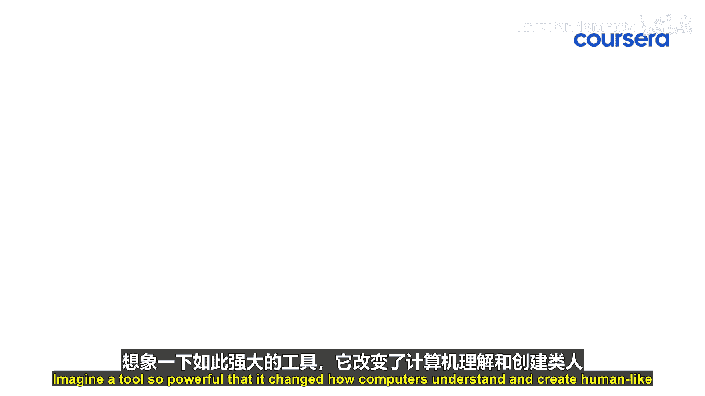

# 010：Transformer为何至关重要？🤖

在本节课中，我们将探讨Transformer架构，了解它为何成为现代大语言模型（LLM）的核心技术，并改变了计算机理解和生成类人文本的方式。

## 概述：Transformer的革命性影响

Transformer彻底改变了机器学习领域，并成为当今大语言模型（如GPT和BERT）巨大能力的基石。在Transformer出现之前，机器理解长而复杂的文本是一项巨大的挑战。

上一节我们介绍了大语言模型的背景，本节中我们来看看Transformer如何解决了这一核心难题。

## Transformer的核心机制：自注意力

Transformer引入了一种名为**自注意力**的机制。该机制允许模型在处理文本时，高效地聚焦于相关的部分，类似于我们阅读时强调重要信息的方式。

这种效率使得Transformer能够处理海量数据集，从而释放了像GPT和BERT这类模型的潜力，使其能够生成连贯的故事、进行翻译甚至创作诗歌。

## Transformer的实际应用

以下是Transformer在现实世界中引发各行业突破的几个例子：

*   **医疗保健**：它们能够分析海量医学文献，辅助诊断和提供治疗建议。
*   **商业**：它们通过自动分类和管理客户咨询来协助企业。
*   **娱乐**：它们有助于为电子游戏生成对话，或创造性地辅助作家构思叙事。

## Transformer的重要性

理解Transformer为何重要，为你打开了通往创新AI解决方案的大门，其影响遍及从聊天机器人到复杂数据分析的各个领域。

这不仅仅是关于Transformer能做什么，更是关于你能用它做什么。通过在处理效率和细致的文本理解之间保持平衡，Transformer确保了AI应用不仅功能强大，而且准确且具有上下文感知能力。

## 总结：拥抱Transformer的力量

本节课中，我们一起学习了Transformer架构如何构成当今AI进步的支柱。拥抱它的能力意味着你不仅能利用最前沿的人工智能技术，还能塑造未来技术交互的方式，使你在快速发展的领域中成为不可或缺的参与者。

深入探索Transformer的变革力量，站在AI革命的前沿。