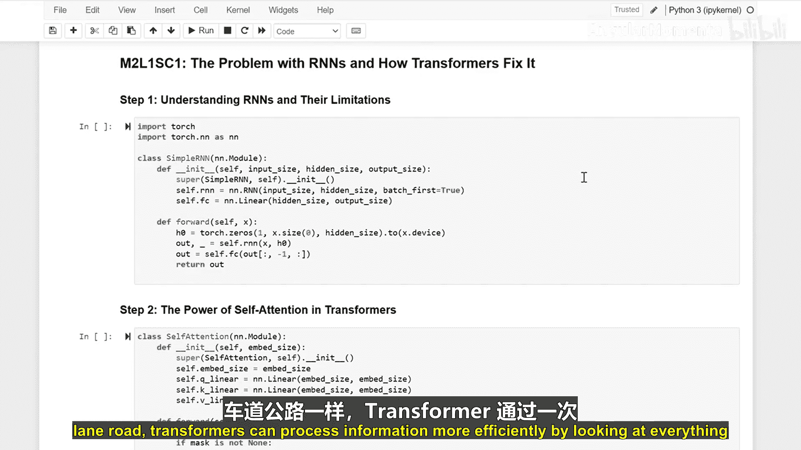

# 011：循环神经网络的问题与Transformer的解决方案 🚀

在本节课中，我们将学习Transformer架构为何在人工智能领域变得如此流行。我们将通过对比循环神经网络（RNN）的局限性，来理解Transformer如何通过其独特的设计解决这些问题，从而实现更高效的信息处理。

## 从单车道到多车道高速公路 🛣️

上一节我们介绍了循环神经网络的基本概念。本节中，我们来看看RNN在处理信息时面临的核心挑战。

RNN按顺序逐个处理信息，就像单车道上的汽车。每一段信息都必须等待前一段处理完毕。序列越长，记住早期信息就越困难，这类似于狭窄道路上发生的交通堵塞。

以下是RNN处理信息的关键步骤：

```python
# 创建一个简单的RNN层
self.rnn = nn.RNN(input_size, hidden_size)
# 添加一个全连接层以获取输出
self.fc = nn.Linear(hidden_size, output_size)

# 前向传播过程
def forward(self, x):
    # 从空记忆状态开始
    h0 = torch.zeros(1, x.size(0), self.hidden_size)
    # 读取每个信息片段时更新记忆
    out, _ = self.rnn(x, h0)
    out = self.fc(out[:, -1, :])
    return out
```

## Transformer的并行处理方案 🚗💨

了解了RNN的瓶颈后，本节我们来看看Transformer如何通过“自注意力”机制实现更好的信息处理。

可以将自注意力机制想象成拥有多条车道的高速公路。所有信息片段可以同时移动，每个片段都能轻松地与其他片段建立联系，从而避免了“交通堵塞”。

以下是自注意力机制的核心实现：

```python
# 为信息创建三个“车道”（查询、键、值）
self.q_linear = nn.Linear(d_model, d_model)
self.k_linear = nn.Linear(d_model, d_model)
self.v_linear = nn.Linear(d_model, d_model)

# 计算每个信息片段对其他片段的重要性（得分）
scores = torch.matmul(query, key.transpose(-2, -1)) / math.sqrt(d_k)
# 根据重要性组合信息（注意力）
attention = torch.matmul(F.softmax(scores, dim=-1), value)
```

## 位置编码：信息的GPS坐标 🗺️

虽然Transformer可以并行处理所有信息，但它仍需了解信息的顺序。这就引入了“位置编码”的概念。

就像给每辆车分配唯一的GPS坐标一样，我们需要告诉Transformer每个信息片段的位置。这有助于模型理解信息的先后顺序。

以下是位置编码的实现方式：

```python
class PositionalEncoding(nn.Module):
    def __init__(self, d_model, max_len=5000):
        super().__init__()
        # 创建位置编码矩阵
        pe = torch.zeros(max_len, d_model)
        position = torch.arange(0, max_len).unsqueeze(1)
        # 使用正弦和余弦波标记位置
        div_term = torch.exp(torch.arange(0, d_model, 2) * -(math.log(10000.0) / d_model))
        pe[:, 0::2] = torch.sin(position * div_term)
        pe[:, 1::2] = torch.cos(position * div_term)
        self.register_buffer('pe', pe)

    def forward(self, x):
        # 将位置编码添加到输入词向量中
        x = x + self.pe[:x.size(1)]
        return x
```

## 构建完整的Transformer系统 🏗️

最后，我们将所有组件组合起来，构建完整的Transformer模型。这就像设计一个完整的高速公路系统。

以下是Transformer编码器层的核心结构：

```python
class TransformerEncoderLayer(nn.Module):
    def __init__(self, d_model, nhead, dim_feedforward=2048):
        super().__init__()
        # 设置多头注意力（多个“交通控制器”）
        self.self_attn = nn.MultiheadAttention(d_model, nhead)
        # 添加位置信息
        self.pos_encoder = PositionalEncoding(d_model)
        # 创建多个处理层
        self.linear1 = nn.Linear(d_model, dim_feedforward)
        self.linear2 = nn.Linear(dim_feedforward, d_model)
        self.norm1 = nn.LayerNorm(d_model)
        self.norm2 = nn.LayerNorm(d_model)

    def forward(self, src):
        # 通过每一层处理信息
        src2 = self.self_attn(src, src, src)[0]
        src = src + self.dropout1(src2)
        src = self.norm1(src)
        src2 = self.linear2(F.relu(self.linear1(src)))
        src = src + self.dropout2(src2)
        src = self.norm2(src)
        return src
```

## 总结 📚

本节课中，我们一起学习了Transformer架构为何优于传统的循环神经网络（RNN）。

**核心对比**：
*   **RNN**：像**单车道公路**，信息必须**顺序处理**，容易产生“记忆瓶颈”。
*   **Transformer**：像**多车道高速公路**，通过**自注意力机制**实现信息**并行处理**，效率更高。




Transformer通过引入**位置编码**来理解序列顺序，并通过**多头注意力**和**层叠结构**构建了一个强大且高效的模型，这使其成为当今大语言模型和生成式AI的基石。