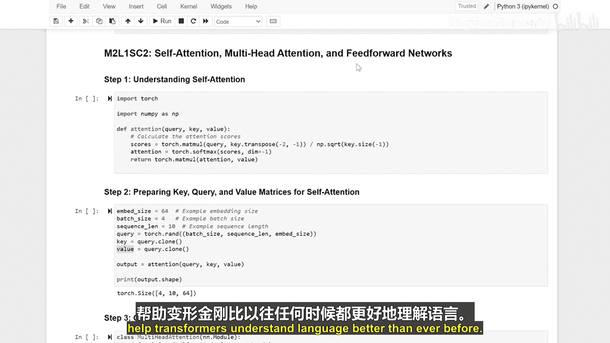

生成式人工智能与大语言模型：12：自注意力、多头注意力与前馈网络 🧠

在本节课中，我们将学习Transformer模型如何理解文本，重点剖析其三个核心组成部分：自注意力机制、多头注意力机制以及前馈网络。这些组件共同协作，使模型能够捕捉文本中的复杂关系并做出决策。

---

### 自注意力机制

上一节我们介绍了Transformer的整体架构，本节中我们来看看其理解文本的核心——自注意力机制。自注意力机制让模型能够计算一个句子中每个词与其他所有词之间的关联程度。

其核心计算过程如下：
1.  **计算注意力分数**：模型为句子中的每一对词计算一个分数，表示它们之间的相关性。
2.  **应用Softmax**：使用`softmax`函数将这些分数转换为概率分布（百分比），即注意力权重。这确保了所有权重之和为1。
3.  **加权求和**：根据计算出的注意力权重，对所有词的信息进行加权组合，为每个词生成一个新的、包含了上下文信息的表示。

这个过程可以用以下公式概括：
**注意力输出 = Softmax( (Q * K^T) / sqrt(d_k) ) * V**
其中，`Q`（查询）、`K`（键）、`V`（值）是由输入词向量通过线性变换得到的矩阵。

---

### 准备关键矩阵

为了进行自注意力计算，我们需要从输入数据中创建三个关键的矩阵：查询矩阵、键矩阵和值矩阵。

这些矩阵通过将输入向量与不同的可学习权重矩阵相乘得到，它们帮助模型从不同角度理解和建立词与词之间的关系。

---

### 多头注意力机制

单一的注意力视角可能不足以捕捉文本中所有类型的关系。因此，我们引入了多头注意力机制。

多头注意力允许模型并行地从多个不同的“视角”或“子空间”来关注输入信息。以下是其工作原理：

多头注意力类将输入数据分割成多个较小的部分，称为“头”。
*   每个头都独立进行一套完整的自注意力计算，拥有自己的一套`Q`、`K`、`V`变换矩阵。
*   每个头专注于输入信息的不同方面，例如语法结构、语义角色或指代关系。
*   所有头的输出被拼接起来，并通过一个最终的线性变换层进行融合，产生最终的输出。

这种设计让模型能够同时捕捉短语依赖、远距离关联等多种模式。

---

### 增强模型能力：前馈网络

在注意力机制提取了词与词之间的关系后，我们需要进一步处理这些信息。这就是前馈网络的作用。

前馈网络对注意力机制的输出进行非线性变换，将其映射到更复杂、更具表现力的表示空间。

前馈网络类通常包含两个线性层：
*   **第一层（扩展层）**：将输入数据的维度增大，例如从512维扩展到2048维。这增加了模型的容量。
*   **第二层（收缩层）**：将维度缩减回原始的尺寸（如512维）。中间通常会使用激活函数（如ReLU）引入非线性。

这个过程可以简化为：
**FFN(x) = max(0, x * W1 + b1) * W2 + b2**
它帮助模型学习更复杂的数据特征，是每个Transformer块中进行深度处理的关键步骤。

---

### 构建Transformer块

最后，我们将多头注意力机制和前馈网络组合起来，形成一个完整的Transformer编码器块。

Transformer块类按顺序集成了以下组件：
1.  **多头注意力层**：捕捉输入的上下文关系。
2.  **层归一化与残差连接**：每个子层（注意力、前馈）的输出都会与输入相加（残差连接），然后进行层归一化。这有助于缓解梯度消失问题，稳定训练过程。
3.  **前馈网络层**：对归一化后的注意力输出进行非线性变换。
4.  **再次的层归一化与残差连接**。
5.  **Dropout**：在训练时随机“关闭”一部分神经元，用于防止模型过拟合。

这个模块是Transformer模型处理数据的基本构建单元，通过堆叠多个这样的块，模型能够实现对文本的深度理解。

---

### 总结

本节课中，我们一起学习了Transformer理解文本的核心技术。
*   **自注意力**如同聚光灯，计算词与词之间的关联强度。
*   **多头注意力**如同多位读者同时从不同角度分析文本，提供了多重视角。
*   **前馈网络**则像一位深思熟虑的决策者，对注意力汇聚的信息进行深度加工和转换。

这些部分协同工作，使Transformer模型能够以前所未有的方式更好地理解语言。

