# 013：温度参数与Top-P采样

在本节课中，我们将学习如何通过调整温度参数和Top-P采样技术，来控制大语言模型生成文本的创造性与一致性。

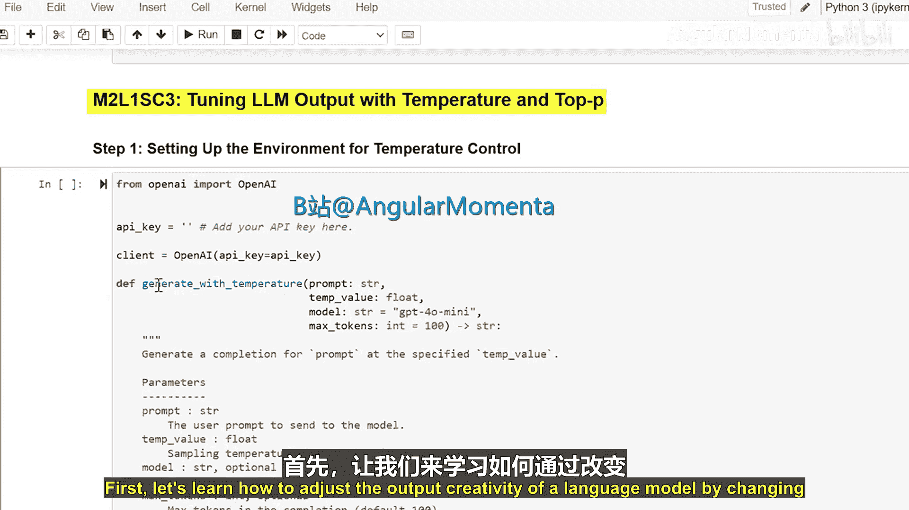

## 调整输出创造性：温度参数

上一节我们介绍了语言模型的基本工作原理。本节中，我们来看看如何通过调整一个关键参数——温度——来影响模型的输出风格。

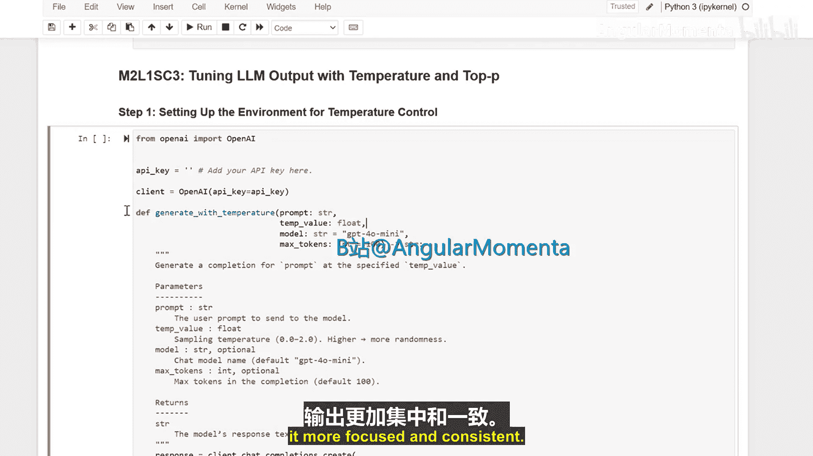

温度参数控制着模型预测下一个词时的随机性。其核心原理是对模型输出的原始概率分布进行“锐化”或“平滑”处理。

**公式**：调整后的概率 = softmax(原始逻辑值 / 温度)

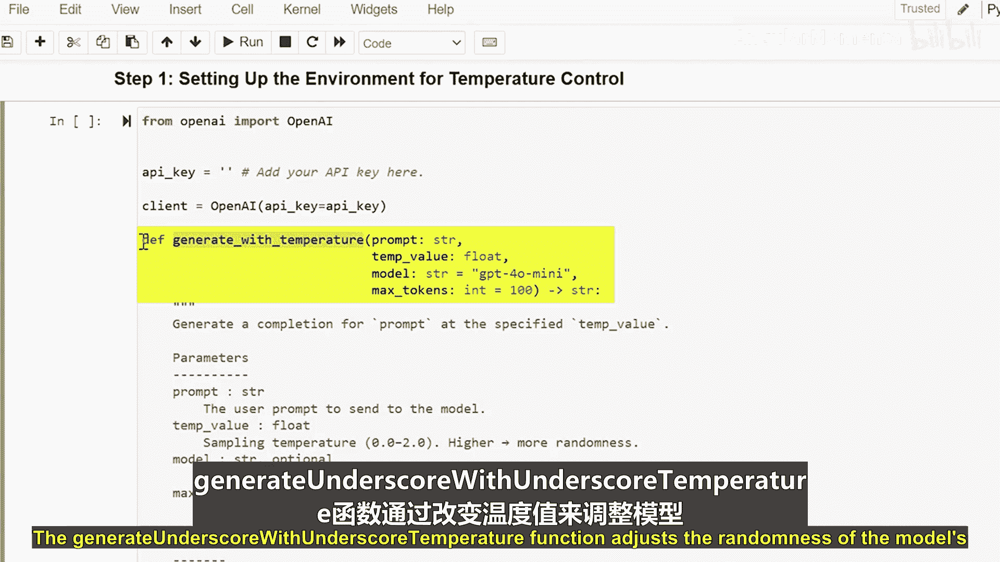

*   **较高的温度值**（如 1.0）会使概率分布更加平滑。这意味着模型在选择下一个词时，会给予低概率词更多机会，从而使输出更具随机性和多样性，更富有创造性。
*   **较低的温度值**（如 0.1）会使概率分布更加尖锐。这意味着模型会高度集中于概率最高的几个词上，从而使输出更加确定、聚焦和一致。

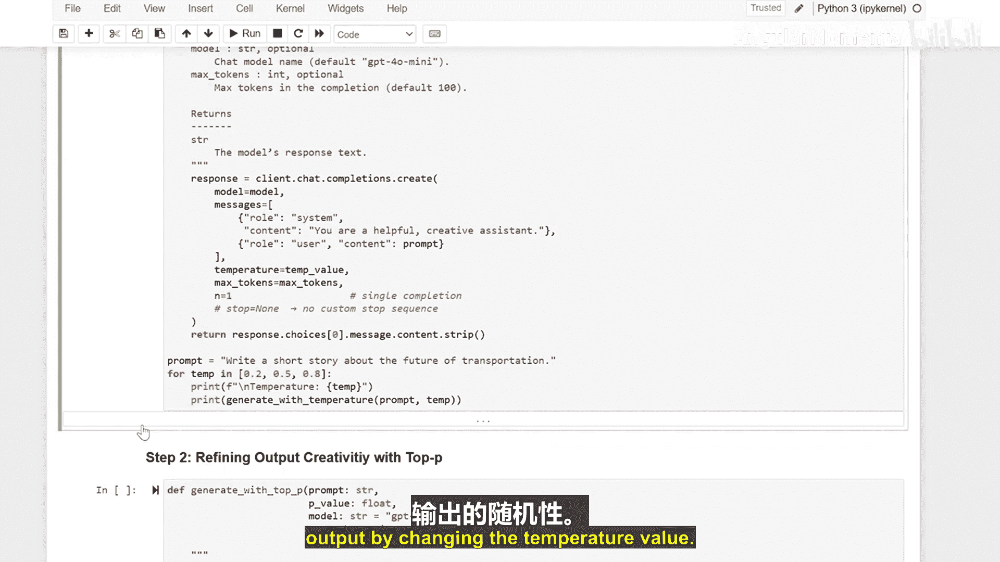

在代码中，通常会有一个类似 `generate_with_temperature` 的函数来应用这一调整。

以下是温度参数影响的直观对比：

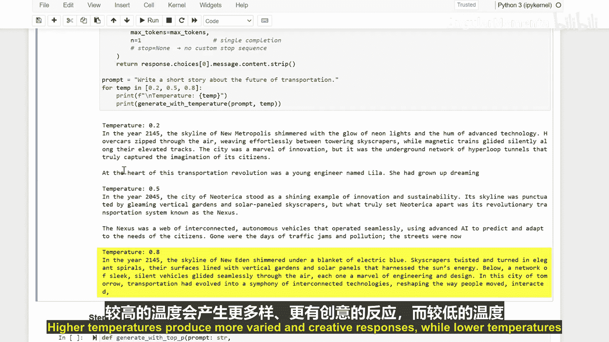

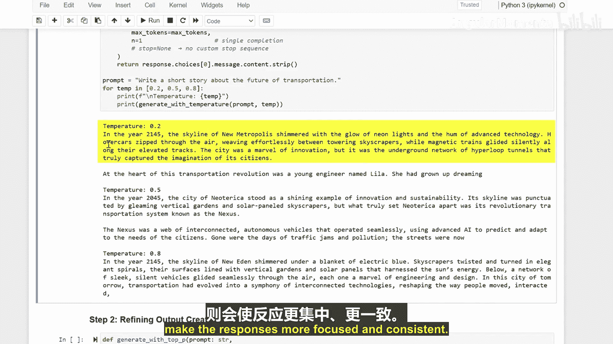

*   **高温度**：输出更多样、更具创造性，但可能偏离主题或不合逻辑。
*   **低温度**：输出更聚焦、更一致，但可能显得重复或缺乏新意。

## 精炼输出创造性：Top-P采样

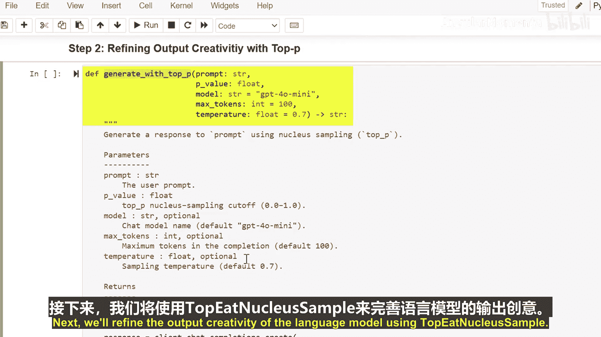

了解了如何通过温度进行整体调整后，我们来看看另一种更精细的控制方法：Top-P采样（也称核采样）。

Top-P采样不是调整所有词的概率分布，而是动态地从一个累积概率分布中筛选候选词。具体做法是，仅从累积概率超过阈值P的最高概率词集合中随机选择下一个词。

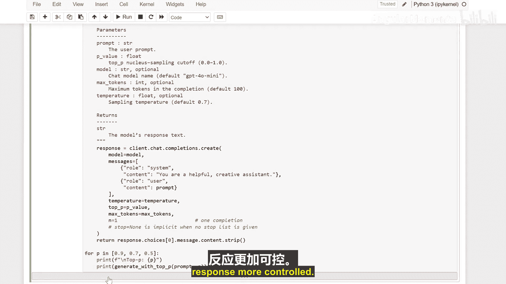

**代码逻辑描述**：
1.  获取模型预测的下一个词的概率分布。
2.  将词按概率从高到低排序。
3.  从概率最高的词开始累加，直到累积概率超过预设的Top-P值（例如0.9）。
4.  仅从这个候选词集合中随机抽取下一个词。

以下是Top-P值的影响：

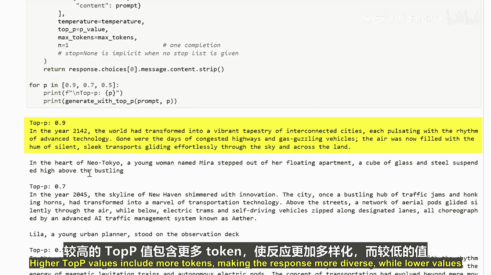

*   **较高的Top-P值**（如 0.9）：包含更多可能的词，使输出更具多样性。
*   **较低的Top-P值**（如 0.5）：严格限制候选词范围，使输出更可控、更可预测。

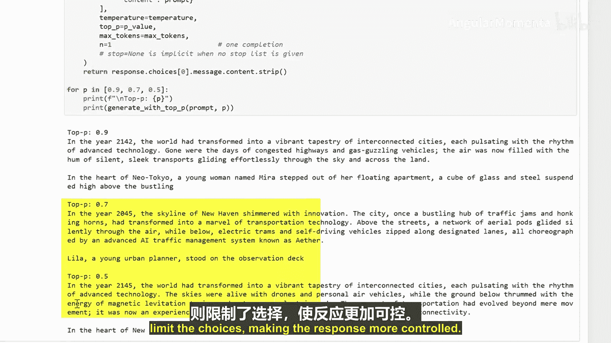

## 总结

本节课中我们一起学习了两种调整语言模型输出的关键技术。

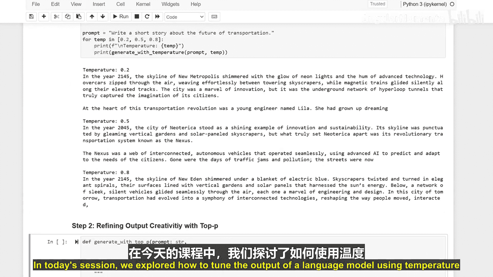

首先，我们探讨了**温度参数**，它通过缩放逻辑值来全局调整输出概率分布的平滑程度，从而在“创造性”与“一致性”之间取得平衡。

接着，我们学习了**Top-P采样**，这种方法通过设定一个累积概率阈值，动态地限制每一步的候选词范围，实现对输出随机性的更精细控制。

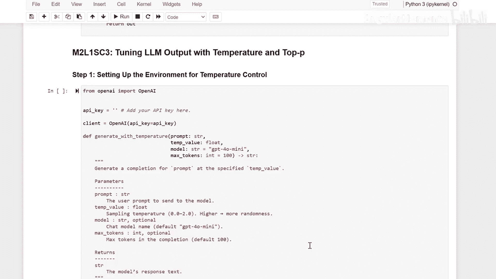

这些技术帮助我们根据具体需求，引导模型生成更聚焦、更可靠的文本，或是更富创意、更多样化的内容，是使用大语言模型时不可或缺的工具。