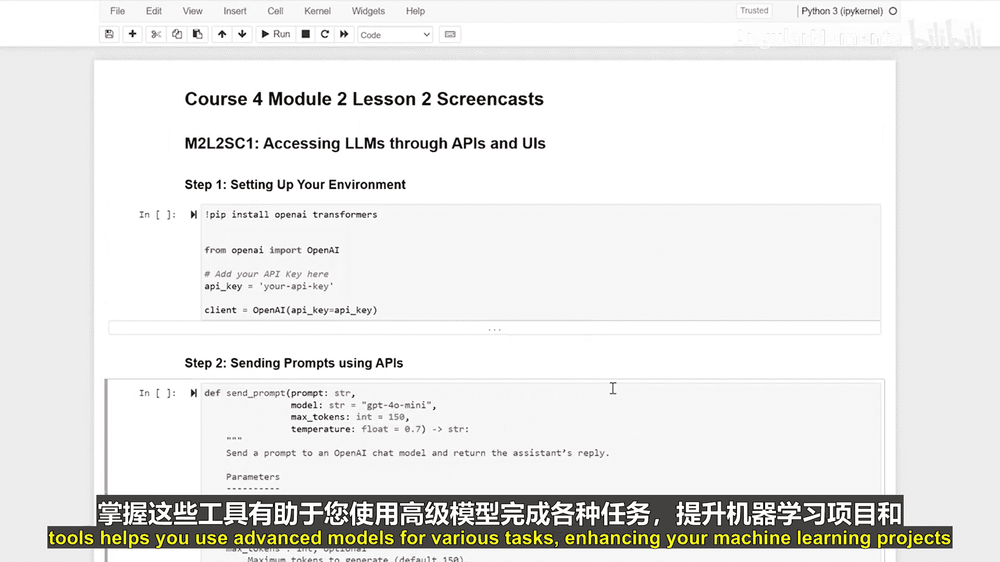

生成式人工智能与大语言模型：14：通过API和UI访问大型语言模型

在本节课中，我们将学习如何通过应用程序编程接口和用户界面来访问大型语言模型。我们将使用OpenAI的服务，轻松地发送提示并获取详细的模型回复。

首先，我们需要设置好开发环境。

以下是设置步骤：
1.  安装必要的Python库，主要是`openai`。
2.  获取并配置你的OpenAI API密钥。

现在，让我们创建一个函数，用于向模型发送提示并获取回复。

这个函数的核心是调用OpenAI的API。你可以通过参数来控制模型的响应方式，例如选择具体的模型、设置生成文本的最大长度以及调整创造性（温度）。

以下是关键参数说明：
*   **`model`**: 指定使用的模型，例如 `"gpt-3.5-turbo"`。
*   **`max_tokens`**: 限制模型生成回复的最大长度。
*   **`temperature`**: 控制回复的随机性，值越高（如0.8）回复越多样，值越低（如0.2）回复越确定。

接下来，我们尝试发送一个示例提示，看看模型如何回应。

我们发送提示：“请用简单的语言解释光合作用。”

模型将回复一个关于光合作用的简单解释。通过API和用户界面访问大型语言模型，可以便捷地获取详细而准确的信息。

本节课中，我们一起学习了如何设置环境、调用OpenAI API以及通过参数控制模型输出。掌握这些工具能帮助你利用先进的模型完成多种任务，从而提升你的机器学习项目与数据分析能力。