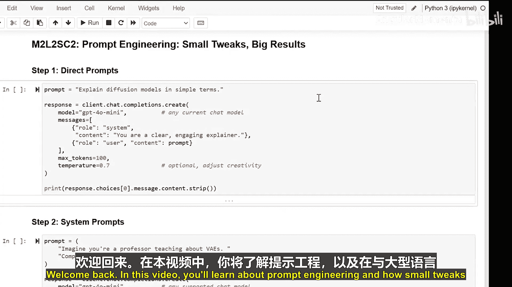
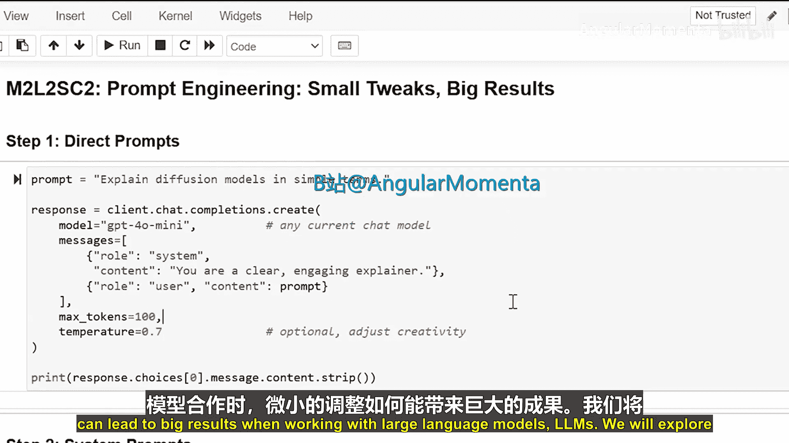
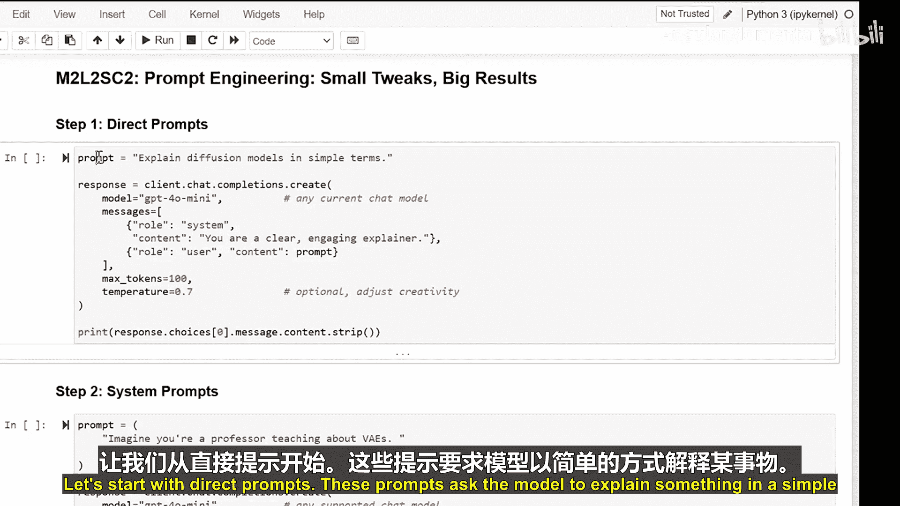
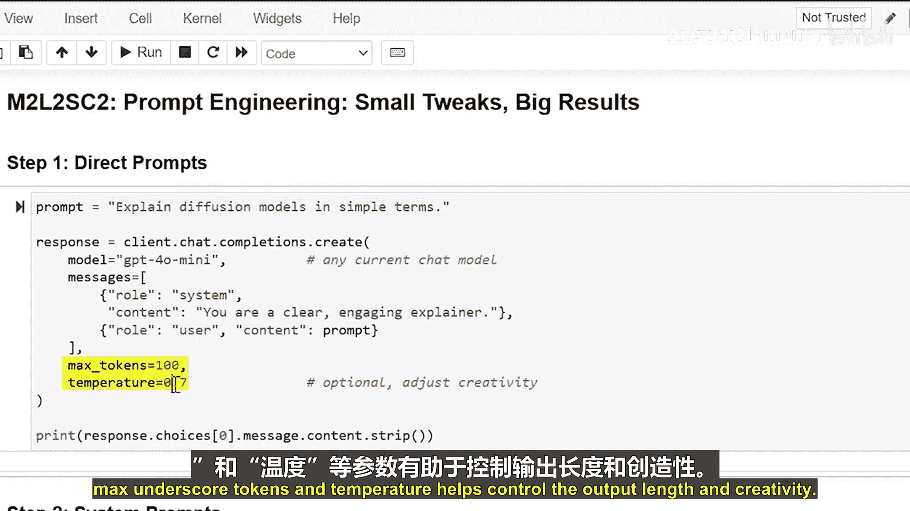
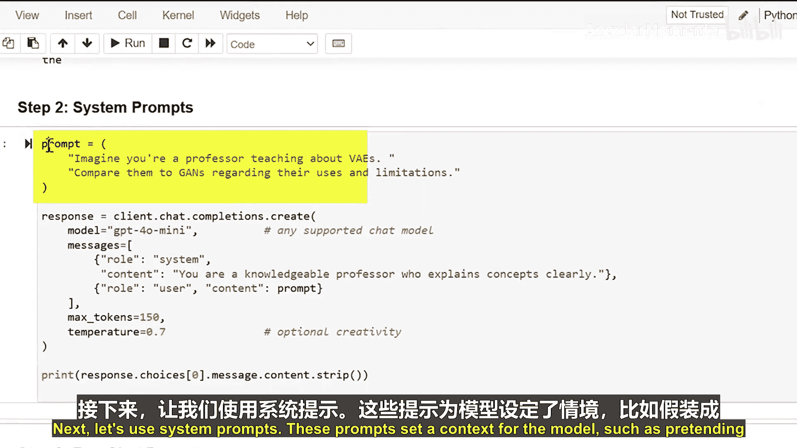
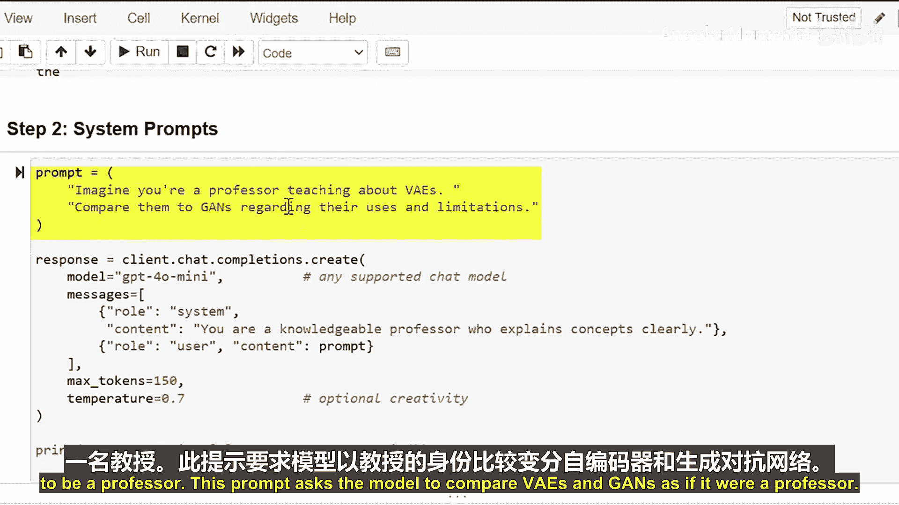
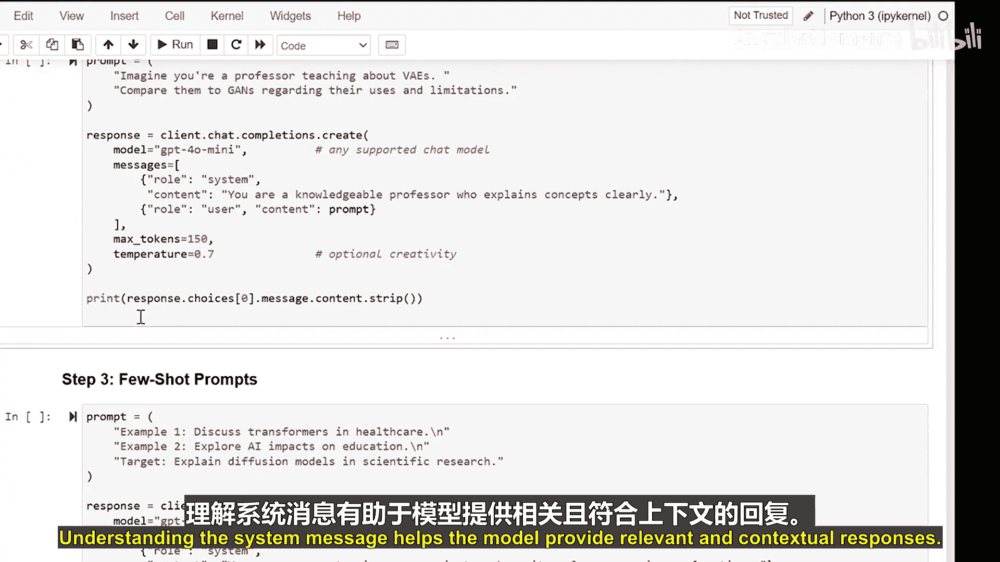
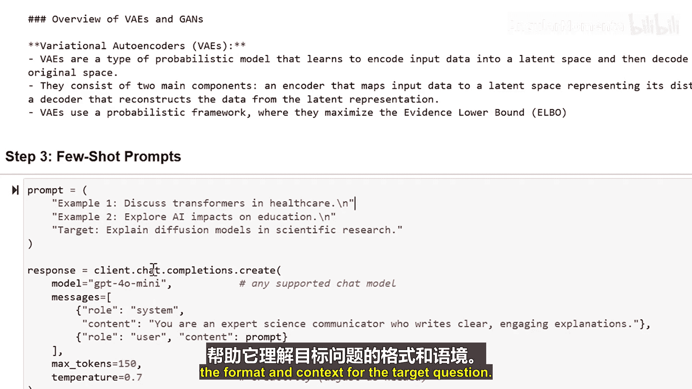
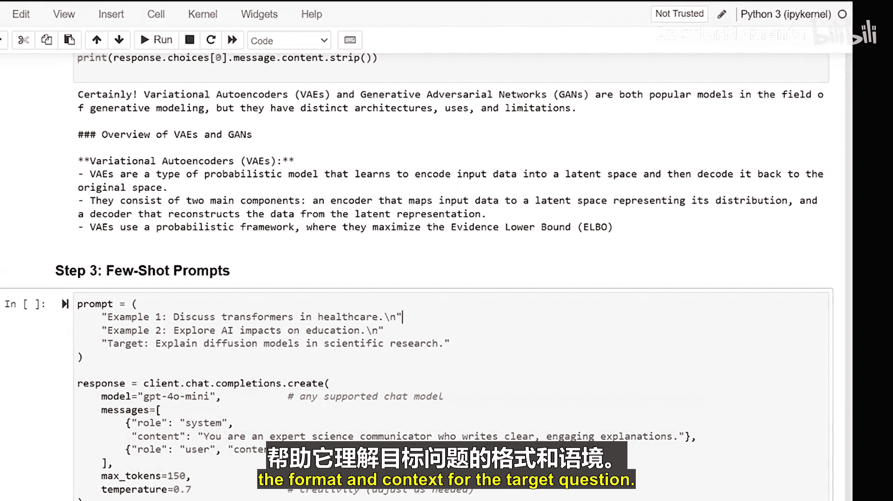
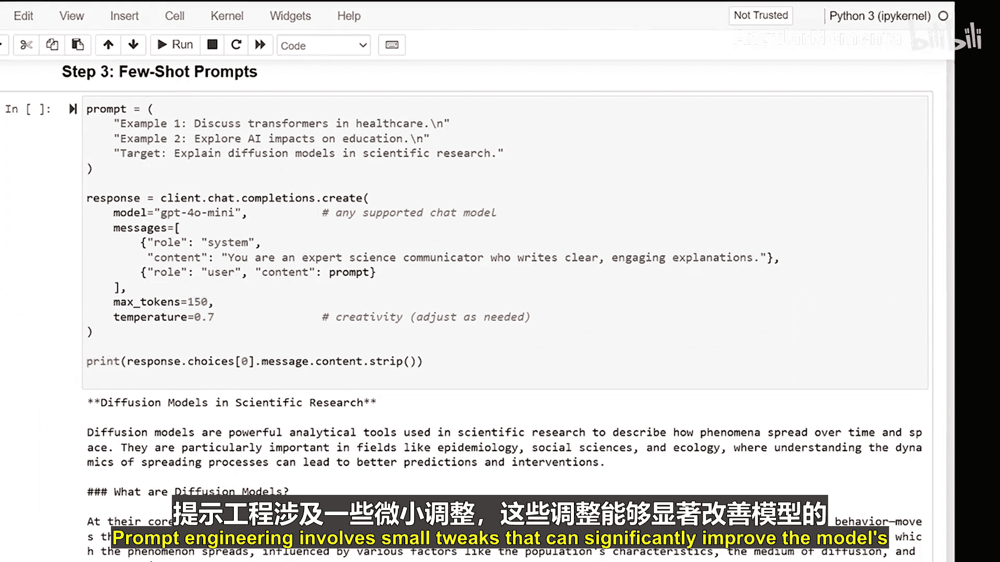

# 015：微调带来巨大成效 🎯


在本节课中，我们将要学习提示工程，并了解与大语言模型交互时，如何通过微小的调整获得显著的效果提升。

提示工程的核心在于精心设计输入给模型的指令或问题。通过调整提示的措辞、结构或提供额外信息，我们可以引导模型生成更准确、相关且符合预期的回答。接下来，我们将探索几种不同类型的提示及其对模型输出的影响。



## 直接提示 ✍️

上一节我们介绍了提示工程的基本概念，本节中我们来看看最基础的提示类型——直接提示。



直接提示要求模型以简单明了的方式解释某个概念。例如，我们可以要求模型解释扩散模型。



以下是使用直接提示的一个例子：
```
请以简单的方式解释扩散模型。
```

在使用这类提示时，我们还可以添加参数来控制输出。例如：
- **`max_tokens`**：此参数用于限制模型生成文本的最大长度。
- **`temperature`**：此参数控制模型输出的随机性和创造性，值越高，回答越多样；值越低，回答越确定。

## 系统提示 🎭



了解了直接提示后，我们来看看如何通过系统提示为模型设定一个特定的角色或上下文。

系统提示为模型设定一个背景或角色，例如，让它扮演一位教授。这有助于模型提供更具情境相关性的回答。

以下是使用系统提示的一个例子：
```
系统消息：你是一位人工智能教授。
用户消息：请以教授的口吻，比较变分自编码器和生成对抗网络。
```



通过设置系统消息，我们可以引导模型在特定的框架内进行思考和回应。





## 小样本提示 📋

最后，让我们探讨小样本提示。这种提示通过提供少量示例来指导模型的回答格式和内容。

小样本提示向模型展示几个例子，帮助它理解我们期望的回答模式和上下文。

以下是小样本提示的一个例子：
```
示例1：
问题：什么是机器学习？
回答：机器学习是人工智能的一个分支，它使计算机能够从数据中学习并做出决策。



示例2：
问题：什么是神经网络？
回答：神经网络是一种受人脑启发的计算模型，用于识别数据中的模式。

目标问题：
问题：什么是深度学习？
```

通过提供这些示例，模型能更好地理解如何构建对“深度学习”这个问题的回答。





## 总结 📝


本节课中，我们一起学习了提示工程的几种关键方法。我们了解到，通过尝试直接提示、系统提示和小样本提示，并对提示进行微小的调整，可以显著提升大语言模型的回答质量。掌握这些技巧，你将能更有效地与大语言模型互动，并获得更理想的结果。