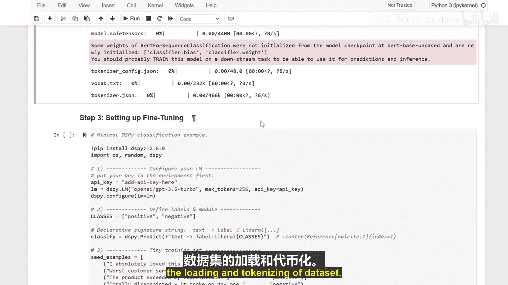
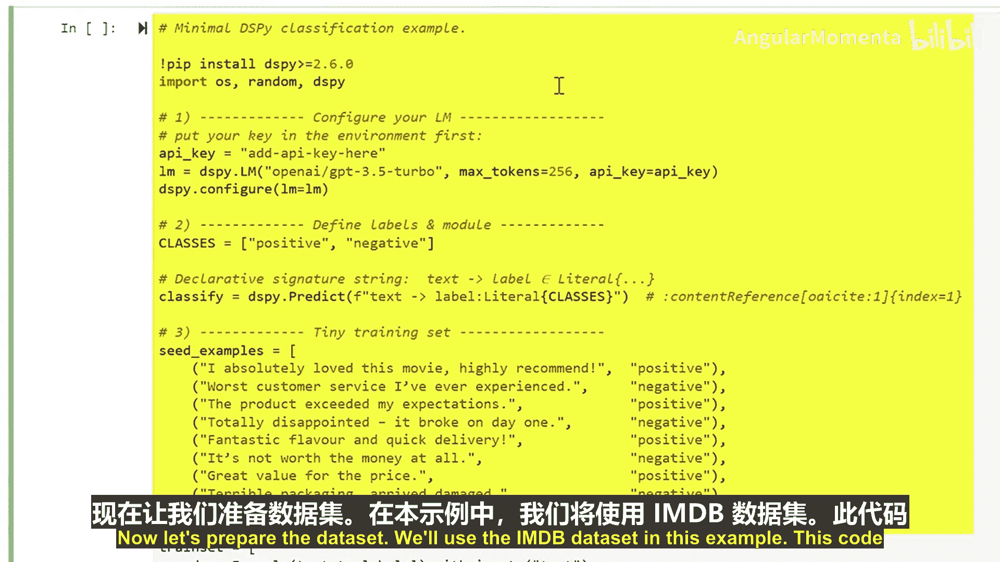
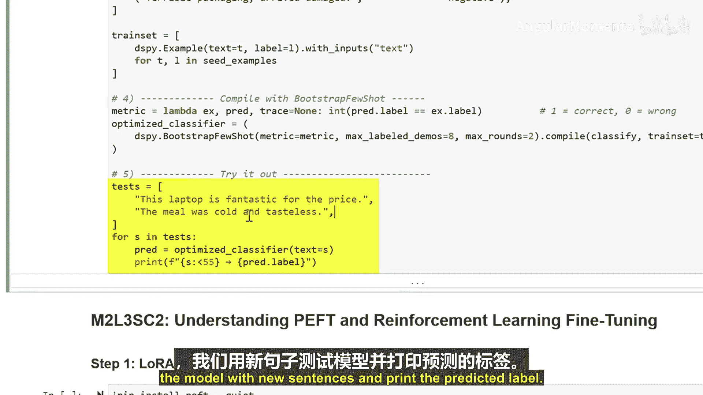
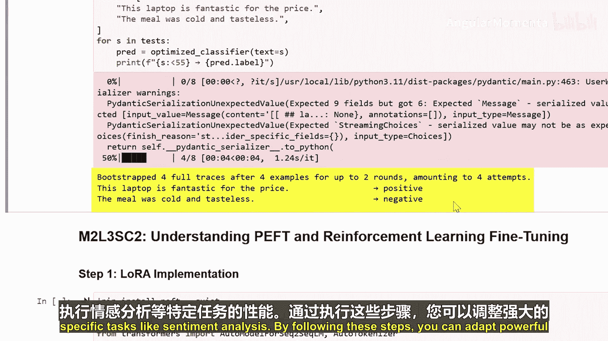
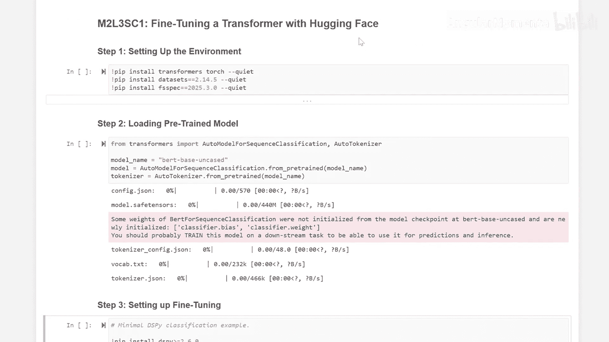

生成式人工智能与大语言模型：P16：使用Hugging Face微调Transformer模型

在本节课中，我们将学习如何使用Hugging Face库来微调一个预训练的Transformer模型。微调能够让我们将通用模型适配到特定任务上，从而提升其性能。

---

### 环境设置

首先，我们需要设置环境并安装必要的库。

以下是安装所需库的命令：
```python
pip install transformers datasets
```

---

### 加载预训练模型与分词器

上一节我们设置了环境，本节中我们来看看如何加载模型。我们将以BERT模型为例进行演示。

以下代码用于加载BERT模型及其对应的分词器：
```python
from transformers import AutoModelForSequenceClassification, AutoTokenizer

model_name = "bert-base-uncased"
model = AutoModelForSequenceClassification.from_pretrained(model_name, num_labels=2)
tokenizer = AutoTokenizer.from_pretrained(model_name)
```

---

### 准备数据集



模型加载完成后，下一步是准备用于训练的数据。我们将使用IMDB电影评论数据集作为示例。



以下代码加载IMDB数据集并进行分词处理：
```python
from datasets import load_dataset

dataset = load_dataset("imdb")
def tokenize_function(examples):
    return tokenizer(examples["text"], padding="max_length", truncation=True)

tokenized_datasets = dataset.map(tokenize_function, batched=True)
```

---

### 配置微调过程

数据准备就绪后，现在可以配置模型的微调过程了。我们将使用Hugging Face的`Trainer` API。

以下是配置训练参数并初始化`Trainer`的代码：
```python
from transformers import TrainingArguments, Trainer

training_args = TrainingArguments(
    output_dir="./results",
    evaluation_strategy="epoch",
    learning_rate=2e-5,
    per_device_train_batch_size=16,
    num_train_epochs=3,
    weight_decay=0.01,
)

trainer = Trainer(
    model=model,
    args=training_args,
    train_dataset=tokenized_datasets["train"].select(range(100)), # 小样本训练
    eval_dataset=tokenized_datasets["test"].select(range(100)),
    tokenizer=tokenizer,
)
```

---

### 测试微调后的模型

模型训练完成后，最后一步是测试其在新数据上的表现。

以下代码展示了如何使用微调后的模型进行预测：
```python
test_sentences = ["This movie was fantastic!", "The plot was boring and predictable."]
inputs = tokenizer(test_sentences, padding=True, truncation=True, return_tensors="pt")
outputs = model(**inputs)
predictions = outputs.logits.argmax(-1)
print(predictions) # 输出预测的标签
```





---

### 总结



本节课中，我们一起学习了使用Hugging Face库微调Transformer模型的完整流程。我们首先设置了环境并加载了预训练的BERT模型，然后准备了IMDB数据集，接着配置并执行了模型的微调，最后测试了模型在新句子上的情感分析能力。通过微调，我们可以使强大的通用模型更好地服务于特定任务，有效提升其准确性和效率。