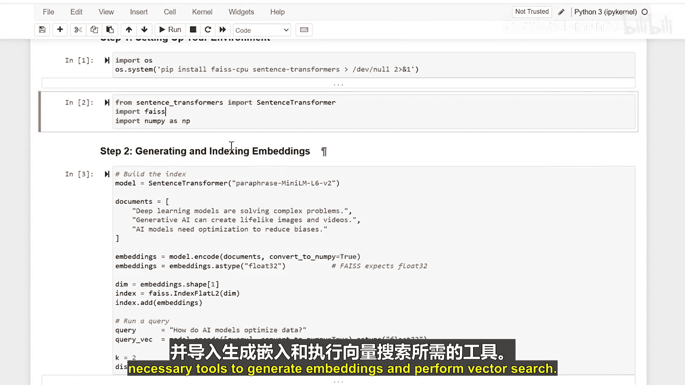
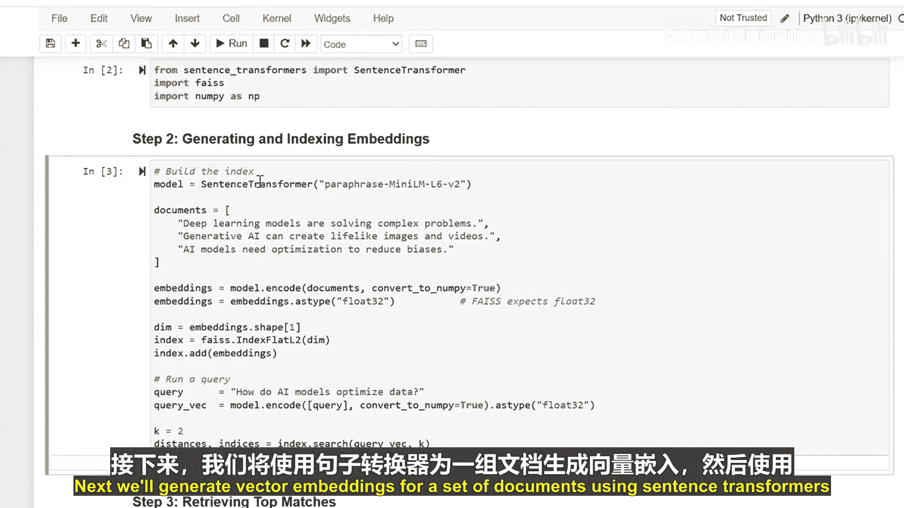
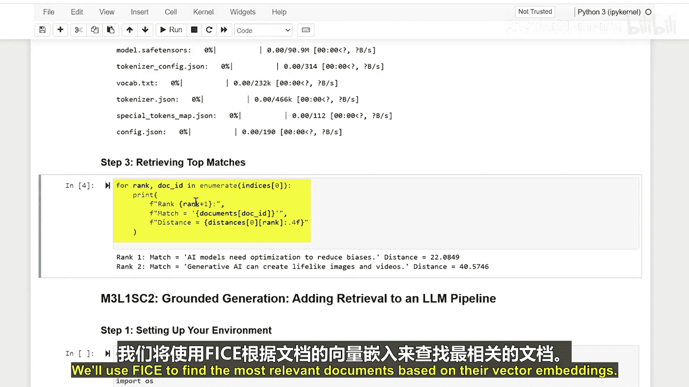
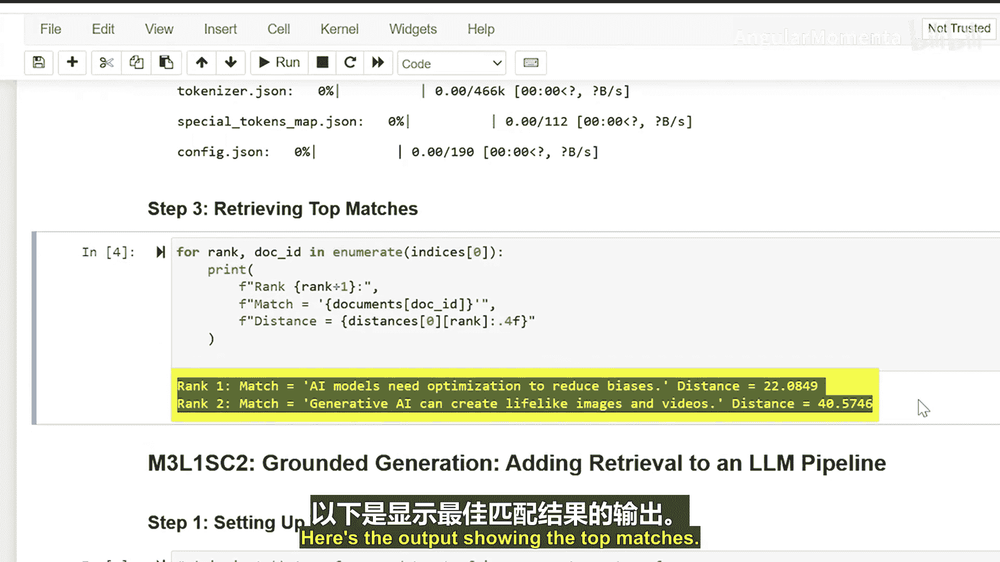

生成式人工智能与大语言模型：P17-03_01_02：检索知识嵌入与使用Faiss进行向量搜索 🔍

在本节课中，我们将学习如何利用嵌入向量和Faiss向量搜索技术，从文档集合中高效检索相关知识。我们将通过环境配置、生成嵌入、建立索引和查询匹配四个步骤，完整演示这一流程。

---

### 环境配置 🛠️

首先，我们需要设置编程环境。以下是配置所需库的步骤。


我们将安装`faiss`库和`sentence-transformers`库，并导入必要的工具来生成嵌入向量和执行向量搜索。


```python
# 安装必要的库
!pip install faiss-cpu sentence-transformers -q

# 导入库
from sentence_transformers import SentenceTransformer
import faiss
import numpy as np
```

---

### 生成文档嵌入向量 📄

上一节我们配置好了环境，本节中我们来看看如何为文档生成向量嵌入。我们将使用`sentence-transformers`模型将文本转换为数值向量。





以下是生成嵌入向量的代码示例：

```python
# 初始化嵌入模型
model = SentenceTransformer('all-MiniLM-L6-v2')

# 示例文档
documents = [
    "机器学习是人工智能的一个分支。",
    "深度学习利用神经网络进行学习。",
    "向量搜索用于高效检索相似信息。"
]

# 生成嵌入向量
document_embeddings = model.encode(documents)
```

---



### 使用Faiss建立向量索引 🗂️

生成了文档的嵌入向量后，下一步是使用Faiss为这些向量建立索引，以实现快速相似性搜索。


以下是建立Faiss索引的步骤：

```python
# 获取嵌入向量的维度
dimension = document_embeddings.shape[1]

# 创建Faiss索引（这里使用内积进行相似度计算，等同于余弦相似度，因为向量已归一化）
index = faiss.IndexFlatIP(dimension)
faiss.normalize_L2(document_embeddings) # 归一化向量
index.add(document_embeddings) # 将向量添加到索引
```



---

### 执行查询与检索匹配结果 🔎

现在，我们已经有了一个包含文档向量的Faiss索引。本节中，我们将学习如何输入一个查询，并检索出最相关的文档。


以下是执行查询的代码：

```python
# 定义查询
query = "什么是神经网络？"

# 将查询转换为嵌入向量
query_embedding = model.encode([query])
faiss.normalize_L2(query_embedding)

# 在索引中搜索最相似的k个文档
k = 2
distances, indices = index.search(query_embedding, k)

# 输出结果
print("最相关的文档索引:", indices[0])
print("相似度分数:", distances[0])
for idx in indices[0]:
    print(f"文档 {idx}: {documents[idx]}")
```

🎼 输出将显示与查询最匹配的文档及其相似度分数。



---


### 总结 📝


本节课中我们一起学习了利用嵌入向量和Faiss进行知识检索的完整流程。我们首先配置了环境并安装了必要的库。接着，我们使用`sentence-transformers`模型将文本文档转换为向量表示。然后，我们利用Faiss为这些向量建立了高效的搜索索引。最后，我们演示了如何输入一个查询，并快速检索出语义上最相关的文档。

这项强大的技术使我们能够在大型数据集中进行高效语义搜索，快速找到所需信息。