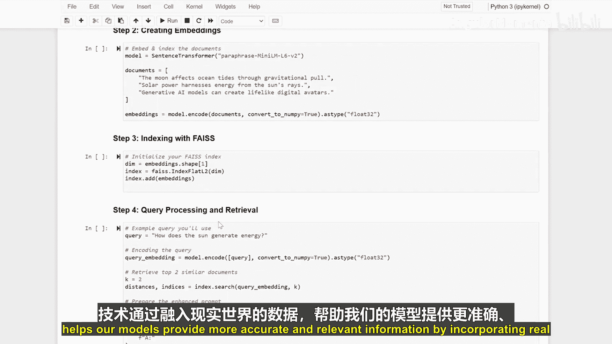

生成式人工智能与大语言模型：18：基于检索的生成：在LLM流程中融入检索机制 🧠

在本节课中，我们将学习如何通过为大语言模型流程添加检索机制，来实现基于检索的生成。这项技术能让模型通过整合外部真实世界的信息，生成更准确、更相关的回答。

上一节我们介绍了大语言模型的基本生成流程。本节中，我们来看看如何通过检索外部知识来增强模型的回答能力。

首先，我们需要设置运行环境。以下是需要安装的关键库：

```python
# 安装必要的Python库
pip install transformers datasets faiss-cpu sentence-transformers
```

接下来，我们将使用句子转换器模型为一系列文档创建向量嵌入。向量嵌入是将文本转换为数值向量的过程，便于后续的相似度计算。

```python
from sentence_transformers import SentenceTransformer

# 加载预训练的句子嵌入模型
embedder = SentenceTransformer('all-MiniLM-L6-v2')
# 假设documents是一个包含多个文本字符串的列表
document_embeddings = embedder.encode(documents)
```

现在，我们将使用Faiss库为这些嵌入向量建立索引，以实现高效检索。Faiss是一个专门用于快速相似性搜索和密集向量聚类的库。

```python
import faiss

# 获取嵌入向量的维度
dimension = document_embeddings.shape[1]
# 创建一个索引（这里使用内积作为相似度度量，等同于余弦相似度，因为向量已归一化）
index = faiss.IndexFlatIP(dimension)
# 将文档向量添加到索引中
index.add(document_embeddings)
```

然后，我们处理用户查询。流程是：将查询转换为向量，检索最相关的文档，并构建一个增强的提示词。

以下是实现此流程的关键步骤：

1.  **嵌入查询**：使用相同的句子转换器模型将用户查询转换为向量。
2.  **执行检索**：在Faiss索引中搜索与查询向量最相似的K个文档向量。
3.  **构建上下文**：将检索到的相关文档文本组合起来，作为额外的上下文信息。
4.  **组装提示**：将原始查询与检索到的上下文信息结合，形成一个新的、信息更丰富的提示词，输入给大语言模型。

```python
# 1. 嵌入查询
query_embedding = embedder.encode([user_query])

# 2. 执行检索，获取最相似的3个文档
k = 3
distances, indices = index.search(query_embedding, k)

# 3. 构建上下文
retrieved_docs = [documents[i] for i in indices[0]]
context = "\n\n".join(retrieved_docs)

# 4. 组装增强提示
enhanced_prompt = f"基于以下信息回答问题：\n{context}\n\n问题：{user_query}\n答案："
```

最后，我们将这个增强后的提示词输入给一个文本生成模型，让它基于检索到的真实信息生成最终的回答。

```python
from transformers import pipeline



# 加载文本生成管道
generator = pipeline('text-generation', model='gpt2')
# 使用增强提示生成回答
response = generator(enhanced_prompt, max_length=200, do_sample=True)[0]['generated_text']
```


本节课中我们一起学习了如何将检索机制融入大语言模型流程。通过安装必要的库、为文档创建向量嵌入、建立高效索引、处理查询并构建增强提示，最终引导模型生成基于真实信息的回答。这项强大的技术能显著提升模型回答的准确性和相关性，是构建可靠AI应用的关键步骤之一。