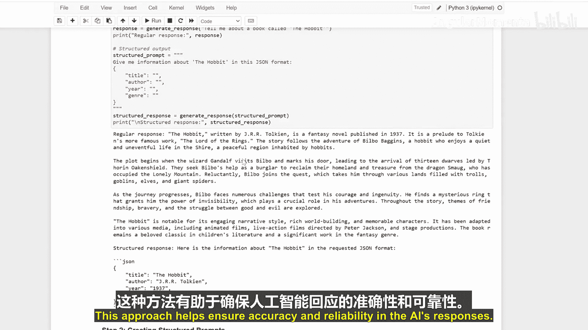

# 019：提示大语言模型实现结构化输出与函数模拟 🧠

在本节课中，我们将学习如何通过特定的提示（Prompt）引导大语言模型，使其输出结构化的数据（如JSON、XML格式）并模拟执行函数任务。掌握这些技巧，可以让你更精确地控制模型的输出，提升交互的可靠性和实用性。

---

上一节我们了解了提示的基本概念，本节中我们来看看如何引导模型生成结构化输出。

首先，理解如何提示模型生成结构化输出（例如JSON格式）至关重要。以下代码展示了如何引导模型生成常规响应和结构化响应。

```python
# 常规提示示例
prompt_regular = "请告诉我关于《霍比特人》这本书的信息。"
# 结构化提示示例
prompt_structured = "请以JSON格式提供《霍比特人》的信息，包含以下字段：title, author, year, genre。"
```

常规响应会提供关于《霍比特人》的故事和角色等详细信息。而结构化响应则会以JSON格式返回相同的信息，其结构如下：

```json
{
  "title": "霍比特人",
  "author": "J.R.R. 托尔金",
  "year": 1937,
  "genre": "奇幻小说"
}
```

---

接下来，让我们学习如何创建专门用于请求特定格式（如JSON或XML）输出的结构化提示。

以下是请求JSON和XML格式输出的提示示例：

*   **JSON格式请求**：“请将以下数据以JSON格式返回：书名、作者、出版年份。”
*   **XML格式请求**：“请将用户信息组织成XML格式，包含`<name>`、`<email>`和`<id>`标签。”

---

在引导模型模拟函数时，我们可以让它扮演特定角色来执行任务。例如，让AI模拟一个计算器。

以下是一个模拟简单计算任务的提示：

```python
prompt_calculator = "你是一个计算器。请计算：15乘以8加上20等于多少？只返回最终数字结果。"
```

---

为确保模型响应符合我们要求的格式，对响应进行验证是必不可少的一步。

以下代码演示了如何检查AI的响应是否为有效的JSON，并是否符合我们预期的精确格式：

```python
import json

def validate_json_response(response):
    try:
        data = json.loads(response)
        # 检查是否包含预期的字段
        required_fields = {"title", "author", "year", "genre"}
        if all(field in data for field in required_fields):
            return True, data
        else:
            return False, "响应缺少必要字段。"
    except json.JSONDecodeError:
        return False, "响应不是有效的JSON格式。"
```

验证成功的输出表明请求的格式被正确遵循。

---

我们可以利用此方法模拟更复杂的任务，例如计算购物清单总额。

以下提示要求模型扮演购物计算器，并遵循特定的计算规则：

“你是一个购物计算器。我有一个购物清单：苹果3斤（单价5元），香蕉2把（单价4元），牛奶1盒（单价10元）。请计算总价，并考虑如果总价超过30元，打9折。最后返回一个JSON对象，包含`items`（列表）、`subtotal`（小计）、`discount_applied`（是否应用折扣）、`total`（总计）字段。”

---

最后，让我们创建一个结合了以上所有知识的智能助手。

以下代码展示了如何创建一个能执行任务并验证响应的智能助手：

```python
def smart_assistant(task_prompt, expected_format="json"):
    # 1. 向大语言模型发送组合了格式要求的提示
    full_prompt = f"{task_prompt}\n\n请务必以{expected_format.upper()}格式返回结果。"
    # 2. 获取模型响应（此处为模拟）
    llm_response = get_llm_response(full_prompt)
    # 3. 根据预期格式验证响应
    if expected_format.lower() == "json":
        is_valid, result = validate_json_response(llm_response)
        if is_valid:
            return result
        else:
            return {"error": result}
    # 可以扩展其他格式（如XML）的验证
    # elif expected_format.lower() == "xml":
    #     ... 验证XML ...
```



---


本节课中我们一起学习了如何通过结构化提示引导大语言模型生成JSON等格式的输出，如何让其模拟计算器等函数角色，以及如何验证响应的正确性。通过使用结构化提示和函数模拟，你可以显著增强与大语言模型的交互效果，确保输出结果的准确性和可靠性，从而构建出更强大、更可控的AI应用。