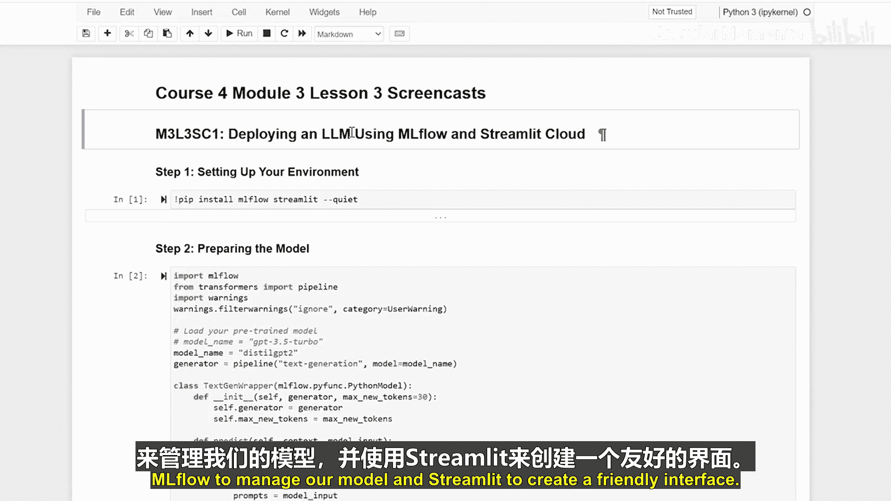

**生成式人工智能与大语言模型：P20-03-03-02：使用MLflow与Streamlit云部署大语言模型** 🚀

在本节课中，我们将学习如何利用MLflow和Streamlit Cloud，将我们训练好的AI模型部署成一个可供他人使用的Web应用。整个过程就像为你的AI模型搭建一个网站，让用户可以通过简单的界面与之交互。

---

### **准备工作：认识我们的工具** 🛠️

在开始构建之前，我们需要了解两个核心工具。

*   **MLflow**：这是一个用于管理机器学习生命周期的平台。它可以帮助我们以标准化的格式打包、记录和部署模型，确保模型在不同环境中的一致性。
*   **Streamlit**：这是一个用于快速创建数据科学Web应用的Python库。它允许我们用简单的Python脚本构建交互式界面，无需前端开发知识。

可以理解为，**MLflow**负责将我们的模型“打包”好，而**Streamlit**则负责为这个“包裹”设计一个漂亮的“展示窗口”和“操作面板”。

---

### **第一步：使用MLflow打包模型** 📦

上一节我们介绍了部署所需的工具，本节中我们来看看如何具体准备模型。我们将使用Hugging Face Transformers库中的模型，并通过MLflow进行封装。

核心步骤是创建一个自定义的MLflow模型类，它定义了模型如何被加载和进行预测。

```python
import mlflow
import transformers

# 定义一个自定义的MLflow Python模型类
class HuggingFaceModel(mlflow.pyfunc.PythonModel):
    def load_context(self, context):
        # 从保存的路径加载模型和分词器
        self.model = transformers.AutoModelForCausalLM.from_pretrained(context.artifacts["model_path"])
        self.tokenizer = transformers.AutoTokenizer.from_pretrained(context.artifacts["model_path"])

    def predict(self, context, model_input):
        # 定义生成文本的预测逻辑
        inputs = self.tokenizer(model_input["prompt"].tolist(), return_tensors="pt", padding=True)
        outputs = self.model.generate(**inputs, max_length=50)
        return self.tokenizer.batch_decode(outputs, skip_special_tokens=True)
```

接下来，我们需要将这个模型类与具体的模型文件（如从Hugging Face下载的模型）一起，保存为MLflow模型格式。

```python
# 指定模型在Hugging Face上的名称或本地路径
model_name = "gpt2"

# 使用MLflow记录并保存模型
with mlflow.start_run():
    # 记录模型为PyFunc格式
    mlflow.pyfunc.log_model(
        artifact_path="model",
        python_model=HuggingFaceModel(),
        artifacts={"model_path": model_name},
        registered_model_name="MyChatGPT"
    )
```

执行以上代码后，模型会被打包并记录到MLflow的跟踪服务器中，为后续部署做好准备。

---

### **第二步：使用Streamlit构建Web界面** 🖥️

模型打包完成后，我们需要为用户创建一个访问界面。Streamlit让这一步变得非常简单。

以下是构建一个简易聊天界面的核心代码。我们创建一个标题、一个文本输入框和一个触发生成的按钮。

```python
import streamlit as st
import mlflow.pyfunc

# 设置页面标题
st.title("🤖 我的AI聊天助手")

# 创建一个文本输入框，供用户输入问题
prompt = st.text_input("请输入您的问题：", "你好，AI！")

# 创建一个按钮，当点击时生成回复
if st.button("生成回复"):
    # 加载之前用MLflow保存的模型
    model = mlflow.pyfunc.load_model('models:/MyChatGPT/Production')
    # 准备输入数据
    input_data = {"prompt": [prompt]}
    # 进行预测
    result = model.predict(input_data)
    # 显示结果
    st.write("AI回复：", result[0])
```

这段代码构建了一个最基础的交互流程：用户输入（`st.text_input`） -> 触发处理（`st.button`） -> 调用模型（`model.predict`） -> 显示结果（`st.write`）。

---

### **第三步：部署到Streamlit Cloud** ☁️

应用构建好后，最后的步骤就是将其分享给全世界。我们需要将代码上传到GitHub仓库，然后在Streamlit Cloud上部署。

1.  **准备部署文件**：确保你的项目包含以下两个核心文件：
    *   `app.py`：包含上述Streamlit应用代码的主文件。
    *   `requirements.txt`：列出所有依赖的Python包，例如 `streamlit`, `mlflow`, `transformers`。

2.  **执行部署命令**：在Streamlit Cloud的界面中，连接你的GitHub仓库，并指定主文件路径（例如 `app.py`）。平台会自动安装依赖并启动应用。

完成部署后，Streamlit Cloud会提供一个公开的URL，任何人都可以通过这个链接访问你的AI聊天助手。

---

### **总结** 📝



本节课中我们一起学习了将大语言模型从开发环境部署到云端的完整流程。


1.  **模型管理**：我们使用**MLflow**将Hugging Face模型封装成标准化的、可服务的格式。
2.  **界面构建**：我们利用**Streamlit**快速创建了一个包含输入、按钮和显示区域的Web应用界面。
3.  **云部署**：最后，我们通过**Streamlit Cloud**将应用发布到互联网，实现了模型的共享与公开访问。

通过这三个步骤，你可以将任何AI项目转化为一个可交互的在线服务，极大地提升了模型的实际应用价值和可访问性。