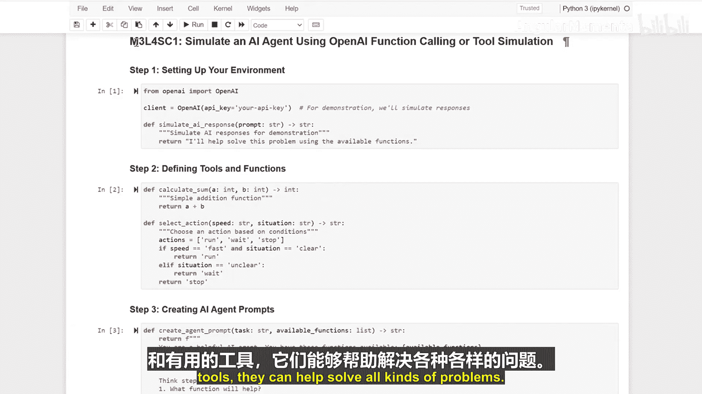

# 021：使用OpenAI函数调用或工具仿真模拟AI代理 🧠🤖

在本节课中，我们将学习如何创建能够自主决策并使用工具的AI代理。我们将通过一个简单的模拟，为AI配备“工具箱”，并教会它如何理解问题、分解步骤并选择合适的工具来完成任务。

---

上一节我们介绍了AI代理的基本概念，本节中我们来看看如何具体实现一个能够使用工具的AI代理。首先，我们需要为AI助手设置好它可以使用的工具。

以下是创建AI代理工具的两个核心步骤：

1.  **创建计算器工具**：我们为AI创建一个工具，使其能够执行数字相加的运算。
2.  **创建决策制定器工具**：我们为AI创建另一个工具，使其能够根据条件选择要执行的动作。

这就像为我们的AI配备了一个包含多种专业工具的工具箱，让它有能力处理不同类型的问题。

---

接下来，我们需要教会AI如何理解它所拥有的工具。这个过程包括：

*   **识别可用工具**：让AI知晓“计算器”和“决策制定器”的存在及其功能。
*   **分解问题步骤**：指导AI将复杂问题拆解为一系列可执行的子任务。
*   **选择合适工具**：训练AI根据每个子任务的需求，从工具箱中选择最恰当的工具。

---

现在，让我们观察这个AI代理是如何工作的。其工作流程遵循一个清晰的逻辑链：

1.  **读取问题**：AI首先接收并理解用户提出的问题。
2.  **选择工具**：AI根据对问题的分析，决定使用哪个工具。
3.  **解决问题**：AI调用选定的工具执行操作，并生成最终答案。

整个过程就像一个聪明的助手在严格遵循指令，逐步完成任务。

---

本节课中我们一起学习了如何创建能够使用工具并做出决策的AI代理。关键在于为AI提供清晰的指令和有用的工具。通过这种方式，AI代理能够帮助我们解决各种各样的问题。