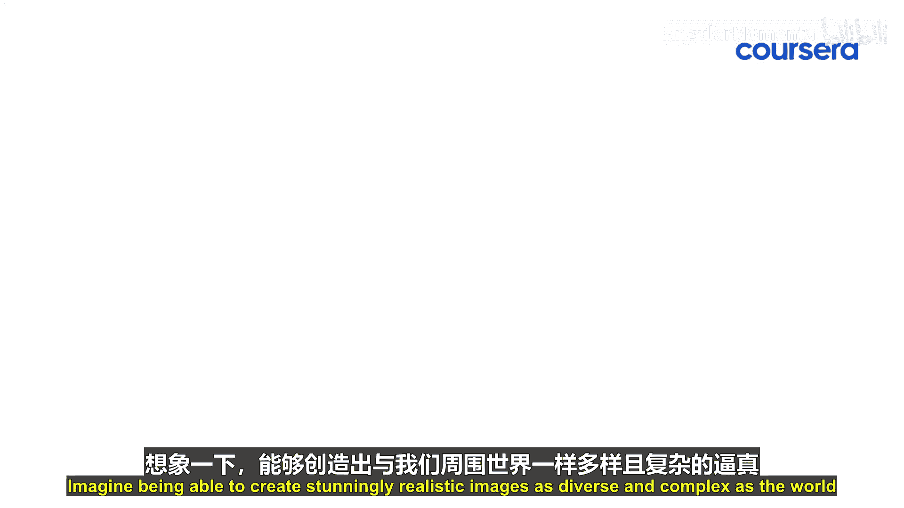

# 022：为何扩散模型成为高质量图像生成的首选方法 🎨

在本节课中，我们将要学习扩散模型（Diffusion Models）为何能在图像生成领域脱颖而出，成为高质量图像生成的首选方法。我们将探讨其相较于传统方法的优势，以及它在不同行业中的应用。

想象一下，能够创造出与我们周围世界一样多样和复杂的、令人惊叹的真实感图像。这就是扩散模型的力量。它是一种图像生成领域的革命性方法，将传统的生成对抗网络（GANs）和变分自编码器（VAEs）等方法远远抛在身后。

那么，是什么让扩散模型如此突出？让我们来详细分析一下。

## 稳定性与精确性 ✨

扩散模型的魔力在于其稳定性和精确性。与生成对抗网络（GANs）不同，后者常常难以产生稳定的结果，而扩散模型提供了一个一致的框架。它确保生成的每一张图像都保持高保真度和真实感。

你是否曾使用过照片应用将自拍照转换成艺术作品？这背后就是扩散模型在默默工作。它为你提供更清晰、更生动的转换效果，避免了其他方法有时会出现的随机性问题。

## 可靠性与广泛应用 🌍

扩散模型的优势不仅在于生成一张好图像，更在于其在无数次渲染中的可靠性。在媒体和娱乐等行业，对逼真图形的需求是持续不断的，扩散模型正在重塑这些领域的格局。它们带来了前所未有的控制力和多样性，使其成为从超写实电影视觉效果到互动游戏环境等一切内容创作的理想选择。

上一节我们介绍了扩散模型的稳定性与可靠性，本节中我们来看看其影响范围。

扩散模型的影响不止于娱乐领域。以医疗保健为例，精确的成像技术可以挽救生命。扩散模型增强了医学成像技术，通过生成能更清晰揭示人体解剖结构和健康状况的高质量图像，潜在地改善了诊断水平。

## 为何需要关注扩散模型？ 🚀

那么，你为什么应该关注扩散模型？因为它们不仅仅是人工智能工具箱中的又一个工具。它们是一扇通往创新的大门。无论你是一位有抱负的艺术家、游戏开发者还是医疗保健专业人士，理解扩散模型都能为你所在的领域解锁新的潜力。在一个快速发展的世界中，站在技术前沿至关重要。

以下是拥抱扩散模型带来的核心益处：
*   **掌握最新进展**：它使你具备了解最新技术进步的知识。
*   **赋能行业领导**：它赋予你在自身行业中引领潮流的能力。

因此，请抓住这个机会来探索和掌握这项尖端技术。人工智能驱动的图像生成的未来是光明的，而掌握了扩散模型，你就已经走在了时代的前沿。

## 总结 📝

本节课中我们一起学习了扩散模型成为高质量图像生成首选方法的原因。我们了解到，其**稳定、精确**的生成框架克服了传统方法（如GANs）的不稳定性问题，确保了高保真度的输出。同时，其**可靠的性能**和**广泛的应用潜力**——从娱乐产业的视觉效果到医疗领域的诊断辅助——使其成为推动多行业创新的关键工具。理解并掌握扩散模型，意味着掌握了当前图像生成领域最前沿和强大的技术之一。